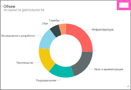
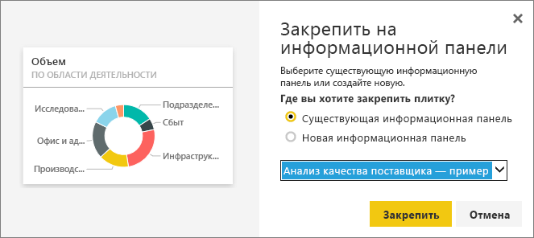

# Изменение и удаление плитки на информационной панели
Можно изменить внешний вид и стандартное поведение плитки, находящейся на панели мониторинга.

<iframe width="560" height="315" src="https://www.youtube.com/embed/lJKgWnvl6bQ" frameborder="0" allowfullscreen></iframe>

В этой статье рассматриваются следующие темы.

* [Закрепление плитки на другой информационной панели](#different)
* [Переименование плитки](#rename)
* [Перемещение плитки](#move)
* [Изменение размера плитки](#resize)
* [Добавление гиперссылки в плитку](#hyperlink)
* [Удаление плитки](#delete)
  
  > [!TIP]
  > Чтобы изменить визуализацию на самой плитке, удалите ее и добавьте новую [плитку панели мониторинга](service-dashboard-tiles.md).
  > 
  > 

## Начало работы
1. Откройте [панель мониторинга](service-dashboards.md), на которой закреплена по крайней мере одна плитка. 
   
   
2. Наведите указатель мыши на плитку на панели мониторинга и щелкните значок многоточия для отображения параметров.
   
   

## Закрепление плитки на панели мониторинга
1. Выберите значок **Закрепить плитку** .
2. Определите, требуется ли закрепить плитку на существующей или новой информационной панели. 
   
   
3. Выберите **Закрепить**.

- - -

## Переименование плитки и изменение сведений о ней
Выберите значок "Сведения о плитке" , чтобы изменить имя плитки и отобразить время ее последнего обновления.

- - -

## Перемещение плитки
Выберите и удерживайте плитку, чтобы перетащить ее на новое место в области информационной панели.

- - -

## Изменение размера плитки
Плитки могут быть самых разных размеров — от 1x1 единиц для 5x5. Щелкните и перетащите маркер (в правом нижнем углу), чтобы изменить размер плитки.
    

- - -

## Изменение гиперссылки по умолчанию
По умолчанию при выборе плитки открывается отчет, в котором была создана плитка, или раздел вопросов и ответов (если плитка была создана в нем). Чтобы связать плитку с веб-страницей, другой панелью мониторинга или отчетом (в той же рабочей области), отчетом служб SSRS или другим содержимым в сети, добавьте настраиваемую ссылку.

1. Выберите значок **Изменить сведения** , чтобы изменить плитку.
2. Установите флажок **Задать пользовательскую связь** и выберите тип ссылки.    
   
   * Для внешней ссылки введите URL-адрес.     
   * Чтобы установить ссылку на панель мониторинга или отчет в текущей рабочей области, выберите нужный объект в раскрывающемся меню.
   
   

- - -

## Удаление плитки
* Чтобы удалить плитку, выберите значок **Удалить плитку** . При удалении плитки базовый отчет или визуализация не удаляется.

- - -
## Дальнейшие действия
[Плитки панели мониторинга в Power BI](service-dashboard-tiles.md)

[Панели мониторинга в Power BI](service-dashboards.md)

[Power BI — основные понятия](service-basic-concepts.md)

Появились дополнительные вопросы? [Ответы на них см. в сообществе Power BI.](http://community.powerbi.com/)

