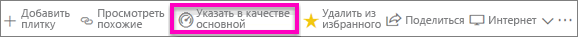
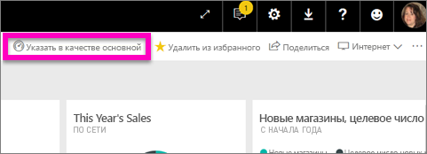
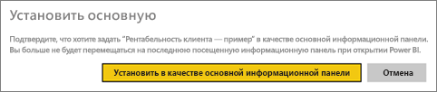
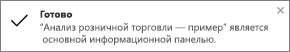
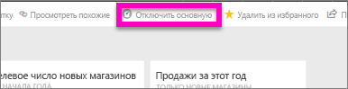

# Основные панели мониторинга в службе Power BI
## Создание основной панели мониторинга
У многих из нас есть одна панель мониторинга, с которой мы работаем больше, чем с другими.  Возможно, это панель мониторинга, которую вы используете для ведения бизнеса или которая содержит несколько плиток из разных панелей мониторинга и отчетов.

Если указать информационную панель как *основную*, то при каждом открытии службы Power BI сначала будет отображаться эта информационная панель.  

Вы также можете выбрать несколько панелей мониторинга и включить их в *избранные*. См. раздел [Добавление панелей мониторинга в "Избранное"](service-dashboard-favorite.md).

> [!NOTE] 
>Сведения, приведенные в этом разделе, относятся к службе Power BI, но не к Power BI Desktop.

Если вы еще не настроили основную информационную панель, Power BI откроет панель, которая использовалась в последний раз.  

### Настройка **основной** панели мониторинга
Посмотрите, как Аманда создает основную панель мониторинга, и следуйте инструкциям под видео, чтобы попробовать сделать это самостоятельно.

<iframe width="560" height="315" src="https://www.youtube.com/embed/G26dr2PsEpk" frameborder="0" allowfullscreen></iframe>

1. Откройте информационную панель, которую необходимо задать как *основную*. 
2. На верхней панели навигации вы увидите параметр **Set as featured** (Указать в качестве основной) или просто значок основной панели мониторинга. Щелкните один из вариантов.
   
    
3. Подтвердите выбор.
   
    

## Изменение основной панели мониторинга
Разумеется, в дальнейшем вы можете задать другую информационную панель в качестве основной.

1. Выполните шаги 1 и 2 выше.
   
    
2. Выберите **Указать в качестве основной**. Отключение основной панели мониторинга не приводит к ее удалению из рабочей области.  
   
    

## Удаление основной панели мониторинга
Если вы больше не нуждаетесь в какой-либо информационной панели как в основной, ниже приведены действия по ее отключению.

1. Откройте информационную панель, которая сейчас указана как основная.
2. В верхней строке меню выберите **Отключить основную**.
   
    

Теперь Power BI откроет последнюю панель мониторинга, которую вы использовали.  

## Дальнейшие действия
[Избранные панели мониторинга в Power BI](service-dashboard-favorite.md)

Появились дополнительные вопросы? [Ответы на них см. в сообществе Power BI.](http://community.powerbi.com/)

