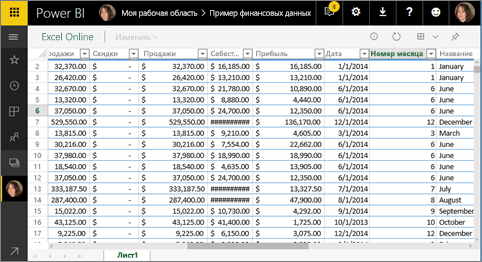
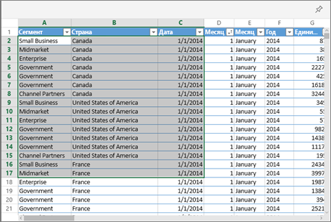

# Закрепление плитки на панели мониторинга Power BI из книги Excel
Прежде чем можно будет закрепить плитку из книги Excel, эту книгу необходимо подключить к службе Power BI (app.powerbi.com). При подключении книги ее связанная доступная только для чтения версия добавляется в службу Power BI, что дает возможность закреплять диапазоны ячеек на панелях мониторинга. На панели мониторинга можно закрепить даже целый лист.  
Если доступ к книге вам предоставил другой пользователь, вы сможете просматривать плитки, закрепленные владельцем, а создавать новые плитки на панели мониторинга — нет. 

Подробные сведения о совместной работе Excel и Power BI см. в статье [Получение данных из файлов книг Excel](http://go.microsoft.com/fwlink/?LinkID=521962).

В следующем видео Уилл покажет несколько способов импорта данных из книги Excel и подключения к ней.

<iframe width="560" height="315" src="https://www.youtube.com/embed/l8JoB7w0zJA" frameborder="0" allowfullscreen></iframe>

## Подключение книги Excel из OneDrive для бизнеса к Power BI
Если выбрать **Подключить**, ваша книга отобразится в Power BI так же, как в Excel Online. При этом у вас будет несколько удобных функций, не доступных в Excel Online, которые помогут вам закрепить элементы из листов прямо на информационных панелях.

Книгу нельзя редактировать в Power BI. Но если вы хотите внести изменения, на вкладке **Книги** рабочей области щелкните значок с изображением карандаша, а затем отредактируйте книгу в Excel Online или откройте ее в Excel на своем компьютере. Любые внесенные изменения сохраняются в книге в OneDrive.

1. Отправьте книгу в OneDrive для бизнеса.

2. В Power BI [подключитесь к этой книге](service-excel-workbook-files.md). Для этого выберите **Получить данные > Файлы > OneDrive для бизнеса** и перейдите в расположение, где сохранен файл Excel. Выберите файл и щелкните **Подключение > Подключиться**.

    

3. В Power BI книги добавляются на вкладку **Книги** рабочей области.  Значок  показывает, что это книга Excel, а желтая звездочка означает, что книга новая.
    
    
4. Откройте книгу в Power BI, выбрав ее имя.

    Изменения, внесенные в книгу в Power BI, не сохраняются и не влияют на исходную книгу, которая находится в OneDrive для бизнеса. Изменения, внесенные в Power BI в результате сортировки, фильтрования или изменения значений, нельзя сохранить или закрепить. Если необходимо внести изменения, которые будут сохранены, выберите **Изменить** в правом верхнем углу, чтобы открыть книгу для редактирования в Excel Online или Excel. После изменений, внесенных таким образом, пройдет несколько минут, прежде чем обновятся плитки на панелях мониторинга.
   
    

## Закрепление диапазона ячеек на панели мониторинга
Новую [плитку информационной панели](service-dashboard-tiles.md) можно добавить в том числе и из книги Excel в Power BI. Диапазоны можно закреплять из книг Excel, сохраненных в OneDrive для бизнеса или в другой библиотеке документов с общим доступом для группы пользователей. Диапазоны могут содержать данные, диаграммы, таблицы, сводные таблицы, сводные диаграммы и других компоненты Excel.

1. Выделите ячейки, которые нужно закрепить на панели мониторинга.
   
    
2. Выберите значок закрепления  . 
3. Закрепите плитку на существующей или новой панели мониторинга. 
   
   * Существующая информационная панель: выберите имя панели в раскрывающемся списке.
   * Новая информационная панель: введите имя новой панели.
   
     
4. Выберите **Закрепить**. Сообщение об успешном выполнении (рядом с правым верхним углом экрана) позволяет узнать, что выбранный диапазон данных был добавлен на панель мониторинга в качестве плитки. 
   
    
5. Выберите **Перейти к панели мониторинга**. Здесь можно [переименовать, изменить размер, связать и переместить](service-dashboard-edit-tile.md) закрепленную визуализацию. По умолчанию при выборе закрепленной плитки книга открывается в Power BI.

## Закрепление всей таблицы или сводной таблицы на панели мониторинга
Выполните указанные выше действия, но вместо диапазона ячеек выберите всю таблицу или сводную таблицу.

Чтобы закрепить таблицу, выделите весь ее диапазон, включая заголовки.  Чтобы закрепить сводную таблицу, необходимо захватить все видимые части таблицы, включая фильтры, если они используются.

 

На плитке, созданной из таблицы или сводной таблицы, отображается вся таблица.  Строки или столбцы, добавленные в исходную книгу, удаленные из нее или отфильтрованные, также добавляются, удаляются и фильтруются в плитке.

## Просмотр книги, связанной с плиткой
Щелчок по плитке открывает связанную с ней книгу в Power BI. Поскольку файл книги находится в приложении OneDrive для бизнеса ее владельца, для просмотра соответствующей книги также требуется разрешение на ее чтение. Если у вас его нет, появится сообщение об ошибке.  

 

## Рекомендации и устранение неполадок
Не поддерживаются следующие функции: Power BI использует службы Excel для извлечения плиток книги. Таким образом, из-за того, что некоторые функции Excel не поддерживаются в REST API служб Excel, эти функции не будут отображаться на плитках в Power BI. К таким функциям относятся, например, спарклайны, условное форматирование набора значков и срезы времени. Полный список неподдерживаемых функций см. в статье [Неподдерживаемые компоненты API REST служб Excel](http://msdn.microsoft.com/library/office/ff394477.aspx).

## Дальнейшие действия
[Общий доступ к панели мониторинга, содержащей ссылки на книгу Excel](service-share-dashboard-that-links-to-excel-onedrive.md)

[Получение данных из книг Excel](service-excel-workbook-files.md)

Появились дополнительные вопросы? [Ответы на них см. в сообществе Power BI.](http://community.powerbi.com/)

