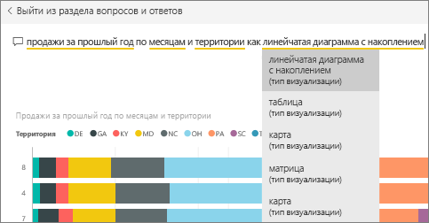

# Закрепление плитки на информационной панели из подсистемы вопросов и ответов
## Закрепление плитки из вопросов и ответов
Вопросы и ответы — это средство автоматизированной системы отчетности Power BI. Нужно что-то понять? Задайте вопрос о данных и получите ответ в форме визуализации.

В этом практическом руководстве мы с помощью службы Power BI (app.powerbi.com) откроем панель мониторинга, зададим вопрос, используя естественный язык для создания визуализации, и закрепим эту визуализацию на панели мониторинга. Панели мониторинга недоступны в приложении Power BI Desktop. См. дополнительные ведения об [использовании функции "Вопросы и ответы" с помощью других средств и содержимого Power BI](consumer/end-user-q-and-a.md). 

Чтобы продолжить работу, откройте [панель мониторинга "Анализ розничной торговли — пример"](sample-retail-analysis.md).

1. Откройте [информационную панель](consumer/end-user-dashboards.md), на которой закреплена по крайней мере одна плитка из отчета. При вводе вопроса служба Power BI ищет ответ в любом наборе данных, имеющем плитку на этой информационной панели.  Дополнительные сведения см. в статье [Источники данных для службы Power BI](service-get-data.md).
2. Начните вводить вопрос о данных в поле вопроса в верхней части информационной панели.  
   
3. Например, когда вы вводите "last year sales by month and territory" (выручка за прошлый год по месяцам и территориям)...  
   

   в поле вопроса отображаются рекомендации.
4. Чтобы добавить диаграмму на панель мониторинга как плитку, щелкните значок закрепления  справа вверху на холсте. Если доступ к панели мониторинга вам предоставил другой пользователь, вы не сможете закрепить на ней визуализацию.

5. Закрепите плитку на существующей или новой панели мониторинга.

   

   * Существующая информационная панель: выберите имя панели в раскрывающемся списке. Вы сможете выбрать только те панели мониторинга, которые доступны в текущей рабочей области.
   * "Новая информационная панель". Введите имя новой информационной панели, и она будет добавлена в текущую рабочую область.

6. Выберите **Закрепить**.

   Сообщение об успешном выполнении (рядом с правым верхним углом экрана) позволяет узнать, что визуализация была добавлена на панель мониторинга в качестве плитки.  

   
7. Выберите **Перейти на информационную панель**, чтобы просмотреть новую плитку. Здесь вы можете [изменить имя или размер, добавить гиперссылку и переместить плитку, а также выполнить другие действия](service-dashboard-edit-tile.md) на панели мониторинга.

   

## Рекомендации и устранение неполадок
* При вводе вопроса подсистема вопросов и ответов немедленно начинает поиск лучшего ответа по всем наборам данных, связанным с текущей панелью мониторинга.  Текущей считается панель мониторинга, указанная на верхней панели навигации. Например, этот вопрос можно задать на информационной панели **Анализ розничной торговли — пример**, которая является частью рабочей области приложения **mihart**.

  
* **Как подсистема вопросов и ответов узнает, какие наборы данных использовать**?  Функция "Вопросы и ответы" имеет доступ ко всем наборам данных, у которых хотя бы одна визуализация прикреплена к этой панели мониторинга.

* **Не видите поле вопроса**? Обратитесь за помощью к администратору. Администратор может отключить функцию "Вопросы и ответы".

## Дальнейшие действия
[Изменение и удаление плитки на информационной панели](service-dashboard-edit-tile.md)    
[Отображение плитки панели мониторинга или визуального элемента отчета в режиме фокусировки](consumer/end-user-focus.md)     
[Вопросы и ответы в Power BI](consumer/end-user-q-and-a.md)  
Появились дополнительные вопросы? [Ответы на них см. в сообществе Power BI.](http://community.powerbi.com/)
