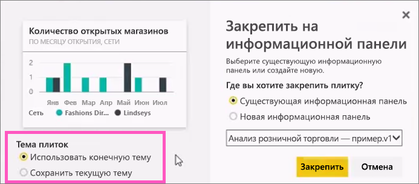
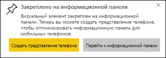

# Закрепление плитки на панели мониторинга Power BI из отчета
## Закрепление плиток из отчета
Новую [плитку панели мониторинга](consumer/end-user-tiles.md) можно в том числе добавить из [отчета Power BI](consumer/end-user-reports.md). Фактически из отчета можно добавить много новых плиток.  Каждая из этих плиток содержит обратную ссылку на отчет.

Кроме того, все страницы отчета могут быть прикреплены к панели мониторинга.  Этот процесс также называется закреплением *живой* плитки.  Плитка называется *живой*, так как вы можете взаимодействовать с ней на панели мониторинга, и, в отличие от отдельных плиток визуализации, вносимые в отчет изменения синхронизируются с панелью мониторинга. Дополнительные сведения об этом см. ниже.

Нельзя закреплять плитки из отчетов, к которым вам предоставили общий доступ, или из Power BI Desktop. 

> **Совет**. В некоторых визуализациях используются фоновые изображения. Если фоновое изображение слишком велико, есть вероятность, что закрепить плитки не удастся.  Попробуйте уменьшить размер изображения или сжать его.  
> 
> 

## Закрепление плитки из отчета
Посмотрите, как Аманда создает панель мониторинга, закрепляя на ней визуальные элементы и изображения из отчета Power BI.

<iframe width="560" height="315" src="https://www.youtube.com/embed/lJKgWnvl6bQ" frameborder="0" allowfullscreen></iframe>

Теперь вы можете создать свою собственную панель мониторинга, используя для примера один из отчетов Power BI.

1. Наведите указатель мыши на визуализацию, которую требуется закрепить, и выберите значок булавки . Power BI открывает экран **Закрепить на информационной панели** .
   
     
2. Определите, требуется ли закрепить плитку на существующей или новой панели мониторинга.
   
   * Существующая информационная панель: выберите имя панели в раскрывающемся списке. Панели мониторинга, к которым был предоставлен доступ, не появятся в раскрывающемся списке.
   * Новая информационная панель: введите имя новой панели.
3. В некоторых случаях к закрепляемому элементу может быть применена *тема* .  Это можно сказать, например, о визуальных элементах, закрепленных из книги Excel. В этом случае выберите тему для применения к плитке.
4. Выберите **Закрепить**.
   
   Сообщение об успешном выполнении (рядом с правым верхним углом экрана) позволяет узнать, что визуализация была добавлена на панель мониторинга в качестве плитки.
   
   
5. На панели навигации выберите информационную панель с новой плиткой. Выберите плитку, чтобы вернуться в отчет. Или [измените отображение и поведение плитки](service-dashboard-edit-tile.md).

## Закрепление целой страницы отчета
Другой вариант — закрепить страницу отчета целиком на панели мониторинга. Это простой способ закрепить несколько визуализаций за раз.  Кроме того, при закреплении целой страницы используются *живые* плитки. Вы можете взаимодействовать с ними прямо на информационной панели. А изменения, вносимые в любую из визуализаций в редакторе отчетов, например добавление фильтра или изменение полей, используемых в диаграмме, также отражаются на плитке панели мониторинга.  

Дополнительные сведения см. в статье [Закрепление целой страницы отчета](service-dashboard-pin-live-tile-from-report.md)

## Дальнейшие действия
[Панели мониторинга в Power BI](consumer/end-user-dashboards.md)

[Плитки панели мониторинга в Power BI](consumer/end-user-tiles.md)

[Отчеты в Power BI](consumer/end-user-reports.md)

[Обновление данных в Power BI](refresh-data.md)

[Power BI — основные понятия](consumer/end-user-basic-concepts.md)

Появились дополнительные вопросы? [Ответы на них см. в сообществе Power BI.](http://community.powerbi.com/)

