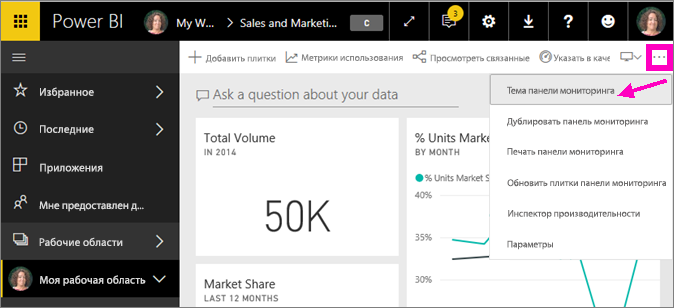

# Использование тем панели мониторинга в службе Power BI
С помощью **тем панели мониторинга** ко всей панели мониторинга можно применить требуемую цветовую тему, например корпоративные цвета, цвета времен года или другие цветовые темы. При применении **темы панели мониторинга** для всех визуальных элементов на панели мониторинга используются цвета из выбранной темы (c некоторыми исключениями, описанными далее в этой статье).

Изменение цветов для визуальных элементов отчета на панели мониторинга не влияет на визуальные элементы в отчете. Кроме того, при закреплении плиток из отчета, к которому уже [применена тема отчета](desktop-report-themes.md), можно оставить текущую тему или использовать тему панели мониторинга.

## Предварительные требования
* Чтобы продолжить работу, откройте [панель мониторинга "Продажи и маркетинг — пример"](sample-datasets.md).

## Как применяются темы панели мониторинга
Сначала откройте панель мониторинга, которую вы создали (или для которой имеете разрешение на изменение) и которую хотите настроить. Нажмите кнопку с многоточием (...) и выберите пункт **Тема панели мониторинга**. 

В появившейся области панели мониторинга выберите одну из готовых тем.  В приведенном ниже примере мы выбрали тему **Темная**.

## Создание пользовательской темы

Тема по умолчанию для панелей мониторинга Power BI — **Светлая**. Чтобы настроить цвета или создать собственную тему, в раскрывающемся списке выберите пункт **Пользовательская**. 

Чтобы создать собственную тему панели мониторинга, используйте пользовательские параметры. При добавлении фонового изображения рекомендуется, чтобы оно имело разрешение не менее 1920 x 1080 пикселей.  

### Использование тем JSON
Другой способ создать пользовательскую тему — передать файл JSON с параметрами всех цветов, которые следует использовать для панели мониторинга. В Power BI Desktop авторы отчетов используют файлы JSON с целью [создания тем для отчетов](desktop-report-themes.md). Такие же файлы JSON можно передавать для панелей мониторинга. Кроме того, можно найти и передать файлы JSON со [страницы коллекции тем](https://community.powerbi.com/t5/Themes-Gallery/bd-p/ThemesGallery) в сообществе Power BI. 

Вы также можете сохранить пользовательскую тему как файл JSON и поделиться им с другими создателями панелей мониторинга. 

### Использование темы из коллекции тем

Так же как в случае со встроенными и пользовательскими параметрами, при передаче темы цвета применяются автоматически ко всем плиткам на панели мониторинга. 

1. Наведите указатель на тему и выберите пункт **Просмотреть отчет**.

    

2. Прокрутите содержимое окна вниз и найдите ссылку на файл JSON.  Щелкните значок скачивания и сохраните файл.

    

3. Вернувшись в службу Power BI, в окне пользовательской темы панели мониторинга нажмите кнопку **Отправить тему JSON**.

    

4. Перейдите в расположение, в котором был сохранен JSON-файл темы, и нажмите кнопку **Открыть**.

5. На странице темы панели мониторинга нажмите кнопку **Сохранить**. Новая тема будет применена к панели мониторинга.

    

## Рекомендации и ограничения

* Если в отчете используется тема, которая отличается от темы панели мониторинга, можно выбрать, сохранит ли визуальный элемент текущую тему или использует тему панели мониторинга для поддержания согласованности между визуальными элементами из разных источников. Чтобы оставить тему отчета при закреплении плитки на панели мониторинга, выберите параметр **Сохранить текущую тему**. Визуальный элемент на панели мониторинга сохранит тему отчета, включая параметры прозрачности. 

    Параметры **темы плиток** отображаются в единственной ситуации: если вы создали отчет в Power BI Desktop, [добавили тему отчета](desktop-report-themes.md), а затем опубликовали отчет в службе Power BI. 

    

    Попробуйте повторно закрепить плитку и выбрать параметр **Использовать тему панели мониторинга**.

    

* Темы панели мониторинга в настоящее время не поддерживаются при просмотре панели мониторинга, внедренной с помощью REST API, панели мониторинга на мобильных устройствах или просмотре панели мониторинга внешними пользователями.    
* Темы панели мониторинга не могут применяться к закрепленным динамическим страницам отчетов, плиткам IFrame, плиткам SSRS, плиткам книги или изображениям.
* Темы панели мониторинга можно просматривать на мобильных устройствах, но создавать их можно только в службе Power BI. 
* Пользовательские темы панели мониторинга работают только с плитками, закрепленными из отчетов. 

