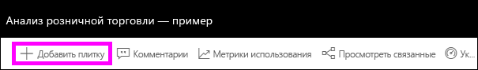
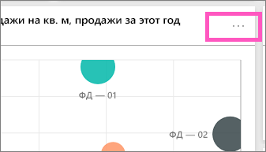
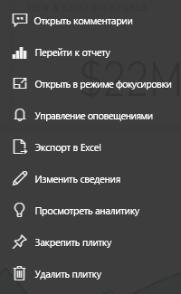

# Общие сведения о плитках панели мониторинга для разработчиков Power BI

Плитка представляет собой моментальный снимок данных, закрепленный на панели мониторинга. Плитку можно создать на основе отчета, набора данных, панели мониторинга, поля вопросов и ответов, Excel, а также отчетов SQL Server Reporting Services (SSRS) и многого другого.  На предыдущем снимке экрана показано множество различных плиток, закрепленных на информационной панели.

Информационные панели и плитки информационной панели — это компоненты службы Power BI, а не Power BI Desktop. Нельзя создавать панели мониторинга на мобильных устройствах, однако их можно на них [просматривать и предоставлять к ним доступ](mobile-apps-view-dashboard.md).

Помимо закрепления, автономные плитки можно создавать непосредственно на панели мониторинга с помощью команды [Добавить плитку](service-dashboard-add-widget.md). Автономные плитки содержат следующие данные: текстовые поля, изображения, видео, потоковую передачу данных и веб-содержимое.

Нужна помощь со стандартными блоками Power BI?  См. раздел [Power BI — основные понятия](service-basic-concepts.md).

> [!NOTE]
> Если исходная визуализация, использованная для создания плитки, изменяется, сама плитка не изменяется.  Например, если вы закрепили график из отчета, а затем изменили график на гистограмму, график будет по-прежнему отображаться на плитке информационной панели. Данные обновляются, а тип визуализации — нет.
> 
> 

## Источники для закрепления плитки
Существует много различных способов добавления (закрепления) плитки на информационной панели. Плитки можно закреплять из указанных ниже источников.

* [Функция "Вопросы и ответы" Power BI](service-dashboard-pin-tile-from-q-and-a.md)
* [Отчет](service-dashboard-pin-tile-from-report.md)
* [Другая информационная панель](service-pin-tile-to-another-dashboard.md)
* [Книга Excel в OneDrive для бизнеса](service-dashboard-pin-tile-from-excel.md)
* [Издатель Power BI для Excel](publisher-for-excel.md)
* [Краткая аналитика](service-insights.md)
* [Службы отчетов](https://docs.microsoft.com/sql/reporting-services/pin-reporting-services-items-to-power-bi-dashboards)

Автономные плитки для изображений, текстовых полей, видео, потоковой передачи данных и веб-содержимого можно создать непосредственно на панели мониторинга с помощью команды [Добавить плитку](service-dashboard-add-widget.md).

  

## Взаимодействие с плитками на информационной панели
### Перемещение и изменение размеров плитки
Захватите плитку и [переместите ее на информационной панели](service-dashboard-edit-tile.md). Наведите указатель мыши на маркер  и выберите его для изменения размеров плитки.

### Изменение ее внешнего вида и поведения плитки
1. Наведите указатель на плитку , чтобы отобразить многоточие.
   
    
2. Выберите многоточие, чтобы открыть меню действий плитки.
   
    
   
    Здесь можно выполнять следующие действия:
   
   * [открыть отчет, который использовался для создания этой плитки ](service-reports.md) ;  
   
   * [открыть лист, который использовался для создания этой плитки ](service-reports.md) ;  
     
    * [просматривать плитку в режиме фокусировки ](service-focus-mode.md) ;  
     * [экспортировать данные, используемые на плитке](visuals/power-bi-visualization-export-data.md) ;
     * =[изменить заголовок и подзаголовок, добавить гиперссылку](service-dashboard-edit-tile.md) ;
     * [запускать аналитику ](service-insights.md) ;
     * [закреплять плитку на другой панели мониторинга ](service-pin-tile-to-another-dashboard.md)
       ;
     * [удалять плитку](service-dashboard-edit-tile.md)
     .
3. Чтобы закрыть меню действий, выберите пустую область на холсте.

### Выбор плитки
То, что происходит при выборе плитки, зависит от того, как плитка была создана. Кроме того, если имеется [пользовательская ссылка](service-dashboard-edit-tile.md), при выборе плитки осуществляется переход по этой ссылке. В противном случае при выборе плитки открываются отчет, книга Excel Online, локальный отчет SQL Server Reporting Services или вопрос функции "Вопросы и ответы", которые использовались для создания плитки.

> [!NOTE]
> Исключением из этого являются плитки видео, созданные непосредственно на панели мониторинга с помощью команды **Добавить плитку**. При выборе такой плитки видео воспроизводится прямо на панели мониторинга.   
> 
> 

## Рекомендации и устранение неполадок

* Если отчет, который использовался для создания визуализации, не был сохранен, при выборе плитки никакие действия не выполняются.
* Если плитка была создана из книги в Excel Online, требуется по крайней мере разрешение на чтение для этой книги. В противном случае при выборе плитки книга не будет открываться в Excel Online.
* Например, вы создаете плитку непосредственно на панели мониторинга с помощью команды **Добавить плитку** и задаете для нее пользовательскую гиперссылку. В этом случае при выборе заголовка, подзаголовка или плитки открывается этот URL-адрес. В противном случае по умолчанию при выборе одной из плиток, созданных непосредственно на панели мониторинга для изображения, веб-кода или текстового поля, ничего не происходит.
* Если у вас нет разрешения на доступ к отчету в Reporting Services и вы выберете плитку, созданную в отчете Reporting Services, появится страница с сообщением, что у вас нет доступа (rsAccessDenied).
* Если у вас нет доступа к сети, в которой размещается сервер Reporting Services, и вы выберете плитку, созданную в Reporting Services, появится страница с сообщением о том, что не удалось найти сервер (HTTP 404). Для просмотра отчета ваше устройство должно иметь сетевой доступ к серверу отчетов.
* Если исходная визуализация, использованная для создания плитки, изменяется, сама плитка не изменяется.  Например, если вы закрепили график из отчета, а затем изменили график на гистограмму, плитка панели мониторинга продолжает отображать график. Данные обновляются, а тип визуализации — нет.

## Дальнейшие действия
[Визуализация карточек](power-bi-visualization-card.md)

[Панели мониторинга в Power BI](service-dashboards.md)  

[Обновление данных](refresh-data.md)

[Power BI — основные понятия](service-basic-concepts.md)

[Экспорт плитки в PowerPoint](http://blogs.msdn.com/b/powerbidev/archive/2015/09/28/integrating-power-bi-tiles-into-office-documents.aspx)

[Закрепление элементов Reporting Services на панелях мониторинга в Power BI](https://msdn.microsoft.com/library/mt604784.aspx)

Появились дополнительные вопросы? [Ответы на них см. в сообществе Power BI.](http://community.powerbi.com/)

