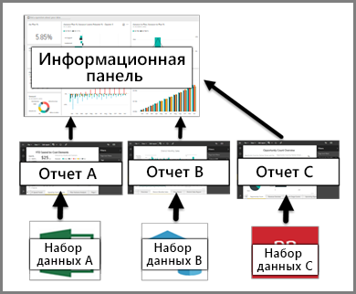

# Панели мониторинга в службе Power BI

***Панель мониторинга*** Power BI — это отдельная страница (часто называется полотном), на которой данные отображаются в виде визуализаций. Будучи ограниченной одной страницей, продуманная панель мониторинга содержит самые важные фрагменты таких данных.

Панели мониторинга — это компонент службы Power BI, который недоступен в службе Power BI Desktop. На мобильных устройствах невозможно создавать панели мониторинга, но можно их [просматривать и предоставлять для общего доступа](mobile-apps-view-dashboard.md).

## Создатели и потребители панелей мониторинга
В зависимости от вашей роли, вы можете быть создателем панелей мониторинга для собственного пользования или для совместного использования с коллегами. Нужные вам сведения можно найти в разделе **Панели мониторинга для создателей**. Вы также можете получать панели мониторинга от других. Возможно, вы хотите разобраться в особенностях использования панелей мониторинга и способах взаимодействия с ними. Тогда эта статья предназначена для вас!

### Если вы хотите получать и использовать панели мониторинга

Визуализации, отображаемые на панели мониторинга, называются *плитками*. *Создатели* *закрепляют* их на панели мониторинга из отчетов. Если вы недавно начали использовать службу Power BI, ознакомьтесь со статьей [Power BI — основные понятия](service-basic-concepts.md), где приведены базовые сведения.

> [!IMPORTANT]
> Для просмотра общедоступной панели мониторинга требуется [Power BI Pro](service-free-vs-pro.md).

Визуализации на панели мониторинга появляются из отчетов, а каждый отчет создается на основе набора данных. Фактически панель мониторинга можно рассматривать как средство представления базовых отчетов и наборов данных. Выбирая визуализацию, вы можете перейти к отчету (и набору данных), который использовался для ее создания.

## Преимущества панелей мониторинга
Панели мониторинга — прекрасный способ отслеживать положение дел в бизнесе, находить ответы на вопросы и быстро просматривать наиболее важные метрики. Визуализации на панели мониторинга могут поступать из одного или нескольких базовых наборов данных и из одного или нескольких базовых отчетов. Панель мониторинга объединяет локальные и облачные данные независимо от того, где они расположены.

Панель мониторинга — это не просто симпатичная картинка; это интерактивное средство, в котором обновление плиток происходит при изменении базовых данных.

## Панели мониторинга и отчеты
[Отчеты](service-reports.md) зачастую путают с панелями мониторинга, так как они также являются полотнами, которые заполнены визуализациями. Но для потребителей Power BI есть некоторые существенные различия.

| **Возможность** | **Панели мониторинга** | **Отчеты** |
| --- | --- | --- |
| Страницы |Одна страница |Одна или несколько страниц |
| Источники данных |Один или несколько отчетов и один или несколько наборов данных на каждую панель мониторинга |Один набор данных на каждый отчет |
| Доступность в Power BI Desktop |Нет |Да, ***создатели*** могут создавать и просматривать отчеты в Power BI Desktop |
| Подписаться |Можно подписаться на панель мониторинга |Можно подписаться на страницы отчета |
| Фильтрация |Невозможно выполнить фильтрацию и срез |Множество различных способов для выполнения фильтрации, выделения и среза |
| Подборка |Можно задать одну панель мониторинга в качестве избранной |Нельзя создать избранный отчет |
| Избранное | Можно добавить панели мониторинга в *избранное* | Можно добавить отчеты в *избранное*
| Настройка оповещений |Доступно на плитках панели мониторинга в определенных обстоятельствах |Недоступно из отчетов |
| Запросы на естественном языке |Доступно на панели мониторинга |Недоступно из отчетов |
| Просмотр таблиц и полей базового набора данных |Нет. Можно экспортировать данные, но нельзя просматривать таблицы и поля непосредственно на панели мониторинга |Да. Можно просматривать таблицы, поля и значения набора данных |
| Настройка |Нет |В режиме чтения можно выполнять публикацию, внедрение, фильтрацию, экспорт, скачивание в формате PBIX, просмотр связанного содержимого, создание QR-кодов, анализ в Excel и многие другие операции.  |

## Дальнейшие действия
* Ознакомьтесь с обзорными сведениями об использовании на примере одной из наших [панелей мониторинга](sample-tutorial-connect-to-the-samples.md).
* Узнайте, что такое [плитки панели мониторинга](service-dashboard-tiles.md) и что произойдет, если выбрать одну из них.
* Хотите отслеживать отдельную плитку панели мониторинга и получать сообщения электронной почты при достижении определенного порога? [Создавайте оповещения, связанные с плитками](service-set-data-alerts.md).
* Не стесняйтесь задавать вопросы о панели мониторинга. Узнайте, как использовать функцию ["Вопросы и ответы" Power BI](power-bi-tutorial-q-and-a.md), задавайте вопросы о своих данных и получайте ответы в виде визуализации.
