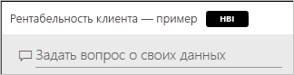
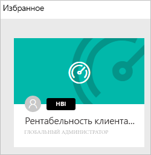
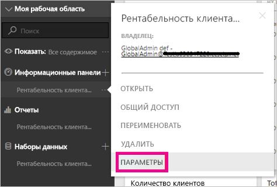

# Классификация данных на панелях мониторинга
Все панели мониторинга разные, и от того, к каким источникам данных вы подключаетесь, должны зависеть меры для защиты их конфиденциальности, принимаемые вами и вашими коллегами, которым вы предоставляете доступ к панелям. Некоторые панели мониторинга вообще не предназначены для людей за пределами организации или для вывода на печать, другие панели не требуют подобных мер предосторожности. Классификация данных на панелях позволяет обратить внимание людей, которые с ними работают, на степень конфиденциальности представленной на них информации. Данным на панелях мониторинга можно присваивать категории, установленные ИТ-отделом организации, чтобы у всех ее пользователей было одинаковое представление о степени важности той или иной информации.

## Теги классификации данных
Теги классификации данных отображаются рядом с названием панели, чтобы все, кто ее просматривает, понимали, какие меры предосторожности нужно принимать при работе с ней и какую информацию она содержит.

Кроме того, эти теги отображаются рядом с плитками панелей в списке избранного.

При наведении указателя мыши на тег появляется полное название соответствующей классификационной категории.

Администраторы также могут задавать для тегов URL-адреса на страницы с дополнительными сведениями.

> [!NOTE]
> В зависимости от заданных администратором параметров классификации некоторые категории могут не отображаться в виде тегов на панели мониторинга. Если вы являетесь владельцем панели, вы сможете в любой момент проверить ее классификационный тип в ее параметрах.
> 
> 

## Настройка классификации панели мониторинга
Если для вашей организации включена классификация данных, всем панелям мониторинга изначально назначается классификационный тип по умолчанию, однако владелец панели может сменить его в зависимости от требований к безопасности данных.

Чтобы изменить классификационный тип панели, выполните указанные ниже действия.

1. Откройте параметры панели, нажав на кнопку с **многоточием** рядом с ее названием и выбрав пункт **Параметры**.
   
    
2. В параметрах панели мониторинга указан ее текущий классификационный тип, который можно сменить, выбрав другой вариант из раскрывающегося списка.
   
    
3. Завершив настройку, нажмите кнопку **Применить**.

После того как вы примените изменение, все пользователи, которым вы предоставили доступ к панели, увидят его следующий раз, когда перезагрузят ее.

## Работа с тегами классификации данных в качестве администратора
Классификацию данных настраивает глобальный администратор организации. Чтобы включить классификацию, выполните указанные ниже действия.

1. Щелкните значок «Параметры» в виде шестеренки и выберите **Портал администратора**.
   
    
2. На вкладке **Параметры клиента** установите для параметра **Классификация данных для панелей мониторинга и отчетов** значение *Вкл*.
   
    

После включения этой функции появится форма, на которой вы сможете создать различные классификационные категории для своей организации.

У каждой категории есть **имя** и **сокращение**, которое будет отображаться на панели мониторинга. С помощью параметра **Показать обозначение** для каждой классификационной категории можно указать, должно ли ее сокращенное название появляться на панели мониторинга. Даже если вы решите не показывать классификационный тип на панели мониторинга, ее владелец все равно сможет увидеть его в ее параметрах. Кроме того, вы можете добавить **URL-адрес** на страницу с дополнительной информацией о правилах классификации и использования данных в вашей организации.  

Наконец, нужно выбрать классификационный тип по умолчанию.  

Заполнив форму создания классификационных типов, нажмите кнопку **Применить**, чтобы сохранить изменения.

После этого всем панелям мониторинга будет назначена классификационная категория по умолчанию, и их владельцы смогут сменить ее в зависимости от типа представленной на панели информации. Вы можете в любой момент добавить здесь новые классификационные типы, удалить существующие или сменить тип по умолчанию.  

> [!NOTE]
> При изменении параметров в этом разделе следует помнить о ряде моментов:
> 
> * Если вы отключите классификацию данных, все уже добавленные классификационные теги будут потеряны. Если потом вы решите опять включить ее, вам придется назначить их снова.  
> * Если удалить классификационный тип, всем панелям мониторинга, которым он был присвоен, будет назначен тип по умолчанию, пока владелец снова не сменит его.  
> * При смене классификационного типа по умолчанию он назначается всем панелям мониторинга, владельцы которых ранее не изменили их тип.
> 
> 

