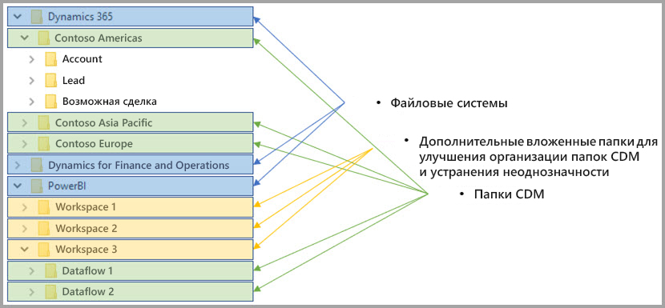

# Потоки данных и интеграция Azure Data Lake (предварительная версия)

По умолчанию данные, используемые в Power BI, хранятся во внутренней памяти, предоставляемой Power BI. С помощью интеграции потоков данных и Azure Data Lake Storage 2-го поколения (ADLS 2-го поколения) вы можете хранить свои потоки данных в корпоративной учетной записи Azure Data Lake Storage 2-го поколения. 

## Как папки CDM связаны с потоками данных

С помощью **потоков данных** пользователи и организации могут объединять данные из разнородных источников и готовить их к моделированию. С помощью модели общих данных (CDM) организации могут использовать формат данных, обеспечивающий семантическую согласованность между приложениями и развертываниями. C помощью ADLS 2-го поколения можно настроить детальное управление доступом и авторизацией для озер данных в Azure. Вместе эти элементы обеспечивают централизованные данные, структурированные данные, детальное управление доступом и семантическую согласованность для приложений и сущностей в масштабах всего предприятия.

Хранимые данные в формате CDM обеспечивают семантическую согласованность между приложениями и развертываниями в организации. Благодаря интеграции CDM с ADLS 2-го поколения такая же структурная согласованность и семантическое значение могут быть применены к данным, хранящимся в ADLS 2-го поколения с использованием папок CDM, содержащих схематизированные данные в стандартном формате CDM. Стандартизированные метаданные и данные с самоописанием в Azure Data Lake облегчают обнаружение метаданных и взаимодействие между поставщиками и потребителями данных, такими как Power BI, Фабрика данных Azure, Azure Data Lake, Databricks и Машинное обучение Azure (ML). 

Потоки данных хранят свои определения и данные в папках CDM в следующих форматах:

**Model.json**
* Файл описания метаданных **Model.json** содержит семантическую информацию о записях и атрибутах сущностей, а также ссылки на базовые файлы данных. Существование файла model.json указывает на соответствие формату метаданных CDM и может включать стандартные сущности, которые содержат дополнительные расширенные готовые семантические метаданные, используемые приложениями.
* Power BI также хранит сведения о каждом источнике данных вместе с **запросом и преобразованиями**, созданными с помощью редактора потоков данных в службе Power BI. Пароли к источникам данных в файле модели не сохраняются.

**Файлы данных**
* Файлы данных содержатся в папке CDM в четко определенной структуре и формате (как указано в этой статье далее, вложенные папки необязательны). В файле model.json представлены ссылки на эти файлы данных. В настоящее время файлы данных должны иметь формат CSV, но в следующих обновлениях могут поддерживаться дополнительные форматы. 

На представленной ниже схеме показан пример папки CDM, созданной потоком данных Power BI, которая содержит три сущности:

Файл model.json или файл метаданных, представленные на предыдущем рисунке, указывают на файлы данных сущности в папке CDM.

## Power BI упорядочивает папки CDM в озере данных

С помощью потоков данных Power BI и их интеграции с ADLS 2-го поколения Power BI может создавать данные в озере данных. В качестве поставщика данных служба Power BI должна создать папку CDM для каждого потока данных, содержащую файл model.json и связанные с ним файлы данных. Power BI хранит свои данные изолированно от других поставщиков данных в озере данных с помощью *файловых систем*. Подробные сведения о файловой системе Azure Data Lake Storage 2-го поколения и иерархическом пространстве имен см. в [этой статье](https://docs.microsoft.com/azure/storage/data-lake-storage/namespace).

Power BI использует вложенные папки для устранения неоднозначности и обеспечения улучшенной организации данных при представлении в **службе Power BI**. Имена и структура папок представляют собой рабочие пространства (папки) и потоки данных (папки CDM). На следующей схеме показано, как можно структурировать озеро данных, совместно используемое службой Power BI и другими поставщиками данных. Каждая служба, в данном случае Dynamics 365, Microsoft Dynamics 365 for Finance and Operation и Power BI, создает и поддерживает собственную файловую систему. В зависимости от интерфейса в каждой службе создаются вложенные папки для лучшей организации папок CDM в файловой системе. 

## Power BI защищает данные в озере данных

Power BI использует маркеры *носителя OAuth Active Directory* и *POSIX ACL*, предоставляемые Azure Data Lake Storage 2-го поколения. Эти функции позволяют определять доступ службы Power BI к файловой системе, которой она управляет в озере данных, а также разрешать пользователям доступ только к тем потокам данных или папкам CDM, которые они создали. 

Для создания папок CDM и управления ими в файловой системе Power BI требуются разрешения на чтение, запись и выполнение. Каждый поток данных, созданный в Power BI, хранится в отдельной папке CDM, а владельцу потока данных предоставляется лишь доступ на чтение содержимого папки CDM. Такой подход обеспечивает защиту целостности данных, которые создает Power BI, и предоставляет администраторам возможность определять, какие пользователи получали доступ к папке CDM с помощью журналов аудита. 

### Авторизация пользователей или служб для папок CDM

Предоставление общего доступа к папкам CDM потребителям данных, таким как пользователи или службы, которым необходимо считывать данные, можно упростить с помощью маркеров носителя OAuth Active Directory и POSIX ACL. Это дает администраторам возможность определять, кто получил доступ к папке CDM. Единственное, что требуется, — предоставить выбранному объекту Active Directory (например, группе пользователей или службе) доступ к папке CDM. Мы рекомендуем, чтобы доступ к папке CDM для любой сущности, кроме поставщика данных, был предоставлен только на чтение. Это защитит целостность данных, созданных поставщиком.

Чтобы добавить папки CDM в Power BI, пользователь, добавляющий папку CDM, должен иметь ACL с доступом *на чтение* как для самой папки CDM, так и для любых файлов или папок в ней. Кроме того, ACL с доступом на *выполнение* как для самой папки CDM, так и любых папок в ней. Дополнительные сведения см. в разделе о [списках управления доступом для файлов и каталогов](https://docs.microsoft.com/azure/storage/blobs/data-lake-storage-access-control#access-control-lists-on-files-and-directories) и в статье [Best practices for using Azure Data Lake Storage Gen2](https://docs.microsoft.com/azure/storage/blobs/data-lake-storage-best-practices) (Рекомендации по использованию Azure Data Lake Storage 2-го поколения).

### Альтернативные формы авторизации

Пользователи или службы за пределами Power BI могут использовать альтернативные формы авторизации. Эти альтернативы предоставляют владельцам ключа доступ ко *всем* ресурсам в учетной записи, полный доступ ко всем ресурсам в озере. Кроме того, они не могут быть ограничены файловыми системами или папками CDM. Этими альтернативами могут быть простые способы предоставления доступа, но они ограничивают возможность совместного использования определенных ресурсов в озере данных и не предоставляют пользователям возможность определения того, кто получил доступ к хранилищу. Дополнительные сведения о доступных схемах авторизации см. в статье [Access control in Azure Data Lake Storage Gen2](https://docs.microsoft.com/azure/storage/blobs/data-lake-storage-access-control
) (Управление доступом в Azure Data Lake Storage 2-го поколения).

## Дальнейшие действия

В этой статье представлены общие сведения об интеграции потоков данных Power BI, папок CDM и Azure Data Lake Storage 2-го поколения. Дополнительные сведения вы найдете в перечисленных ниже статьях.

Дополнительные сведения о потоках данных, CDM и Azure Data Lake Storage 2-го поколения см. в следующих статьях:

* [Настройка параметров потоков данных рабочей области (предварительная версия)](service-dataflows-configure-workspace-storage-settings.md)
* [Добавление папки CDM в Power BI в виде потока данных (предварительная версия)](service-dataflows-add-cdm-folder.md)
* [Подключение Azure Data Lake Storage 2-го поколения для хранения потока данных (предварительная версия)](service-dataflows-connect-azure-data-lake-storage-gen2.md)

Общие сведения о потоках данных см. в этих статьях:

* [Creating and using dataflows in Power BI (Preview)](service-dataflows-create-use.md) (Создание и использование потоков данных в Power BI (предварительная версия))
* [Использование вычисляемых сущностей в Power BI Premium](service-dataflows-computed-entities-premium.md)
* [Использование потоков данных с локальными источниками данных](service-dataflows-on-premises-gateways.md)
* [Ресурсы для разработчиков потоков данных Power BI](service-dataflows-developer-resources.md)

Дополнительные сведения о службе хранилища Azure см. в следующих статьях:
* [Руководство по безопасности службы хранилища Azure](https://docs.microsoft.com/azure/storage/common/storage-security-guide)
* [CDM folders and Azure Data Services integration](https://aka.ms/cdmadstutorial) (Интеграция папок CDM и служб данных Azure)

Дополнительные сведения о модели общих данных вы найдете в этой обзорной статье:
* [Что такое модель общих данных?](https://docs.microsoft.com/powerapps/common-data-model/overview)
* [Папки CDM](https://go.microsoft.com/fwlink/?linkid=2045304)
* [The metadata file (model.json) for the Common Data Model](https://go.microsoft.com/fwlink/?linkid=2045521) (Файл метаданных (model.json) для модели общих данных)

Вы всегда можете [задать вопросы в Сообществе Power BI](http://community.powerbi.com/).
