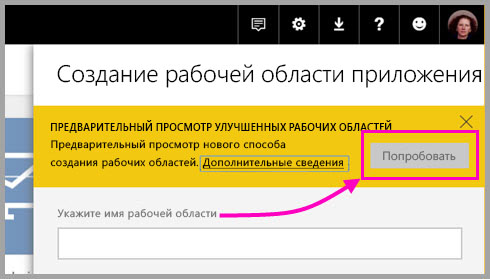
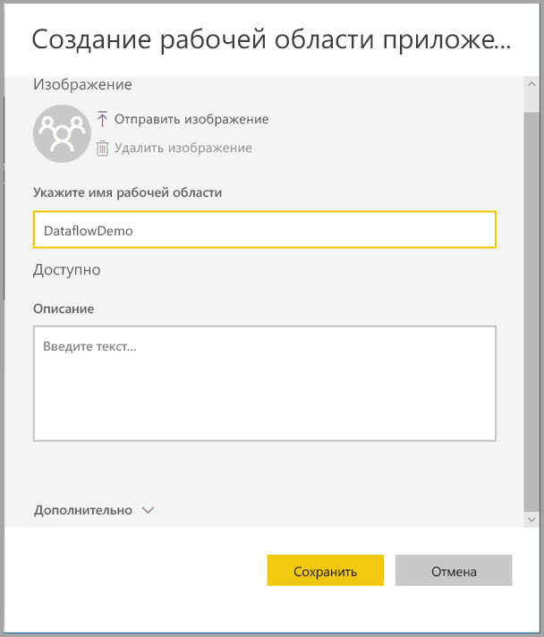
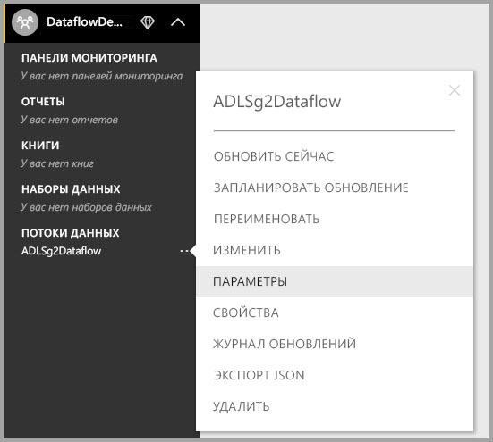

# Настройка параметров потоков данных рабочей области (предварительная версия)

С помощью Power BI и потоков данных вы можете хранить файлы данных и файл определения потока данных рабочей области в учетной записи Azure Data Lake Storage 2-го поколения. Администраторы рабочих областей могут настроить Power BI для этого. Процедура настройки подробно описана в этой статье. 

Перед настройкой места хранения потока данных рабочей области глобальному администратору вашей организации необходимо подключить учетную запись хранения организации к Power BI, а также включить для нее разрешения для назначения хранилища. *[Подключение Azure Data Lake Storage 2-го поколения для хранения потока данных (предварительная версия)](service-dataflows-connect-azure-data-lake-storage-gen2.md)* 

Настроить параметры хранения потока данных рабочей области можно двумя способами: 

* во время создания рабочей области;
* изменив имеющуюся рабочую область.

Мы рассмотрим каждый вариант в следующих разделах. 

> [!IMPORTANT]
> Параметр хранения потока данных рабочей области может быть изменен, только если рабочая область не содержит потоков данных. Кроме того, эта функция доступна только в новом интерфейсе рабочей области. Дополнительные сведения о новой рабочей области см. в статье [Создание рабочих областей (предварительная версия) в Power BI](service-create-the-new-workspaces.md).

## Создание рабочей области и настройка хранения потока данных

Чтобы создать рабочую область приложения в службе Power BI, выберите **Рабочие области > Создать рабочую область приложения**.

В диалоговом окне "Создать рабочую область приложения" может появиться желтый прямоугольник **Предварительный просмотр улучшенных рабочих областей**. В этой области выберите **Попробовать**.

В открывшемся диалоговом окне новой рабочей области можно присвоить уникальное имя. Пока не выбирайте **Сохранить**, так как необходимо внести дополнительные параметры.

Теперь разверните область **Дополнительно** в диалоговом окне **Создание рабочей области приложения**. Здесь можно включить параметр **Хранилище потоков данных (предварительная версия)**.

Чтобы создать рабочую область, выберите **Сохранить**. В любом новом потоке данных, созданном в этой рабочей области, теперь хранится файл его определения (файл Model.json) и данные в учетной записи Azure Data Lake Storage 2-го поколения вашей организации. 

> [!NOTE]
> Функции потоков данных предоставляются в предварительной версии и могут быть изменены до выпуска общедоступной версии.

## Обновление хранилища потока данных для имеющейся рабочей области

Вместо создания рабочей области можно обновить имеющуюся, чтобы хранить файл определения и данные в учетной записи Azure Data Lake Storage 2-го поколения вашей организации. Помните, что параметр хранения потока данных можно изменить, только если рабочая область еще не содержит поток данных.

Чтобы изменить рабочую область приложения, щелкните многоточие **(...)** и выберите команду **Изменить рабочую область**. 

В открывшемся окне **Изменение рабочей области** разверните область **Дополнительно**, а затем установите для параметра **Хранилище потоков данных (предварительная версия)** значение **Вкл**. 

Затем выберите **Сохранить**. Теперь в любом потоке данных, созданном в этой рабочей области, хранятся файл определения и данные в учетной записи Azure Data Lake Storage 2-го поколения вашей организации.

## Получение URI хранимых файлов потока данных

После создания потока данных в рабочей области, назначенной учетной записи Azure Data Lake вашей организации, можно получить доступ к файлам данных и определения напрямую. Их расположение доступно на странице **Параметры потока данных**. Чтобы перейти на эту страницу, сделайте следующее.

Выберите многоточие **(...)** рядом с потоком данных, указанном в разделе **Потоки данных** в рабочей области. В открывшемся меню выберите пункт **Параметры**.

В отображаемой информации расположение папки CDM потока данных указано в разделе **Dataflow Storage location** (Место хранения потока данных), как показано на следующем рисунке.

> [!NOTE]
> Power BI настраивает владельца потока данных с разрешениями для чтения для папки CDM, где хранятся файлы данных. Для предоставления доступа к месту хранения потока данных другим пользователям или службам необходимо, чтобы владелец учетной записи хранения предоставил доступ в Azure.

## Рекомендации и ограничения

Определенные функции потока данных не поддерживаются, когда хранилище потока данных находится в Azure Data Lake Storage 2-го поколения: 

Рабочие области Power BI Pro, Premium и Embedded:
* Функция **связанных сущностей** поддерживается только в рабочих областях из одной учетной записи хранения.
* Разрешения рабочей области не применяются к потокам данных, которые хранятся в Azure Data Lake Storage 2-го поколения; только владелец потока данных может получить к ним доступ.
* В противном случае все функции подготовки данных совпадают с функциями для потоков данных, хранимых в хранилище Power BI.

В списке ниже также описаны некоторые дополнительные рекомендации.

* Место хранения потока данных нельзя изменить после настройки.
* Только владелец потока данных, хранящегося в Azure Data Lake Storage 2-го поколения, может получить доступ к его данным.
* Локальные источники данных в общей емкости Power BI не поддерживаются в потоках данных, хранящихся в Azure Data Lake Storage 2-го поколения вашей организации.

Клиенты **Power BI Desktop** не могут получить доступ к потокам данных, хранящимся в учетной записи Azure Data Lake Storage 2-го поколения вашей организации, если только они не являются владельцами потока данных. Рассмотрим следующую ситуацию:

1.  Анна создает рабочую область приложения и настраивает ее на хранение потоков данных в Data Lake организации.
2.  Бен, который также является членом рабочей области, которую создала Анна, хочет с помощью Power BI Desktop и соединителя потока данных получить данные из потока данных, созданного Анной.
3.  У Бена возникает ошибка, потому что его не добавили как авторизованного пользователя в папку CDM потока данных в Data Lake.

    

## Дальнейшие действия

В этой статье предоставляются инструкции по настройке хранилища рабочей области для потоков данных. Дополнительные сведения вы найдете в перечисленных ниже статьях.

Дополнительные сведения о потоках данных, CDM и Azure Data Lake Storage 2-го поколения см. в следующих статьях:

* [Потоки данных и интеграция Azure Data Lake (предварительная версия)](service-dataflows-azure-data-lake-integration.md)
* [Добавление папки CDM в Power BI в виде потока данных (предварительная версия)](service-dataflows-add-cdm-folder.md)
* [Подключение Azure Data Lake Storage 2-го поколения для хранения потока данных (предварительная версия)](service-dataflows-connect-azure-data-lake-storage-gen2.md)

Общие сведения о потоках данных см. в этих статьях:

* [Creating and using dataflows in Power BI (Preview)](service-dataflows-create-use.md) (Создание и использование потоков данных в Power BI (предварительная версия))
* [Использование вычисляемых сущностей в Power BI Premium (предварительная версия)](service-dataflows-computed-entities-premium.md)
* [Использование потоков данных с локальными источниками данных (предварительная версия)](service-dataflows-on-premises-gateways.md)
* [Ресурсы для разработчиков потоков данных Power BI (предварительная версия)](service-dataflows-developer-resources.md)

Дополнительные сведения о службе хранилища Azure см. в следующих статьях:

* [Руководство по безопасности службы хранилища Azure](https://docs.microsoft.com/azure/storage/common/storage-security-guide)
* [CDM folders and Azure Data Services integration](https://aka.ms/cdmadstutorial) (Интеграция папок CDM и служб данных Azure)

Дополнительные сведения о модели общих данных вы найдете в этой обзорной статье:

* [Что такое модель общих данных?](https://docs.microsoft.com/powerapps/common-data-model/overview)
* [Папки CDM](https://go.microsoft.com/fwlink/?linkid=2045304)
* [The metadata file (model.json) for the Common Data Model](https://go.microsoft.com/fwlink/?linkid=2045521) (Файл метаданных (model.json) для модели общих данных)

Вы всегда можете [задать вопросы в Сообществе Power BI](http://community.powerbi.com/).
