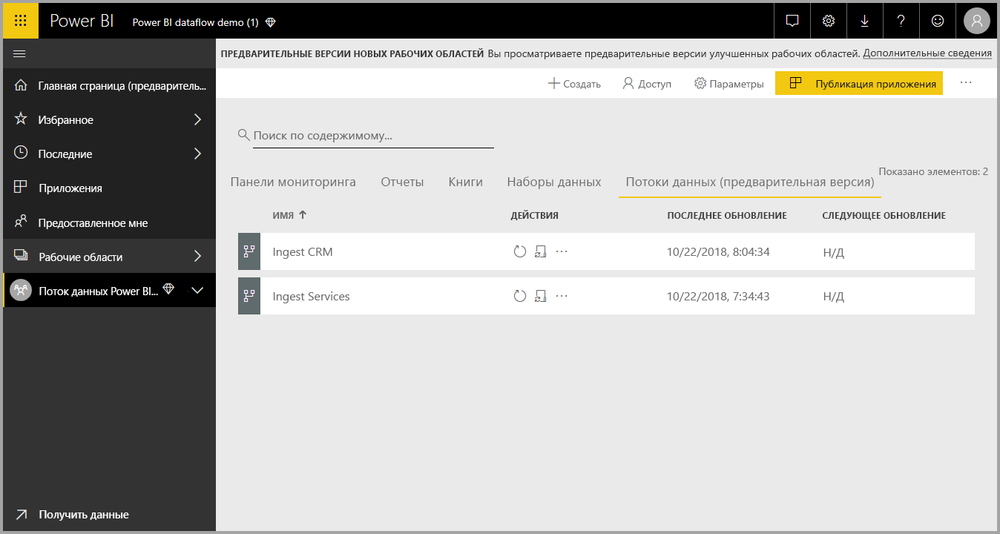
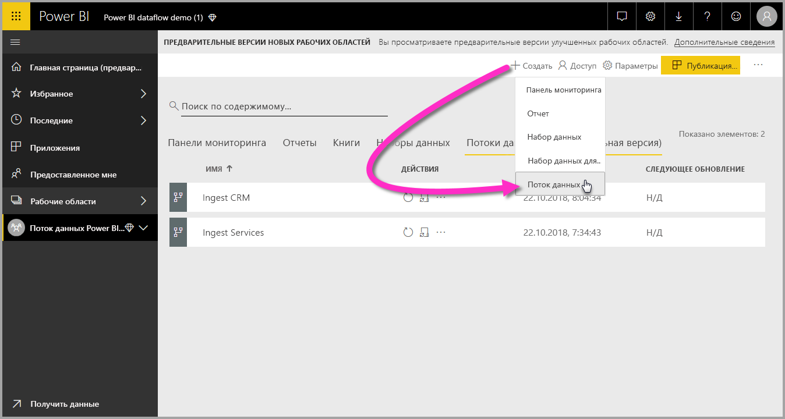
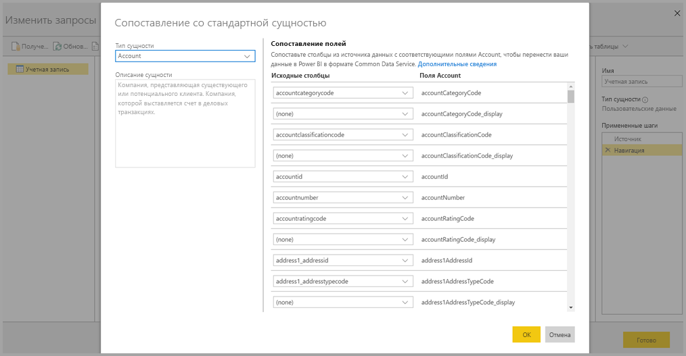
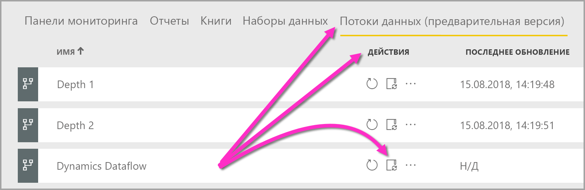

# Создание и использование потоков данных в Power BI (предварительная версия)

С помощью расширенной подготовки данных в **Power BI** можно создать коллекцию данных, которая называется потоком данных, а затем с ее помощью подключиться к бизнес-данным из разных источников, очистить и преобразовать эти данные, а затем загрузить их в хранилище Power BI.

**Поток данных** — это коллекция *сущностей* (сущности здесь аналогичны таблицам), которые создаются и администрируются в рабочих областях приложений в службе Power BI. Вы можно добавлять и изменять сущности в потоке данных, а также управлять расписаниями обновления данных непосредственно из рабочей области, в которой был создан поток данных.

Создав поток данных с помощью**Power BI Desktop** и **службы Power BI**, вы можете создавать наборы данных, отчеты, панели мониторинга и приложения на основе данных из потоков данных Power BI. Это позволит вам получить ценные аналитические сведения о вашей коммерческой деятельности.

Для работы с потоком данных нужно выполнить три шага:

1. Создание потока данных с помощью специально разработанных средств Майкрософт.
2. Настройка расписания обновления для данных, которые вы хотите включить в поток данных.
3. Создание набора данных на основе этого потока данных с помощью Power BI Desktop. 

В следующих разделах мы рассмотрим каждый из этих шагов и средства, которые предоставляются для их выполнения. Давайте начнем.

> [!NOTE]
> Функции потоков данных предоставляются в предварительной версии и могут быть изменены до выпуска общедоступной версии.

## Создание потока данных
Чтобы создать поток данных, запустите службу Power BI в браузере и выберите **рабочую область приложения** (потоки данных недоступны в разделе *my-workspace* в службе Power BI) в области навигации слева, как показано на следующем экране. Вы также можете создать рабочую область для создания потока данных. 

Перейдя в область **рабочей области приложения**, где вы можете создать поток данных, вы увидите кнопку **+Создать** в правом верхнем углу холста. Нажмите эту кнопку **+Создать** и выберите **Поток данных** в раскрывающемся списке. 

Помните, что у каждого потока данных есть только *один владелец* — это создавший его пользователь. Только владелец может изменить поток данных. Все члены **рабочей области приложения** с правами на чтение или запись в рабочей области приложения, в которой был создан поток данных, могут подключаться к потоку данных через **Power BI Desktop**, как описано далее в этой статье.

Здесь вы можете добавить **сущности**, которые мы подробнее рассмотрим в следующем разделе.

### Добавление сущностей

**Сущность** — это набор полей, используемых для хранения данных, аналогично таблице в базе данных. На следующем рисунке показано несколько источников данных, из которых можно принимать данные в Power BI.

При выборе источника данных вам нужно указать параметры подключения, в том числе учетную запись для подключения к источнику данных, как показано на следующем рисунке.

Подключившись, вы сможете выбрать данные, используемые для сущности. Когда вы выберете данные и источник, Power BI будет повторно подключаться к этому источнику для обновления данных в потоке данных с частотой, которую вы настроите позже.

Выбрав данные для использования в сущности, вы сможете с помощью редактора потока данных изменить их формат для использования с потоком данных.

### Использование редактора потока данных

Выбрав данные из источника для использования в сущности, вы сможете изменить формат выбранных данных в соответствии с требованиями к созданной сущности, используя возможности редактирования Power Query, аналогичные функциям **редактора Power Query** в  **Power BI Desktop**. См. дополнительные сведения о [Power Query (Power Query входит в состав Power BI Desktop как редактор Power Query)](desktop-query-overview.md) для Power BI Desktop. 

Если вы хотите просмотреть код, который создает запрос в каждом действии, или нужно создать собственный формирующий код, можно использовать **расширенный редактор**. 

### Потоки данных и общая модель данных (CDM)

В число сущностей потоков данных входят новые средства, которые позволяют легко сопоставлять бизнес-данные с CDM (стандартизованной схемой от корпорации Майкрософт), дополнять ее данными от корпорации Майкрософт и сторонних поставщиков, а также получать упрощенный доступ к машинному обучению. Эти новые возможности позволяют получить ценные сведения и практические рекомендации на основе бизнес-данных. Завершив все необходимые преобразования на этапе изменения запросов, вы сможете сопоставить столбцы из таблиц источника данных с полями стандартной сущности, которая определена в CDM. Для стандартных сущностей используется известная схема, определенная в CDM.

См. дополнительные сведения в статье [Что такое модель общих данных?](https://docs.microsoft.com/powerapps/common-data-model/overview)

Чтобы применить CDM для потока данных, в диалоговом окне **Изменение запросов** щелкните команду **Map to Standard** (Сопоставить со стандартной) для преобразования. Откроется экран **Сопоставление сущностей**, где вы можете выбрать стандартную сущность для сопоставления.

При сопоставлении исходного столбца со стандартным полем происходит следующее:

1. Исходный столбец принимает имя стандартного поля (если эти имена не совпадают, имя столбца изменяется).
2. Столбцу источника присваивается стандартный тип поля данных.

Чтобы сохранить стандартную сущность Map to Standard, всем несопоставленным стандартным полям присваиваются значения *Null*.

Все несопоставленные столбцы источника сохраняются неизменными, чтобы в результате сопоставления получить стандартную сущность с пользовательскими полями.

Когда вы завершите выбор параметров, то есть сущность и все параметры данных будут готовы к сохранению, выберите в меню команду **Сохранить**. Обратите внимание, что вы можете создать несколько сущностей с помощью кнопки **Добавить сущности**. Кроме того, вы можете уточнить запросы и параметры для созданных сущностей с помощью функции изменения сущности.

Когда вы нажмете **Сохранить**, вам будет предложено присвоить потоку данных имя и описание.

Завершив эти изменения и нажав кнопку **Сохранить**, вы увидите новое окно с сообщением о создании **потока данных**. 

Итак, теперь все готово для следующего шага, на котором вы настроите частоту обновления источников данных.

## Настройка частоты обновления

Сохранив поток данных, вам нужно настроить расписание обновления для каждого из подключенных источников данных.

Потоки данных Power BI используют процесс обновления данных Power BI для поддержания актуальности данных. В **службе Power BI** в разделе **рабочей области приложения** есть несколько областей, где могут отображаться данные, в том числе потоки данных, как показано на следующем рисунке.

Элемент *Поток данных Dynamics*, который мы видели на предыдущем рисунке — это тот самый поток данных, который мы создали в предыдущем разделе. Чтобы настроить обновление, выберите значок **Расписание обновлений** в области **Действия**, как показано на следующем рисунке. 

Щелкнув значок **Расписание обновлений**, вы перейдете на панель **Расписание обновлений**, которая позволяет задать частоту и время обновления для потока данных.

Дополнительные сведения вы найдете в статье [о настройке обновления по расписанию](refresh-scheduled-refresh.md) с описанием алгоритма обновления наборов данных в Power BI. Для потоков данных используется только та же логика и те же параметры обновления, что и для наборов данных Power BI. 

## Подключение к потокам данных из Power BI Desktop

Завершив создание потока данных и настроив частоту обновления для каждого источника данных, которые используются для заполнения модели, вы сможете перейти к последнему (третьему) шагу, на котором мы подключимся к потоку данных из **Power BI Desktop**. 

Чтобы подключиться к потоку данных, выберите в Power BI Desktop элементы **Получить данные > Power BI > Потоки данных Power BI (бета-версия)**, как показано на следующем рисунке.

Отсюда перейдите к **рабочей области приложения**, в которой ранее сохранили поток данных, затем выберите из списка поток данных и созданные сущности.

Можно также использовать **панель поиска** в верхней части окна, чтобы быстро найти имя потока данных или сущностей среди множества представленных здесь сущностей.

Когда вы выберете сущность и нажмете кнопку **Загрузить**, сущности отобразятся на панели **Поля** в **Power BI Desktop**. По виду и функциям они ничем не отличаются от **таблиц** из любого другого набора данных.

## Устранение неполадок при подключении к данным

Иногда при подключении к источникам данных для потоков данных могут возникать проблемы. Этот раздел содержит советы по устранению неполадок при возникновении таких проблем. 

* **Соединитель SalesForce** — использование пробной учетной записи Salesforce с потоками данных приводит к сбою подключения без каких-либо сообщений. Чтобы устранить эту проблему, используйте рабочую учетную запись Salesforce или учетную запись разработчика для тестирования.

* **Соединитель SharePoint** — обязательно указывайте корневой адрес сайта SharePoint, но не вложенные папки или документы. Правильная ссылка должна иметь такой формат: https://microsoft.sharepoint.com/teams/ObjectModel/. 

## Дальнейшие действия

В этой статье описано, как создать собственный **поток данных** и применить его в наборе данных и отчете, созданных в **Power BI Desktop**. Следующие статьи помогут получить дополнительные сведения и изучить сценарии применения потоков данных:

* [Self-service data prep in Power BI (Preview)](service-dataflows-overview.md) (Самостоятельная подготовка данных в Power BI (предварительная версия))
* [Использование вычисляемых сущностей в Power BI Premium (предварительная версия)](service-dataflows-computed-entities-premium.md)
* [Использование потоков данных с локальными источниками данных (предварительная версия)](service-dataflows-on-premises-gateways.md)
* [Ресурсы для разработчиков потоков данных Power BI (предварительная версия)](service-dataflows-developer-resources.md)

Дополнительные сведения о модели общих данных вы найдете в этой обзорной статье:
* [Что такое модель общих данных?](https://docs.microsoft.com/powerapps/common-data-model/overview)
* [Дополнительные сведения о схеме модели общих данных и сущностях на сайте GitHub](https://github.com/Microsoft/CDM)

Связанные статьи о Power BI Desktop:

* [Подключение к наборам данных в службе Power BI из приложения Power BI Desktop](desktop-report-lifecycle-datasets.md)
* [Общие сведения о запросах в Power BI Desktop](desktop-query-overview.md)

Связанные статьи о службе Power BI:
* [Настройка запланированного обновления](refresh-scheduled-refresh.md)
