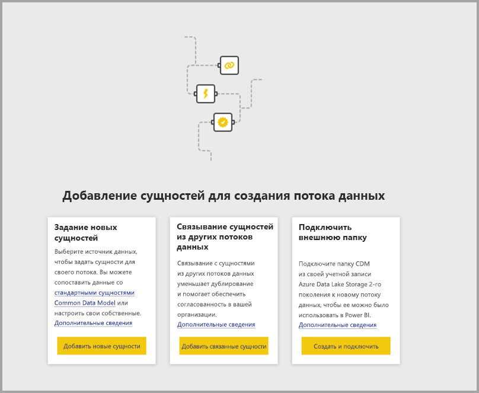
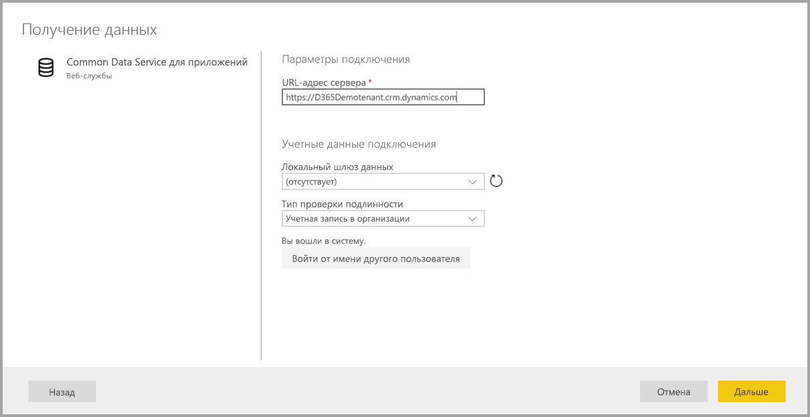
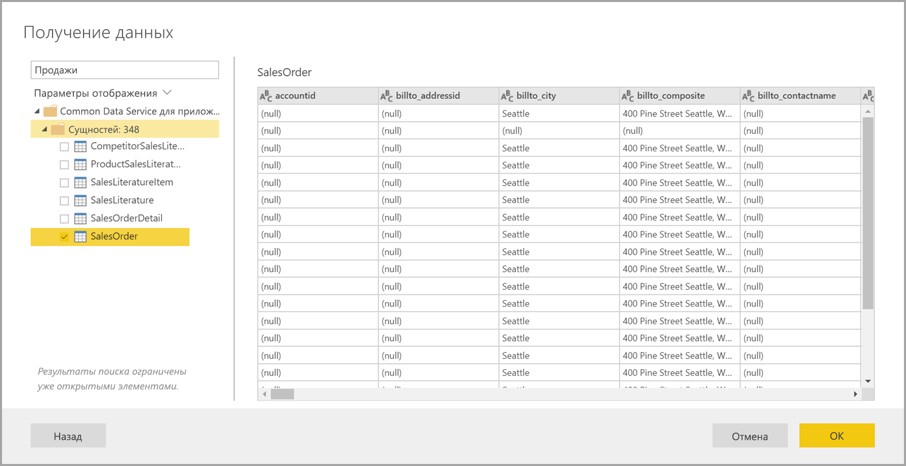
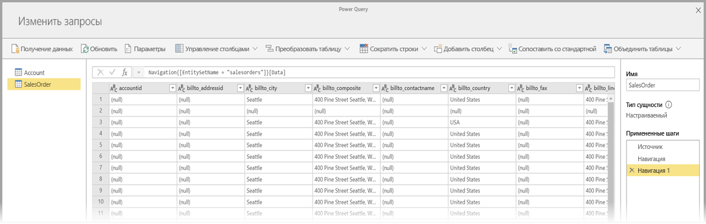
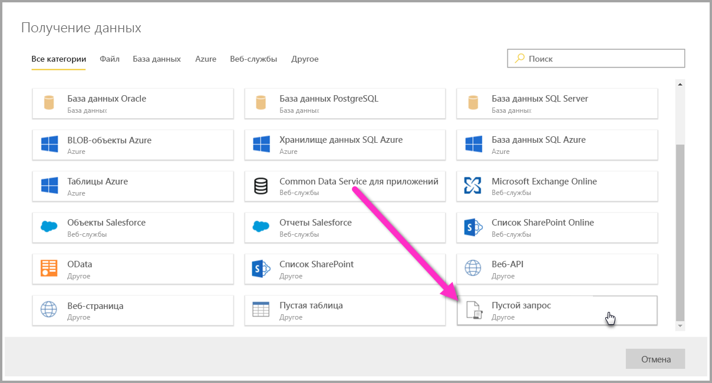

# Подключение к источникам данных для потоков данных Power BI

С помощью потоков данных Power BI можно подключаться к различным источникам данных, чтобы создавать новые потоки данных или добавлять сущности в существующие потоки.

В этой статье перечислены различные источники данных, которые можно создавать или добавлять в потоки данных, и описывается создание потоков данных с помощью этих источников данных.

Общие сведения о создании и использовании потоков данных в Power BI см. в [этой статье](service-dataflows-create-use.md).

## Создание потока данных на основе источника данных

Чтобы подключиться к данным, в **службе Power BI** выберите пункт меню **+ Создать**, а затем в появившемся меню выберите пункт **поток данных**. В результате на холсте службы Power BI появляется следующее содержимое: 

Если поток данных уже существует, в него можно добавить новые сущности, выбрав команду **Добавить объекты**, показанную ниже, или нажав кнопку **Получение данных** в средстве разработки потоков данных.

На рисунке ниже показана кнопка **Получение данных** в средстве разработки потоков данных. 

## Источники данных для потоков данных

Чтобы просмотреть доступные источники данных, в средстве разработки потоков данных нажмите кнопку **Получение данных**. Откроется диалоговое окно, в котором можно выбрать категорию и конкретный источник данных, как показано на рисунке ниже.

Источники данных для потоков данных делятся на следующие категории, которые представлены в верхней части диалогового окна **Получение данных**:

* Все категории
* Файл
* SQL
* Power BI
* Azure
* Веб-службы
* Другое

Категория **Все категории** включает в себя все источники данных из всех категорий. 

Категория **Файл** включает в себя следующие доступные подключения к данным для потоков данных:

* Доступ
* Excel
* JSON
* Text/CSV.
* XML

Категория **База данных** включает в себя следующие доступные подключения к данным для потоков данных:

* База данных IBM DB2
* База данных MySQL
* База данных Oracle
* База данных PostgreSQL
* База данных SQL Server
* База данных Sybase
* Teradata
* Vertica

Категория **Power BI** включает в себя следующие доступные подключения к данным для потоков данных:

* Потоки данных Power BI

Категория **Azure** включает в себя следующие доступные подключения к данным для потоков данных:

* BLOB-объекты Azure
* Azure Data Explorer
* Хранилище данных SQL Azure
* База данных SQL Azure
* Таблицы Azure

Категория **Online Services** включает в себя следующие доступные подключения к данным для потоков данных:

* Amazon Redshift
* Common Data Service для приложений
* Microsoft Exchange Online
* Объекты SalesForce
* Отчеты Salesforce
* Список SharePoint Online
* Smartsheet

Категория **Другие** включает в себя следующие доступные подключения к данным для потоков данных:

* Active Directory
* OData
* Список SharePoint
* Веб-API
* Веб-страница
* Пустая таблица
* Пустое поле запроса

## Подключение к источнику данных

Чтобы подключиться к источнику данных, выберите его. Мы возьмем для примера один источник данных, однако другие подключения к данным для потоков данных устанавливаются так же. Другие соединители могут требовать определенных учетных данных или других сведений, но поток их работы аналогичный. На рисунке ниже видно, что для примера выбрано подключение **Common Data Service для приложений** в категории **Online Services**.

Отображается окно подключения для выбранного подключения к данным. Если необходимы учетные данные, вам будет предложено ввести их. На рисунке ниже показан введенный URL-адрес сервера, необходимый для подключения к серверу Common Data Service для приложений.

После ввода URL-адреса сервера или сведений о подключении ресурса нажмите кнопку **Войти**, чтобы ввести учетные данные для доступа к данным, а затем нажмите кнопку **Далее**.

**Power Query Online** запустится и установит подключение к источнику данных, после чего представит доступные таблицы из источника данных в окне **Навигатор**, как показано на рисунке ниже.

Вы можете выбрать таблицы и данные для загрузки, установив флажки рядом с ними в области слева. Чтобы загрузить данные, внизу области **Навигатор** нажмите кнопку **ОК**. Откроется диалоговое окно Power Query Online, в котором можно изменять запросы и выполнять другие преобразования с выбранными данными.

Вот, собственно, и все. Для других источников данных процедура аналогична. Power Query Online используется для редактирования и преобразования данных, добавленных в поток данных.

## Подключение к дополнительным источникам данных

Помимо соединителей данных, которые отображаются в пользовательском интерфейсе потоков данных Power BI, есть и другие соединители, для работы с которыми требуются дополнительные шаги. 

Чтобы создать подключение к соединителю, который отсутствует в пользовательском интерфейсе, выполните указанные ниже действия.

1. Откройте **Power BI Desktop** и выберите **Получение данных**.
2. Откройте **редактор Power Query** в Power BI Desktop, щелкните нужный запрос правой кнопкой мыши и откройте **Расширенный редактор**, как показано на рисунке ниже. Теперь вы можете скопировать скрипт M из Расширенного редактора.

     

3. Откройте поток данных Power BI и выберите команду **Получение данных** для пустого запроса, как показано на рисунке ниже.

     

4. Вставьте скопированный запрос в пустой запрос для потока данных.

     

После этого скрипт подключится к указанному источнику данных. 

Ниже перечислены соединители, которые в настоящее время можно использовать путем копирования скрипта M в пустой запрос.

* Azure Analysis Services
* Adobe Analytics
* ODBC
* OLE DB
* Папка
* Папка SharePoint Online
* Папка SharePoint
* Hadoop HDFS
* Azure HDInsight (HDFS)
* Файл Hadoop (HDFS)
* Informix (бета-версия)

Это вся информация о подключении к источникам данных в потоках данных Power BI.

## Дальнейшие действия

В этой статье были рассмотрены источники данных, к которым можно подключаться для потоков данных. В следующих статьях содержатся более подробные сведения о типичных сценариях применения потоков данных. 

* [Самостоятельная подготовка данных в Power BI](service-dataflows-overview.md)
* [Creating and using dataflows in Power BI (Preview)](service-dataflows-create-use.md) (Создание и использование потоков данных в Power BI (предварительная версия))
* [Использование вычисляемых сущностей в Power BI Premium](service-dataflows-computed-entities-premium.md)
* [Использование потоков данных с локальными источниками данных](service-dataflows-on-premises-gateways.md)
* [Ресурсы для разработчиков потоков данных Power BI](service-dataflows-developer-resources.md)
* [Потоки данных и интеграция Azure Data Lake (предварительная версия)](service-dataflows-azure-data-lake-integration.md)

Дополнительные сведения о Power Query и обновлении по расписанию содержатся в следующих статьях:
* [Общие сведения о запросах в Power BI Desktop](desktop-query-overview.md)
* [Настройка запланированного обновления](refresh-scheduled-refresh.md)

Дополнительные сведения о модели общих данных вы найдете в этой обзорной статье:
* [Что такое модель общих данных?](https://docs.microsoft.com/powerapps/common-data-model/overview)

