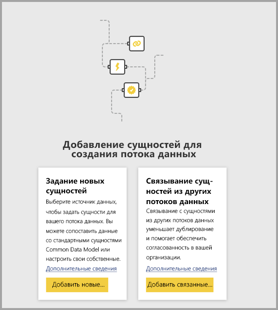

# Связывание сущностей из разных потоков данных в Power BI

Потоки данных в Power BI позволяют создать единый корпоративный источник хранения данных, в котором бизнес-аналитики смогут однократно подготовить и настроить данные для многократного применения в разных аналитических приложениях организации. 

Настроив связывание сущностей между потоками данных, вы сможете повторно использовать сущности, которые уже приняты, очищены и преобразованы другими пользователями для других потоков данных, не тратя дополнительных сил на обслуживание этих данных. Связанные сущности просто ссылаются на другие сущности из других потоков данных, но *не* копируют и не дублируют данные из них.

Связанные сущности доступны **только для чтения**. Если вы хотите создавать преобразования для связанной сущности, следует создать новую вычисляемую сущность со ссылкой на связанную сущность.

## Доступность связанных сущностей

Для обновления связанных сущностей требуется подписка [Power BI Premium](service-premium-what-is.md). Связанные сущности доступны в любом потоке данных в рабочей области, размещенной в емкости Power BI Premium. В качестве источника можно использовать любой поток данных без ограничений.

Связанные сущности нормально работают только в новых рабочих областях Power BI. Изучите дополнительные сведения о [новых рабочих областях Power BI](service-create-the-new-workspaces.md). Чтобы все работало правильно, все связанные потоки данных нужно располагать в новых рабочих областях.

> [!NOTE]
> Есть два типа сущностей: стандартные и вычисляемые. Стандартные сущности (часто — просто сущности) отправляют запросы к внешним источникам данных, таким как базы данных SQL. Для использования вычисляемых сущностей требуется емкость Premium в Power BI, а преобразования выполняются с данными, которые уже находятся в хранилище Power BI. 
>
>Если поток данных находится не в рабочей области емкости Premium, вы все равно можете создать ссылку на один запрос или объединить несколько запросов, так как преобразования не определяются как преобразования в хранилище. Такие ссылки считаются стандартными сущностями. Для этого отключите параметр **Включить загрузку** для запросов, на которые указывают ссылки, чтобы данные не материализовались и не передавались в хранилище. После этого вы можете создавать ссылки на запросы **Enable load = false**, установив для параметра **Включить загрузку** значение **Вкл.** только для результирующих запросов, которые нужно материализовать.

## Процедура связывания сущностей из разных потоков данных

В Power BI есть несколько способов связать сущности из разных потоков данных. Вы можете выбрать команду **Добавить связанные сущности** в средстве разработки потоков данных, как показано на приведенном ниже рисунке. 

Также вы можете выбрать действие **Добавить связанные сущности** из пункта меню **Добавить сущности** в службе Power BI.

Для связывания сущностей следует войти с учетными данными Power BI.

Откроется окно **Навигатор** с набором сущностей, к которым вы можете подключиться. Здесь отображаются сущности, для которых у вас есть права доступа, из всех рабочих областей в клиенте Power BI. 

Выбранные связанные сущности отображаются в средстве разработки в списке сущностей для потока данных и отмечаются специальным значком как связанные сущности.

Кроме того, можно просмотреть исходный поток данных из параметров потока данных для связанной сущности.

## Логика обновления для связанных сущностей
Используемая по умолчанию логика обновления для связанных сущностей изменяется в зависимости от того, размещен ли исходный поток данных в том же рабочем потоке, что и целевой поток данных. В следующих разделах описаны оба варианта логики.

### Ссылки между рабочими областями

Обновление для связанных сущностей из разных рабочих областей выполняется так же, как и для внешних источников данных. При обновлении потока данных из исходного потока данных извлекаются самые свежие данные сущности. Если обновляется исходный поток данных, данные в целевом потоке данных не изменяются автоматически.

### Ссылки в одной рабочей области

Когда происходит обновление данных для исходного потока данных, это событие автоматически активирует процесс обновления зависимых сущностей во всех целевых потоках данных, размещенных в той же рабочей области, в том числе всех основанных на них вычисляемых сущностей. Все остальные сущности в целевом потоке данных обновляются в соответствии с расписанием для потока данных. Сущности, которые зависят от нескольких источников, обновляют свои данные при каждом успешном обновлении любого из соответствующих источников.

Здесь важно понимать, что весь процесс обновления выполняется как одна фиксация. Это означает, что при сбое обновления в целевом потоке данных не будет выполнено и обновление исходного потока данных.

## Разрешения для просмотра отчета из потоков данных

Если вы создадите отчет Power BI с данными, основанными на потоке данных, все связанные сущности смогут видеть только те пользователи, у которых есть доступ к исходному потоку данных.

## Рекомендации и ограничения

При работе со связанными сущностями следует учитывать несколько ограничений:

* допускается не более пяти последовательных ссылок;
* не допускаются циклические зависимости связанных сущностей;
* поток данных должен находиться в [новой рабочей области Power BI](service-create-the-new-workspaces.md).
* Связанная сущность не может объединяться с обычной сущностью, получающей данные из локального источника.

## Дальнейшие действия

При создании потоков данных и работе с ними могут быть полезными следующие статьи: 

* [Самостоятельная подготовка данных в Power BI](service-dataflows-overview.md)
* [Creating and using dataflows in Power BI (Preview)](service-dataflows-create-use.md) (Создание и использование потоков данных в Power BI (предварительная версия))
* [Использование вычисляемых сущностей в Power BI Premium](service-dataflows-computed-entities-premium.md)
* [Использование потоков данных с локальными источниками данных](service-dataflows-on-premises-gateways.md)
* [Ресурсы для разработчиков потоков данных Power BI](service-dataflows-developer-resources.md)

Дополнительные сведения о Power Query и обновлении по расписанию содержатся в следующих статьях:
* [Общие сведения о запросах в Power BI Desktop](desktop-query-overview.md)
* [Настройка запланированного обновления](refresh-scheduled-refresh.md)

Дополнительные сведения о модели общих данных вы найдете в этой обзорной статье:
* [Что такое модель общих данных?](https://docs.microsoft.com/powerapps/common-data-model/overview)

