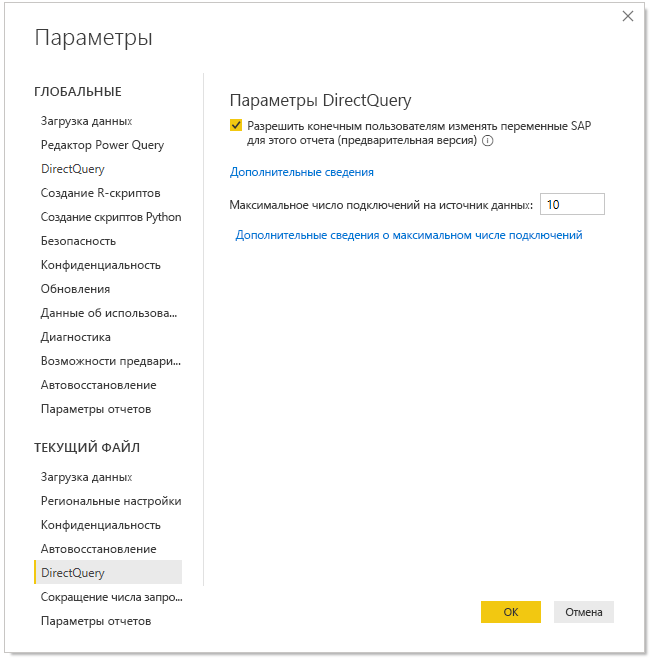
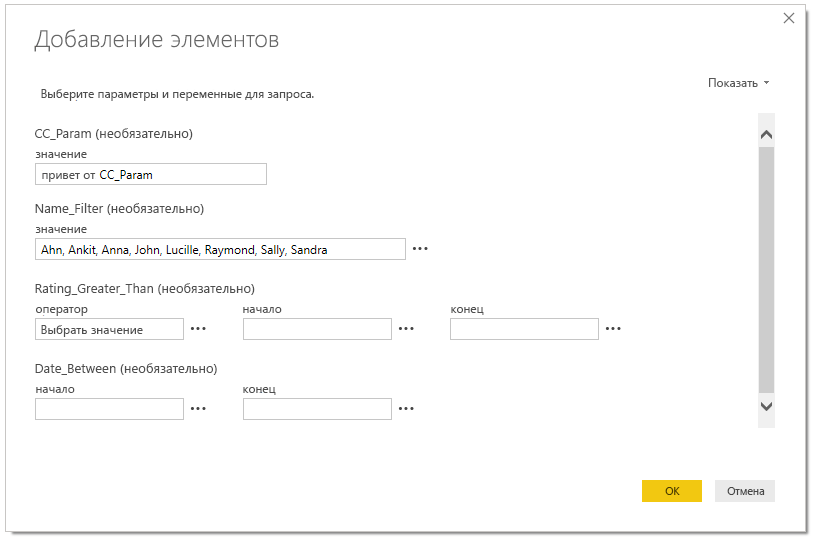

# Изменение переменных SAP в службе Power BI (предварительная версия)

При использовании SAP Business Warehouse или SAP HANA с DirectQuery авторы отчетов теперь могут разрешать конечным пользователям изменять переменные SAP в **службе Power BI** для рабочих областей Premium.

В этом документе описаны требования для изменения переменных в Power BI, процедура включения этой функции, находящейся на этапе предварительной версии, а также то, где можно изменять переменные в службе Power BI.

## Требования для изменения переменных SAP

К использованию функции изменения переменных SAP предъявляется ряд требований. Они приведены в таблице ниже.

**Требуются новые функции фильтров** — для отчета должны быть включены [новые функции фильтров](power-bi-report-filter.md). Чтобы включить их для отчета в Power BI Desktop, выполните указанные ниже действия.
- В Power BI Desktop последовательно выберите **Файл** > **Параметры и настройки** > **Параметры**.
- В левой панели навигации в разделе **Текущий файл** выберите **Параметры отчета**.
- В разделе **Возможности фильтрации** выберите **Включение обновленной панели фильтров**.

**Требуются подключения DirectQuery** — к источнику данных SAP необходимо подключаться с помощью DirectQuery. Подключения импорта не поддерживаются.

**Требуется подписка Power BI Premium** — функция изменения переменных SAP в настоящее время работает только в подписках Power BI Premium.

**Требуется настройка единого входа** — чтобы эта функция работала, необходимо настроить единый вход. Дополнительные сведения см. в [обзоре единого входа](service-gateway-sso-overview.md).

**Требуется новый шлюз** — скачайте последнюю версию шлюза и обновите имеющийся шлюз. Дополнительные сведения см. на странице [шлюза службы](service-gateway-onprem.md).

**Многомерный режим только для SAP HANA** — для SAP HANA функция изменения переменных SAP работает только с многомерными моделями и не работает с реляционными источниками.

**Не поддерживается в национальных облаках** — в настоящее время средство Power Query Online недоступно в национальных облаках, поэтому эта функция также не поддерживается в них.

## Включение функции

Чтобы включить функцию **изменения переменных SAP**, в Power BI Desktop подключитесь к источнику данных SAP HANA или SAP BW. Затем последовательно выберите **Файл > Параметры и настройки > Параметры** и в разделе "Текущий файл" в области слева выберите **DirectQuery**. При выборе этого параметра в правой области отображаются параметры DirectQuery, а также флажок **Разрешить конечным пользователям изменять переменные SAP в отчете (предварительная версия)** , как показано на рисунке ниже.

## Использование функции изменения переменных SAP в Power BI Desktop

Для использования функции изменения переменных SAP в Power BI Desktop можно выбрать ссылку "Изменить переменные" в меню **Изменить запросы** на ленте. Появится представленное ниже диалоговое окно. Эта функция доступна в Power BI Desktop уже некоторое время. Создатели отчетов могут выбирать переменные для отчетов, используя представленное ниже диалоговое окно.

## Использование функции изменения переменных SAP в службе

После публикации отчета в службе Power BI в новой области фильтра появляется ссылка **Изменить переменные**. Если отчет публикуется впервые, ссылка "Изменить переменные" появляется в течение 5 минут. Если ссылка не появилась, необходимо обновить набор данных вручную.
Для этого выполните указанные ниже действия.

1. В службе Power BI выберите вкладку **Наборы данных** в списке содержимого для рабочей области.

2. Найдите набор данных, который необходимо обновить, и щелкните значок **Обновить**.

    

3. При выборе ссылки "Изменить переменные" открывается диалоговое окно **Изменение переменных**, в котором пользователи могут переопределить переменные. При нажатии кнопки **Сброс** переменные сбрасываются в исходные значения, которые они имели при открытии этого диалогового окна.

    

4. Любые изменения в диалоговом окне **Изменение переменных** сохраняются только для этого пользователя (так же как и другие данные в Power BI). Если выбрать **Вернуться к значениям по умолчанию**, как показано на рисунке ниже, отчет, включая переменные, сбрасывается в исходное состояние создателя отчета.

    

При работе с опубликованным отчетом, использующим SAP HANA или SAP BW с включенной функцией **изменения переменных**, в службе Power BI владелец отчета может изменить значения по умолчанию. Владелец отчета может изменить переменные в режиме редактирования и сохранить отчет, чтобы эти настройки стали *новыми настройками по умолчанию* для отчета. Все остальные пользователи, обращающиеся к отчету после внесения таких изменений владельцем отчета, увидят эти новые настройки по умолчанию.

## Проблемы и рекомендации

В настоящее время функция изменения переменных SAP не поддерживается в приложениях.

## Дальнейшие действия

Дополнительные сведения о SAP HANA, SAP BW и DirectQuery см. в следующих статьях:

- [Использование SAP HANA в Power BI Desktop](desktop-sap-hana.md)
- [Использование DirectQuery и SAP Business Warehouse (BW)](desktop-directquery-sap-bw.md)
- [DirectQuery и SAP HANA](desktop-directquery-sap-hana.md)
- [Использование DirectQuery в Power BI](desktop-directquery-about.md)