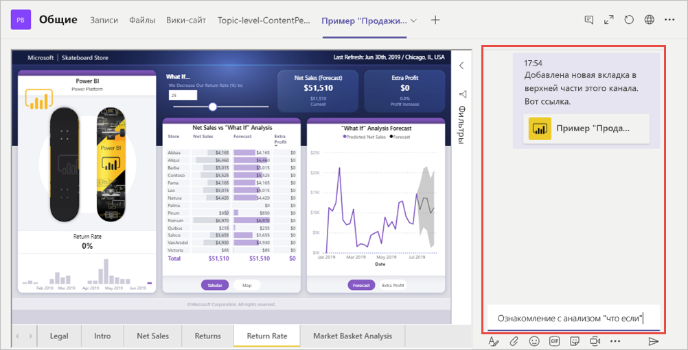

# Внедрение отчета в Microsoft Teams с помощью вкладки Power BI

С помощью обновленной вкладки Power BI для Microsoft Teams можно легко внедрять интерактивные отчеты в каналы и чаты Microsoft Teams.

Используйте вкладку Power BI для Microsoft Teams, чтобы помочь своим коллегам находить данные, над которыми вы работаете, и обсуждать их в каналах команды.

## Требования

Для использования **вкладки Power BI для Microsoft Teams** должны выполняться указанные ниже условия.

- Требуется лицензия Power BI Pro, либо отчет должен находиться в [емкости Power BI Premium (номер SKU EM или P)](service-premium-what-is.md) с лицензией Power BI.
- Требуется вкладка Power BI для Microsoft Teams.
- Для работы с отчетом пользователю необходимо выполнить вход в службу Power BI и активировать свою лицензию Power BI.
- У пользователя должно быть разрешение на просмотр отчета.

## Внедрение отчета
Чтобы внедрить отчет в канал или чат Microsoft Teams, добавьте его, как описано ниже.

1. Откройте нужный канал или чат в Microsoft Teams и щелкните значок **+** .

    

2. Выберите вкладку Power BI.

    

3. Выберите отчет из рабочей области, из списка "Мне предоставлен доступ" или приложения Power BI.

    

4. Имя вкладки обновляется автоматически в соответствии с именем отчета, но его можно изменить. 

5. Нажмите кнопку **Save**(Сохранить).

## Поддерживаемые отчеты

Вкладка позволяет внедрять следующие отчеты:

- интерактивные отчеты и отчеты с разбивкой на страницы;
- отчеты из раздела "Моя рабочая область", нового интерфейса рабочих областей и классических рабочих областей;
- отчеты из приложения Power BI.

## Предоставление доступа к отчетам

При внедрении отчета в Microsoft Teams разрешение на просмотр отчета не предоставляется пользователям автоматически — вам нужно [разрешить пользователям просматривать отчет в Power BI](service-share-dashboards.md). Чтобы упростить эту задачу, можно воспользоваться группой Office 365. 

> [!IMPORTANT]
> Обязательно проверьте, кто может просматривать отчет в службе Power BI, и предоставьте доступ пользователям, которых нет в списке.

Один из способов обеспечить доступ всех членов команды к внедренным отчетам — поместить отчеты в одну рабочую область в Power BI и предоставить группе Office 365 вашей команды доступ к ней.

## Начать беседу

При добавлении вкладки отчета Power BI в Teams в этой службе автоматически создается беседа для обсуждения отчета. 

- В правом верхнем углу выберите **Показать беседу во вкладке**.

    

    Первый комментарий является ссылкой на отчет. Каждый в этом канале Teams может просматривать и обсуждать отчет в беседе.

    

## Известные проблемы и ограничения

- Power BI не поддерживает те же языки с локализацией, что и Microsoft Teams. В результате во внедренном отчете требуемая локализация может не отображаться.
- Панели мониторинга Power BI невозможно внедрить на вкладку Power BI для Microsoft Teams.
- Пользователь, у которого нет лицензии Power BI или разрешения на доступ к отчету, увидит сообщение "Содержимое недоступно".
- При использовании Internet Explorer 10 могут возникнуть проблемы. <!--You can look at the [browsers support for Power BI](consumer/end-user-browsers.md) and for [Office 365](https://products.office.com/office-system-requirements#Browsers-section). -->
- [Фильтры URL-адресов](service-url-filters.md) не поддерживаются на вкладке Power BI для Microsoft Teams.
- В национальных облаках новая вкладка Power BI недоступна. Может быть доступна прежняя версия, которая не поддерживает новый интерфейс рабочих областей и отчеты в приложении Power BI. 
- После сохранения вкладки ее имя невозможно изменить в параметрах вкладки. Чтобы изменить его, используйте команду "Переименовать".

## Дальнейшие действия
- [Предоставление общего доступа к панели мониторинга и отчетам коллегам и другим пользователям](service-share-dashboards.md)  
- [Создание и распространение приложения в Power BI](service-create-distribute-apps.md)  
- [Что такое Power BI Premium?](service-premium-what-is.md)

Появились дополнительные вопросы? [Попробуйте задать вопрос в сообществе Power BI.](https://community.powerbi.com/)
