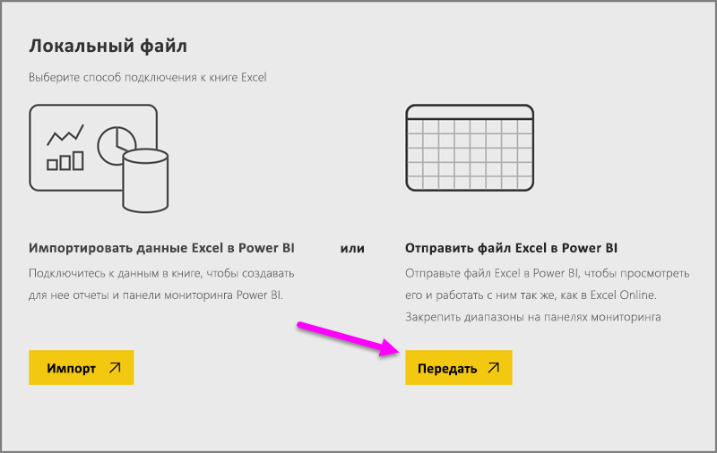
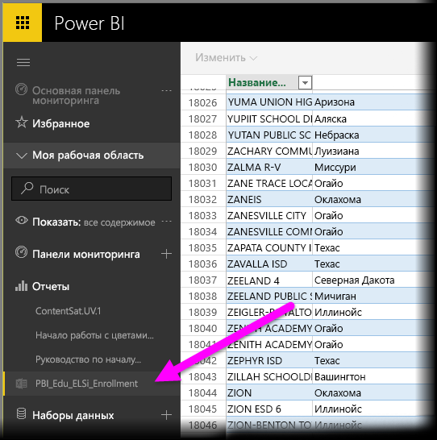

# Получение данных из файлов книг Excel

Microsoft Excel является одним из наиболее широко используемых бизнес-приложений. Оно также является одним из наиболее распространенных способов получения данных в Power BI.

## Какие типы книг поддерживает Power BI?
Power BI поддерживает импорт данных и подключение к книгам, созданным в Excel 2007 и более поздних версиях. Книги необходимо сохранять в формате XLSX или XLSM с размером не более 1 ГБ. Некоторые функции, описанные в этой статье, доступны только в более поздних версиях Excel.

### Книги с диапазонами или с таблицами данных
Если книга содержит простые листы с диапазонами данных, для максимально эффективного получения данных в Power BI необходимо отформатировать эти диапазоны как таблицы. В этом случае при создании отчетов в Power BI вы увидите в области полей таблицы и столбцы с именами, что существенно облегчит визуализацию данных.

### Книги с моделями данных
Книги могут содержать модель данных с одной или несколькими таблицами данных, загруженными в нее с помощью связанных таблиц, Power Query (функция "Скачать и преобразовать" в Excel 2016) или Power Pivot. Power BI поддерживает все свойства моделей данных, такие как отношения, меры, иерархии и ключевые показатели эффективности.

> [!NOTE]
> Книги с моделями данных не могут совместно использоваться на клиентах Power BI. Например, если пользователь входит в Power BI с помощью учетной записи *contoso.com*, то он не может совместно использовать книгу Excel с пользователем, который входит с помощью учетной записи входа Power BI из *woodgrovebank.com*.
> 
> 

### Книги с подключениями к внешним источникам данных
При использовании Excel для подключения к внешнему источнику данных, когда книга уже загружена в Power BI, можно создавать отчеты и информационные панели на основе данных из подключенного источника данных. Вы также можете настроить запланированное обновление, чтобы автоматически подключаться прямо к источнику данных и получать обновления. Вам больше не потребуется выполнять обновление вручную на ленте "Данные" в Excel. Все визуализации в отчетах и плитки на информационных панелях, основанные на данных из этого источника данных, будут обновляться автоматически. Дополнительные сведения см. в разделе [Обновление данных в Power BI](refresh-data.md).

### Книги с листами Power View, сводными таблицами и диаграммами
Отображение или отсутствие отображения листов PowerView, сводных таблиц и диаграмм в Power BI зависит от того, где сохранен файл книги и от выбранного способа его получения в Power BI. Рассмотрим это подробнее ниже.

## Типы данных
Power BI поддерживает следующие типы данных: целое число, десятичное число, валюта, дата, истина/ложь, текст. Если пометить данные как относящиеся к определенному типу в Excel, это улучшит эффективность работы Power BI.

## Подготовка книги для Power BI
Просмотрите это полезное видео, чтобы узнать больше о подготовке книг Excel для Power BI.

<iframe width="500" height="281" src="https://www.youtube.com/embed/l2wy4XgQIu0" frameborder="0" allowfullscreen></iframe>

## Важно, где сохранен файл книги
**Локально**. В случае сохранения файла книги на локальный диск на компьютере или в другом расположении в вашей организации вы можете загрузить файл в Power BI. На самом деле файл останется на локальном диске, поэтому файл не импортируется в Power BI целиком. На самом деле создается новый набор данных в Power BI, и в него загружаются данные и модель данных (если она существует) из файла книги. Если книга содержит листы Power View, они будут отображаться на сайте Power BI в области "Отчеты". Excel 2016 также включает функцию **публикации** (в меню **Файл**). Функция **публикации** фактически аналогична получению данных из Power BI (**Получить данные > Файлы > Локальный файл**), но при этом часто бывает легче обновить набор данных в Power BI, если в книгу регулярно вносятся изменения.

**OneDrive — бизнес**. Если вы используете хранилище OneDrive для бизнеса и для входа в него используете ту же учетную запись, что и для Power BI, вне всяких сомнений, это самый эффективный способ синхронизировать вашу работу в Excel с набором данных, отчетами и информационными панелями в Power BI. Так как Power BI и OneDrive находятся в облаке, Power BI *подключается* к вашему файлу книги в OneDrive примерно раз в час. При обнаружении каких-либо изменений ваш набор данных, отчеты и информационные панели в Power BI автоматически обновляются. Так же, как при сохранении книги на локальном диске, можно использовать функцию публикации для немедленного обновления набора данных и отчетов в Power BI. В противном случае Power BI автоматически выполнит синхронизацию, обычно в течение часа.

**OneDrive — персональный**. Если вы сохраняете файлы книг в свою учетную запись OneDrive, то получите многие преимущества, доступные для OneDrive для бизнеса. Главное отличие — при первом подключении к файлу (щелкнув "Получить данные" > "Файлы" > "OneDrive — персональный") необходимо войти в OneDrive с учетной записью Майкрософт, которая обычно отличается от учетной записи, используемой для входа в Power BI. При входе в OneDrive с учетной записью Майкрософт убедитесь, что установлен флажок "Оставаться в системе". Тогда Power BI сможет примерно раз в час подключаться к вашему файлу книги и синхронизировать его с набором данных и отчетами в Power BI.

**Сайты рабочих групп SharePoint**. Сохранение файлов Power BI Desktop на сайтах рабочих групп SharePoint очень похоже на сохранение файлов в OneDrive для бизнеса. Главное отличие состоит в подключении к файлу из Power BI. Можно указать URL-адрес или подключаться к корневой папке.

## Одна книга Excel — два способа ее использования
Если сохранить файлы книг в **OneDrive**, вы сможете использовать несколько способов просмотра данных в Power BI.

### Импорт данных Excel в Power BI
Если выбрать **Импорт**, все поддерживаемые данные в таблицах и (или) в модели данных будут импортированы в новый набор данных в Power BI. Если у вас есть листы Power View, они будут созданы повторно в Power BI как отчеты.

Вы можете продолжить редактирование в книге. При сохранении изменений они будут синхронизированы с набором данных в Power BI, обычно в течение часа. Если вам требуется более быстрый результат, можно просто повторно щелкнуть "Опубликовать", и ваши изменения сразу экспортируются. При этом также будут обновлены все визуализации в отчетах и на информационных панелях.

Выберите этот параметр, если для загрузки данных в модель данных вы использовали функцию "Скачать и преобразовать" или Power Pivot, или если ваша книга содержит листы Power View с визуализациями, которые необходимо отображать в Power BI.

В Excel 2016 можно также щелкнуть "Опубликовать" > "Экспорт". Это даст такой же результат. Дополнительные сведения см. в разделе [Публикация в Power BI из Excel 2016](service-publish-from-excel.md).

### Подключение к данным Excel, а также управление ими и просмотр их в Power BI
Если выбрать **Подключить**, ваша книга отобразится в Power BI так же, как в Excel Online. При этом у вас будет несколько удобных функций, не доступных в Excel Online, которые помогут вам закрепить элементы из листов прямо на информационных панелях.

Книгу нельзя редактировать в Power BI. Но если необходимо внести какие-либо изменения, нажмите кнопку "Изменить" и отредактируйте книгу в Excel Online или откройте ее в Excel на своем компьютере. Любые внесенные изменения сохраняются в книге в OneDrive.

При выборе этого способа набор данных в Power BI не создается. Книга будет отображаться на панели навигации по рабочей области Power BI в разделе "Отчеты". Подключенные книги обозначены специальным значком Excel.

Выберите этот параметр, только если хотите закрепить на информационных панелях какие-либо данные с листов, диапазоны, сводные таблицы или диаграммы.

В Excel 2016 можно также щелкнуть "Опубликовать" > "Отправить". Это даст такой же результат. Дополнительные сведения см. в разделе [Публикация в Power BI из Excel 2016](service-publish-from-excel.md).

## Импорт или подключение к книге Excel из Power BI
1. В Power BI на панели навигации щелкните **Получить данные**.
   
   
2. В разделе "Файлы" щелкните **Получить**.
   
   
3. Найдите свой файл.
   
   
4. Если файл книги находится в OneDrive или на сайтах рабочих групп SharePoint, выберите **Импорт** или **Подключить**.

## Локальные книги Excel
Можно также использовать локальный файл Excel и загрузить его в Power BI. Просто выберите **Локальный файл** в предыдущем меню, а затем перейдите в расположение, где сохранены нужные книги Excel.

Выбрав книгу, отправьте файл в Power BI.

После загрузки книги вы получаете уведомление о ее готовности.

Когда книга будет готова к использованию, ее можно найти в разделе **Отчеты** Power BI.

## Публикация из Excel 2016 на сайт Power BI
Функция **Публикация в Power BI** в Excel 2016 позволяет выполнить импорт или подключиться к файлу так же, как с помощью функции **получения данных** в Power BI. Не будем сейчас углубляться в подробности, но дополнительные сведения доступны в разделе [Публикация в Power BI из Excel 2016](service-publish-from-excel.md).

## Устранение неполадок
Файл книги имеет слишком большой размер? Ознакомьтесь с разделом [Уменьшение размера книги Excel для ее просмотра в Power BI](reduce-the-size-of-an-excel-workbook.md).

В настоящее время при выполнении импорта служба Power BI импортирует только данные, которые входят в именованную таблицу или модель данных. В результате, если книга не содержит именованные таблицы, листы Power View или модели данных Excel, может отображаться следующая ошибка: **"Не удалось найти данные в книге Excel"**. [Эта статья](service-admin-troubleshoot-excel-workbook-data.md) объясняет, как можно исправить книгу и повторно импортировать ее.

## Дальнейшие действия
**Изучите данные**. После передачи данных и отчетов из файла в Power BI пришло время для их изучения. Просто щелкните правой кнопкой мыши новый набор данных и выберите команду "Просмотреть". Если при выполнении шага 4 вы выбрали подключение к файлу книги в OneDrive, ваша книга отобразится в отчетах. Если щелкнуть ее, она откроется в Power BI так же, как если бы она была в Excel Online.

**Установите расписание обновлений**. Если файл книги Excel подключается к внешним источникам данных или был импортирован с локального диска, можно установить расписание обновлений, чтобы гарантировать актуальность набора данных или отчета. В большинстве случаев настроить расписание обновлений довольно просто, но подробное описание этой функции выходит за рамки данной статьи. Дополнительные сведения см. в разделе [Обновление данных в Power BI](refresh-data.md).

[Публикация в Power BI из Excel 2016](service-publish-from-excel.md)

[Издатель Power BI для Excel](publisher-for-excel.md)

[Обновление данных в Power BI](refresh-data.md)

