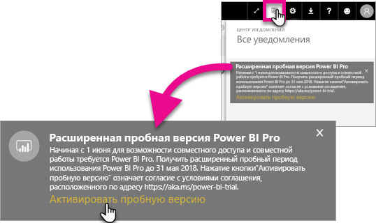

# Активация расширенной пробной версии Power BI Pro
С 1 июня 2017 г. все пользователи, имеющие право, смогут воспользоваться расширенной пробной версией Power BI Pro.

<iframe width="640" height="360" src="https://www.youtube.com/embed/tPsNoPyY9aA?showinfo=0" frameborder="0" allowfullscreen></iframe>

В рамках [объявления о выпуске Power BI Premium 3 мая 2017 г.](https://powerbi.microsoft.com/blog/microsoft-accelerates-modern-bi-adoption-with-power-bi-premium/) корпорация Майкрософт сообщила об изменениях в бесплатной версии службы Power BI, вступающих в силу 1 июня 2017 г. Изменения включают в себя расширение доступа ко всем источникам данных, больший размер хранилища рабочей области и более высокую частоту обновлений и потоковой передачи для бесплатной версии службы, что делает ее эквивалентом Power BI Pro.

Также было объявлено, что функции общего доступа и возможность совместной работы будут доступны только для пользователей Power BI Pro, включая совместный доступ к панелям мониторинга в одноранговой сети, рабочие пространства группы (теперь называемые рабочими пространствами приложений), экспорт в PowerPoint и анализ в Excel с помощью приложений Power BI. В объявлении от 3 мая возможность экспорта в CSV или Excel и PowerPoint ограничивалась только пользователями Power BI Pro, но после получения отзывов от широкого сообщества пользователей было решено предоставить эту возможность также для пользователей бесплатной версии службы.

С 1 июня 2017 г. существующие пользователи бесплатной версии службы, которые были активными в прошлом году (до 2 мая 2017 г.), смогут воспользоваться преимуществами бесплатной 12-месячной расширенной пробной версии Power BI Pro. Они смогут пользоваться всеми возможностями Power BI Pro в течение следующего года в знак благодарности сообществу и чтобы дать возможность привыкнуть к изменениям.

1 июня 2017 г. пользователи, которые имеют право на использование, во время входа в службу получили уведомление, оповещающее о вступивших в силу изменениях. Им также было предложено зарегистрироваться в расширенной пробной версии Power BI Pro. ИТ-администраторы не контролируют уведомления внутри продукта, а также не имеют возможность регистрироваться в расширенной пробной версии Power BI Pro от имени пользователя. Каждый пользователь должен лично выполнить данную процедуру.

Пользователи могут воспользоваться возможностью регистрации в предложении в течение 12 месяцев, но расширенная пробная версия Power BI Pro закончится для всех пользователей 31 мая 2018 г. независимо от того, было ли принято предложение. В это время пользователи будут иметь возможность приобрести Power BI Pro или перейти на бесплатную версию Power BI без возможности общего доступа и совместной работы.

В Power BI Pro не будут вноситься изменения. Эти пользователи не будут затронуты. Они не будут получать уведомления при входе в службу после 1 июня 2017 г. Пользователи, отклонившие расширенную пробную версию Power BI Pro, или пользователи, для которых предложение недоступно, будут продолжать использовать бесплатную версию Power BI без возможности общего доступа и совместной работы. Они могут зарегистрироваться в любое время в стандартной 60-дневной пробной версии Power BI Pro, перейдя на [веб-сайт](https://powerbi.microsoft.com/get-started/) Power BI.

## Право на регистрацию в расширенной пробной версии Power BI Pro
Ваша учетная запись должна отвечать следующим требованиям, чтобы иметь право на регистрацию в расширенной пробной версии Power BI Pro.

* Право на регистрацию в расширенной пробной версии Power BI Pro получат пользователи, которые активно использовали бесплатную версию Power BI в период между 3 мая 2016 г. и 2 мая 2017 г.
* Пользователи, которые ранее использовали или сейчас используют *60-дневную пробную версию Pro*, также получат право регистрации в расширенной пробной версии Power BI Pro.

> [!NOTE]
> Пользователи, имеющие лицензии, полученные от подписок Power BI Pro или пробной версии Power BI Pro в Office 365, не смогут воспользоваться данным предложением.
> 
> 

## Способ активации
Существует два способа активации расширенной пробной версии Power BI Pro. Во-первых, при выполнении входа в Power BI. Если вы отклонили предложение, оно будет отображаться в области уведомлений.

> [!NOTE]
> Оповещения внутри продукта не контролируются администратором и будут отправлены пользователям, которые имеют право на использование.
> 
> 

### Активация во время входа
Если у вас есть право на регистрацию, при входе в службу Power BI вы получите всплывающее уведомление. При выборе **Активировать пробную версию** начнется использование расширенной пробной версии Power BI Pro. Никаких дополнительных действий не потребуется.

Затем вы сможете получать доступ ко всем существующим общим панелям мониторинга и отчетам в течение пробного использования.

Если вы выбрали **Не сейчас**, расширенная пробная версия Power BI Pro может быть активирована в любое время до окончания пробного периода 31 мая 2018 г.

### Активация в дальнейшем
Если вы закрыли всплывающее окно, выбрав **Не сейчас**, расширенная пробная версия Power BI Pro может быть активирована в любое время до окончания пробного периода 31 мая 2018 г. Это можно сделать в **центре уведомлений**.

В центре уведомлений вы увидите уведомление о расширенной пробной версии Power BI Pro. Оно будет доступно, пока пользователь не закроет его.

В уведомлении можно выбрать **Активировать пробную версию**, чтобы активировать пробную версию. Никаких дополнительных действий не потребуется.

Затем вы сможете получать доступ ко всем существующим общим панелям мониторинга и отчетам в течение пробного использования.

## После активации
После активации в правом верхнем углу будет отображаться количество дней до окончания срока действия пробной версии.

Условия использования этой версии см. на странице [Условия использования расширенной пробной версии Power BI Pro](https://aka.ms/power-bi-trial). Расширенная пробная версия Power BI Pro действует до 31 мая 2018 г. для всех подходящих пользователей.

## Часто задаваемые вопросы
**Что произойдет с новыми пользователями, которые зарегистрируются после 3 мая 2017 г.?**

Пользователи, которые зарегистрировались в бесплатной версии Power BI в течение или после 3 мая 2017 г., не смогут воспользоваться расширенной пробной версией Pro. Однако они смогут воспользоваться стандартной 60-дневной пробной версией Power BI Pro.

**Как узнать, кто сможет воспользоваться расширенной пробной версией Power BI Pro в моей организации?**

Нет прямого способа это выяснить. Можно просмотреть отчет интегрированных приложений Azure Active Directory для Power BI, чтобы узнать, кто является активным пользователем в организации за последние 30 дней. Это поможет найти подходящих пользователей. Дополнительные сведения см. в статье [Поиск пользователей Power BI, выполнивших вход](service-admin-access-usage.md).

Эти пользователи, проявившие активность в соответствующий период, и пользователи с бесплатными лицензиями получат всплывающее уведомление. 

> [!NOTE]
> В отчете Azure AD не указывается, является ли пользователь Power BI владельцем бесплатной лицензии или лицензии Pro. Из него можно узнать только то, какие пользователи выполняли вход в Power BI и дату выполнения входа. Если пользователь указан в этом отчете, это не означает, что он имеет право на использование расширенной пробной версии Power BI Pro.
> 
> 

**Может ли администратор запретить пользователю активацию расширенной пробной версии Power BI Pro?**

Нет. Администраторы не могут ограничить возможность активации пользователями расширенной пробной версии Pro или 60-дневной пробной версии Power BI Pro.

## Дальнейшие действия
[Условия использования расширенной пробной версии Power Bi Pro](https://aka.ms/power-bi-trial)  
[Условия использования Microsoft Power BI Preview](https://powerbi.microsoft.com/terms-of-service/)  
[Объявление о выпуске Power BI Premium](https://aka.ms/pbipremium-announcement)  
[Поиск пользователей Power BI, выполнивших вход](service-admin-access-usage.md)

Появились дополнительные вопросы? [Попробуйте задать вопрос в сообществе Power BI.](https://community.powerbi.com/)

