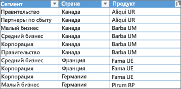
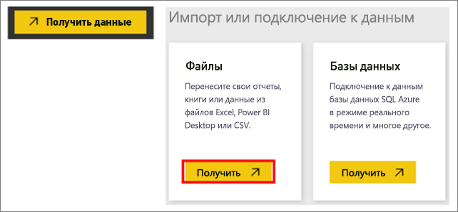
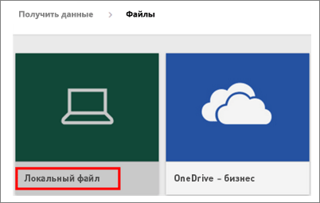
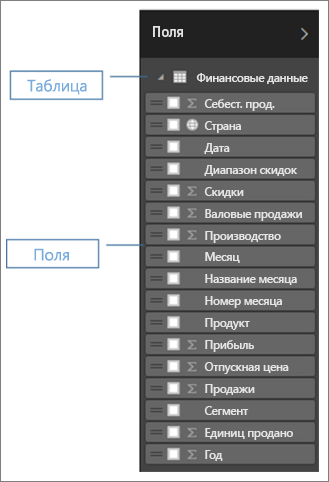
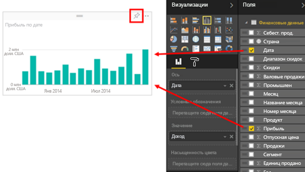
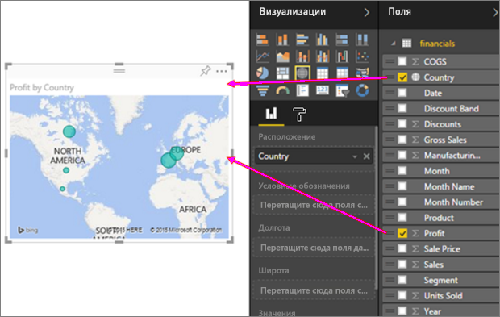
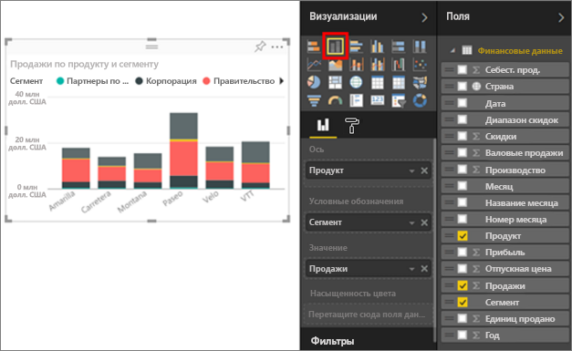
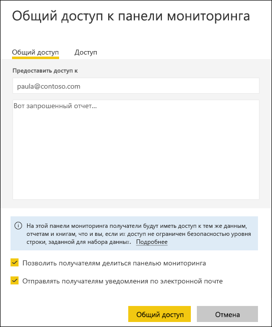

# Быстрое превращение книги Excel в красивый отчет
Ваш руководитель требует отчет по последним результатам продаж и ваши впечатления о последней кампании к концу дня. При этом последние данные хранятся в различных сторонних системах и в файлах на вашем ноутбуке. Раньше создание визуальных элементов и форматирование отчета занимало несколько часов. Вы начинаете нервничать.

Не волнуйтесь. В Power BI превосходный отчет можно создать практически мгновенно.

В этом примере мы загрузим в систему файл Excel, создадим новый ответ и предоставим к нему доступ коллегам — и все это в Power BI.

## Подготовка данных
Для примера возьмем простой файл Excel. Прежде чем отправлять файл Excel в Power BI, необходимо упорядочить данные в виде таблицы с одноуровневой адресацией. Это значит, что каждый столбец содержит данные одного типа: текст, даты, цифры, валюты и т. д. Таблица должна содержать строку заголовков, но не должна включать столбец или строку с итогами.

Теперь отформатируем данные в виде таблицы. В группе "Стили" на вкладке "Главная" в Excel выберите **Форматирование таблицы**. Выберите стиль таблицы, который нужно применить к листу. Теперь лист Excel готов к отправке в Power BI.

## Отправка файла Excel в Power BI
Power BI подключается к нескольким источникам данных, включая файлы Excel на вашем компьютере. Чтобы начать работу, войдите в службу Power BI. Если вы еще не зарегистрировались, [это можно сделать бесплатно](https://powerbi.com).

Создайте новую панель мониторинга. Откройте **Моя рабочая область** и выберите значок **+ Create** (+ Создать).

Выберите **Информационная панель**, введите имя и выберите **Создать**. Новая информационная панель отображается без данных.

В нижней части левой области навигации выберите **Получить данные**. В разделе "Импорт или подключение к данным" на странице "Получение данных" выберите в поле "Файлы" параметр **Получить**.

На странице "Файлы" выберите **Локальный файл**. Перейдите к файлу книги Excel на компьютере и выберите его для отправки в Power BI. Выберите команду **Импортировать**.

> **ПРИМЕЧАНИЕ**. Далее в этом учебном руководстве описана работа с [книгой, содержащей образец финансовых данных](sample-financial-download.md).
> 
> 

## Создание отчета
После того как файл Excel будет импортирован в Power BI, приступайте к созданию отчета. Когда появится сообщение **Your dataset is ready** (Набор данных готов), выберите **Просмотреть набор данных**.  Power BI откроется в режиме редактирования и отобразит холст отчета. Справа находятся панели "Визуализации", "Фильтры" и "Поля".

Данные из таблицы Excel отображаются на панели "Поля". Заголовки столбцов перечисляются под названием таблицы как отдельные поля.

Теперь можно приступать к созданию визуализации. Ваш руководитель хочет увидеть прибыли за определенный период. Перетащите поле **Прибыль** с панели "Поля" на холст отчета. По умолчанию в Power BI отображается линейчатая диаграмма. Затем перетащите на холст отчета поле **Даты** . Power BI обновит линейчатую диаграмму и покажет прибыль по датам.

> **СОВЕТ**. Если диаграмма выглядит не так, как вы ожидали, проверьте агрегированные значения. Например, в области **Значение** щелкните правой кнопкой мыши только что добавленное поле и убедитесь, что вычисление данных выполняется надлежащим образом.  В нашем примере используется **суммирование**.
> 
> 

Ваш руководитель хочет знать, какие страны оказались наиболее прибыльными. Произведите на него впечатление, добавив визуализацию карты. Выберите пустую область на холсте и перетащите поля **Страна** и **Прибыль** с панели "Поля". Power BI создаст визуализацию карты с пузырьками, представляющими относительную прибыль в каждом регионе.

А что насчет визуального представления продаж по продуктам и сегментам рынка? Это легко. На панели "Поля" установите флажки рядом с полями "Продажи", "Продукт" и "Сегмент". Power BI мгновенно создаст линейчатую диаграмму. Измените тип диаграммы, выбрав один из значков в меню "Визуализации". Например, вы можете преобразовать ее в линейчатую диаграмму с накоплением.  Чтобы отсортировать данные на диаграмме, щелкните многоточие (...) и выберите **Сортировка**.

Закрепите все визуальные элементы на панели мониторинга. Теперь их можно сделать доступными для коллег.

## Предоставление доступа к панели мониторинга
Допустим, вы хотите предоставить доступ к панели мониторинга своему руководителю Павлу. Доступ к панели мониторинга и соответствующему отчету можно предоставить коллегам, у которых есть учетная запись Power BI. Они смогут работать с отчетом, но не смогут сохранять изменения в нем.

Чтобы предоставить доступ к отчету, в верхней части панели мониторинга выберите элемент **Поделиться**.

В Power BI откроется страница "Общий доступ к панели мониторинга". В верхнее поле введите адреса электронной почты получателей. В нижнее поле добавьте сообщение. Чтобы разрешить получателям предоставлять общий доступ к панели мониторинга другим пользователям, установите флажок **Разрешить получателям предоставлять доступ к этой панели мониторинга**. Выберите **Общий доступ**.

Дальнейшие действия

* [Приступая к работе с Power BI](service-get-started.md)
* [Начало работы с Power BI Desktop](desktop-getting-started.md)
* [Power BI — основные понятия](service-basic-concepts.md)
* Появились дополнительные вопросы? [Ответы на них см. в сообществе Power BI.](http://community.powerbi.com/)

