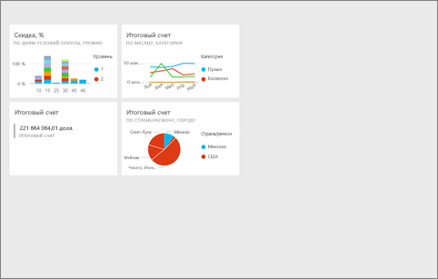
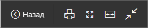
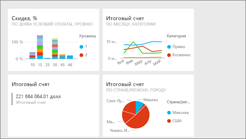
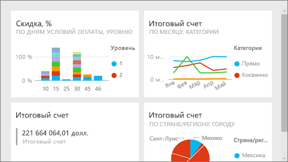
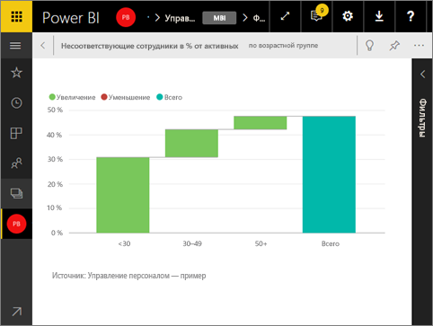

# Полноэкранный режим в Power BI
## Что такое полноэкранный режим?

Отображайте содержимое (панели мониторинга, страницы отчетов, плитки и визуализации) так, чтобы не отвлекаться на меню и панели навигации.  Так вы можете быстро просматривать все содержимое целиком. Иногда это также называется ТВ-режимом. Функциональные возможности, доступные в полноэкранном режиме, зависят от содержимого.  

Некоторые варианты применения полноэкранного режима:

* презентация панели мониторинга, плитки, визуального элемента или отчета на собрании или конференции;
* отображение в офисе на выделенном большом экране или проекторе;
* просмотр на небольшом экране;
* просмотр в режиме блокировки — вы можете коснуться экрана или наводить указатель мыши на плитки без открытия базового отчета или панели мониторинга.

> **ПРИМЕЧАНИЕ.** Полноэкранный режим отличается от режима [фокусировки (в новом окне)](service-focus-mode.md).
> 
> 

В следующем видео Аманда откроет информационную панель и будет перемещаться по ней в полноэкранном режиме, а затем применит некоторые параметры URL-адреса для управления отображением по умолчанию. Затем сделайте то же самое, выполнив пошаговые инструкции, приведенные под видео.

<iframe width="560" height="315" src="https://www.youtube.com/embed/c31gZkyvC54" frameborder="0" allowfullscreen></iframe>

## Панели мониторинга и страницы отчетов в полноэкранном режиме
1. В строке меню Power BI в верхней части панели мониторинга или отчета щелкните значок **Во весь экран** . Холст панели мониторинга или страница отчета отобразятся на весь экран. Ниже приведен пример панели мониторинга.
   
      
2. В полноэкранном режиме есть несколько вариантов меню.  Чтобы открыть меню, просто переместите указатель мыши или курсор. 
   
     Меню для панелей мониторинга    
         
   
     Меню для страниц отчета    
        
   
        
    Для возврата на предыдущую страницу браузера используйте кнопку **Назад**. Если предыдущей является страница Power BI, она также отобразится в полноэкранном режиме.  Полноэкранный режим будет использоваться, пока вы не выйдете из него.
   
        
    Используйте эту кнопку, чтобы распечатать панель мониторинга или страницу отчета в полноэкранном режиме. 
   
        
    Используйте кнопку **По размеру экрана**, чтобы панель мониторинга отобразилась в максимальном размере без полос прокрутки.     
   
    
   
           
    Иногда полосы прокрутки не мешают, но нужно, чтобы панель мониторинга занимала всю ширину доступного пространства. Для этого нажмите кнопку **По ширине**.    
   
    
   
           
    В отчетах, развернутых на весь экран, используйте эти стрелки для перемещения между страницами.    
3. Чтобы выйти из полноэкранного режима, выберите значок **Выйти из полноэкранного режима**.
   
      

## Визуализации и плитки панелей мониторинга в полноэкранном режиме
1. Чтобы плитки панелей мониторинга и визуализации отчетов отображались в полноэкранном режиме, начните работу с ними в [режиме фокусировки](service-focus-mode.md). 
   
    
2. Затем выберите значок "Во весь экран"   для этой плитки или визуального элемента. Плитка или визуальный элемент отобразятся в полноэкранном режиме без меню или панелей навигации.
   
    

## Дальнейшие действия
[Панели мониторинга в Power BI](service-dashboards.md)  
[Режим фокусировки](service-focus-mode.md)    

Появились дополнительные вопросы? [Ответы на них см. в сообществе Power BI.](http://community.powerbi.com/)

