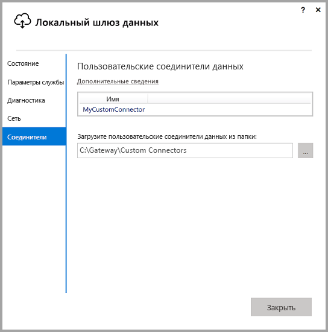
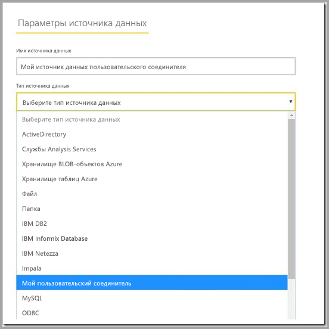

# Использование пользовательских соединителей данных с локальным шлюзом данных

[!INCLUDE [gateway-rewrite](includes/gateway-rewrite.md)]

Соединители данных для Power BI позволяют подключаться и получать доступ к данным приложения, службы или источника данных. Вы можете разработать пользовательские соединители данных и использовать их в Power BI Desktop.

Дополнительные сведения о разработке пользовательских соединителей данных для Power BI см. на [странице GitHub о пакете SDK соединителей данных](http://aka.ms/dataconnectors) документации. Этот сайт содержит сведения о начале работы, а также примеры для Power BI и Power Query.

При создании отчетов, которые используют пользовательские соединители данных, в Power BI Desktop можно использовать локальный шлюз данных для обновления отчетов из службы Power BI.

## Руководство по включению и использованию этой возможности

В версии локального шлюза данных за июль 2018 г. или более поздней на вкладке **Соединители** в приложении локального шлюза данных можно выбрать папку, из которой нужно загружать пользовательские соединители. Убедитесь, что вы выбрали папку, к которой может получить доступ пользователь, запустивший службу шлюза (по умолчанию *NT SERVICE\PBIEgwService*). Шлюз автоматически загружает файлы пользовательского соединителя, расположенные в этой папке, в список соединителей данных. Вы можете увидеть их в этом списке.

Если вы используете локальный шлюз данных (персональный режим), то сможете отправить отчет Power BI в службу Power BI и использовать шлюз для его обновления.

Для локального шлюза данных по-прежнему необходимо создать источник данных для пользовательского соединителя. На странице параметров шлюза в службе Power BI при выборе кластера шлюзов вы увидите новый параметр, позволяющий использовать пользовательские соединители с этим кластером. Чтобы этот параметр был доступен, убедитесь, что на всех шлюзах в кластере установлено обновление за июль 2018 г. или более поздней версии. Теперь выберите этот параметр, чтобы разрешить использование пользовательских соединителей с этим кластером.

Если этот параметр включен, пользовательские соединители будут отображаться как доступные источники данных, которые можно создать в этом кластере шлюза. После создания источника данных с помощью нового пользовательского соединителя вы можете обновлять отчеты Power BI, используя этот соединитель в службе Power BI.

## Рекомендации и ограничения

* Убедитесь, что созданная папка доступна в фоновой службе шлюза. Обычно папки, расположенные в пользовательской папке Windows, а также системные папки недоступны. Если папка недоступна, локальный шлюз данных выводит соответствующее сообщение (за исключением персональной версии шлюза).
* Для использования пользовательских соединителей с локальным шлюзом данных необходима реализация ими раздела "TestConnection" в коде пользовательского соединителя. Это необязательно при использовании пользовательских соединителей с Power BI Desktop. По этой причине необходимо использовать соединители с Power BI Desktop, а не с локальным шлюзом данных. Дополнительные сведения о реализации раздела TestConnection см. в [этой документации](https://github.com/Microsoft/DataConnectors/blob/master/docs/m-extensions.md#implementing-testconnection-for-gateway-support).

## Дальнейшие действия

* [Управление своим источником данных — службы Analysis Services](service-gateway-enterprise-manage-ssas.md)  
* [Управление своим источником данных — SAP HANA](service-gateway-enterprise-manage-sap.md)  
* [Управление своим источником данных — SQL Server](service-gateway-enterprise-manage-sql.md)  
* [Управление своим источником данных — Oracle](service-gateway-onprem-manage-oracle.md)  
* [Управление источником данных — импорт или запланированное обновление](service-gateway-enterprise-manage-scheduled-refresh.md)  

* [Настройка параметров прокси-сервера для локального шлюза данных](/data-integration/gateway/service-gateway-proxy)  
* [Использование Kerberos для единого входа из Power BI в локальные источники данных](service-gateway-sso-kerberos.md)  

Появились дополнительные вопросы? [Ответы на них см. в сообществе Power BI.](http://community.powerbi.com/)
