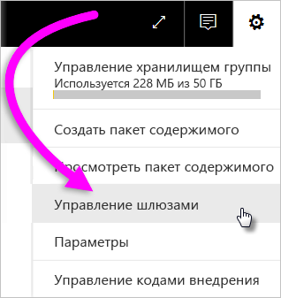
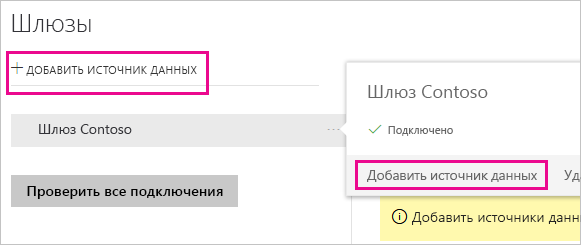
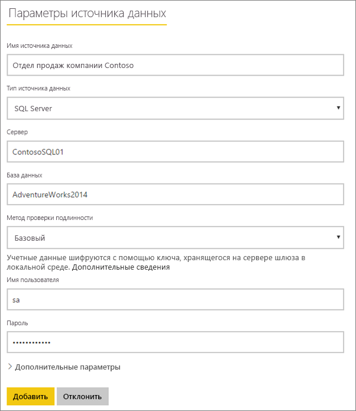
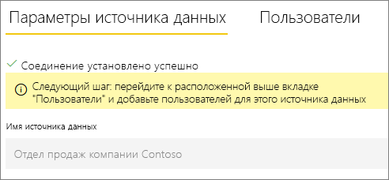
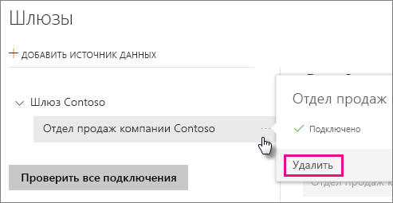
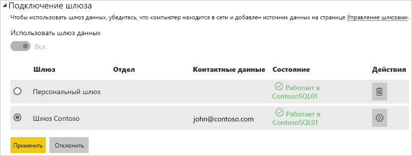

# Управление источниками данных

[!INCLUDE [gateway-rewrite](includes/gateway-rewrite.md)]

Power BI поддерживают многие [локальные источники данных](power-bi-data-sources.md), для каждого из которых существуют свои собственные требования. Шлюз можно использовать для одного или нескольких источников данных. В этом примере демонстрируется добавление источника данных SQL Server. Эта процедура выполняется аналогично другим источникам данных.

Большинство операций по управлению источниками данных можно выполнять и с помощью API. Дополнительные сведений см. в статье [REST API (шлюзы)](/rest/api/power-bi/gateways).

## Добавление источника данных

1. В службе Power BI в правом верхнем углу экрана щелкните значок шестеренки  > **Управление шлюзами**.

    

2. Выберите шлюз и щелкните **Добавить источник данных**. Также можно выбрать **Шлюзы** > **Добавить источник данных**.

    

3. Выберите **тип источника данных**.

    

4. Введите сведения об источнике данных. В нашем примере это имена **сервера**, **базы данных** и другие сведения. 

    

5. Для SQL Server в параметре **Метод проверки подлинности** следует выбрать значение **Windows** или **Базовый** (проверка подлинности SQL). Если вы выбрали вариант **Базовый**, введите учетные данные для доступа к источнику данных.

6. В разделе **Дополнительные параметры** настройте необязательный параметр [Уровень конфиденциальности](https://support.office.com/article/Privacy-levels-Power-Query-CC3EDE4D-359E-4B28-BC72-9BEE7900B540) для источника данных (не применяется к [DirectQuery](desktop-directquery-about.md)).

    

7. Нажмите кнопку **Добавить**. При успешном завершении процесса вы увидите сообщение *Соединение установлено успешно*.

    

Теперь этот источник данных можно использовать для применения данных из SQL Server в панелях мониторинга и отчетах Power BI.

## Удаление источника данных

Источник данных можно удалить, если он больше не используется. Не забудьте, что при удалении источника данных отключаются все панели мониторинга и отчеты, в которых он используется.

Чтобы удалить источник данных, перейдите к нему и выберите команду **Удалить**.

## Использование источника данных для запланированного обновления или DirectQuery

После создания источника данных он будет доступен для использования с подключениями DirectQuery или через функцию запланированного обновления.

> [!NOTE]
>Имена сервера и базы данных в Power BI Desktop и источнике данных в конфигурации локального шлюза должны совпадать.

Связь между набором и источником данных в пределах шлюза основана на именах сервера и базы данных. Эти имена должны совпадать. Например, если вы указали IP-адрес в качестве имени сервера в Power BI Desktop, необходимо использовать такой IP-адрес и для источника данных в конфигурации шлюза. Если вы используете формат *СЕРВЕР\ЭКЗЕМПЛЯР* в Power BI Desktop, нужно использовать тот же формат и в источнике данных, настроенном для шлюза.

Если вы указаны на вкладке **Пользователи** источника данных, настроенного в шлюзе, а имена сервера и базы данных совпадают, вы увидите шлюз в списке вариантов, доступных для использования с запланированным обновлением.

> [!WARNING]
> Если набор данных содержит несколько источников данных, необходимо добавить каждый из них в шлюз. Если в шлюз не добавлен один или несколько источников данных, при запланированном обновлении он не будет отображаться как доступный.

### Ограничения

Локальный шлюз данных поддерживает схему проверки подлинности OAuth только для пользовательских соединителей. Невозможно добавить другие источники данных, требующие OAuth. Если в наборе данных есть источник данных, требующий OAuth, и это не пользовательский соединитель, шлюз невозможно будет использовать для запланированного обновления.

## Управление пользователями

После добавления источника данных к шлюзу вам нужно предоставить пользователям и группам безопасности с поддержкой почты доступ к этом источнику данных (а не ко всему шлюзу). Список пользователей для источника данных определяет, кто может публиковать отчеты, содержащие данные из этого источника данных. Владельцы отчетов могут создавать панели мониторинга, пакеты содержимого и приложения, а также предоставлять доступ к ним другим пользователям.

Также вы можете предоставить пользователям и группам безопасности административный доступ к шлюзу.

### Добавление пользователей к источнику данных

1. В службе Power BI в правом верхнем углу экрана щелкните значок шестеренки  > **Управление шлюзами**.

2. Выберите источник данных, к которому вы хотите добавить пользователей.

3. Выберите **Пользователи** и введите имя пользователя из вашей организации, которому нужно предоставить доступ к выбранному источнику данных. Например, на следующем экране вы добавляете пользователей Maggie и Adam.

    

4. Выберите **Добавить**, и имена добавленных участников отобразятся в списке.

    

Помните, что необходимо добавить пользователей для каждого источника данных, к которому вы хотите предоставить доступ. У каждого источника данных есть собственный список пользователей. Для каждого источника данных пользователи добавляются отдельно.

### Удаление пользователей из источника данных

На вкладке **Пользователи** для источника данных можно удалять пользователей или группы безопасности, которые могут с ним работать.

## Хранение зашифрованных учетных данных в облаке

При добавлении источника данных в шлюз необходимо указать учетные данные для доступа к этому источнику. Все запросы к источнику данных будут выполняться с использованием этих учетных данных. Учетные данные надежно шифруются. Для этого применяется симметричное шифрование, благодаря чему данные не могут быть расшифрованы в облаке перед сохранением в облако. Учетные данные отправляются на локальный компьютер со шлюзом и расшифровываются при обращении к источникам данных.

## Список доступных типов источников данных

Сведения о том, какие источники данных поддерживает локальный шлюз данных, см. в статье [Источники данных Power BI](power-bi-data-sources.md).

## Дальнейшие действия

* [Управление своим источником данных — службы Analysis Services](service-gateway-enterprise-manage-ssas.md)
* [Управление своим источником данных — SAP HANA](service-gateway-enterprise-manage-sap.md)
* [Управление своим источником данных — SQL Server](service-gateway-enterprise-manage-sql.md)
* [Управление своим источником данных — Oracle](service-gateway-onprem-manage-oracle.md)
* [Управление источником данных — импорт или запланированное обновление](service-gateway-enterprise-manage-scheduled-refresh.md)
* [Руководство по развертыванию шлюза данных](service-gateway-deployment-guidance.md)

Появились дополнительные вопросы? Ответы на них см. в [сообществе Power BI](https://community.powerbi.com/).
