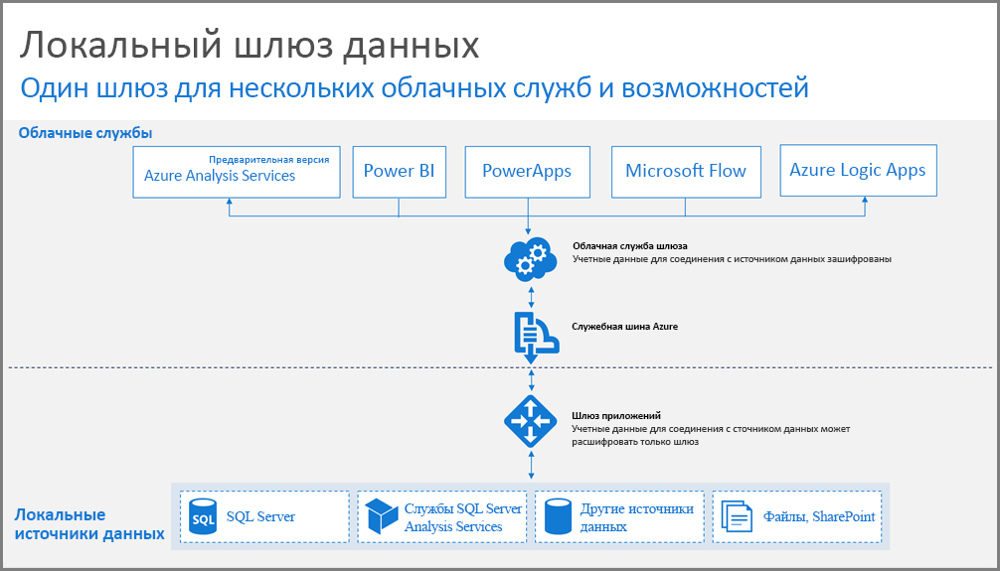
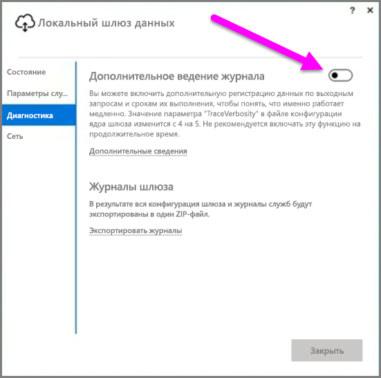
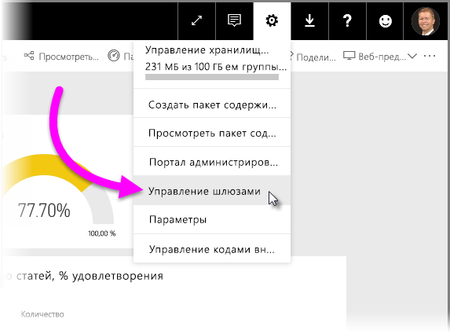

# Руководство по развертыванию шлюза данных для Power BI
Эта статья содержит руководство и рекомендации по развертыванию шлюза данных в сетевой среде. **Шлюз** — это программное обеспечение, облегчающее доступ к данным в частной локальной сети для последующего использования в облачной службе, такой как Power BI. В этой статье описывается развертывание и приводятся рекомендации по настройке **локального шлюза данных**.

Дополнительные сведения о **локальном шлюзе данных**, включая ссылку на его установщик, доступны в этой [записи блога](https://powerbi.microsoft.com/blog/power-bi-gateways-march-update/).

## Рекомендации по установке локального шлюза данных
Прежде чем углубиться в процесс установки и развертывания, следует принять во внимание несколько рекомендаций. В следующих разделах описаны важные моменты, о которых следует помнить.

### Количество пользователей
Число пользователей, которые работают с отчетом, использующим шлюз — важная метрика, которую нужно учесть при выборе места установки шлюза. Ниже приведены некоторые вопросы, которые следует учесть.

* Будут ли пользователи работать с отчетами в разное время суток?
* Подключения какого типа они используют (DirectQuery или импорт)?
* Будут ли все пользователи работать с одним и тем же отчетом?

Если все пользователи обращаются отчету в одно время каждый день, то имеет смысл установить шлюз на компьютере, который сможет обрабатывать все эти запросы (в следующих разделах описываются счетчики производительности и минимальные требования, которые помогут вам определить это).

В **Power BI** существует ограничение, позволяющее использовать только *один* шлюз на *отчет*, поэтому, даже если отчет основан на нескольких источниках данных, все они должны проходить через один шлюз. Тем не менее, если панель мониторинга основана на *нескольких* отчетах, то можно использовать выделенный шлюз для каждого из них, тем самым распределив нагрузку между шлюзами этих отчетов.

### Тип подключения
**Power BI** предлагает два типа подключений, **DirectQuery** и **импорт**. Оба типа подключений поддерживаются не всеми источниками данных, и на выбор типа подключения может влиять множество факторов, включая требования к безопасности, производительность, ограничения данных и размер моделей данных. Дополнительные сведения о типе подключения и поддерживаемых источниках данных приведены в разделе *Список доступных типов источников данных* статьи [Локальный шлюз данных](service-gateway-onprem.md).

Выбранный тип подключения влияет на использование шлюза. Например, старайтесь отделять источники данных **DirectQuery** от источников данных **запланированного обновления**, когда это возможно (при условии, что они находятся в разных отчетах и могут быть разделены). Это предотвратит накопление в очереди шлюза тысяч запросов DirectQuery во время утреннего запланированного обновления модели данных большого размера, используемой для основной панели мониторинга организации. Вот что нужно учитывать для каждого типа:

* **Запланированное обновление**: в зависимости от размера запросов и числа обновлений, выполняемых ежедневно, вы можете не выходить за рамки минимальных рекомендуемых требований к оборудованию или модернизировать компьютер, чтобы повысить производительность. Если какой-либо запрос не свернут, преобразования выполняются на компьютере шлюза, поэтому он работает быстрее с большим объемом памяти.
* **DirectQuery**: запрос отправляется при каждом открытии отчета или просмотре данных любым пользователем. Поэтому, если ожидается, что к данным будут одновременно обращаться более 1000 пользователей, выбранный компьютер должен состоять из надежных и мощных деталей. Большее число ядер ЦП позволит повысить пропускную способность подключения **DirectQuery**.

Ниже приведены требования к компьютеру, на котором устанавливается **локальный шлюз данных**.

**Минимальные требования**

* .Net Framework 4.5
* 64-разрядная версия Windows 7, Windows Server 2008 R2 (и более новые версии)

**Рекомендуемые требования**

* 8-ядерный ЦП
* 8 ГБ памяти
* 64-разрядная версия Windows 2012 R2 (и более новые версии)

### Расположение
Расположение установки шлюза может оказать значительное влияние на производительность запросов, поэтому важно убедиться, что шлюз, источники данных и клиент Power BI расположены максимально близко друг к другу, чтобы свести к минимуму задержку сети. Чтобы определить расположение клиента Power BI, в службе Power BI щелкните значок **?** в правом верхнем углу, а затем выберите **О Power BI**.

### Мониторинг шлюзов
Существует несколько инструментов, которые можно использовать для мониторинга использования и производительности установленных шлюзов.

#### Счетчики производительности
Существует много счетчиков производительности, с помощью которых можно проверить и оценить действие, выполняемое на шлюзе. С помощью счетчиков можно выявить большое число действий определенного типа, что может потребовать развертывания нового шлюза.

> [!NOTE]
> Эти счетчики не записывают длительность определенной задачи.
> 
> 

*Счетчик шлюза*, помимо счетчиков компьютера, позволяет выяснить, какую нагрузку обрабатывает компьютер, и определить нехватку или превышение емкости ресурсов сервера.

Эти счетчики доступны в **системном мониторе Windows** и могут использоваться любых средствах создания отчетов, с которыми вы работаете. Подробное пошаговое руководство по использованию системного монитора шлюза с Power BI приведено в следующей записи блога сообщества.

* [Monitor on-premises data gateways](https://insightsquest.com/2016/08/08/monitor-on-premises-data-gateways/) (Мониторинг локальных шлюзов данных)

#### Журналы
Журналы конфигурации и служб позволяют по-другому взглянуть на то, что происходит со шлюзом. Всегда просматривайте журналы шлюза, если подключение не работает должным образом, так как не все сообщения об ошибках отображаются в службе Power BI.

Чтобы просмотреть файлы журнала на локальном компьютере простым способом, можно нажать кнопку *Экспортировать журналы* на странице **локального шлюза данных при повторном открытии шлюза после завершения его первоначальной установки, а затем выбрать **Диагностика > Экспортировать журналы**.

#### Дополнительное ведение журнала
По умолчанию шлюз выполняет базовое ведения журнала. Если вы изучаете проблемы в работе шлюза и нуждаетесь в дополнительных сведениях о подключениях, использованных для запросов, то можете временно включить *подробное ведение журнала*, чтобы собрать дополнительные данные. Для этого в установленном шлюзе выберите **Диагностика > Дополнительное ведение журнала**.

Вероятнее всего, включение этого параметра приведет к значительному увеличению размера журнала. Это зависит от использования шлюза. Рекомендуется отключить **дополнительное ведение журнала**, завершив просмотр журналов. Не рекомендуется оставлять этот параметр включенным при работе шлюза в обычном режиме.

#### Конфигурация сети
Шлюз создает исходящее подключение к **служебной шине Azure**. Связь осуществляется через следующие исходящие порты:

* TCP-порт 443 (по умолчанию);
* 5671;
* 5672;
* 9350– 9354.

Шлюзу *не* требуются входящие порты. Все необходимые порты перечислены выше.

Рекомендуется добавить IP-адреса для региона, в котором хранятся ваши данные, в список разрешений брандмауэра. Вы можете скачать список IP-адресов, которые находятся в [списке IP-адресов центра обработки данных Microsoft Azure](https://www.microsoft.com/download/details.aspx?id=41653). Он обновляется еженедельно. Шлюз будет взаимодействовать со **служебной шиной Azure**, используя указанный IP-адрес и полное доменное имя (FQDN). При принудительной установке связи по протоколу HTTPS шлюз использует только полное доменное имя и не обменивается данными с помощью IP-адресов.

#### Принудительная установка связи по HTTPS со служебной шиной Azure
Для шлюза можно настроить принудительную установку связи со **служебной шиной Azure** по протоколу HTTPS вместо TCP. Это приведет к незначительному снижению производительности. Настроить принудительную установку связи со **служебной шиной Azure** по протоколу HTTPS для шлюза можно также с помощью его пользовательского интерфейса (начиная с выпуска шлюза за март 2017 года).

Для этого выберите **Сеть**, а затем для параметра **Режим подключения служебной шины Azure** задайте значение **Включено**.

### Дополнительные рекомендации
Этот раздел содержит дополнительные рекомендации по развертыванию шлюзов и управлению ими.

* Избегайте образования единой точки отказа. Если это возможно, распределите локальные источники данных между несколькими шлюзами. В этом случае при отказе одного компьютера вы по-прежнему сможете обновлять часть данных, а не полностью утратите эти функциональные возможности.
* Шлюз невозможно установить на контроллер домена, поэтому не планируйте и не пытайтесь сделать это.
* Не следует устанавливать шлюз на компьютер, который может быть выключен, переведен в спящий режим или отключен от Интернета (например, ноутбук), так как шлюз не сможет работать в этих условиях.
* Избегайте установки шлюза в беспроводной сети, так как из-за этого может снизиться производительность.

#### Восстановление шлюза
Можно восстановить существующий шлюз или переместить его на новый компьютер с помощью **ключа восстановления**. Ключ восстановления предоставляется пользователю, установившему шлюз, и его *невозможно* изменить. Ключ восстановления используется для шифрования данных и восстановления шлюза.

Чтобы восстановить шлюз, убедитесь, что вы являетесь его администратором, вам известно имя шлюза, у вас есть правильный ключ восстановления и доступен новый компьютер с аналогичными характеристиками производительности.

После входа выберите параметр **Migrate an existing gateway** (Перенос существующего шлюза). Далее необходимо выбрать шлюз, который нужно восстановить или перенести, ввести ключ восстановления и щелкнуть "Настроить". После этого старый шлюз будет заменен новым шлюзом, который унаследует его имя и все ранее настроенные источники данных. Теперь все источники данных будут проходить через новый компьютер, и вам ничего не потребуется повторно публиковать. Автоматический переход на другой ресурс пока не поддерживается, однако команда разработчиков шлюза активно рассматривает эту функцию.

#### Администраторы
Можно отобразить список администраторов шлюза в **службе Power BI**. После входа в **службу Power BI выберите **Параметры** (значок шестеренки), затем щелкните "Управление шлюзами" и выберите пользовательский интерфейс шлюза.  

Здесь можно выбрать шлюз и просмотреть список его администраторов. Эти администраторы имеют доступ к шлюзу и могут восстановить или удалить его. Они могут также добавлять и удалять источники данных в шлюзе. Чтобы у всех администраторов в организации был доступ ко всем шлюзам в соответствующей группе, рекомендуется сделать следующее.

* Создайте группу безопасности **AAD** и добавьте в нее других пользователей, а затем добавьте эту группу безопасности в список администраторов соответствующего шлюза. Это гарантирует, что в случае сбоя шлюза доступ к нему будет не только у одного пользователя, что может также понадобиться при восстановлении или перемещении шлюза. Это также позволит другим администраторам узнать, какие шлюзы используются в их группе и какие источники данных существуют в каждом шлюзе.

## Дальнейшие действия
[Настройка параметров прокси-сервера](service-gateway-proxy.md)  
[Устранение неполадок локального шлюза данных](service-gateway-onprem-tshoot.md)  
[Вопросы и ответы о локальном шлюзе данных](service-gateway-onprem-faq.md)  

Появились дополнительные вопросы? [Ответы на них см. в сообществе Power BI.](http://community.powerbi.com/)

