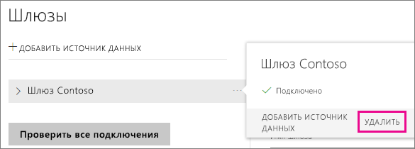
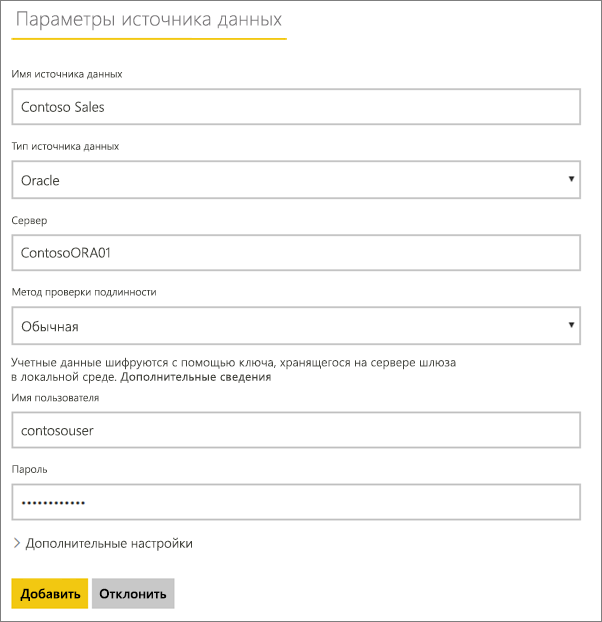
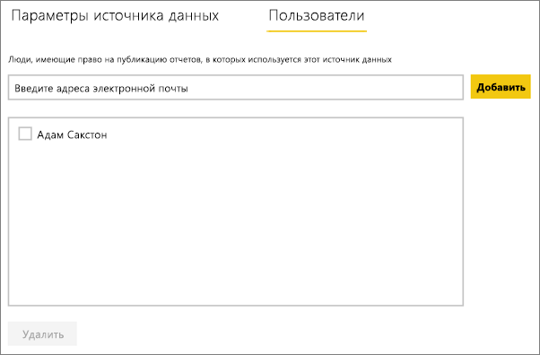
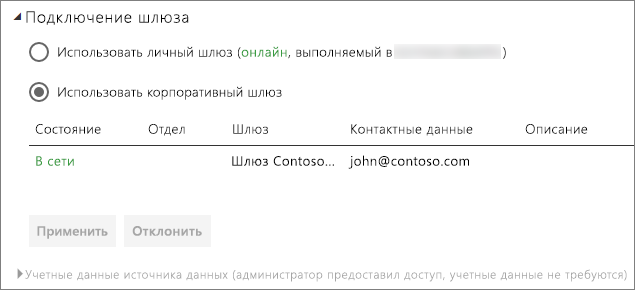

# Управление источником данных — импорт или запланированное обновление
После установки локального шлюза данных необходимо добавить источники, которые можно будет с ним использовать. В этой статье будут рассмотрены способы работы со шлюзами и источниками данных, которые используются для запланированного обновления, в сравнении с DirectQuery и активными подключениями.

## Загрузка и установка шлюза
Вы можете скачать шлюз в службе Power BI. Выберите **Загрузки** > **Шлюз данных** или перейдите на [страницу скачивания шлюза](https://go.microsoft.com/fwlink/?LinkId=698861).

## Добавление шлюза
Чтобы добавить шлюз, просто [скачайте](https://go.microsoft.com/fwlink/?LinkId=698863) и установите корпоративный шлюз на сервере в своей среде. Установленный шлюз появится в списках шлюзов в разделе **Управление шлюзами**.

> [!NOTE]
> Параметр **Управление шлюзами** виден только пользователям, которые являются администраторами хотя бы одного шлюза. Для работы с этим параметром нужно, чтобы вас добавили в качестве администратора либо чтобы вы сами установили и настроили шлюз.
> 
> 

## Удаление шлюза
Удаление шлюза приведет к удалению всех связанных с ним источников данных,  а также отключению панелей мониторинга и отчетов, в которых используются эти источники.

1. Щелкните значок шестеренки  в правом верхнем углу экрана и выберите **Управление шлюзами**.
2. Шлюз > **Удалить**
   
   

## Добавление источника данных
Чтобы добавить источник данных, выберите шлюз и щелкните **Добавить источник данных** или откройте меню "Шлюз" и выберите пункт **Добавить источник данных**.

После этого вы сможете выбрать **тип источника данных** в списке. Все перечисленные источники данных можно использовать для запланированного обновления с помощью корпоративного шлюза. Службы Analysis Services, SQL Server и SAP HANA можно использовать как для запланированного обновления, так и для DirectQuery или активных подключений.

После этого следует указать сведения об источнике данных, включая собственно сведения об источнике и учетные данные, используемые для доступа к нему.

> [!NOTE]
> Все запросы к источнику данных будут выполняться с использованием этих учетных данных. См. дополнительные сведения о локальных шлюзах данных и хранении [учетных данных](service-gateway-onprem.md#credentials).
> 
> 

Заполнив все данные, нажмите кнопку **Добавить** .  Теперь можно использовать этот источник данных для запланированного обновления локальных данных. В случае успеха появится сообщение *Подключение установлено* .

<!-- Shared Install steps Include -->
[!INCLUDE [gateway-onprem-datasources-include](./includes/gateway-onprem-datasources-include.md)]

### Дополнительные настройки
Для источника данных можно настроить уровень конфиденциальности. Определяет, каким образом можно объединять данные. Используется только для запланированного обновления. [Дополнительные сведения](https://support.office.com/article/Privacy-levels-Power-Query-CC3EDE4D-359E-4B28-BC72-9BEE7900B540)

## Удаление источника данных
При удалении источника данных отключаются все панели мониторинга и отчеты, в которых он используется.  

Чтобы удалить источник данных, выберите в меню "Источник данных" команду **Удалить**.

## Управление администраторами
На вкладке "Администраторы" для шлюза можно добавлять и удалять пользователей, которые могут его администрировать. В настоящее время можно добавлять можно только пользователей. Группы безопасности добавлять нельзя.

## Управление пользователями
На вкладке "Пользователи" для источника данных можно добавлять и удалять пользователей или группы безопасности, которые могут с ним работать.

> [!NOTE]
> Список пользователей определяет только права на публикацию отчетов. Владельцы отчетов могут создавать панели мониторинга или пакеты содержимого и предоставлять доступ к ним другим пользователям.
> 
> 

## Использование источника данных для запланированного обновления
После создания источника данных он будет доступен для использования с подключениями DirectQuery или через функцию запланированного обновления.

> [!NOTE]
> Имена сервера и базы данных в Power BI Desktop и источнике данных в конфигурации локального шлюза должны совпадать.
> 
> 

Связь между набором и источником данных в пределах шлюза основана на именах сервера и базы данных. Они должны совпадать. Например, если вы указали IP-адрес в качестве имени сервера в Power BI Desktop, необходимо будет использовать IP-адрес и для источника данных в конфигурации шлюза. Если вы используете формат *СЕРВЕР\ЭКЗЕМПЛЯР* в Power BI Desktop, необходимо использовать тот же формат и в источнике данных, настроенном для шлюза.

Если вы указаны на вкладке **Пользователи** источника данных, настроенного в шлюзе, а имена сервера и базы данных совпадают, вы увидите шлюз в списке вариантов, доступных для использования с запланированным обновлением.

> [!WARNING]
> Если набор данных содержит несколько источников данных, необходимо добавить каждый из них в пределах шлюза. Если в шлюз не добавлен один или несколько источников данных, при запланированном обновлении он не будет доступным.
> 
> 

## Ограничения
* Локальный шлюз данных не поддерживает схему аутентификации OAuth. Невозможно добавить источники данных, требующие OAuth. Если в наборе данных есть источник данных, требующий OAuth, шлюз невозможно будет использовать для запланированного обновления.

## Дальнейшие действия
[Локальный шлюз данных](service-gateway-onprem.md)  
[Локальный шлюз данных: подробный обзор](service-gateway-onprem-indepth.md)  
[Устранение неполадок локального шлюза данных](service-gateway-onprem-tshoot.md)  
Появились дополнительные вопросы? [Ответы на них см. в сообществе Power BI.](http://community.powerbi.com/)

