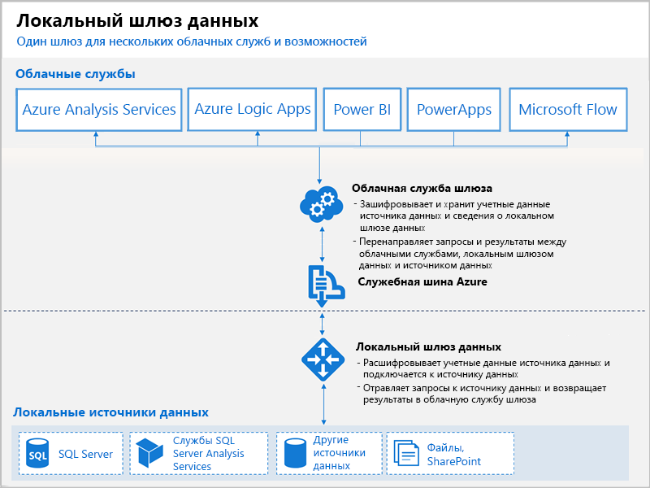

# Что такое шлюзы Power BI?

Шлюз Power BI — это программное обеспечение, установленное в локальной сети, которое упрощает доступ к данным в этой сети. Он похож на "привратника", который прослушивает запросы пользователей на подключение и выполняет их только при соответствии определенным условиям. Это позволяет организациям хранить базы данных и другие источники данных в локальной сети, сохраняя возможность безопасно использовать эти данные в отчетах и на панелях мониторинга Power BI.

Ниже представлена схема развертывания со шлюзом, который обрабатывает запросы из облака к трем локальным компьютерам. Мы рассмотрим ее подробнее далее в этой статье.

## Типы шлюзов

Power BI предлагает два шлюза, предназначенные для разных сценариев.

* **Локальный шлюз данных (персональный режим)** позволяет одному пользователю подключаться к источникам. Его невозможно использовать совместно с другими пользователями. Он используется только в Power BI. Этот шлюз отлично подходит для тех случаев, когда только один автор создает отчеты и ему не нужно предоставлять другим пользователям доступ к локальным источникам данных.

* **Локальный шлюз данных** позволяет нескольким пользователям подключаться к нескольким локальным источникам данных. Его можно использоваться из Power BI, PowerApps, Flow, Azure Analysis Services и Azure Logic Apps через один развернутый шлюз. Этот шлюз отлично подходит для более сложных сценариев, в которых несколько пользователей обращаются к нескольким источникам данных. 

## Использование шлюза

Чтобы использовать шлюз, нужно выполнить четыре основных действия:

1. **установите шлюз** на локальном компьютере, выбрав подходящий режим;
2. **добавьте пользователей к шлюзу**, чтобы они получили доступ к локальным источникам данных;
3. **подключитесь к источникам данных**, которые нужны для отчетов и панелей мониторинга;
4. **обновляйте локальные данных**, чтобы отчеты в Power BI содержали актуальные сведения.

Шлюз можно установить автономно или в *кластер*. Мы рекомендуем второй вариант, так как он обеспечивает высокий уровень доступности.

## Как работают шлюзы

Установленный шлюз работает как служба Windows **On-premises data gateway** (Локальный шлюз данных). Эта локальная служба регистрируется в облачной службе шлюза через Служебную шину Azure. Ниже показана схема потока данных между локальными источниками и облачными службами, которые используют шлюз.

Поток запросов и данных:

1. Облачная служба создает запрос с зашифрованными учетными данными для обращения к локальному источнику данных. Этот запрос отправляется в очередь шлюза для обработки.
2. Облачная служба шлюза анализирует запрос и передает его в Служебную шину Azure.
3. Локальный шлюз данных опрашивает Служебную шину Azure на наличие необработанных запросов.
4. шлюз получает запрос, расшифровывает учетные данные и использует их для подключения к источникам данных;
5. Шлюз отправляет запрос в источник данных на исполнение.
6. Результаты возвращаются от источника данных в шлюз и далее в облачную службу и на сервер.

## Дальнейшие действия
[Установка и настройка локального шлюза данных](service-gateway-install.md)

Появились дополнительные вопросы? [Ответы на них см. в сообществе Power BI.](http://community.powerbi.com/)

