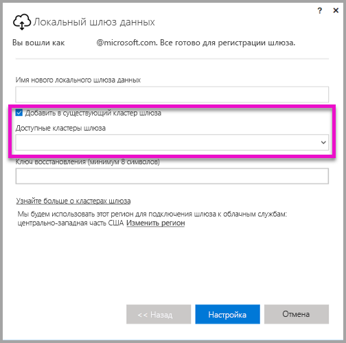

# <a name="high-availability-clusters-for-on-premises-data-gateway"></a>Кластеры с высоким уровнем доступности для локальных шлюзов данных
Вы можете создавать **кластеры с высоким уровнем доступности** для установленных **локальных шлюзов данных**. Так вы обеспечите корпоративный доступ к локальным ресурсам данных, которые используются в отчетах и панелях мониторинга Power BI. Такие кластеры позволяют администраторам шлюзов группировать шлюзы, чтобы не допустить существования единой точки отказа при доступе к локальным ресурсам данных. В этой статье описано, как создать и настроить кластер с высоким уровнем доступности для локальных шлюзов данных. Для кластеров с высоким уровнем доступности требуется, чтобы локальный шлюз данных был обновлен до версии за ноябрь 2017 г. или более поздней.


## <a name="setting-up-high-availability-clusters-of-gateways"></a>Настройка кластеров с высоким уровнем доступности для шлюзов

При установке **локального шлюза данных** вы можете выбрать, нужно ли добавить шлюз в существующий кластер шлюза. 



Чтобы добавить шлюз в существующий кластер, предоставьте *ключ восстановления* для экземпляра основного шлюза кластеру, к которому нужно присоединить новый шлюз. Основной шлюз для кластера должен быть обновлен до версии за ноябрь 2017 г. или более поздней. 


## <a name="managing-a-gateway-cluster"></a>Управление кластером шлюза

Так как кластер содержит два или больше шлюзов, все операции управления шлюзом, например добавление источника данных или предоставление разрешений администратора для шлюза, применяются ко всем шлюзам, находящимся в кластере. 

Когда администраторы выбирают пункт меню **Управление шлюзами**, расположенный под значком шестеренки в **службе Power BI**, они видят список зарегистрированных кластеров или отдельные шлюзы, но не видят отдельные экземпляры шлюзов, которые являются элементами кластера.

Все новые запросы **запланированного обновления** и операции DirectQuery автоматически перенаправляются на основной экземпляр определенного кластера шлюза. Если экземпляр основного шлюза не подключен к сети, запрос перенаправляется к другому экземпляру шлюза в кластере.

## <a name="powershell-support-for-gateway-clusters"></a>Поддержка PowerShell для кластеров шлюзов

Скрипты PowerShell доступны в папке установки локального шлюза данных. По умолчанию папка располагается здесь: *C:\Program Files\On-premises data gateway*. Чтобы скрипты работали правильно, используйте PowerShell версии 5 или более поздней версии. С помощью скриптов PowerShell пользователи могут выполнять такие операции:

-   получение списка кластеров шлюзов, доступных для пользователя;
-   получение списка экземпляров шлюзов, зарегистрированных в кластере, а также сведения о их статусе ("В сети" или "Вне сети");
-   изменение статуса "Включено" или "Отключено" и других свойств для экземпляра шлюза в кластере;
-   Удаление шлюза

Чтобы запустить команды PowerShell, приведенные в таблице, сначала нужно выполнить следующие шаги.

1. Откройте окно командной строки PowerShell от имени администратора.
2. Затем выполните следующую одноразовую команду PowerShell (предполагается, что вы не выполняли команды PowerShell на этом компьютере):

    ```
    Set-ExecutionPolicy -ExecutionPolicy Unrestricted -Force
    ```

3. После этого перейдите к папке установки локального шлюза данных в окне PowerShell и импортируйте необходимый модуль с помощью следующей команды:

    ```
    Import-Module .\OnPremisesDataGatewayHAMgmt.psm1
    ```

Выполнив эти шаги, вы сможете использовать команды в следующей таблице, чтобы управлять кластерами шлюзов.

| **Команда** | **Описание** | **Параметры** |
| --- | --- | --- |
| *Login-OnPremisesDataGateway* |С помощью этой команды пользователь может войти в систему, чтобы управлять кластерами локальных шлюзов данных.  Вам нужно запустить эту команду и войти в систему, *чтобы* другие команды высокого уровня доступности могли выполняться правильно. Примечание. Маркер проверки подлинности AAD, который требуется для вызова команды Login, действителен только в течение часа. После этого его срок действия истечет. Вы можете повторно выполнить команду Login, чтобы запросить новый маркер.| Имя пользователя и пароль AAD (предоставляются во время выполнения команды, а не при начальном вызове).|
| *Get-OnPremisesDataGatewayClusters* | Позволяет получить список кластеров шлюзов для пользователя, вошедшего в систему. | При необходимости можно передать параметры форматирования этой команде, чтобы повысить читаемость, например *Format-Table -AutoSize -Wrap*. |
| *Get-OnPremisesDataClusterGateways* | Позволяет получить список шлюзов в определенном кластере, а также дополнительные сведения для каждого шлюза (статус "В сети" или "Вне сети", имя компьютера и т. д.). | *-ClusterObjectID xyz*, где *xyz* заменяется значением идентификатора объекта текущего кластера, которое можно получить с помощью команды *Get-OnPremisesDataGatewayClusters*.|
| *Set-OnPremisesDataGateway* | Позволяет задать значения свойств для определенного шлюза в кластере, включая возможность включить или отключить определенный экземпляр шлюза.  | *-ClusterObjectID xyz*, где *xyz* нужно заменить значением идентификатора объекта текущего кластера, которое можно получить с помощью команды *Get-OnPremisesDataGatewayClusters*. *-GatewayObjectID abc*, где *abc* нужно заменить значением идентификатора объекта текущего кластера, которое можно получить с помощью команды *Get-OnPremisesDataClusterGateways* при наличии идентификатора объекта кластера. |
| *Get-OnPremisesDataGatewayStatus* | Позволяет получить сведения о статусе для определенного экземпляра шлюза в кластере.  | *-ClusterObjectID xyz*, где *xyz* нужно заменить значением идентификатора объекта текущего кластера, которое можно получить с помощью команды *Get-OnPremisesDataGatewayClusters*. *-GatewayObjectID abc*, где *abc* нужно заменить значением идентификатора объекта текущего кластера, которое можно получить с помощью команды *Get-OnPremisesDataClusterGateways* при наличии идентификатора объекта кластера. |
| *Remove-OnPremisesDataGateway*  | Позволяет удалить экземпляр шлюза из кластера. Обратите внимание, что основной шлюз в кластере можно удалить, только когда все шлюзы в кластере будут удалены.| *-ClusterObjectID xyz*, где *xyz* нужно заменить значением идентификатора объекта текущего кластера, которое можно получить с помощью команды *Get-OnPremisesDataGatewayClusters*. *-GatewayObjectID abc*, где *abc* нужно заменить значением идентификатора объекта текущего кластера, которое можно получить с помощью команды *Get-OnPremisesDataClusterGateways* при наличии идентификатора объекта кластера. |


## <a name="next-steps"></a>Дальнейшие действия

-   [Управление своим источником данных — службы Analysis Services](service-gateway-enterprise-manage-ssas.md)  
-   [Управление своим источником данных — SAP HANA](service-gateway-enterprise-manage-sap.md)  
-   [Управление своим источником данных — SQL Server](service-gateway-enterprise-manage-sql.md)  
-   [Управление своим источником данных — Oracle](service-gateway-onprem-manage-oracle.md)  
-   [Управление источником данных — импорт или запланированное обновление](service-gateway-enterprise-manage-scheduled-refresh.md)  
-   [Локальный шлюз данных во всех подробностях](service-gateway-onprem-indepth.md)  
-   [Локальный шлюз данных (персональный режим)](service-gateway-personal-mode.md)
-   [Настройка параметров прокси-сервера для локального шлюза данных](service-gateway-proxy.md)  
-   [Использование Kerberos для единого входа из Power BI в локальные источники данных](service-gateway-kerberos-for-sso-pbi-to-on-premises-data.md)  

Появились дополнительные вопросы? [Ответы на них см. в сообществе Power BI.](http://community.powerbi.com/)
