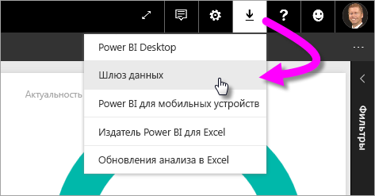
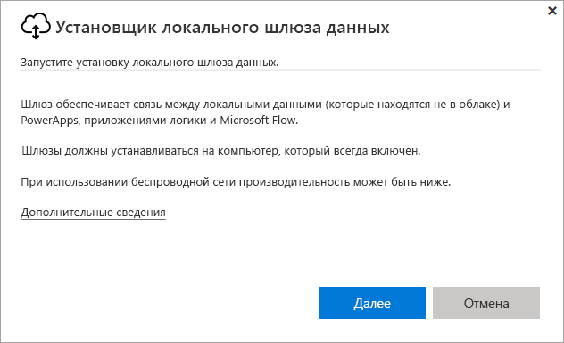
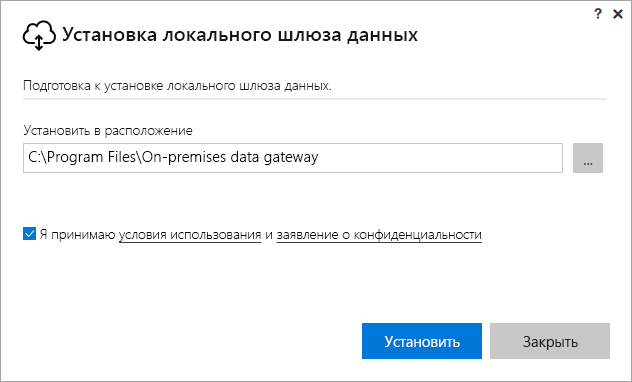
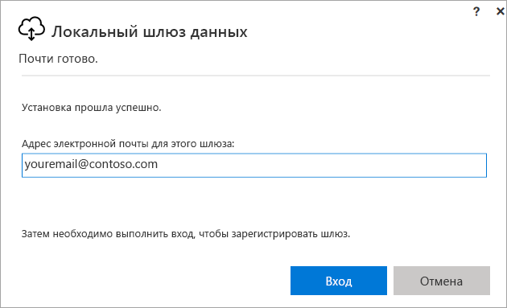
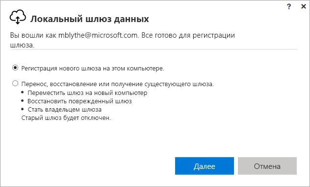
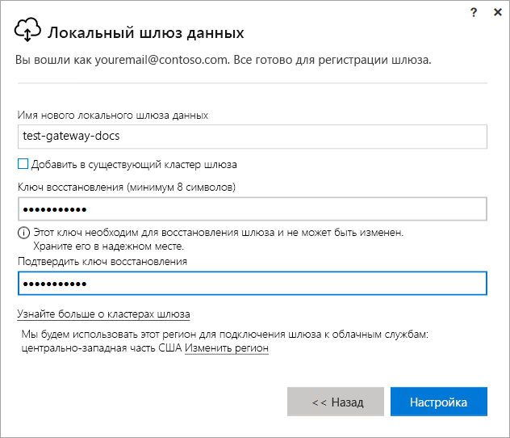
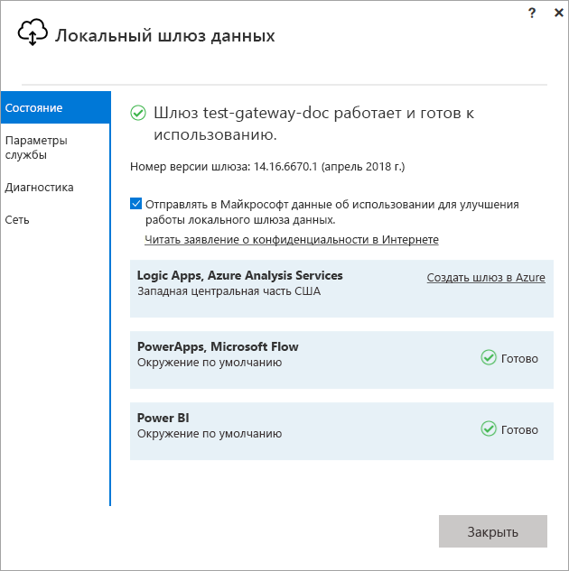
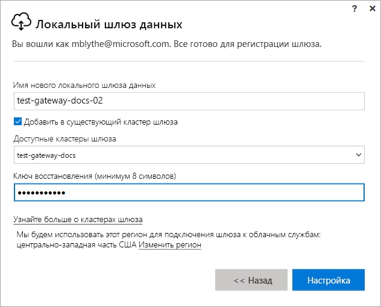

# Установка шлюза для Power BI

Шлюз Power BI — это программное обеспечение, установленное в локальной сети, которое упрощает доступ к данным в этой сети. Как описано в [этом обзоре](service-gateway-getting-started.md), шлюз можно установить в персональном режиме или в стандартном режиме (рекомендуется). В стандартном режиме шлюз можно установить автономно или в *кластер*. Мы рекомендуем второй вариант, так как он обеспечивает высокий уровень доступности. В этой статье мы покажем, как установить стандартный шлюз и добавить еще один для создания кластера.

Если вы не зарегистрированы в Power BI, перед началом работы [пройдите бесплатную регистрацию](https://app.powerbi.com/signupredirect?pbi_source=web).

## Скачивание и установка шлюза

Шлюз работает на конкретном компьютере, где он установлен, поэтому выберите такой компьютер, который всегда будет включен. Для повышения производительности и надежности мы рекомендуем подключать этот компьютер к проводной сети, а не к беспроводной.

1. В службе Power BI выберите в правом верхнем углу **значок скачивания**  > **Шлюз данных**.

    

2. На странице скачивания нажмите кнопку **Download gateway** (Скачать шлюз).

3. Нажмите кнопку **Далее**.     

    

4. Последовательно выберите **On-premises data gateway (recommended)** > **Next** (Локальный шлюз данных (рекомендуется) > Далее).

    

5. Не меняйте путь установки по умолчанию и подтвердите согласие с условиями, затем щелкните **Установить**.

    

6. Войдите в учетную запись, которую вы используете для Power BI и щелкните **Войти**.

    

    Шлюзы будут связаны с указанной учетной записью Power BI, и вы можете управлять ими через службу Power BI. Итак, вы вошли в учетную запись.

7. Последовательно выберите **Регистрация нового шлюза на этом компьютере** > **Далее**.

    

8. Введите для шлюза имя (оно должно быть уникальным в пределах клиента) и ключ восстановления. Этот ключ потребуется в том случае, если вы решите восстановить или переместить шлюз. Выберите **Настройка**.

    

    Обратите внимание на действие **Добавить в существующий кластер шлюза**. Оно пригодится нам в следующем разделе статьи.

9. Просмотрите сведения, представленные на последнем экране. Обратите внимание, что шлюз теперь доступен для Power BI, а также PowerApps и Flow, так как для всех трех платформ мы указали одну и ту же учетную запись. Выберите **Закрыть**.

    

После успешной установки шлюза вы можете добавить еще один шлюз, чтобы создать кластер.

## Добавление второго шлюза для создания кластера

Кластер позволяет администраторам шлюза избежать единой точки отказа в системе доступа к локальным данным. Если основной шлюз данных станет недоступен, все запросы будут направляться на второй добавленный шлюз и т. д. На компьютере можно установить только один стандартный шлюз, а значит для второго шлюза в кластере потребуется другой компьютер. Это разумный подход, так как избыточность всегда полезна для кластера.

Для кластеров с высоким уровнем доступности требуется, чтобы локальный шлюз данных был обновлен до версии за ноябрь 2017 г. или более поздней.

1. Скачайте шлюз на другой компьютер и установите его.

2. Войдя в учетную запись Power BI, зарегистрируйте шлюз. Выберите **Добавить в существующий кластер шлюза**. В разделе **Доступные кластеры шлюза** выберите первый шлюз, который вы недавно установили (*основной шлюз*) и введите ключ восстановления для этого шлюза. Выберите **Настройка**.

    

## Дальнейшие действия

[Управление шлюзом Power BI](service-gateway-manage.md)

Появились дополнительные вопросы? [Ответы на них см. в сообществе Power BI.](http://community.powerbi.com/)