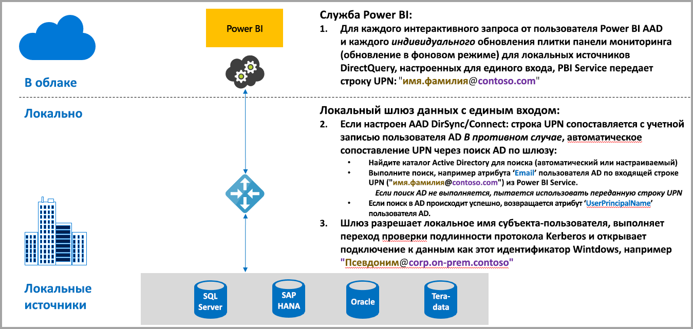
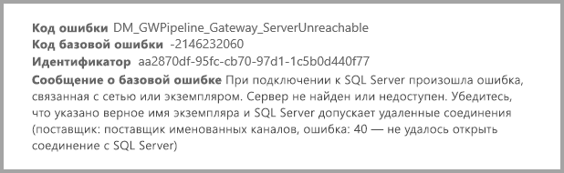
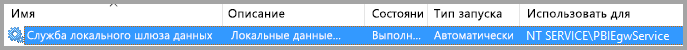
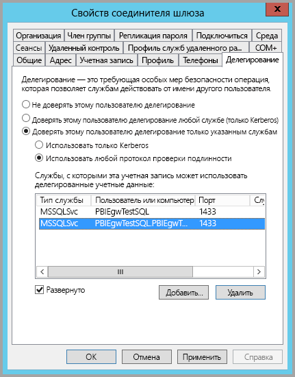
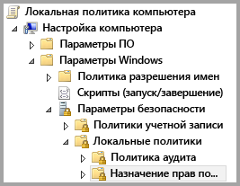
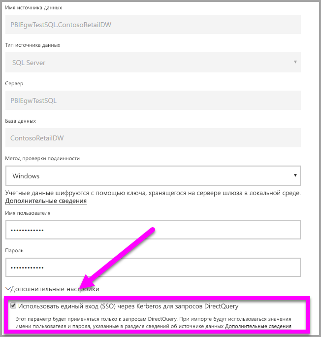
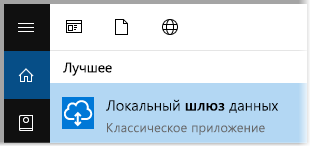
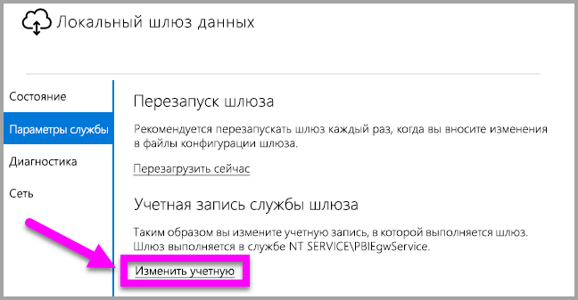

# Использование Kerberos для единого входа из Power BI в локальные источники данных
Вы можете быстро установить подключение с единым входом, включив обновление отчетов и панели мониторинга Power BI с помощью данных из локальной среды. Для этого настройте локальный шлюз данных с Kerberos. Локальный шлюз данных упрощает единый вход (SSO) с помощью функции DirectQuery, которая используется для подключения к локальным источникам данных.

В настоящее время поддерживаются следующие источники данных: SQL Server, SAP HANA и Teradata. Все они основаны на [ограниченном делегировании Kerberos](https://technet.microsoft.com/library/jj553400.aspx).

* SQL Server
* SAP HANA
* SAP BW
* Teradata

Когда пользователь работает с отчетом DirectQuery в службе Power BI, каждая операция перекрестной фильтрации, среза, сортировки и редактирования отчета генерирует запросы, которые в режиме реального времени отправляются в основной источник данных в локальной среде.  Если для источника данных настроен единый вход, запросы выполняются с идентификатором пользователя, работающего в Power BI (то есть через веб-интерфейс или мобильные приложения Power BI). Таким образом, каждый пользователь может просмотреть данные, доступ к которым ему разрешен в основном источнике данных. Если настроен единый вход, общее кэширование данных разных пользователей не выполняется.

## Этапы выполнения запроса с единым входом
Запрос, который выполняется с единым входом, состоит из трех этапов, которые представлены на следующей схеме:

> [!NOTE]
> Единый вход для Oracle еще не предусмотрен, но находится в разработке и ожидается в ближайшее время.
> 
> 

Ниже приведены дополнительные сведения об этих действиях:

1. При отправке каждого запроса в настроенный шлюз **служба Power BI** включает *имя субъекта-пользователя*.
2. Шлюз должен сопоставить имя субъекта-пользователя Azure с локальным идентификатором Active Directory.
   
   а.  Если решение AAD DirSync (также известное как *AAD Connect*) настроено, то сопоставление выполнится на этом шлюзе автоматически.
   
   б.  В противном случае шлюз может выполнить поиск и сопоставить имя участника-пользователя Azure AD с локальным пользователем, выполнив поиск в домене локальной версии Active Directory.
3. После сопоставления процесс службы шлюза олицетворяет локального пользователя, устанавливает подключение к базе данных и отправляет запрос. Шлюз не обязательно устанавливать на том же компьютере, что и базу данных.
   
   - Олицетворение пользователя и подключение к базе данных будут успешными, только если учетная запись службы шлюза является учетной записью домена (или идентификатором безопасности службы) и если конфигурация ограниченного делегирования Kerberos позволяет базе данных принимать билеты Kerberos из учетной записи службы шлюза.  
   
   > [!NOTE]
   > Если настроено AAD DirSync/Connect и учетные записи синхронизированы, службе шлюза не требуется выполнять поиск в локальной службе AD на этапе выполнения. А что касается идентификатора безопасности службы, для службы шлюза можно использовать его локальный вариант (вместо учетной записи домена).  Этапы настройки ограниченного делегирования Kerberos, описанные в этом документе, совпадают (просто применяются на основе идентификатора безопасности службы, а не учетной записи домена).
   > 
   > 

> [!NOTE]
> Чтобы включить единый вход для SAP HANA:
>
> - Убедитесь, что для сервера SAP HANA используется минимально допустимая версия, которая зависит от уровня платформы сервера SAP HANA:
>     - [HANA 2 SPS 01 Rev 012.03](https://launchpad.support.sap.com/#/notes/2557386)
>     - [HANA 2 SPS 02 Rev 22](https://launchpad.support.sap.com/#/notes/2547324)
>     - [HANA 1 SP 12 Rev 122.13](https://launchpad.support.sap.com/#/notes/2528439)
>
> - На компьютере шлюза установите последнюю версию драйвера ODBC для HANA от SAP.  Минимальная версия драйвера ODBC для HANA — 2.00.020.00, выпущенная в августе 2017 г.
>
> См. дополнительные сведения о [настройке единого входа для SAP HANA с помощью Kerberos](https://help.sap.com/viewer/b3ee5778bc2e4a089d3299b82ec762a7/2.0.03/en-US/1885fad82df943c2a1974f5da0eed66d.html) в руководстве по безопасности SAP HANA. На этой странице приведены ссылки, в частности ссылка SAP Note 1837331 – HOWTO HANA DBSSO Kerberos/Active Directory]. 
>
>

## Ошибки из-за неполной конфигурации Kerberos
Если основной сервер базы данных и шлюз неправильно настроены для **ограниченного делегирования Kerberos**, может поступить следующее сообщение об ошибке:

Технические сведения, связанные с сообщением об ошибке, могут выглядеть так:

Эта ошибка возникает из-за неполной конфигурации Kerberos: шлюз не может правильно олицетворить исходного пользователя, поэтому не удается подключиться к базе данных.

## Подготовка к ограниченному делегированию Kerberos
Чтобы ограниченное делегирование Kerberos правильно работало, необходимо настроить несколько элементов, в том числе *имена субъектов-служб* и параметры делегирования в учетных записях служб.

### Предварительное требование 1. Установка и настройка локального шлюза данных
Этот выпуск локального шлюза данных поддерживает обновление на месте, а также подхват параметров из существующих шлюзов.

### Предварительное требование 2. Запуск службы Windows для шлюза в качестве учетной записи домена
В стандартной установке шлюз выполняет роль учетной записи службы для локального компьютера (например, *NT Service\PBIEgwService*). Пример представлен на следующем изображении:

Чтобы включить **ограниченное делегирование Kerberos**, шлюз необходимо запускать как учетную запись домена, если служба AAD уже синхронизирована с локальным каталогом Active Directory (с помощью AAD DirSync или Connect). Обеспечить надлежащую работу измененной учетной записи можно двумя способами:

* Если вы начали работу с предыдущей версией локального шлюза данных, последовательно выполните все пять шагов (в том числе запуск конфигуратора шлюзов на шаге 3), описанные в следующей статье:
  
  * [Смена учетной записи службы шлюза на пользователя домена](https://powerbi.microsoft.com/documentation/powerbi-gateway-proxy/#changing-the-gateway-service-account-to-a-domain-user).
  * Если вы уже установили предварительную версию локального шлюза данных, можно сменить учетную запись службы через интерфейс непосредственно из конфигуратора шлюзов. См. раздел **Переключение шлюза на учетную запись домена** в конце этой статьи.

> [!NOTE]
> Если настроено AAD DirSync/Connect и учетные записи синхронизированы, службе шлюза не требуется выполнять поиск в локальной службе AD на этапе выполнения. Для службы шлюза также можно использовать идентификатор безопасности локальной службы (вместо учетной записи домена). Этапы настройки ограниченного делегирования Kerberos, описанные в этой статье, будут аналогичными для такой конфигурации (они просто применяются к идентификатору безопасности службы, а не учетной записи домена).
> 
> 

### Предварительное требование 3. Получение прав администратора домена для настройки параметров ограниченного делегирования Kerberos и имен субъектов-служб (SetSPN)
Технически администратор домена может на временной или постоянной основе разрешить любому пользователю настраивать делегирование Kerberos и имена субъектов-служб. Но это не рекомендуется делать для пользователей без прав администратора. В следующем разделе подробно описаны этапы настройки для выполнения **предварительного требования 3**.

## Настройка ограниченного делегирования Kerberos для шлюза и источника данных
Чтобы правильно настроить систему, необходимо настроить или проверить два следующих элемента:

1. При необходимости настройте имя субъекта-службы для учетной записи домена в службе шлюза (если она еще не создана).
2. Настройте параметры делегирования для учетной записи домена в службе шлюза.

Обратите внимание, что эти шаги может выполнять только администратор домена.

В следующих разделах описаны действия по настройке.

### Настройка имени субъекта-службы для учетной записи службы шлюза
Сначала определите, создано ли имя субъекта-службы для учетной записи домена, используемой в качестве учетной записи службы шлюза. Для этого выполните следующие действия:

1. Войдите как администратор домена и запустите средство **Пользователи и компьютеры Active Directory**.
2. Щелкните правой кнопкой мыши домен, выберите **Найти** и введите имя учетной записи службы шлюза.
3. В результатах поиска щелкните правой кнопкой мыши учетную запись службы шлюза и выберите **Свойства**.
   
   * Если в диалоговом окне **Свойства** отображается вкладка **Делегирование**, значит, имя субъекта-службы уже создано и вы можете перейти к следующему подразделу для настройки параметров делегирования.

Если в диалоговом окне **Свойства** не отображается вкладка **Делегирование**, можно создать имя субъекта-службы для учетной записи. После этого будет добавлена вкладка **Делегирование**. Это самый простой способ настройки параметров делегирования. Имя субъекта-службы можно создать с помощью [средства setspn](https://technet.microsoft.com/library/cc731241.aspx), доступного в Windows. Для создания имени субъекта-службы требуются права администратора домена.

Предположим, что учетная запись службы шлюза — PBIEgwTest\GatewaySvc, а компьютер, на котором работает шлюз, называется **Machine1**. Чтобы задать имя субъекта-службы для учетной записи службы шлюза для этого компьютера, выполните следующую команду:

После этого можно перейти к настройке параметров делегирования.

### Настройка параметров делегирования в учетной записи домена службы шлюза
Второе требование конфигурации — это параметры делегирования в учетной записи службы шлюза. Для этого можно использовать разные средства. В этом примере мы будем использовать средство **Пользователи и компьютеры Active Directory**, которое является оснасткой консоли управления (MMC). Это средство используется для администрирования и публикации данных в каталоге. По умолчанию оно доступно в контроллерах домена. На других компьютерах можно использовать средство **установки компонентов Windows**.

Необходимо настроить **ограниченное делегирование Kerberos** с транзитом протокола. При помощи функции ограниченного делегирования определите службы, которые нужно делегировать. Например, если вызовы делегирования от учетной записи службы шлюза должны получать только сервер SQL Server или SAP HANA.

В этом разделе предполагается, что вы уже настроили имена субъектов-служб для ваших базовых источников данных (таких как SQL Server, SAP HANA, Teradata и т. д.). Чтобы узнать, как настроить имена субъектов-служб сервера источника данных, см. техническую документацию соответствующего сервера базы данных. Также см. запись блога, в которой объясняется, [*какое имя субъекта-службы требуется вашему приложению*](https://blogs.msdn.microsoft.com/psssql/2010/06/23/my-kerberos-checklist/).

В приведенных ниже инструкциях предполагается, что у вас есть локальная среда с двумя компьютерами: компьютер шлюза и сервер базы данных (база данных SQL Server). В этом примере будут использоваться следующие параметры и имена:

* Имя компьютера шлюза: **PBIEgwTestGW**.
* Учетная запись службы шлюза: **PBIEgwTest\GatewaySvc** (отображаемое имя учетной записи: соединитель шлюза).
* Имя компьютера источника данных SQL Server: **PBIEgwTestSQL**.
* Учетная запись для службы источника данных SQL Server: **PBIEgwTest\SQLService**.

Учитывая эти примеры имен и параметров, этапы настройки будут следующими:

1. Войдите как администратор домена и запустите средство **Пользователи и компьютеры Active Directory**.
2. Щелкните правой кнопкой мыши учетную запись службы шлюза (**PBIEgwTest\GatewaySvc**) и выберите **Свойства**.
3. Выберите вкладку **Делегирование**.
4. Выберите параметр **Доверять компьютеру делегирование указанных служб**.
5. Выберите **Использовать любой протокол проверки подлинности**.
6. В разделе **Службы, с которыми эта учетная запись может использовать делегированные учетные данные:** нажмите кнопку **Добавить**.
7. В открывшемся диалоговом окне выберите **Пользователи или компьютеры**.
8. Введите данные учетной записи для службы базы данных SQL Server (**PBIEgwTest\SQLService**) и нажмите кнопку **ОК**.
9. Выберите имя субъекта-службы, созданное для сервера базы данных. В этом примере имя субъекта-службы будет начинаться с **MSSQLSvc**. Если вы добавили полное доменное имя и имя субъекта-службы NetBIOS для службы базы данных, выберите оба имени. Вы можете увидеть только одно имя.
10. Нажмите кнопку **ОК**. Вы должны увидеть имя субъекта-службы в списке.
11. При необходимости выберите **Развернуто**, чтобы отображалось имя субъекта-службы NetBIOS и полное доменное имя.
12. Если установлен флажок **Развернуто**, диалоговое окно должно выглядеть так:
    
    
13. Нажмите кнопку **ОК**.
    
    Теперь на компьютере со службой шлюза (**PBIEgwTestGW** в нашем примере), назначьте учетной записи службы шлюза локальную политику "Имитация клиента после проверки подлинности". Это можно выполнить или проверить с помощью редактора локальных групповых политик (**gpedit**).
14. На компьютере шлюза выполните команду *gpedit.msc*
15. Последовательно выберите элементы **Политика локального компьютера > Конфигурация компьютера > Параметры Windows > Параметры безопасности > Локальные политики > Назначение прав пользователя**, как показано на следующем изображении:
    
    
16. В списке политик в разделе **Назначение прав пользователя** выберите **Имитация клиента после проверки подлинности**.
    
    
    
    Щелкните правой кнопкой мыши, откройте **свойства** параметра **Имитация клиента после проверки подлинности** и проверьте список учетных записей. В нем должна быть указана учетная запись службы шлюза (**PBIEgwTest\GatewaySvc**).
17. В списке политик в разделе **Назначение прав пользователя** выберите **Act as part of the operating system (SeTcbPrivilege)** (Работа в режиме операционной системы (SeTcbPrivilege)). Убедитесь, что учетная запись службы шлюза также входит в список учетных записей.
18. Перезапустите процесс службы **локального шлюза данных**.

## Запуск отчета Power BI
Выполнив все инструкции, приведенные ранее в этой статье, на странице **Управление шлюза** в Power BI можно настроить источник данных, включить единый вход в разделе **Дополнительные параметры**, а затем публиковать отчеты и наборы данных, которые привязаны к источнику данных.

Эта конфигурация применима для большинства случаев. Но при использовании Kerberos в разных средах могут применяться разные конфигурации. Если отчет по-прежнему не загружается, обратитесь к администратору домена для дальнейшего изучения проблемы.

## Переключение шлюза на учетную запись домена
Ранее в этой статье мы упоминали о переключении шлюза с учетной записи локальной службы на учетную запись домена с помощью пользовательского интерфейса **локального шлюза данных**. Ниже объясняется, как это сделать.

1. Запустите средство настройки **локального шлюза данных**.
   
   
2. На главной странице нажмите кнопку **Войти** и войдите в учетную запись Power BI.
3. После входа выберите вкладку **Параметры службы**.
4. Щелкните **Изменить учетную запись**, чтобы запустить интерактивное пошаговое руководство, как показано на следующем изображении:
   
   

## Дальнейшие действия
Дополнительные сведения о **локальном шлюзе данных** и **DirectQuery** см. в следующих ресурсах:

* [Локальный шлюз данных](service-gateway-onprem.md)
* [Power BI и DirectQuery](desktop-directquery-about.md)
* [Источники данных, поддерживаемые DirectQuery](desktop-directquery-data-sources.md)
* [Использование DirectQuery и SAP Business Warehouse (BW)](desktop-directquery-sap-bw.md)
* [DirectQuery и SAP HANA](desktop-directquery-sap-hana.md)

