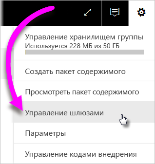
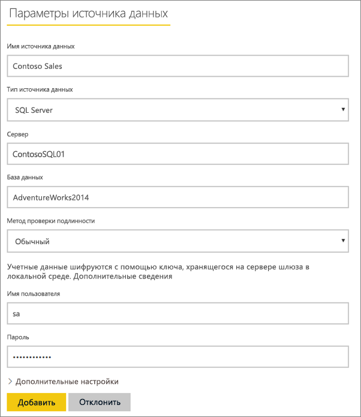
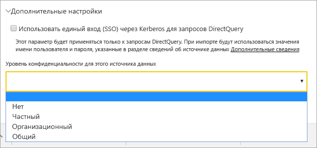
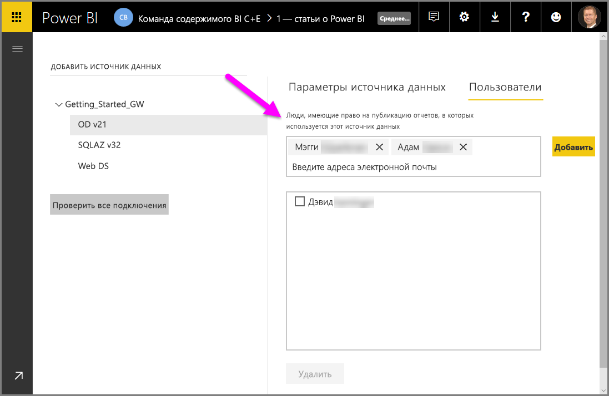
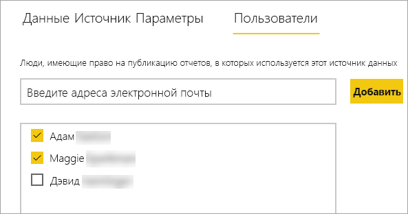
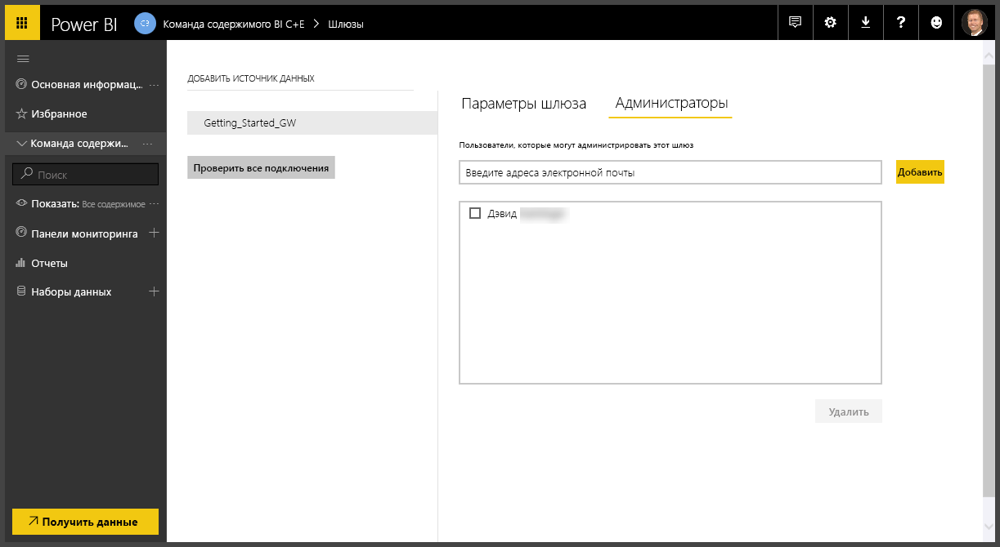
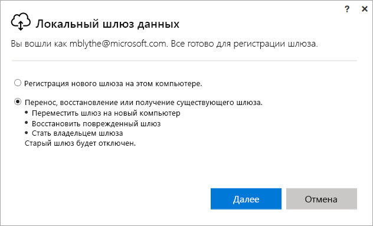
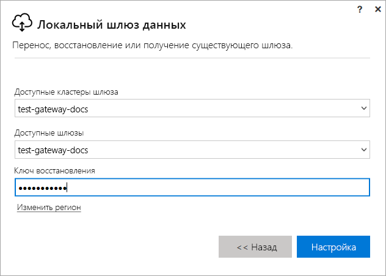

# Управление локальным шлюзом Power BI

[Установив шлюз данных Power BI](service-gateway-install.md), вы можете управлять им в соответствии со своими требованиями. Из этой статьи вы узнаете, как добавлять и удалять источники данных и учетные записи пользователей, перезапускать шлюз, а также переносить его, восстанавливать, принимать и удалять.

Вы можете управлять шлюзом с помощью области **Управление шлюзами** в службе Power BI, приложения шлюза на локальном компьютере и скриптов PowerShell. В этой статье описывается только служба Power BI.

Если вы только что установили шлюз, мы рекомендуем [добавить источник данных](#add-a-data-source) и [пользователей](#add-users-to-a-data-source) для доступа к источнику данных.

## Управление источниками данных

Power BI поддерживают многие локальные источники, для каждого из которых существуют свои собственные требования. Шлюз можно использовать для одного или нескольких источников данных. В этом примере мы покажем добавление источника данных на примере SQL Server, но процесс для других источников данных будет в целом таким же.

> [!NOTE]
> Администраторы шлюзов теперь могут создавать несколько источников данных, подключенных к одному источнику, каждый из которых использует свои учетные данные, и добавлять пользователей к каждому из этих источников данных на основе их уровней доступа.

### Добавление источника данных

1. В службе Power BI в правом верхнем углу экрана щелкните значок шестеренки  > **Управление шлюзами**.

    

1. Выберите шлюз, затем щелкните **Добавить источник данных**, или перейдите к разделу "Шлюзы" > **Добавить источник данных**.

    

1. Выберите **тип источника данных**.

    

1. Введите сведения об источнике данных. В нашем примере это имена **сервера**, **базы данных** и другие сведения.  

    

1. Для SQL Server в параметре **Метод проверки подлинности** следует выбрать значение **Windows** или **Базовый** (аутентификация SQL).  Если вы выбрали вариант **Базовый**, введите учетные данные для доступа к источнику данных.

1. Если этот источник данных в настоящее время недоступен или медленно работает, выберите **Пропустить проверку подключения**. В противном случае может произойти сбой создания источника данных.

    > [!NOTE]
    > Пропуск проверки соединения не поддерживается для служб Analysis Services.

1. В разделе **Дополнительные параметры** настройте необязательный параметр [Уровень конфиденциальности](https://support.office.com/article/Privacy-levels-Power-Query-CC3EDE4D-359E-4B28-BC72-9BEE7900B540) для источника данных (не применяется к [DirectQuery](desktop-directquery-about.md)).

    

1. Нажмите кнопку **Добавить**. При успешном завершении процесса вы увидите сообщение *Соединение установлено успешно*.

    

Теперь этот источник данных можно использовать для применения данных из SQL Server в панелях мониторинга и отчетах Power BI.

### Удаление источника данных

Источник данных можно удалить, если он больше не используется. Но не забудьте, что при удалении источника данных отключаются все панели мониторинга и отчеты, в которых он используется.

Чтобы удалить источник данных, перейдите к нему и выберите команду **Удалить**.

## Управление пользователями и администраторами

После добавления источника данных к шлюзу вам нужно предоставить пользователям и группам безопасности с поддержкой почты доступ к этом источнику данных (а не ко всему шлюзу). Список пользователей для источника данных определяет, кто может публиковать отчеты, содержащие данные из этого источника данных. Владельцы отчетов могут создавать панели мониторинга, пакеты содержимого и приложения, а также предоставлять доступ к ним другим пользователям.

Также вы можете предоставить пользователям и группам безопасности административный доступ к шлюзу.

### Добавление пользователей к источнику данных

1. В службе Power BI в правом верхнем углу экрана щелкните значок шестеренки  > **Управление шлюзами**.

2. Выберите источник данных, к которому вы хотите добавить пользователей.

3. Выберите **Пользователи** и введите имя пользователя из вашей организации, которому нужно предоставить доступ к выбранному источнику данных. На следующем экране я добавляю пользователей Maggie и Adam.

    

4. Выберите **Добавить**, и добавленные участники отобразятся в списке.

    

Вот, собственно, и все. Помните, что необходимо добавить пользователей для каждого источника данных, к которому вы хотите предоставить доступ. Каждый источник данных имеет отдельный список пользователей, и необходимо добавлять пользователей к каждому источнику данных отдельно.

### Удаление пользователей из источника данных

На вкладке **Пользователи** для источника данных можно удалять пользователей или группы безопасности с поддержкой почты, которые могут с ним работать.

### Добавление и удаление администраторов

На вкладке **Администраторы** для шлюза можно добавлять и удалять пользователей (или группы безопасности с поддержкой почты), которые могут администрировать шлюз.

## Управление кластером шлюза

Когда вы создадите кластер с двумя или несколькими шлюзами, все операции управления шлюзом, например добавление источника данных или предоставление разрешений администратора для шлюза, применяются ко всем шлюзам, находящимся в кластере. 

Когда администраторы выбирают пункт меню **Управление шлюзами**, расположенный под значком шестеренки в **службе Power BI**, они видят список зарегистрированных кластеров или отдельные шлюзы, но не видят отдельные экземпляры шлюзов, которые являются элементами кластера.

Все новые запросы **запланированного обновления** и операции DirectQuery автоматически перенаправляются на основной экземпляр определенного кластера шлюза. Если экземпляр основного шлюза не подключен к сети, запрос перенаправляется к другому экземпляру шлюза в кластере.

## Предоставление общего доступа к шлюзу

По сути, нельзя *предоставить общий доступ* к шлюзу, но вы можете добавить администраторов шлюза, а также пользователей к источникам данных шлюза. 

После установки шлюза вы по умолчанию становитесь его администратором. Как упоминалось ранее, вы можете добавить других пользователей в качестве администраторов. Эти администраторы могут добавлять источники данных, настраивать и удалить шлюз.

Также можно назначать пользователей для источников данных, создаваемых в каждом шлюзе. Таким образом, пользователи могут применять эти источники данных для обновления отчетов Power BI. Но они не могут изменить источники данных или параметры шлюза.

## Миграция, восстановление и перенос шлюза

Запустите программу установки шлюза на компьютере, на котором выполняется миграция, восстановление или перенос шлюза.

1. Скачайте и установите шлюз.

2. Войдя в учетную запись Power BI, зарегистрируйте шлюз. Выберите **Миграция, восстановление и перенос существующего шлюза** > **Далее**.

    

3. Выберите нужный элемент из списка доступных кластеров и шлюзов, затем введите ключ восстановления для выбранного шлюза. Выберите **Настройка**.

    

## Перезапуск шлюза

Шлюз работает как служба Windows. Как и для любой службы Windows, существует несколько способов запустить и остановить шлюз. Вот как это можно сделать из командной строки.

1. На компьютере, где работает шлюз, откройте командную строку с правами администратора.

2. Введите `net stop PBIEgwService`, чтобы остановить службу.

3. Введите `net start PBIEgwService`, чтобы перезапустить службу.

## Удаление шлюза

Шлюз можно удалить, если он больше не используется. Но не забывайте, что удаление шлюза приводит к удалению всех размещенных в нем источников данных. Это, в свою очередь, приводит к неработоспособности всех панелей мониторинга и отчетов, в которых используются эти источники.

1. В службе Power BI в правом верхнем углу экрана щелкните значок шестеренки  > **Управление шлюзами**.

2. Выберите шлюз, а затем щелкните **Удалить**
   
   

## Дальнейшие действия

[Руководство по развертыванию шлюза данных](service-gateway-deployment-guidance.md)

Появились дополнительные вопросы? [Ответы на них см. в сообществе Power BI.](http://community.powerbi.com/)
