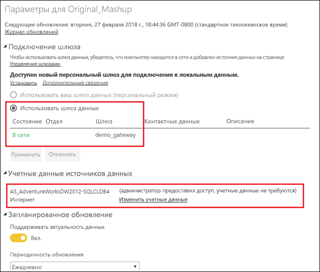

# Объединение и добавление локальных и облачных источников данных

Локальный шлюз данных позволяет объединять или добавлять локальные и облачные источники данных в одном запросе. Это полезно, если нужно комбинировать данные из нескольких источников, не используя отдельные запросы.

## Предварительные требования

- [Шлюз, установленный](service-gateway-install.md) на локальном компьютере.
- Файл Power BI Desktop с запросами, в которых сочетаются локальные и облачные источники данных.

1. В службе Power BI в правом верхнем углу экрана щелкните значок шестеренки  > **Управление шлюзами**.

    

2. Выберите шлюз, который нужно настроить.

3. В разделе **Параметры кластера шлюза** выберите **Разрешите облачные источники данных пользователя, чтобы обновлять их через этот кластер шлюза** > **Применить**.

    

4. В кластере шлюза добавьте [локальные источники данных](service-gateway-enterprise-manage-scheduled-refresh.md#add-a-data-source), используемые в запросах. Добавлять здесь облачные источники данных не требуется.

4. Отправьте в службу Power BI файл Power BI Desktop с запросами, в которых сочетаются локальные и облачные источники данных.

5. На странице **Настройки набора данных** для нового набора данных выполните указанные ниже действия.

    - Для локального источника выберите шлюз, связанный с этим источником данных.

    - В разделе **Учетные данные источника данных** при необходимости измените учетные данные облачного источника данных.

    

6. Задав учетные данные облачного источника, можно обновить набор данных с помощью команды **Обновить** или запланировать периодическое обновление.

## Дальнейшие действия

Дополнительные сведения об обновлении данных для шлюзов см. в статье [Использование источника данных для запланированного обновления](service-gateway-enterprise-manage-scheduled-refresh.md#using-the-data-source-for-scheduled-refresh).