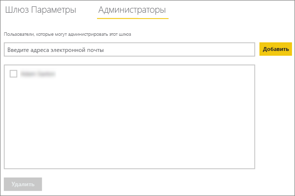
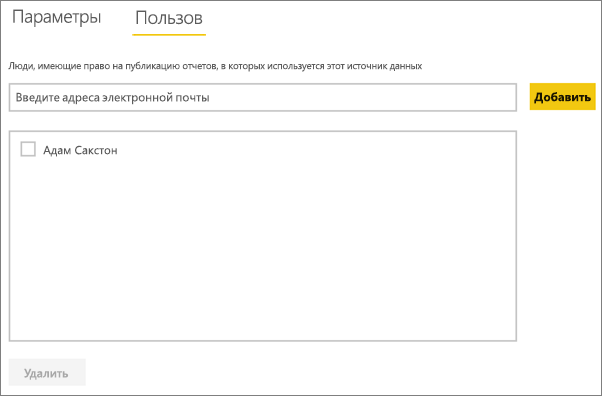

# <a name="manage-your-data-source---oracle"></a>Управление своим источником данных — Oracle
После установки локального шлюза данных необходимо добавить источники, которые можно будет с ним использовать. В этой статье будут рассмотрены способы работы со шлюзами и источниками данных. Источник данных Oracle можно использовать как для запланированного обновления, так и в режиме DirectQuery.

## <a name="download-and-install-the-gateway"></a>Загрузка и установка шлюза
Вы можете скачать шлюз в службе Power BI. Выберите **Загрузки** > **Шлюз данных** или перейдите на [страницу скачивания шлюза](https://go.microsoft.com/fwlink/?LinkId=698861).


> [!WARNING]
> Чтобы установить подключение между шлюзом и сервером Oracle, установите и настройте поставщик данных Oracle для .NET (ODP.NET). Это — часть Oracle Data Access Components (ODAC). Дополнительные сведения о скачивании поставщика Oracle см. в разделе [Установка клиента Oracle](#installing-the-oracle-client) ниже.
> 
> 

## <a name="installing-the-oracle-client"></a>Установка клиента Oracle
Для **32-разрядной** версии Power BI Desktop используйте следующую ссылку, чтобы скачать и установить **32-разрядный** клиент Oracle:

* [32-разрядная версия Oracle Data Access Components (ODAC) с Oracle Developer Tools для Visual Studio (12.1.0.2.4)](http://www.oracle.com/technetwork/topics/dotnet/utilsoft-086879.html)

Если вы используете **64-разрядную** версию Power BI Desktop или локальный шлюз данных, перейдите по следующей ссылке, чтобы скачать и установить **64-разрядный** клиент Oracle:

* [64-разрядная версия ODAC 12.2c, выпуск 1 (12.2.0.1.0) для 64-разрядных версий Windows](http://www.oracle.com/technetwork/database/windows/downloads/index-090165.html)

После его установки укажите в файле tnsnames.ora нужную информацию для своей базы данных. При настройке подключения для Power BI Desktop и шлюза используется имя net_service_name, которое задано в файле tnsnames.ora. Если это имя не указано, вы не сможете подключиться. По умолчанию используется такой путь к файлу tnsnames.ora: `[Oracle Home Directory]\Network\Admin\tnsnames.ora`. Дополнительные сведения о том, как настраивать файлы tnsnames.ora, см. в статье [Local Naming Parameters (tnsnames.ora)](https://docs.oracle.com/cd/B28359_01/network.111/b28317/tnsnames.htm) (Локальные параметры именования (tnsnames.ora)).

### <a name="example-tnsnamesora-file-entry"></a>Пример записи в файле tnsnames.ora
Ниже приведен основной формат записи в файле tnsname.ora.

```
net_service_name=
 (DESCRIPTION=
   (ADDRESS=(protocol_address_information))
   (CONNECT_DATA=
     (SERVICE_NAME=service_name)))
```

Ниже приведен пример с введенными данными о порте и сервере.

```
CONTOSO =
  (DESCRIPTION =
    (ADDRESS = (PROTOCOL = TCP)(HOST = oracleserver.contoso.com)(PORT = 1521))
    (CONNECT_DATA =
      (SERVER = DEDICATED)
      (SERVICE_NAME = CONTOSO)
    )
  )
```

## <a name="add-a-gateway"></a>Добавление шлюза
Чтобы добавить шлюз, просто [скачайте](https://go.microsoft.com/fwlink/?LinkId=698861) и установите его на сервере в своей среде. Установленный шлюз появится в списках шлюзов в разделе **Управление шлюзами**.

> [!NOTE]
> Параметр **Управление шлюзами** виден только пользователям, которые являются администраторами хотя бы одного шлюза. Для работы с этим параметром нужно, чтобы вас добавили в качестве администратора либо чтобы вы сами установили и настроили шлюз.
> 
> 

## <a name="remove-a-gateway"></a>Удаление шлюза
Удаление шлюза приведет к удалению всех связанных с ним источников данных,  а также отключению панелей мониторинга и отчетов, в которых используются эти источники.

1. Щелкните значок шестеренки  в правом верхнем углу экрана и выберите **Управление шлюзами**.
2. Шлюз > **Удалить**
   
   

## <a name="add-a-data-source"></a>Добавление источника данных
Чтобы добавить источник данных, выберите шлюз и щелкните **Добавить источник данных** или откройте меню "Шлюз" и выберите пункт **Добавить источник данных**.


После этого вы сможете выбрать **тип источника данных** в списке.


После этого заполните сведения об источнике данных, включая **сервер** и **базу данных**.  

Кроме того нужно выбрать **метод проверки подлинности**.  Можно выбрать параметр **Windows** или **Базовый**.  Если планируется использовать учетную запись, созданную в Oracle, а не с помощью проверки подлинности Windows, выберите вариант **Базовый**. Затем введите учетные данные, которые будут использоваться для этого источника данных.

> [!NOTE]
> Все запросы к источнику данных будут выполняться с использованием этих учетных данных. См. дополнительные сведения о локальных шлюзах данных и хранении [учетных данных](service-gateway-onprem.md#credentials).
> 
> 


Заполнив все данные, нажмите кнопку **Добавить** .  Теперь этот источник данных можно использовать для запланированного обновления или для DirectQuery на сервере Oracle, расположенном на локальном компьютере. В случае успеха появится сообщение *Подключение установлено* .


### <a name="advanced-settings"></a>Дополнительные настройки
Для источника данных можно настроить уровень конфиденциальности. Определяет, каким образом можно объединять данные. Используется только для запланированного обновления. Не применяется к DirectQuery. [Дополнительные сведения](https://support.office.com/article/Privacy-levels-Power-Query-CC3EDE4D-359E-4B28-BC72-9BEE7900B540)


## <a name="remove-a-data-source"></a>Удаление источника данных
При удалении источника данных отключаются все панели мониторинга и отчеты, в которых он используется.  

Чтобы удалить источник данных, выберите в меню "Источник данных" команду **Удалить**.


## <a name="manage-administrators"></a>Управление администраторами
На вкладке "Администраторы" для шлюза можно добавлять и удалять пользователей (или группы безопасности), которые могут его администрировать.



## <a name="manage-users"></a>Управление пользователями
На вкладке "Пользователи" для источника данных можно добавлять и удалять пользователей или группы безопасности, которые могут с ним работать.

> [!NOTE]
> Список пользователей определяет только права на публикацию отчетов. Владельцы отчетов могут создавать панели мониторинга или пакеты содержимого и предоставлять доступ к ним другим пользователям. Пользователи, которые работают с отчетами или панелью мониторинга, необязательно должны быть включены в список пользователей.
> 
> 



## <a name="using-the-data-source"></a>Работа с источником данных
После создания источника данных он будет доступен для использования с подключениями DirectQuery или через функцию запланированного обновления.

> [!WARNING]
> Имена сервера и базы данных в Power BI Desktop и источнике данных в конфигурации локального шлюза должны совпадать.
> 
> 

Связь между набором и источником данных в пределах шлюза основана на именах сервера и базы данных. Они должны совпадать. Например, если вы указали IP-адрес в качестве имени сервера в Power BI Desktop, необходимо будет использовать IP-адрес и для источника данных в конфигурации шлюза. Кроме того, это имя должно совпадать с псевдонимом, который указан в файле tnsnames.ora. Дополнительные сведения о файле tnsnames.ora см. в разделе [Установка клиента Oracle](#installing-the-oracle-client).

Это условие справедливо и для DirectQuery, и для запланированного обновления.

### <a name="using-the-data-source-with-directquery-connections"></a>Использование источника данных с подключениями DirectQuery
Имена сервера и базы данных должны совпадать в Power BI Desktop и источнике данных для корпоративного шлюза. Кроме того, для публикации наборов данных DirectQuery ваша учетная запись должна быть указана на вкладке **Пользователи** источника данных. Выбор для DirectQuery выполняется в Power BI Desktop при импорте данных. [Дополнительные сведения](desktop-use-directquery.md)

После публикации (из Power BI Desktop или окна **Получение данных**) ваши отчеты должны начать работать. Установка подключения после создания источника данных в рамках шлюза может занять несколько минут.

### <a name="using-the-data-source-with-scheduled-refresh"></a>Использование источника данных с запланированным обновлением
Если вы указаны на вкладке **Пользователи** источника данных, настроенного в шлюзе, а имена сервера и базы данных совпадают, вы увидите шлюз в списке вариантов, доступных для использования с запланированным обновлением.


## <a name="troubleshooting"></a>Устранение неполадок
В Oracle может возникнуть несколько ошибок, если синтаксис именования содержит ошибку или неправильно настроен.

* ORA-12154: TNS: не удалось разрешить указанный идентификатор подключения.  
* ORA-12514: прослушивателю TNS неизвестна служба, запрошенная в дескрипторе подключения.  
* ORA-12541: TNS: нет прослушивателя.  
* ORA-12170: TNS: время ожидания подключения истекло.  
* ORA-12504: прослушиватель TNS не получил имя SERVICE_NAME в параметре CONNECT_DATA.  

Эти ошибки могут произойти, если клиент Oracle не установлен или неправильно настроен. Если он установлен, нужно проверить, правильно ли настроен файл tnsnames.ora и используется ли нужное имя net_service_name. Кроме того, нужно задать одно и то же имя net_service_name на компьютере, на котором выполняется Power BI Desktop, и компьютере, на котором запущен шлюз. Дополнительные сведения см. в разделе [Установка клиента Oracle](#installing-the-oracle-client).

> [!NOTE]
> Ошибка может также быть обусловлена несовместимостью между версиями сервера и клиента Oracle. Версии должны быть соответствующими.
> 
> 

См. дополнительные сведения об [устранении неполадок локального шлюза данных](service-gateway-onprem-tshoot.md).

## <a name="next-steps"></a>Дальнейшие действия
[Локальный шлюз данных](service-gateway-onprem.md)  
[Локальный шлюз данных: подробный обзор](service-gateway-onprem-indepth.md)  
[Устранение неполадок локального шлюза данных](service-gateway-onprem-tshoot.md)  
[Power BI Premium](service-premium.md)

Появились дополнительные вопросы? [Попробуйте задать вопрос в сообществе Power BI.](http://community.powerbi.com/)

