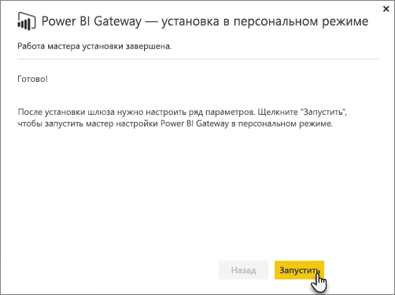
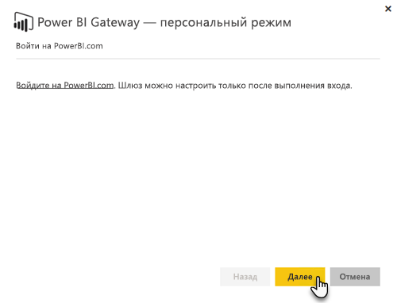
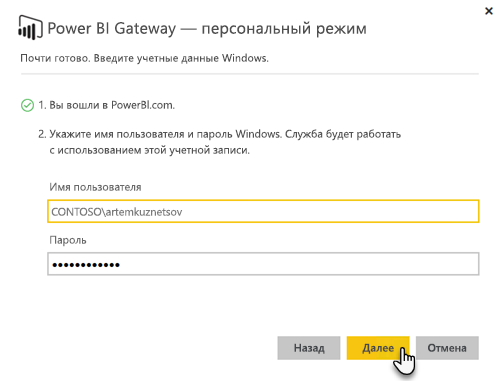

# Локальный шлюз данных
Локальный шлюз данных служит мостом, обеспечивая быструю и безопасную передачу информации между локальной системой (данными, которые не находятся в облаке) и службами Power BI, Microsoft Flow, Logic Apps и PowerApps.

Один шлюз можно использовать для работы с разными службами одновременно. Если вы используете и Power BI, и PowerApps, с помощью одного шлюза можно работать с обеими этими службами. Достаточно просто войти с нужной учетной записью.

> [!NOTE]
> Локальный шлюз данных реализует сжатие данных и шифрование при транспортировке во всех режимах.
> 
> 

<!-- Shared Requirements Include -->
[!INCLUDE [gateway-onprem-requirements-include](./includes/gateway-onprem-requirements-include.md)]

### Ограничения для динамических подключений к службам Analysis Services
С помощью динамического подключения можно работать с табличными и с многомерными экземплярами.

| **Версия сервера** | **Требуемый номер SKU** |
| --- | --- |
| 2012 SP1 CU4 или более поздняя версия |Бизнес-аналитика и SKU категории "корпоративный" |
| 2014 |Бизнес-аналитика и SKU категории "корпоративный" |
| 2016 |SKU категории "стандартный" или старшая версия |

* Функции форматирования на уровне ячеек и перевода не поддерживаются.
* Из Power BI недоступны действия и именованные наборы, но вы можете подключаться к многомерным кубам, которые их содержат, и создавать визуальные элементы и отчеты.

<!-- Shared Install steps Include -->
[!INCLUDE [gateway-onprem-datasources-include](./includes/gateway-onprem-datasources-include.md)]

## Скачивание и установка локального шлюза данных
Чтобы скачать шлюз, выберите **Шлюз данных** в меню "Загрузки". Скачайте [локальный шлюз данных](http://go.microsoft.com/fwlink/?LinkID=820925).

<!-- Shared Install steps Include -->
[!INCLUDE [gateway-onprem-install-include](./includes/gateway-onprem-install-include.md)]

## Установка шлюза в личном режиме
> [!NOTE]
> Личный шлюз работает только с Power BI.
> 
> 

После установки личного шлюза вам потребуется запустить **мастер настройки шлюза Power BI Gateway - Personal**.

Затем вам потребуется войти в Power BI, чтобы зарегистрировать шлюз в облачной службе.

Вам также понадобится указать имя пользователя и пароль Windows, с которыми будет работать служба Windows. Эти имя и пароль могут не совпадать с вашими учетными данными Windows. Служба шлюза будет запущена с помощью этой учетной записи.

После завершения установки вам потребуется открыть свои наборы данных в Power BI и указать учетные данные для своих локальных источников.

## Хранение зашифрованных учетных данных в облаке
При добавлении в шлюз источника данных необходимо указать учетные данные для доступа к этому источнику. Все запросы к источнику данных будут выполняться с использованием этих учетных данных. Учетные данные надежно шифруются с применением асимметричного шифрования и не могут быть расшифрованы в облаке перед сохранением в облако. Учетные данные отправляются на локальный компьютер со шлюзом и расшифровываются при обращении к источникам данных.

<!-- Account and Port information -->
[!INCLUDE [gateway-onprem-accounts-ports-more](./includes/gateway-onprem-accounts-ports-more.md)]

<!-- How the gateway works -->
[!INCLUDE [gateway-onprem-how-it-works-include](./includes/gateway-onprem-how-it-works-include.md)]

## Устранение неполадок
Если при установке и настройке шлюза возникают проблемы, см. статью [Устранение неполадок локального шлюза данных](service-gateway-onprem-tshoot.md). Если у вас проблемы с брандмауэром, см. раздел статьи об устранении неполадок, посвященный [брандмауэру или прокси-серверу](service-gateway-onprem-tshoot.md#firewall-or-proxy).

Если для шлюза возникли проблемы с прокси-сервером, см. статью о [настройке параметров прокси-сервера для шлюзов Power BI](service-gateway-proxy.md).

## Дальнейшие действия
[Управление своим источником данных — службы Analysis Services](service-gateway-enterprise-manage-ssas.md)  
[Управление своим источником данных — SAP HANA](service-gateway-enterprise-manage-sap.md)  
[Управление своим источником данных — SQL Server](service-gateway-enterprise-manage-sql.md)  
[Управление своим источником данных — Oracle](service-gateway-onprem-manage-oracle.md)  
[Управление источником данных — импорт или запланированное обновление](service-gateway-enterprise-manage-scheduled-refresh.md)  
[Локальный шлюз данных во всех подробностях](service-gateway-onprem-indepth.md)  
[Локальный шлюз данных (персональный режим) — новая версия личного шлюза](service-gateway-personal-mode.md);
[Настройка параметров прокси-сервера для локального шлюза данных](service-gateway-proxy.md).  
Появились дополнительные вопросы? [Ответы на них см. в сообществе Power BI.](http://community.powerbi.com/)

