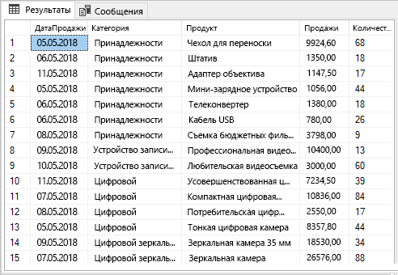
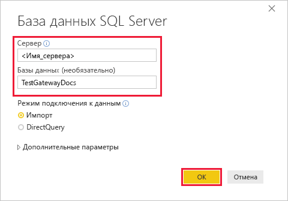
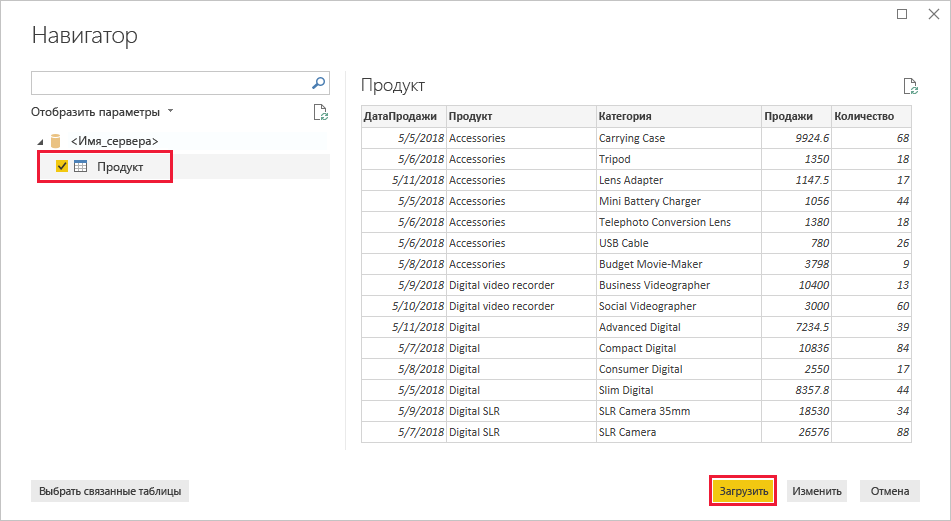
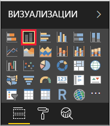
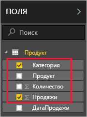
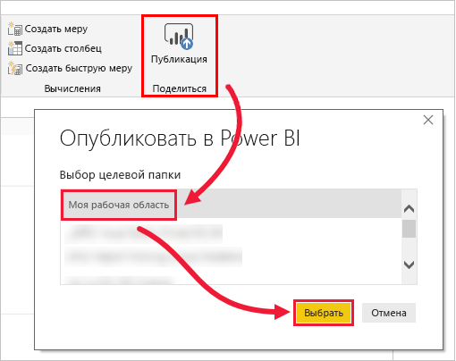
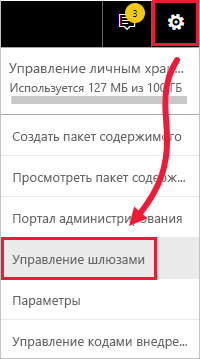
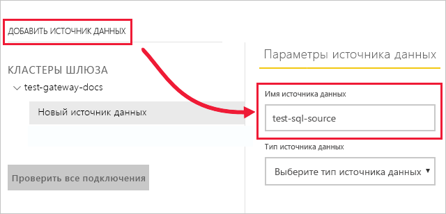

# <a name="tutorial-connect-to-on-premises-data-in-sql-server"></a>Руководство. Подключение к локальным данным в SQL Server

Локальный шлюз данных — это программное обеспечение, установленное в локальной сети, которое помогает обращаться к данным в этой сети. В этом руководстве вы создадите в Power BI Desktop отчет на основе примера данных, импортированных из SQL Server. Затем вы опубликуете этот отчет в службе Power BI и настроите шлюз, через который служба получит доступ к локальным данным. Этот доступ позволит службе обновлять данные для поддержания их актуальности.

Из этого руководства вы узнаете, как выполнять следующие задачи:
> [!div class="checklist"]
> * создание отчета на основе данных в SQL Server;
> * публикация отчета в службе Power BI;
> * добавление SQL Server в качестве источника данных шлюза;
> * обновление данных в отчете.

Если вы не зарегистрированы в Power BI, перед началом работы [пройдите бесплатную регистрацию](https://app.powerbi.com/signupredirect?pbi_source=web).


## <a name="prerequisites"></a>Предварительные требования

* [Установите Power BI Desktop](https://powerbi.microsoft.com/desktop/).
* [Установите SQL Server](https://docs.microsoft.com/sql/database-engine/install-windows/install-sql-server) на локальном компьютере. 
* [Установите локальный шлюз данных](service-gateway-install.md) на том же локальном компьютере (в рабочей среде обычно настраивается отдельный компьютер).


## <a name="set-up-sample-data"></a>Настройка примера данных

Прежде всего вам нужно добавить пример данных в SQL Server, чтобы использовать эти данные в последующих разделах руководства.

1. Из SQL Server Management Studio (SSMS) подключитесь к экземпляру SQL Server и создайте тестовую базу данных.

    ```sql
    CREATE DATABASE TestGatewayDocs
    ```

2. В этой базе данных добавьте таблицу и вставьте в нее данные.

    ```sql
    USE TestGatewayDocs

    CREATE TABLE Product (
        SalesDate DATE,
        Category  VARCHAR(100),
        Product VARCHAR(100),
        Sales MONEY,
        Quantity INT
    )

    INSERT INTO Product VALUES('2018-05-05','Accessories','Carrying Case',9924.60,68)
    INSERT INTO Product VALUES('2018-05-06','Accessories','Tripod',1350.00,18)
    INSERT INTO Product VALUES('2018-05-11','Accessories','Lens Adapter',1147.50,17)
    INSERT INTO Product VALUES('2018-05-05','Accessories','Mini Battery Charger',1056.00,44)
    INSERT INTO Product VALUES('2018-05-06','Accessories','Telephoto Conversion Lens',1380.00,18)
    INSERT INTO Product VALUES('2018-05-06','Accessories','USB Cable',780.00,26)
    INSERT INTO Product VALUES('2018-05-08','Accessories','Budget Movie-Maker',3798.00,9)
    INSERT INTO Product VALUES('2018-05-09','Digital video recorder','Business Videographer',10400.00,13)
    INSERT INTO Product VALUES('2018-05-10','Digital video recorder','Social Videographer',3000.00,60)
    INSERT INTO Product VALUES('2018-05-11','Digital','Advanced Digital',7234.50,39)
    INSERT INTO Product VALUES('2018-05-07','Digital','Compact Digital',10836.00,84)
    INSERT INTO Product VALUES('2018-05-08','Digital','Consumer Digital',2550.00,17)
    INSERT INTO Product VALUES('2018-05-05','Digital','Slim Digital',8357.80,44)
    INSERT INTO Product VALUES('2018-05-09','Digital SLR','SLR Camera 35mm',18530.00,34)
    INSERT INTO Product VALUES('2018-05-07','Digital SLR','SLR Camera',26576.00,88)
    ```

3. Выберите данные из таблицы, чтобы проверить их.

    ```sql
    SELECT * FROM Product
    ```

    


## <a name="build-and-publish-a-report"></a>Построение и публикация отчета

Теперь у вас есть пример данных для работы, и вы можете подключиться к SQL Server из Power BI Desktop и создать отчет на основе этих данных. Этот отчет вы опубликуете в службе Power BI.

1. В Power BI Desktop на вкладке **Главная** выберите **Получить данные** > **SQL Server**.

2. В разделе **Сервер** введите имя сервера, а в разделе **База данных** введите строку TestGatewayDocs. Нажмите кнопку **ОК**. 

    

3. Проверьте учетные данные и щелкните **Подключиться**.

4. В разделе **Навигатор** выберите таблицу **Product** (Продукт), а затем щелкните **Загрузить**.

    

5. В Power BI Desktop откройте представление **Отчет** и на панели **Визуализации** выберите **гистограмму с накоплением**.

        

6. Выбрав гистограмму на холсте отчета, выберите на панели **Поля** поля **Category** (Категория) и **Sales** (Продажи).  

    

    Теперь гистограмма должна выглядеть приблизительно так:

    

    Обратите внимание, что лидером продаж сейчас является товар **SLR Camera** (Зеркальная камера). Эта ситуация изменится после того, как вы измените данные и обновите отчет в следующих разделах этого руководства.

7. Сохраните отчет с именем TestGatewayDocs.pbix.

8. На вкладке **Главная** выберите **Опубликовать** > **Моя рабочая область** > **Выбрать**. Войдите в службу Power BI, если потребуется. 

    

9. На экране **успешного выполнения** выберите действие **Открыть "TestGatewayDocs.pbix" в Power BI**.


## <a name="add-sql-server-as-a-gateway-data-source"></a>Добавление SQL Server в качестве источника данных шлюза

В Power BI Desktop вы подключаетесь напрямую к SQL Server, но службе Power BI для нормальной работы необходим шлюз, выполняющий роль моста. Добавьте экземпляр SQL Server в качестве источника данных для шлюза, который вы создали в предыдущей статье (она указана в разделе [Предварительные требования](#prereqisites)). 

1. В службе Power BI в правом верхнем углу экрана щелкните значок шестеренки  > **Управление шлюзами**.

    

2. Выберите **Добавить источник данных** и введите строку test-sql-source в поле **Имя источника данных**.

    

3. Для параметра **Тип источника данных** выберите значение **SQL Server** и введите другие значения, как указано ниже.

    

    | Параметр | Значение |
    | ---    | ---   |
    | **Имя источника данных**       | test-sql-source      |
    | **Тип источника данных**       | SQL Server      |
    | **Сервер**       |  Имя экземпляра SQL Server (тот же, который вы указали в Power BI Desktop)    |
    | **База данных**       | TestGatewayDocs      |
    | **Метод аутентификации**       | Windows      |
    | **Имя пользователя**        |  Учетная запись для подключения к SQL Server, например michael@contoso.com     |
    | **Пароль**       |  Пароль для учетной записи, которая используется для подключения к SQL Server    |

4. Нажмите кнопку **Добавить**. При успешном завершении процесса вы увидите сообщение *Соединение установлено успешно*.

    

    Теперь этот источник данных можно использовать для применения данных из SQL Server в панелях мониторинга и отчетах Power BI.


## <a name="configure-and-use-data-refresh"></a>Настройка и использование обновления данных

Итак, вы подготовили отчет и опубликовали его в службе Power BI и настроили источник данных SQL Server. Теперь, когда все готово, внесите изменения в таблицу Product, чтобы проверить передачу этих изменений через шлюз в опубликованный отчет. Можно также настроить расписание обновлений для всех будущих изменений.

1. В среде SSMS обновите данные в таблице Product.

    ```sql
    UPDATE Product
    SET Sales = 32508, Quantity = 252
    WHERE Product='Compact Digital'     

    ```

2. В службе Power BI на панели навигации слева выберите **Моя рабочая область**.

3. В разделе **Наборы данных** выберите рядом с набором данных **TestGatewayDocs** меню **Дополнительно** (**...**) > **Обновить сейчас**.

    

4. Выберите **Моя рабочая область** > **Отчеты** > **TestGatewayDocs**. Убедитесь, что обновление выполнено успешно и лидером продаж теперь стал товар **Compact Digital** (Компактная цифровая камера). 

    

5. Выберите **Моя рабочая область** > **Отчеты** > **TestGatewayDocs**. Выберите **дополнительно** (**...**) > **Расписание обновлений**.

6. В разделе **Расписание обновлений** установите параметр **Включено** и щелкните **Применить**. По умолчанию набор данных обновляется ежедневно.

    

## <a name="clean-up-resources"></a>Очистка ресурсов
Если этот пример данных вам больше не нужен, выполните команду `DROP DATABASE TestGatewayDocs` в среде SSMS. Если вам больше не нужен источник данных SQL Server, [удалите источник данных](service-gateway-manage.md#remove-a-data-source). 


## <a name="next-steps"></a>Дальнейшие действия
Из этого руководства вы узнали, как выполнять такие задачи:
> [!div class="checklist"]
> * создание отчета на основе данных в SQL Server;
> * публикация отчета в службе Power BI;
> * добавление SQL Server в качестве источника данных шлюза;
> * обновление данных в отчете.

Чтобы узнать больше, перейдите к следующей статье.
> [!div class="nextstepaction"]
> [Управление шлюзом Power BI](service-gateway-manage.md)

