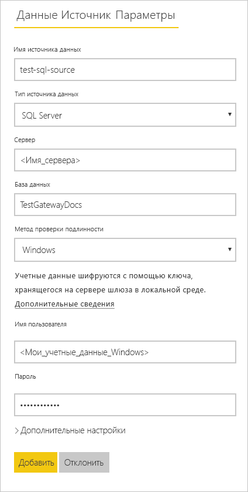
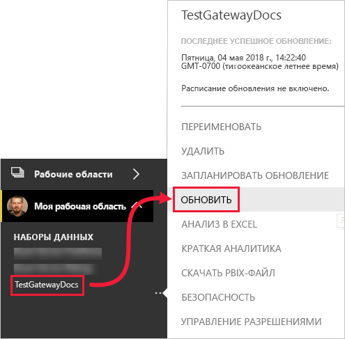

# <a name="refresh-data-from-an-on-premises-sql-server-database"></a>Обновление данных из локальной базы данных SQL Server

В этом руководстве описано обновление набора данных Power BI из реляционной базы данных, которая находится на локальном компьютере в локальной сети. В частности, в этом руководстве используется образец базы данных SQL Server, к которой Power BI обращается через локальный шлюз данных.

В этом учебнике вы выполните следующие действия:

> [!div class="checklist"]
> * Создадите и опубликуете файл Power BI Desktop (.pbix), который импортирует данные из локальной базы данных SQL Server.
> * Настроите параметры источника данных и набора данных в Power BI для подключения к SQL Server через шлюз данных.
> * Настроите расписание обновления, чтобы гарантировать, что панель мониторинга Power BI содержит обновленные данные.
> * Выполните обновление набора данных по требованию.
> * Просмотрите журнал обновления для анализа результатов прошлых циклов обновления.
> * Очистите ресурсы, удалив артефакты, созданные в этом руководстве.

## <a name="prerequisites"></a>Предварительные требования

- Если вы еще этого не сделали, зарегистрируйтесь в [бесплатной пробной версии Power BI](https://app.powerbi.com/signupredirect?pbi_source=web) перед началом работы.
- [Установите Power BI Desktop](https://powerbi.microsoft.com/desktop/) на локальном компьютере.
- [Установите SQL Server](/sql/database-engine/install-windows/install-sql-server) на локальном компьютере и восстановите [образец базы данных из резервной копии](https://github.com/Microsoft/sql-server-samples/releases/download/adventureworks/AdventureWorksDW2017.bak). Дополнительные сведения о базе данных AdventureWorks см. в разделе [Установка и настройка AdventureWorks](/sql/samples/adventureworks-install-configure).
- [Установите локальный шлюз данных](service-gateway-onprem.md) на том же локальном компьютере, где находится SQL Server (в рабочей среде обычно настраивается отдельный компьютер).

> [!NOTE]
> Если вы не являетесь администратором шлюза и не хотите устанавливать шлюз самостоятельно, обратитесь к администратору шлюза в вашей организации. Он может создать определение источника данных, необходимое для подключения набора данных к базе данных SQL Server.

## <a name="create-and-publish-a-power-bi-desktop-file"></a>Создание и публикация файла Power BI Desktop

Используйте следующую процедуру для создания простого отчета Power BI, использующего образец базы данных AdventureWorksDW. Опубликуйте отчет в службе Power BI, чтобы получить набор данных в Power BI, который затем можно настроить и обновить в последующих шагах.

1. В Power BI Desktop на вкладке **Главная** выберите **Получить данные** \> **SQL Server**.

2. В диалоговом окне **База данных SQL Server** укажите имена **сервера** и **базы данных (необязательно)** , убедитесь, что **Режим подключения к данным** задан как **Импорт**, а затем нажмите **ОК**.

    

    В этом руководстве не используются **дополнительные параметры**, но вы можете указать инструкцию SQL и настроить другие параметры, в т. ч. [включить поддержку отработки отказа SQL Server](/sql/database-engine/availability-groups/windows/failover-clustering-and-always-on-availability-groups-sql-server).

    

3. Проверьте **учетные данные** и щелкните **Подключиться**.

    > [!NOTE]
    > Если вам не удается проверить подлинность, убедитесь, что выбран правильный метод проверки и используется учетная запись с доступом к базе данных. В тестовой среде можно использовать проверку подлинности базы данных с помощью явно заданных имени пользователя и пароля. В рабочей среде обычно используется проверка подлинности Windows. См. раздел [Устранение неполадок в сценариях обновления](refresh-troubleshooting-refresh-scenarios.md); за дополнительной помощью обратитесь к администратору базы данных.

1. Если появится диалоговое окно **Поддержка шифрования**, нажмите **ОК**.

2. В диалоговом окне **Навигатор** выберите таблицу **DimProduct**, а затем выберите **Загрузить**.

    

3. В Power BI Desktop откройте представление **Отчет** и на панели **Визуализации** выберите **гистограмму с накоплением**.

    

4. Выбрав гистограмму на холсте отчета, выберите на панели **Поля** поля **EnglishProductName** (Продукт на английском) и **ListPrice** (Цена по прейскуранту).

    

5. Перетащите **EndDate** в **Фильтры уровня отчета**, а затем в разделе **Простая фильтрация** оставьте только флажок **(Пусто)** .

    

    Теперь гистограмма должна выглядеть приблизительно так:

    

    Обратите внимание, что пять продуктов **Road-250** перечислены с наивысшей ценой по прейскуранту. Эта ситуация изменится после того, как вы измените данные и обновите отчет в следующих разделах этого руководства.

6. Сохраните отчет как "AdventureWorksProducts.pbix".

7. На вкладке **Главная** выберите **Опубликовать** \> **Моя рабочая область** \> **Выбрать**. Войдите в службу Power BI, если потребуется.

8. На экране **успешного выполнения** выберите действие **Открыть "AdventureWorksProducts.pbix" в Power BI**.

    [Публикация в Power BI](./media/service-gateway-sql-tutorial/publish-to-power-bi.png)

## <a name="connect-a-dataset-to-a-sql-server-database"></a>Подключение набора данных к базе данных SQL Server

В Power BI Desktop вы подключились непосредственно к локальной базе данных SQL Server, но в службе Power BI требуется шлюз данных в качестве моста между облаком и локальной сетью. Выполните следующие действия для добавления вашей локальной базы данных SQL Server в качестве источника данных на шлюзе и подключите набор данных к этому источнику данных.

1. Войдите в Power BI. В правом верхнем углу щелкните значок шестеренки и выберите пункт **Параметры**.

    

2. На вкладке **Наборы данных** выберите набор данных **AdventureWorksProducts**, чтобы вы могли подключаться к вашей локальной базе данных SQL Server через шлюз данных.

3. Разверните **подключение шлюза** и убедитесь, что в списке есть по крайней мере один шлюз. Если у вас нет шлюза, см. в разделе [Предварительные требования](#prerequisites) ранее в этом руководстве ссылки на документацию по установке и настройке шлюза.

    

4. В разделе **Действия** разверните выключатель для просмотра источников данных и выберите ссылку **Добавить на шлюз**.

    

    > [!NOTE]
    > Если вы не являетесь администратором шлюза и не хотите устанавливать шлюз самостоятельно, обратитесь к администратору шлюза в вашей организации. Он может создать определение источника данных, необходимое для подключения набора данных к базе данных SQL Server.

5. На странице управления **Шлюзы** на вкладке **Параметры источника данных** введите и проверьте следующую информацию и нажмите **Добавить**.

    | Параметр | Значение |
    | --- | --- |
    | Имя источника данных | AdventureWorksProducts |
    | Тип источника данных | SQL Server |
    | Сервер | Имя экземпляра SQL Server, например SQLServer01 (то же, которое вы указали в Power BI Desktop). |
    | База данных | Имя базы данных SQL Server, например AdventureWorksDW (то же, которое вы указали в Power BI Desktop). |
    | Метод проверки подлинности | Windows или базовая (как правило, Windows). |
    | Имя пользователя | Учетная запись для подключения к SQL Server. |
    | Пароль | Пароль для учетной записи, которая используется для подключения к SQL Server. |

    

6. На вкладке **Наборы данных** разверните раздел **Подключение шлюза** еще раз. Выберите шлюз данных, который вы настроили; он находится в работающем **состоянии** на компьютере, на котором он установлен; выберите **Применить**.

    

## <a name="configure-a-refresh-schedule"></a>Настройка расписания обновления

Теперь, когда вы подключили набор данных в Power BI к локальной базе данных SQL Server через шлюз данных, выполните следующие действия, чтобы настроить расписание обновления. Обновление набора данных по расписанию помогает гарантировать, что отчеты и панели мониторинга содержат самые последние данные.

1. В области навигации выберите пункты **Моя рабочая область** \> **Наборы данных**. Нажмите кнопку с многоточием ( **...** ) для набора данных **AdventureWorksProducts**, затем выберите команду **Запланировать обновление**.

    > [!NOTE]
    > Обязательно выберите кнопку с многоточием для набора данных **AdventureWorksProducts**, а не кнопку с многоточием для отчета с тем же именем. Контекстное меню отчета **AdventureWorksProducts** не содержит команды **Запланировать обновление**.

2. В разделе **Запланированное обновление** в пункте **Поддерживать актуальность данных** включите обновление: **Включено**.

3. Выберите соответствующую **частоту обновления** (**Ежедневно** в этом примере) и затем в разделе **Время**выберите **Добавить другое время** для указания нужного времени обновления (06:30 и 18:30 в этом примере).

    

    > [!NOTE]
    > Можно настроить до восьми ежедневных периодов времени, если набор данных находится в общей емкости, или 48 периодов в Power BI Premium.

4. Оставьте флажок **Отправлять уведомления об ошибках обновления мне по электронной почте** установленным и нажмите **Применить**.

## <a name="perform-an-on-demand-refresh"></a>Обновление по требованию

Теперь, когда вы настроили расписание обновления, Power BI обновит набор данных в следующее запланированное время в диапазоне 15 минут. Если вы хотите обновить данные раньше, например, чтобы проверить конфигурацию шлюза и источника данных, выполните обновление по запросу с помощью параметра **Обновить сейчас** в меню набора данных в области навигации. Обновления по запросу не влияют на время следующего запланированного обновления, но они учитываются в дневном ограничении обновлений, как описано в предыдущем разделе.

Для наглядности можно смоделировать изменение образца данных, обновив таблицу DimProduct в базе данных AdventureWorksDW через SQL Server Management Studio (SSMS).

```sql

UPDATE [AdventureWorksDW].[dbo].[DimProduct]
SET ListPrice = 5000
WHERE EnglishProductName ='Road-250 Red, 58'

```

Теперь выполните следующие действия, чтобы обновленные данные могли передаваться через подключение шлюза к набору данных и в отчеты Power BI.

1. В службе Power BI в области навигации выберите и разверните раздел **Моя рабочая область**.

2. В разделе **Наборы данных** у набора данных **AdventureWorksProducts** нажмите кнопку с многоточием ( **...** ) и выберите **Обновить**.

    

    Обратите внимание: в правом верхнем углу указано, что Power BI готовится выполнить запрошенное обновление.

3. Выберите пункты **Моя рабочая область \> Отчеты \> AdventureWorksProducts**. Смотрите, как передаются обновленные данные; продукт с наивысшей ценой по прейскуранту теперь — **Road-250 Red, 58**.

    

## <a name="review-the-refresh-history"></a>Просмотрите журнал обновления

Стоит периодически проверять результаты последних циклов обновления в журнале обновления. Возможно, истек срок действия учетных данных базы данных либо выбранный шлюз может быть недоступен в момент запланированного обновления. Выполните следующие шаги, чтобы просмотреть журнал обновления и проверить наличие проблем.

1. В правом верхнем углу пользовательского интерфейса Power BI щелкните значок шестеренки и выберите пункт **Параметры**.

2. Переключитесь на **Наборы данных** и выберите набор данных, например **AdventureWorksProducts**, который необходимо исследовать.

3. Выберите ссылку **Журнал обновления**, чтобы открыть диалоговое окно **Журнал обновления**.

    

4. На вкладке **Запланированные** обратите внимание на прошлые обновления по расписанию и по запросу,время их **начала** и **окончания**, а также **состояние** — **Завершено**, указывающее, что служба Power BI успешно выполнила обновление. Для неудачных обновлений можно просмотреть сообщение об ошибке и изучить сопутствующие сведения.

    

    > [!NOTE]
    > Вкладка OneDrive относится только к наборам данных, подключенным к файлам Power BI Desktop, книгам Excel или CSV-файлам в OneDrive или SharePoint Online, как описано в разделе [Обновление данных в Power BI](refresh-data.md).

## <a name="clean-up-resources"></a>Очистка ресурсов

Если вы больше не хотите использовать образец данных, удалите базу данных в SQL Server Management Studio (SSMS). Если вам больше не нужен источник данных SQL Server, удалите источник данных со шлюза данных. Также рассмотрите возможность удаления шлюза данных, если он установлен только в рамках прохождения этого учебника. Необходимо также удалить набор данных AdventureWorksProducts и отчет AdventureWorksProducts, который был создан Power BI, когда вы отправили файл AdventureWorksProducts.pbix.

## <a name="next-steps"></a>Дальнейшие действия

В этом руководстве было продемонстрировано, как импортировать данные из локальной базы данных SQL Server в набор данных Power BI, как обновлять этот набор данных на основе расписания и по запросу, чтобы сохранять отчеты и панели мониторинга в Power BI, которые используют этот набор данных, актуальными. Теперь вы можете узнать подробнее об управлении шлюзами данных и источниками данных в Power BI. Также стоит обратить внимание на концептуальную статью про обновление данных в Power BI.

- [Управление локальным шлюзом данных](/data-integration/gateway/service-gateway-manage)
- [Управление источником данных — импорт или запланированное обновление](service-gateway-enterprise-manage-scheduled-refresh.md)
- [Обновление данных в Power BI](refresh-data.md)
