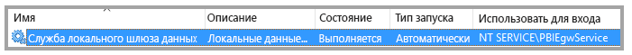
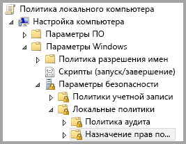
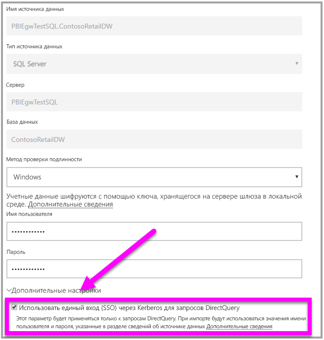

# <a name="use-resource-based-kerberos-for-single-sign-on-sso-from-power-bi-to-on-premises-data-sources"></a>Использование Kerberos (на основе ресурсов) для единого входа из Power BI в локальные источники данных

Используйте [ограниченное делегирование Kerberos на основе ресурсов](/windows-server/security/kerberos/kerberos-constrained-delegation-overview), чтобы обеспечить возможность подключения с единым входом для Windows Server версии 2012 и выше, разместив интерфейсные и серверные службы в разных доменах. Для этого домен серверной службы должен соответствовать домену интерфейсной службы.

## <a name="preparing-for-resource-based-kerberos-constrained-delegation"></a>Подготовка к ограниченному делегированию Kerberos на основе ресурсов

Чтобы ограниченное делегирование Kerberos работало правильно, необходимо настроить несколько элементов, в том числе _имена субъектов-служб_ и параметры делегирования в учетных записях служб.

### <a name="prerequisite-1-operating-system-requirements"></a>Необходимое условие 1. Системные требования

Ограниченное делегирование на основе ресурсов можно настроить в контроллере домена только под управлением Windows Server 2012 R2, Windows Server 2012 или более поздней версии.

### <a name="prerequisite-2-install-and-configure-the-on-premises-data-gateway"></a>Необходимое условие 2. Установка и настройка локального шлюза данных

Этот выпуск локального шлюза данных поддерживает обновление на месте, а также _применение параметров_ из существующих шлюзов.

### <a name="prerequisite-3-run-the-gateway-windows-service-as-a-domain-account"></a>Необходимое условие 3. Запуск службы Windows для шлюза в качестве учетной записи домена

В стандартной установке шлюз выполняет роль учетной записи службы для локального компьютера (например, _NT Service\PBIEgwService_). Пример представлен на следующем изображении:



Чтобы включить **ограниченное делегирование Kerberos, шлюз необходимо запускать как учетную запись домена, если служба Azure AD уже синхронизирована с локальным каталогом Active Directory (с помощью Azure AD DirSync или Connect). Если вам нужно переключиться на учетную запись домена, см. раздел [Переключение шлюза на учетную запись домена](service-gateway-sso-kerberos.md).

Если настроены Azure AD DirSync или Connect и учетные записи синхронизированы, службе шлюза не требуется выполнять поиск в локальной службе AD на этапе выполнения. Для службы шлюза допускается использовать локальный идентификатор безопасности (вместо учетной записи домена). Этапы настройки ограниченного делегирования Kerberos, описанные в этой статье, будут аналогичными для такой конфигурации (они просто применяются к объекту компьютера службы в Active Directory, а не учетной записи домена).

### <a name="prerequisite-4-have-domain-admin-rights-to-configure-spns-setspn-and-kerberos-constrained-delegation-settings"></a>Необходимое условие 4. Получение прав администратора домена для настройки параметров ограниченного делегирования Kerberos и имен субъектов-служб (SetSPN)

Технически администратор домена может на временной или постоянной основе разрешить любому пользователю настраивать делегирование Kerberos и имена субъектов-служб. Но это не рекомендуется делать для пользователей без прав администратора. В следующем разделе подробно описаны этапы настройки для выполнения **предварительного требования 3**.

## <a name="configuring-kerberos-constrained-delegation-for-the-gateway-and-data-source"></a>Настройка ограниченного делегирования Kerberos для шлюза и источника данных

Чтобы правильно настроить систему, необходимо настроить или проверить два следующих элемента:

1. При необходимости настройте имя субъекта-службы для учетной записи домена службы шлюза.

1. Настройте параметры делегирования для учетной записи домена в службе шлюза.

Обратите внимание, что эти шаги может выполнять только администратор домена.

В следующих разделах описаны действия по настройке.

### <a name="configure-an-spn-for-the-gateway-service-account"></a>Настройка имени субъекта-службы для учетной записи службы шлюза

Сначала определите, создано ли имя субъекта-службы для учетной записи домена, используемой в качестве учетной записи службы шлюза. Для этого выполните следующие действия:

1. Войдите как администратор домена и запустите средство **Пользователи и компьютеры Active Directory**.

1. Щелкните правой кнопкой мыши домен, выберите **Найти** и введите имя учетной записи службы шлюза.

1. В результатах поиска щелкните правой кнопкой мыши учетную запись службы шлюза и выберите **Свойства**.

1. Если в диалоговом окне **Свойства** отображается вкладка **Делегирование**, значит, имя субъекта-службы уже создано и вы можете перейти к следующему подразделу для настройки параметров делегирования.

    Если в диалоговом окне **Свойства** не отображается вкладка **Делегирование**, можно создать имя субъекта-службы для учетной записи. После этого будет добавлена вкладка **Делегирование**. Это самый простой способ настройки параметров делегирования. Имя субъекта-службы можно создать с помощью [средства setspn](https://technet.microsoft.com/library/cc731241.aspx), доступного в Windows. Для создания имени субъекта-службы требуются права администратора домена.

    Предположим, что учетная запись службы шлюза — PBIEgwTest\GatewaySvc, а компьютер, на котором работает шлюз, называется **Machine1**. Чтобы задать имя субъекта-службы для учетной записи службы шлюза для этого компьютера, выполните следующую команду:

      

    После этого можно перейти к настройке параметров делегирования.

### <a name="configure-delegation-settings"></a>Настройка параметров делегирования

Далее предполагается использование локальной среды с двумя компьютерами в разных доменах: компьютер шлюза и сервер баз данных с SQL Server. Для примера используем параметры и имена, указанные ниже.

- Имя компьютера шлюза: **PBIEgwTestGW**.
- Учетная запись службы шлюза: **PBIEgwTestFrontEnd\GatewaySvc** (отображаемое имя учетной записи: соединитель шлюза)
- Имя компьютера источника данных SQL Server: **PBIEgwTestSQL**.
- Учетная запись для службы источника данных SQL Server: **PBIEgwTestBackEnd\SQLService**

Учитывая эти примеры имен и параметров, выполните настройки, описанные ниже.

1. Используя оснастку **Active Directory — пользователи и компьютеры** (консоль управления Майкрософт (MMC)) в контроллере домена для домена **PBIEgwTestFront-end** убедитесь, что для учетной записи службы шлюза параметры делегирования не применяются.

    

1. Используя оснастку **Active Directory — пользователи и компьютеры** в контролере домена для домена **PBIEgwTestBack-end** убедитесь, что для учетной записи серверной службы параметры делегирования не применяются. Кроме того убедитесь, что атрибут msDS-AllowedToActOnBehalfOfOtherIdentity для этой учетной записи не задан. Этот атрибут можно найти в редакторе атрибутов, как показано на рисунке ниже.

    

1. Создайте группу **Active Directory — пользователи и компьютеры** в контроллере домена для домена **PBIEgwTestBack-end**. Добавьте учетную запись службы шлюза в эту группу, как показано на рисунке ниже. На рисунке показана новая группа под названием _ResourceDelGroup_ и учетная запись службы шлюза **GatewaySvc**, добавленная в эту группу.

    

1. Откройте командную строку и выполните следующие команды в контроллере домена для домена **PBIEgwTestBack-end**, чтобы обновить атрибут msDS-AllowedToActOnBehalfOfOtherIdentity учетной записи серверной службы:

    ```powershell
    $c=get-adgroupResourceDelGroup
    set-aduser **SQLService** -principalsAllowedToDelegateToAccount$c
    ```

1. Можно убедиться, что обновление отображается на вкладке редактора атрибутов в разделе свойств для учетной записи серверной службы в оснастке **Active Directory — пользователи и компьютеры.**

Теперь на компьютере со службой шлюза (**PBIEgwTestGW** в приведенном примере), назначьте учетной записи службы шлюза локальную политику "Олицетворять клиента после проверки подлинности". Это можно выполнить или проверить с помощью редактора локальных групповых политик (**gpedit**).

1. На компьютере шлюза выполните команду _gpedit.msc_.

1. Выберите элементы **Политика локального компьютера > Конфигурация компьютера > Параметры Windows > Параметры безопасности > Локальные политики > Назначение прав пользователя**, как показано на рисунке ниже:

    

1. В списке политик в разделе **Назначение прав пользователя** выберите **Олицетворять клиента после проверки подлинности**.

    

1. Щелкнув правой кнопкой мыши, откройте пункт **Свойства** для политики **Олицетворять клиента после проверки подлинности** и проверьте список учетных записей. В нем должна быть указана учетная запись службы шлюза (**PBIEgwTestFront-end** **\GatewaySvc**).

1. В списке политик в разделе **Назначение прав пользователя** выберите **Act as part of the operating system (SeTcbPrivilege)** (Работа в режиме операционной системы (SeTcbPrivilege)). Убедитесь, что учетная запись службы шлюза также входит в список учетных записей.

1. Перезапустите процесс службы **локального шлюза данных**.

## <a name="running-a-power-bi-report"></a>Запуск отчета Power BI

Выполнив все инструкции, приведенные ранее в этой статье, на странице **Управление шлюза** в Power BI можно настроить источник данных. Затем можно включить единый вход в подразделе **Дополнительные параметры**, а затем публиковать отчеты и наборы данных, которые привязаны к источнику данных



Эта конфигурация применима для большинства случаев. Но при использовании Kerberos в разных средах могут применяться разные конфигурации. Если отчет по-прежнему не загружается, обратитесь к администратору домена для дальнейшего изучения проблемы.

## <a name="next-steps"></a>Дальнейшие действия

Дополнительные сведения о **локальном шлюзе данных** и **DirectQuery** см. в следующих ресурсах:

- [Локальный шлюз данных](service-gateway-onprem.md)
- [Power BI и DirectQuery](desktop-directquery-about.md)
- [Источники данных, поддерживаемые DirectQuery](desktop-directquery-data-sources.md)
- [Использование DirectQuery и SAP Business Warehouse (BW)](desktop-directquery-sap-bw.md)
- [DirectQuery и SAP HANA](desktop-directquery-sap-hana.md)