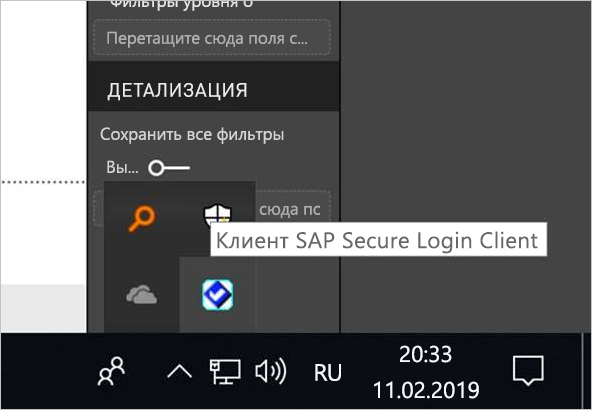
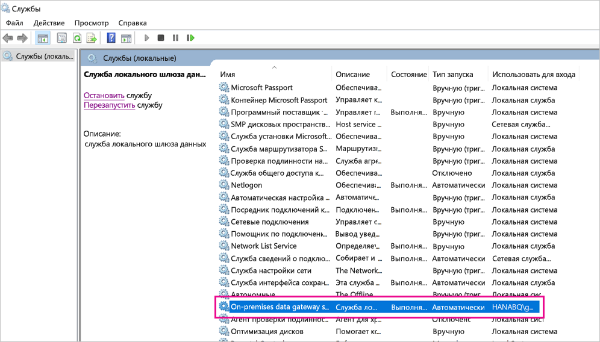
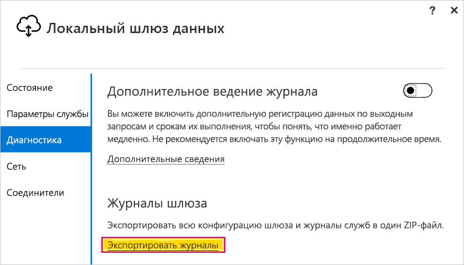

# <a name="use-kerberos-single-sign-on-for-sso-to-sap-bw-using-commoncryptolib-sapcryptodll"></a>Использование единого входа Kerberos для SAP BW с помощью CommonCryptoLib (sapcrypto.dll)

В этой статье описывается, как настроить сервер SAP BW для включения единого входа из службы Power BI с использованием библиотеки CommonCryptoLib (sapcrypto.dll).

> [!NOTE]
> Выполните действия, описанные в этой статье, в дополнение к шагам в статье [Настройка единого входа на основе Kerberos из службы Power BI в локальные источники данных](service-gateway-sso-kerberos.md), прежде чем пытаться обновить отчет на основе SAP BW, в котором используется единый вход Kerberos. Использование CommonCryptoLib в качестве библиотеки SNC позволяет устанавливать подключения с единым входом к серверам приложений и серверам сообщений SAP BW.

## <a name="configure-sap-bw-server-to-enable-sso-using-commoncryptolib"></a>Настройка сервера SAP BW для включения единого входа с использованием CommonCryptoLib

> [!NOTE]
> Локальный шлюз данных является 64-разрядным программным обеспечением, поэтому для него требуется 64-разрядная версия CommonCryptoLib (sapcrypto.dll). Если вы планируете проверить подключение с единым входом к серверу SAP BW в графическом интерфейсе SAP GUI перед попыткой осуществить подключение с единым входом через шлюз (рекомендуется), вам также потребуется 32-разрядная версия CommonCryptoLib, поскольку SAP GUI является 32-разрядным программным обеспечением.

1. Убедитесь, что сервер BW правильно настроен для единого входа Kerberos с использованием CommonCryptoLib. Если это так, вы сможете использовать единый вход для доступа к серверу BW (напрямую или через сервер сообщений SAP BW) с помощью такого средства SAP, как SAP GUI, который был настроен для использования CommonCryptoLib. Дополнительные сведения об этапах установки см. в статье [Единый вход SAP. Проверка подлинности с использованием Kerberos/SPNEGO](https://blogs.sap.com/2017/07/27/sap-single-sign-on-authenticate-with-kerberosspnego/). Ваш сервер BW должен использовать CommonCryptoLib в качестве библиотеки SNC и иметь имя SNC, начинающееся с "CN=", например "CN=BW1". Дополнительные сведения о требованиях к имени SNC см. на странице [SNC Parameters for Kerberos Configuration](https://help.sap.com/viewer/df185fd53bb645b1bd99284ee4e4a750/3.0/en-US/360534094511490d91b9589d20abb49a.html) (Параметры SNC для конфигурации Kerberos) (в частности, параметр snc/identity/as).

1. Если вы еще не сделали этого, установите 64-разрядную версию [соединителя SAP .NET](https://support.sap.com/en/product/connectors/msnet.html) на компьютере, где установлен шлюз. Чтобы проверить, установлен ли компонент, попробуйте подключиться к серверу BW в Power BI Desktop. Если вы не можете подключиться с использованием реализации 2.0, соединитель .NET не установлен.

1. Убедитесь, что на компьютере, где установлен шлюз, не запущен клиент безопасного входа SAP (Secure Login Client — SLC). Клиент SLC кэширует билеты Kerberos таким образом, который может негативно повлиять на способность шлюза использовать Kerberos для единого входа. Если клиент SLC установлен, удалите его или завершите его работу: щелкните правой кнопкой мыши значок в области уведомлений и выберите пункт "Выйти" и "Выход", прежде чем пытаться установить подключение единого входа с помощью шлюза. Клиент SLC не поддерживается для использования на компьютерах Windows Server. Для получения дополнительных сведений см. [Заметку SAP 2780475](https://launchpad.support.sap.com/#/notes/2780475) (требуются права s-user).

    

    Если вы удаляете клиент SLC или выбираете пункт **Выйти** и **Выход**, откройте окно cmd и введите `klist purge`, чтобы очистить все кэшированные билеты Kerberos, прежде чем пытаться установить подключение единого входа через шлюз.

1. Скачайте 64-разрядную библиотеку CommonCryptoLib (sapcrypto.dll) версии **8.5.25 или более поздней** с панели запуска SAP и скопируйте ее в папку на компьютере шлюза. В том же каталоге, куда вы скопировали sapcrypto.dll, создайте файл sapcrypto.ini со следующим содержимым:

    ```
    ccl/snc/enable_kerberos_in_client_role = 1
    ```

    Этот INI-файл содержит сведения о конфигурации, необходимые CommonCryptoLib для реализации единого входа в сценарии шлюза.

    > [!NOTE]
    > Эти файлы должны храниться в одном расположении. Иными словами, _/path/to/sapcrypto/_ должен содержать как sapcrypto.ini, так и sapcrypto.dll.

    Как пользователь службы шлюза, так и пользователь Active Directory (AD), которого пользователь службы будет олицетворять, должны иметь разрешения на чтение и выполнение для обоих файлов. Рекомендуется предоставить разрешения на доступ к INI- и DLL-файлам группе пользователей, прошедших проверку подлинности. В целях тестирования можно также явно предоставить эти разрешения пользователю службы шлюза и пользователю Active Directory, который будет использоваться для тестирования. На снимке экрана ниже мы предоставили группе "Пользователи, прошедшие проверку подлинности" разрешения на **чтение и выполнение** для sapcrypto.dll:&amp;

    

1. Если у вас нет источника данных SAP BW, на странице **Управление шлюзами** в службе Power BI добавьте источник данных. Если у вас уже есть источник данных BW, сопоставленный с шлюзом, через который должно проходить подключение единого входа, подготовьтесь к его изменению. Выберите **SAP Business Warehouse** в качестве **типа источника данных**, если вы хотите создать подключение с единым входом к серверу приложений BW. Выберите параметр **Сервер сообщений SAP Business Warehouse**, если вы хотите создать подключение с единым входом к серверу сообщений BW.

    В поле **Библиотека SNC** выберите значение **Переменная среды SNC\_LIB или SNC\_LIB\_64** либо **Другое**. Если выбран параметр **SNC\_LIB**, нужно задать значение переменной среды **SNC\_LIB\_64** на шлюзе, указав абсолютный путь к 64-разрядной копии sapcrypto.dll на компьютере шлюза, например C:\Users\Test\Desktop\sapcrypto.dll. Если выбрано значение **Другое**, вставьте абсолютный путь к sapcrypto.dll в поле "Путь к пользовательской библиотеке SNC", отображаемое на странице **Управление шлюзами**. Для параметра **Имя партнера SNC** введите SNC-имя сервера BW. В разделе **Дополнительные параметры** установите флажок **Использовать единый вход (SSO) через Kerberos для запросов DirectQuery**. Остальные поля должны быть заполнены так, как если бы вы устанавливали подключение с проверкой подлинности Windows из PBI Desktop.

1. Создайте системную переменную среды CCL\_PROFILE и укажите ее в файле sapcrypto.ini:

    

    Помните, что файлы sapcrypto.dll и sapcrypto.ini должны находиться в одном расположении. В приведенном выше примере, где файл sapcrypto.ini находится на рабочем столе, файл sapcrypto.dll должен находиться там же.

1. Перезапустите службу шлюза:

    

1. [Запуск отчета Power BI](service-gateway-sso-kerberos.md#run-a-power-bi-report)

## <a name="troubleshooting"></a>Устранение неполадок

Если вам не удается обновить отчет в службе Power BI, можно использовать трассировку шлюза, трассировку CPIC и трассировку CommonCryptoLib, чтобы помочь диагностировать проблему. Трассировка CPIC и CommonCryptoLib относятся к продуктам SAP, поэтому корпорация Майкрософт не может предоставить по ним прямую поддержку. Для пользователей Active Directory, которым будет предоставлен доступ к BW посредством единого входа, некоторые конфигурации Active Directory могут потребовать членство в группе администраторов на компьютере, где установлен шлюз.

1. **Журналы шлюза**. Просто воспроизведите ошибку, откройте [приложение шлюза](https://docs.microsoft.com/data-integration/gateway/service-gateway-app), перейдите на вкладку **Диагностика** и выберите **Экспорт журналов**:

    

1. **Трассировка CPIC**. Чтобы включить трассировку CPIC, задайте две переменные среды: CPIC\_TRACE и CPIC\_TRACE\_DIR. Первая задает уровень трассировки, а вторая — каталог файла трассировки. Этот каталог должен представлять собой расположение, куда могут осуществлять запись члены группы "Пользователи, прошедшие проверку подлинности". Задайте для CPIC\_TRACE значение 3, а для CPIC\_TRACE\_DIR любой каталог, куда следует записывать файлы трассировки.

    

    Воспроизведите ошибку и убедитесь, что CPIC\_TRACE\_DIR содержит файлы трассировки.

1. **Трассировка CommonCryptoLib**. Включите трассировку CommonCryptoLib, добавив две строки в созданный ранее файл sapcrypto.ini:

    ```
    ccl/trace/level=5
    ccl/trace/directory=<drive>:\logs\sectrace
    ```

    Измените параметр _ccl/trace/directory_ на расположение, куда могут осуществлять запись члены группы "Пользователи, прошедшие проверку подлинности". Можно также создать INI-файл, чтобы изменить это поведение. В том же каталоге, где находятся файлы sapcrypto.ini и sapcrypto.dll, создайте файл sectrace.ini с приведенным ниже содержимым. Замените значение DIRECTORY на расположение на компьютере, куда могут осуществлять запись члены группы "Пользователи, прошедшие проверку подлинности":

    ```
    LEVEL = 5

    DIRECTORY = <drive>:\logs\sectrace
    ```

    Теперь воспроизведите ошибку и убедитесь, что расположение, указанное в DIRECTORY, содержит файлы трассировки. По завершении не забудьте отключить трассировку CPIC и CCL.

    Для получения дополнительных сведений о трассировке CommonCryptoLib см. [Заметку SAP 2491573](https://launchpad.support.sap.com/#/notes/2491573) (требуются права s-user).

## <a name="next-steps"></a>Дальнейшие действия

Дополнительные сведения о **локальном шлюзе данных** и **DirectQuery** см. в следующих ресурсах:

* [Что такое локальный шлюз данных?](/data-integration/gateway/service-gateway-getting-started)
* [Power BI и DirectQuery](desktop-directquery-about.md)
* [Источники данных, поддерживаемые DirectQuery](desktop-directquery-data-sources.md)
* [Использование DirectQuery и SAP Business Warehouse (BW)](desktop-directquery-sap-bw.md)
* [DirectQuery и SAP HANA](desktop-directquery-sap-hana.md)
