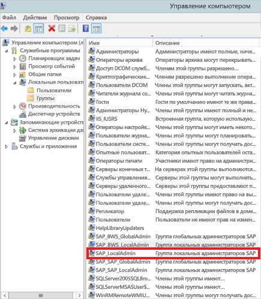

# <a name="use-kerberos-for-single-sign-on-sso-to-sap-bw-using-gx64krb5"></a>Единый вход Kerberos в SAP BW с использованием gx64krb5

В этой статье описывается, как настроить источник данных SAP BW для включения единого входа из службы Power BI с использованием gx64krb5.

> [!NOTE]
> Чтобы включить обновление отчетов на основе сервера приложений SAP BW, использующих единый вход в службе Power BI, можно выполнить действия, описанные в этой статье, в дополнение к действиям, приведенным в статье [Настройка единого входа на основе Kerberos](service-gateway-sso-kerberos.md). Тем не менее корпорация Майкрософт рекомендует использовать CommonCryptoLib в качестве библиотеки SNC вместо gx64krb5. SAP больше не поддерживает библиотеку gx64krb5, а действия по ее настройке для шлюза значительно сложнее по сравнению с CommonCryptoLib. Сведения о настройке единого входа с помощью CommonCryptoLib см. в статье [Настройка единого входа для SAP BW с использованием CommonCryptoLib](service-gateway-sso-kerberos-sap-bw-commoncryptolib.md). В качестве библиотеки SNC следует использовать CommonCryptoLib _или_ gx64krb5. Не выполняйте настройку обеих библиотек.

Это полное руководство. Если вы уже выполнили часть описываемых действий, их можно пропустить. Возможно, вы уже настроили сервер SAP BW для реализации единого входа с использованием gx64krb5.

## <a name="set-up-gx64krb5-on-the-gateway-machine-and-the-sap-bw-server"></a>Настройка gx64krb5 на компьютере шлюза и сервере SAP BW

> [!NOTE]
> Библиотека gx64krb5 больше не поддерживается в SAP. Для получения дополнительных сведений см. [Заметку SAP 352295](https://launchpad.support.sap.com/#/notes/352295). Обратите внимание, что gx64krb5 не позволяет осуществлять подключения с единым входом от шлюза данных к серверам сообщений SAP BW. Возможны только подключения к серверам приложений SAP BW. Это ограничение не действует, если в качестве библиотеки SNC используется [CommonCryptoLib](service-gateway-sso-kerberos-sap-bw-commoncryptolib.md). Другие библиотеки SNC также могут работать с единым входом для BW, но официально не поддерживаются корпорацией Майкрософт.

Для подключения с помощью единого входа через шлюз на сервере и в клиенте должна быть установлена библиотека gx64krb5. Это значит, что клиент и сервер должны использовать одну и ту же библиотеку SNC.

1. Скачайте файл gx64krb5.dll из статьи [Примечание SAP 2115486](https://launchpad.support.sap.com/) (требуется s-пользователь SAP). Убедитесь в наличии версии не ниже 1.0.11.x. Если требуется проверить подключение с помощью единого входа в графическом интерфейсе SAP GUI перед попыткой установки этого подключения через шлюз (рекомендуется), также скачайте файл gsskrb5.dll (32-разрядную версию библиотеки). Для тестирования в графическом интерфейсе SAP GUI требуется 32-разрядная версия, так как этот интерфейс доступен только в 32-разрядной версии.

1. Поместите файл gx64krb5.dll в таком месте на компьютере шлюза, которое доступно пользователю службы шлюза. Если вы хотите протестировать подключение для единого входа с использованием SAP GUI, также необходимо поместить копию файла gsskrb5.dll на компьютер и задать путь к нему в переменной среды **SNC_LIB**. Как пользователь службы шлюза, так и пользователь Active Directory (AD), которого пользователь службы будет олицетворять, должны иметь разрешения на чтение и выполнение для копии библиотеки gx64krb5.dll. Рекомендуется предоставить разрешения на доступ к DLL-файлу группе пользователей, прошедших проверку подлинности. В целях тестирования можно также явно предоставить эти разрешения пользователю службы шлюза и пользователю Active Directory, который будет использоваться для тестирования.

1. Если на сервере BW еще не настроен единый вход с помощью gx64krb5.dll, перенесите на компьютер сервера SAP BW еще одну копию DLL-файла в расположение, доступное для сервера SAP BW. 

    Дополнительные сведения о настройке gx64krb5.dll для работы с сервером SAP BW см. в [документации SAP](https://launchpad.support.sap.com/#/notes/2115486) (необходимы права s-user SAP).

1. На клиентских и серверных компьютерах задайте переменные среды **SNC_LIB** и **SNC_LIB_64**. 
    - При использовании библиотеки gsskrb5.dll укажите в переменной **SNC_LIB** абсолютный путь к ней. 
    - При использовании библиотеки gx64krb5.dll укажите в переменной **SNC_LIB_64** абсолютный путь к ней.

## <a name="configure-an-sap-bw-service-user-and-enable-snc-communication-on-the-bw-server"></a>Настройка пользователя службы SAP BW и включение обмена данными SNC на сервере BW

Выполните инструкции, приведенные в этом разделе, если вы еще не настроили сервер SAP BW для обмена данными SNC (например, единый вход) с помощью gx64krb5.

> [!NOTE]
> В этом разделе предполагается, что вы уже создали пользователя службы для BW и связали с ним подходящее имя субъекта-службы (то есть имя, начинающееся с *SAP/* ).

1. Предоставьте пользователю службы доступ к серверу приложений SAP BW:

    1. На сервере SAP BW добавьте пользователя службы в группу локальных администраторов. Откройте программу **Управление компьютером** и определите группу локальных администраторов своего сервера. 

        

    1. Дважды щелкните группу локальных администраторов, а затем выберите команду **Добавить**, чтобы добавить пользователя службы в группу. 

    1. Выберите **Проверить имена**, чтобы убедиться в том, что вы правильно ввели имя, а затем нажмите кнопку **ОК**.

1. Задайте пользователя службы сервера SAP BW в качестве пользователя, который запускает службу сервера SAP BW на серверном компьютере SAP BW.

    1. Откройте окно **Выполнить** и введите **Services.msc**. 

    1. Найдите службу, соответствующую экземпляру сервера приложений SAP BW, щелкните ее правой кнопкой мыши и выберите пункт **Свойства**.

        

    1. Перейдите на вкладку **Вход** и измените пользователя на пользователя службы SAP BW. 

    1. Введите пароль пользователя и нажмите кнопку **ОК**.

1. Войдите на сервер через SAP Logon и задайте следующие параметры профиля с помощью транзакции RZ10:

    1. Задайте для параметра профиля **snc/identity/as** значение *p:&lt;имя созданного пользователя службы SAP BW&gt;* . Пример: *p:BWServiceUser\@MYDOMAIN.COM*. Обратите внимание на элемент *p:* перед именем субъекта-пользователя. Здесь не используется префикс *p:CN=* , как при использовании CommonCryptoLib в качестве библиотеки SNC.

    1. Присвойте параметру профиля **snc/gssapi\_lib** *&lt;путь к файлу gx64krb5.dll на сервере BW&gt;* . Поместите библиотеку в расположение, доступное серверу приложений SAP BW.

    1. Задайте указанные ниже дополнительные параметры профиля, изменив значения по необходимости. Последние пять параметров позволяют клиентам подключиться к серверу SAP BW через SAP Logon без необходимости настройки SNC.

        | **Параметр** | **Значение** |
        | --- | --- |
        | snc/data\_protection/max | 3 |
        | snc/data\_protection/min | 1 |
        | snc/data\_protection/use | 9 |
        | snc/accept\_insecure\_cpic | 1 |
        | snc/accept\_insecure\_gui | 1 |
        | snc/accept\_insecure\_r3int\_rfc | 1 |
        | snc/accept\_insecure\_rfc | 1 |
        | snc/permit\_insecure\_start | 1 |

    1. Присвойте свойству **snc/enable** значение 1.

1. Задав эти параметры профиля, откройте консоль управления SAP на сервере и перезапустите экземпляр SAP BW. 

   Если сервер не запускается, убедитесь, что параметры профиля заданы правильно. Дополнительные сведения о настройке параметров профиля см. в [документации по SAP](https://help.sap.com/saphelp_nw70ehp1/helpdata/en/e6/56f466e99a11d1a5b00000e835363f/frameset.htm). Кроме того, можно обратиться к разделу [Устранение неполадок](#troubleshooting) далее в этой статье.

## <a name="map-an-sap-bw-user-to-an-active-directory-user"></a>Сопоставление пользователя SAP BW с пользователем Active Directory

Сопоставьте пользователя Active Directory с пользователем сервера приложений SAP BW и проверьте подключение единого входа в SAP Logon, если вы этого еще не сделали.

1. Войдите на сервер SAP BW с помощью SAP Logon. Выполните транзакцию SU01.

1. В поле **Пользователь** введите имя пользователя SAP BW, для которого нужно включить единый вход. Щелкните значок **Изменить** (в виде пера) в левом верхнем углу окна входа в систему SAP.

    

1. Выберите вкладку **SNC**. В поле ввода имени SNC введите *p:&lt;ваше имя пользователя Active Directory&gt;@&lt;домен&gt;* . Для имени SNC перед именем субъекта-пользователя Active Directory должны быть символы *p:* . Обратите внимание, что в имени субъекта-пользователя учитывается регистр.

   Указанная вами учетная запись пользователя Active Directory должна принадлежать лицу или организации, которым вы хотите включить единый вход для доступа к серверу приложений SAP BW. Например, чтобы включить единый вход для пользователя testuser\@TESTDOMAIN.COM, введите *p:testuser\@TESTDOMAIN.COM*.

    

1. Щелкните значок **Сохранить** (в виде гибкого диска) в левом верхнем углу экрана.

## <a name="test-sign-in-via-sso"></a>Тестирование единого входа

Убедитесь в том, что можете войти на сервер через SAP Logon с помощью единого входа от имени пользователя Active Directory, для которого включили доступ с единым входом.

1. Войдите в систему на компьютере в вашем домене, где установлен SAP Logon, от имени пользователя Active Directory, для которого вы только что включили доступ с единым входом. Запустите SAP Logon и создайте подключение.

1. Скопируйте ранее скачанный файл gsskrb5.dll на компьютер, в систему которого вы вошли. Присвойте переменной среды **SNC_LIB** абсолютный путь к расположению этого файла.

1. Запустите SAP Logon и создайте подключение.

1. На экране **Создание системной записи** выберите **Указанная пользователем система** и нажмите кнопку **Далее**.

    

1. Введите соответствующие сведения на следующем экране, включая сервер приложений, номер экземпляра и идентификатор системы. Нажмите кнопку **Готово**.

1. Щелкните правой кнопкой мыши новое подключение, выберите пункт **Свойства** и перейдите на вкладку **Сеть**. 

1. В поле **Имя SNC** введите *p:&lt;имя субъекта-пользователя службы SAP BW&gt;* . Пример: *p:BWServiceUser\@MYDOMAIN.COM*. Выберите **ОК**.

    

1. Дважды щелкните только что созданное подключение, чтобы выполнить единый вход на сервер SAP BW. 

   Если подключение будет установлено успешно, переходите к следующему разделу. В противном случае просмотрите шаги ранее в этом документе, чтобы убедиться в том, что они были завершены правильно, или обратитесь к разделу [Устранение неполадок](#troubleshooting). Если не удается подключиться к серверу SAP BW с помощью единого входа в этом контексте, вы не сможете подключиться к серверу SAP BW с помощью единого входа в контексте шлюза.

## <a name="add-registry-entries-to-the-gateway-machine"></a>Добавление записей реестра на компьютере шлюза

Добавьте необходимые записи в реестр компьютера, на котором установлен шлюз, а также в реестры компьютеров, к которым будет устанавливаться подключение из Power BI Desktop. Чтобы добавить эти записи реестра, выполните следующие команды:

- ```REG ADD HKLM\SOFTWARE\Wow6432Node\SAP\gsskrb5 /v ForceIniCredOK /t REG_DWORD /d 1 /f```

- ```REG ADD HKLM\SOFTWARE\SAP\gsskrb5 /v ForceIniCredOK /t REG_DWORD /d 1 /f```

## <a name="add-a-new-sap-bw-application-server-data-source-to-the-power-bi-service-or-edit-an-existing-one"></a>Добавление нового источника данных сервера приложений SAP BW в службу Power BI или изменение имеющегося

1. В окне настройки источника данных введите **Имя узла** сервера приложений SAP BW, **Номер системы** и **Идентификатор клиента**, как и в случае входа на сервер SAP BW из Power BI Desktop.

1. В поле **Имя партнера SNC** введите *p:&lt;имя субъекта-службы, которое вы сопоставили с пользователем службы SAP BW&gt;* . Например, для имени субъекта-службы SAP/BWServiceUser\@MYDOMAIN.COM введите *p:SAP/BWServiceUser\@MYDOMAIN.COM* в поле **Имя партнера SNC**.

1. В качестве библиотеки SNC выберите **SNC\_LIB** или **SNC\_LIB\_64**. Убедитесь, что **SNC\_LIB\_64** на компьютере шлюза указывает на gx64krb5.dll. Кроме того, можно выбрать параметр **Пользовательский** и указать абсолютный путь к файлу gx64krb5.dll на компьютере шлюза.

1. Установите флажок **Использовать единый вход (SSO) через Kerberos для запросов DirectQuery** и нажмите кнопку **Применить**. Если проверка подключения не была успешной, убедитесь, что предыдущие шаги установки и настройки были выполнены правильно.

1. [Запуск отчета Power BI](service-gateway-sso-kerberos.md#run-a-power-bi-report)

## <a name="troubleshooting"></a>Устранение неполадок

### <a name="troubleshoot-gx64krb5-configuration"></a>Устранение неполадок конфигурации gx64krb5

Если возникнут описанные ниже проблемы, выполните приведенные инструкции для устранения неполадок, связанных с установкой gx64krb5 и подключениями единого входа.

* При выполнении инструкций по установке gx64krb5 происходят ошибки. Например, сервер SAP BW не запускается после изменения параметров профиля. Чтобы устранить такие ошибки, просмотрите журналы сервера (…work\dev\_w0 на компьютере сервера). 

* Не удается запустить службу SAP BW из-за ошибки входа. Возможно, вы указали неправильный пароль при вводе имени пользователя *запуска от имени* для SAP BW. Проверьте пароль, войдя на компьютер в среде Active Directory в качестве пользователя службы SAP BW.

* Если появляются сообщения о том, что учетные данные базового источника данных (например, SQL Server) не позволяют запустить сервер, убедитесь в том, что вы предоставили пользователю службы доступ к базе данных SAP BW.

* Появляется следующее сообщение: *(GSS-API) указано неизвестное расположение или оно недоступно*. Обычна эта ошибка означает, что у вас указано неверное имя SNC. Используйте перед именем субъекта-пользователя службы в клиентском приложении только *p:* , а не *p:CN=* .

* Появляется следующее сообщение: *(GSS-API) указано недопустимое имя*. Убедитесь в том, что символы *p:* присутствуют в начале параметра профиля удостоверения SNC на сервере.

* Появляется следующее сообщение: *(Ошибка SNC) не найден указанный модуль*. Обычно эта ошибка происходит, если поместить gx64krb5.dll в расположение, для доступа к которому требуются повышенные привилегии (права администратора).

### <a name="troubleshoot-gateway-connectivity-issues"></a>Устранение проблем с подключением шлюза

1. Проверьте журналы шлюза. Откройте приложение настройки шлюза и выберите **Диагностика**, а затем **Экспортировать журналы**. Самые последние ошибки указаны в конце файлов журнала.

    

1. Включите трассировку SAP BW и просмотрите созданные файлы журналов. Существует несколько различных типов трассировки SAP BW (например, трассировка CPIC).

   а. Чтобы включить трассировку CPIC, задайте две переменные среды: **CPIC\_TRACE** and **CPIC\_TRACE\_DIR**.

      Первая задает уровень трассировки, а вторая — каталог файла трассировки. Этот каталог должен представлять собой расположение, куда могут осуществлять запись члены группы "Пользователи, прошедшие проверку подлинности". 
 
    б. Задайте для **CPIC\_TRACE** значение *3*, а для **CPIC\_TRACE\_DIR** любой каталог, куда следует записывать файлы трассировки. Например:

      

    в. Воспроизведите ошибку и убедитесь в том, что **CPIC\_TRACE\_DIR** содержит файлы трассировки. 
    
    г. Изучите содержимое файлов трассировки, чтобы найти ошибку блокировки. Например, может оказаться, что библиотека gx64krb5.dll не была правильно загружена или другой пользователь Active Directory (не тот, которого вы ожидаете), инициировал попытку подключения SSO.

## <a name="next-steps"></a>Дальнейшие действия

Дополнительные сведения о локальном шлюзе данных и DirectQuery см. в следующих ресурсах:

* [Что такое локальный шлюз данных?](/data-integration/gateway/service-gateway-onprem)
* [Power BI и DirectQuery](desktop-directquery-about.md)
* [Источники данных, поддерживаемые DirectQuery](desktop-directquery-data-sources.md)
* [Использование DirectQuery и SAP Business Warehouse (BW)](desktop-directquery-sap-bw.md)
* [DirectQuery и SAP HANA](desktop-directquery-sap-hana.md)
