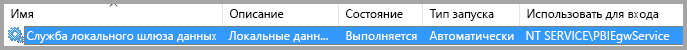
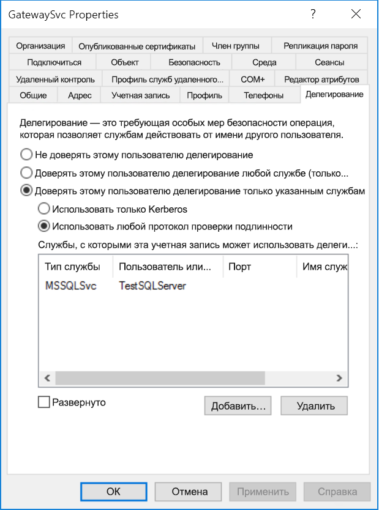
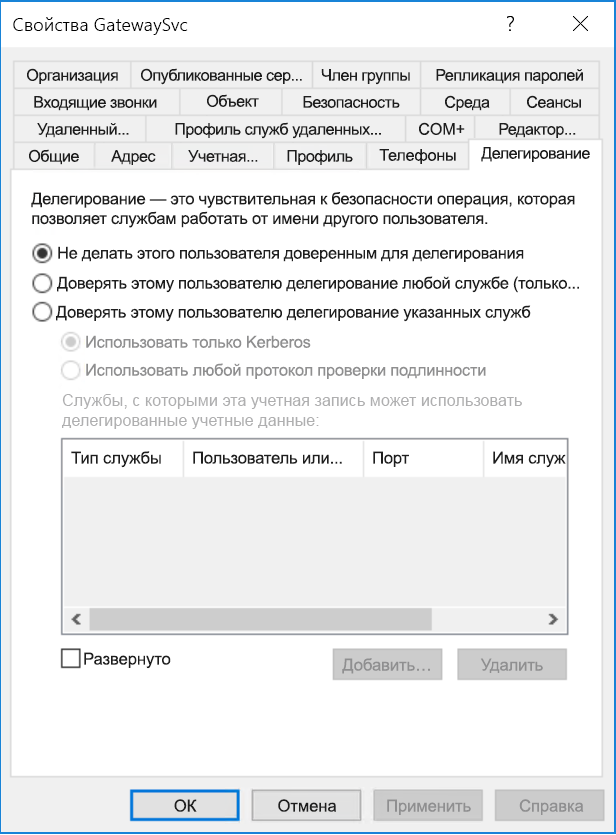
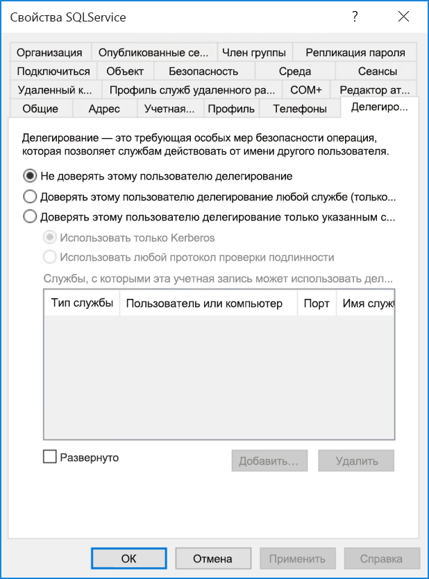
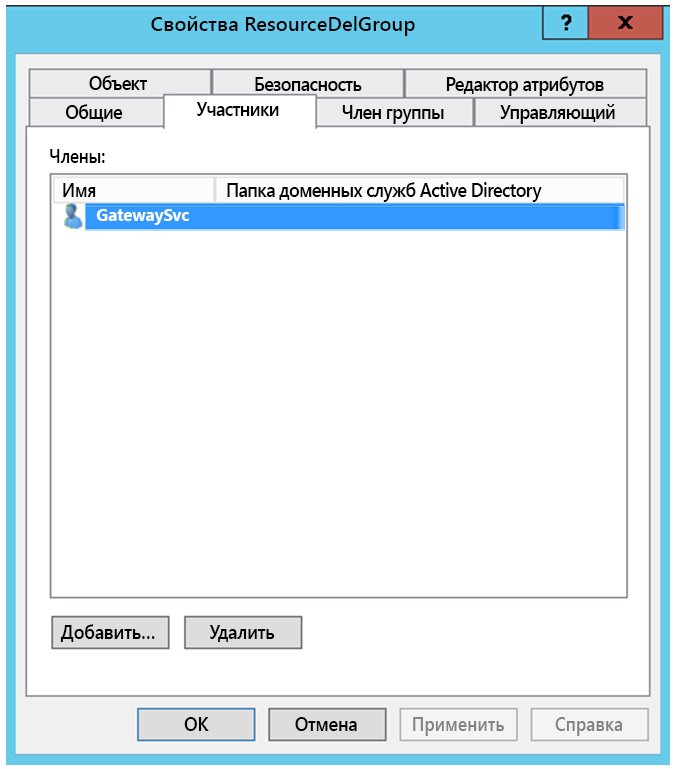
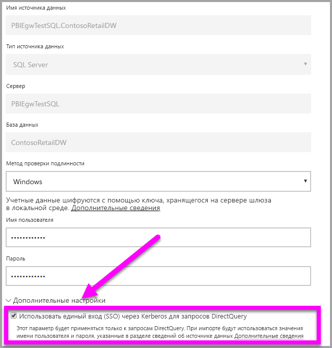

# <a name="configure-kerberos-based-sso-from-power-bi-service-to-on-premises-data-sources"></a>Настройка единого входа на основе Kerberos из службы Power BI в локальные источники данных

Включение единого входа позволяет отчетам и панелям мониторинга Power BI легко обновлять данные из локальных источников с учетом разрешений, настроенных для таких источников на уровне пользователей. Используйте [ограниченное делегирование Kerberos](/windows-server/security/kerberos/kerberos-constrained-delegation-overview), чтобы легко настроить единый вход. 

## <a name="prerequisites"></a>Предварительные требования

Чтобы ограниченное делегирование Kerberos работало правильно, необходимо настроить несколько элементов, в том числе _имена субъектов-служб_ и параметры делегирования в учетных записях служб.

### <a name="install-and-configure-the-microsoft-on-premises-data-gateway"></a>Установка и настройка локального шлюза данных Майкрософт

Локальный шлюз данных поддерживает обновление на месте, а также _применение параметров_ из существующих шлюзов.

### <a name="run-the-gateway-windows-service-as-a-domain-account"></a>Запуск службы Windows для шлюза в качестве учетной записи домена

В стандартной установке шлюз выполняет роль учетной записи службы для локального компьютера (**NT Service\PBIEgwService**).



Чтобы включить ограниченное делегирование Kerberos, шлюз необходимо запускать как учетную запись домена, если только экземпляр Azure Active Directory (Azure AD) не синхронизирован с локальным экземпляром Active Directory (с помощью Azure AD DirSync/Connect). Чтобы переключиться на учетную запись домена, ознакомьтесь со статьей [Смена учетной записи службы шлюза](/data-integration/gateway/service-gateway-service-account).

> [!NOTE]
> Если настроено средство Azure AD Connect и учетные записи пользователей синхронизированы, службе шлюза не требуется выполнять поиск в локальном экземпляре Azure AD во время выполнения. Вместо этого можно просто применить идентификатор безопасности локальной службы в службе шлюза, чтобы выполнить все необходимые настройки в Azure AD. Этапы настройки ограниченного делегирования Kerberos, описанные в этой статье, будут для этой конфигурации такими же, как и в контексте Azure AD. Здесь они применяются к объекту-компьютеру шлюза (который определяется по идентификатору безопасности локальной службы) в Azure AD, а не к учетной записи домена.

## <a name="obtain-domain-admin-rights-to-configure-spns-setspn-and-kerberos-constrained-delegation-settings"></a>Получение прав администратора домена для настройки параметров ограниченного делегирования Kerberos и имен субъектов-служб (SetSPN)

Чтобы настроить имена участников-служб и параметры делегирования Kerberos, администратор домена должен избегать предоставления прав пользователям, у которых нет прав администратора домена. В следующем разделе более подробно описаны рекомендуемые этапы настройки.

## <a name="configure-kerberos-constrained-delegation-for-the-gateway-and-data-source"></a>Настройка ограниченного делегирования Kerberos для шлюза и источника данных

При необходимости как администратор домена настройте имя субъекта-службы для учетной записи домена службы шлюза, а также настройте параметры делегирования в этой учетной записи.

### <a name="configure-an-spn-for-the-gateway-service-account"></a>Настройка имени субъекта-службы для учетной записи службы шлюза

Сначала определите, создано ли имя субъекта-службы для учетной записи домена, используемой в качестве учетной записи службы шлюза.

1. Как администратор домена, откройте оснастку MMC **Пользователи и компьютеры Active Directory**:

2. В левой области щелкните правой кнопкой мыши имя домена, выберите **Найти** и введите имя учетной записи службы шлюза.

3. В результатах поиска щелкните правой кнопкой мыши учетную запись службы шлюза и выберите **Свойства**.

4. Если в диалоговом окне **Свойства** отображается вкладка **Делегирование**, значит, имя субъекта-службы уже создано и вы можете перейти к шагу [Выбор типа ограниченного делегирования Kerberos для использования](#decide-on-the-type-of-kerberos-constrained-delegation-to-use).

5. Если в диалоговом окне **Свойства** не отображается вкладка **Делегирование**, можно вручную создать имя субъекта-службы для этой учетной записи. Используйте [средство setspn](https://technet.microsoft.com/library/cc731241.aspx), входящее в состав Windows (для создания имени субъекта-службы нужны права администратора домена).

   Предположим, что используется учетная запись службы шлюза **Contoso\GatewaySvc**, а шлюз работает на компьютере **MyGatewayMachine**. Чтобы задать имя субъекта-службы для этой учетной записи службы шлюза, выполните следующую команду:

   ```setspn -a gateway/MyGatewayMachine Contoso\GatewaySvc```

   Чтобы задать имя субъекта-службы, можно также использовать оснастку MMC **Пользователи и компьютеры Active Directory**.

### <a name="decide-on-the-type-of-kerberos-constrained-delegation-to-use"></a>Выбор типа ограниченного делегирования Kerberos для использования

В параметрах делегирования можно указать ограниченное делегирование Kerberos на основе ресурсов или стандартное ограниченное делегирование Kerberos. Используйте делегирование на основе ресурсов (требуется Windows Server 2012 или более поздней версии), если источник данных и шлюз расположены в разных доменах. Дополнительные сведения о различиях между двумя подходами к делегированию см. на странице [общих сведений об ограниченном делегировании Kerberos](/windows-server/security/kerberos/kerberos-constrained-delegation-overview).

 В зависимости от того, какой подход вы хотите использовать, перейдите к одному из следующих разделов. Не следует выполнять оба раздела:
 - [Настройка учетной записи службы шлюза для стандартного ограниченного делегирования Kerberos](#configure-the-gateway-service-account-for-standard-kerberos-constrained-delegation)
- [Настройка учетной записи службы шлюза для ограниченного делегирования Kerberos на основе ресурсов](#configure-the-gateway-service-account-for-resource-based-kerberos-constrained-delegation) 

## <a name="configure-the-gateway-service-account-for-standard-kerberos-constrained-delegation"></a>Настройка учетной записи службы шлюза для стандартного ограниченного делегирования Kerberos

> [!NOTE]
> Инструкции из этого раздела следует выполнять, если вы решили настроить [стандартное ограниченное делегирование Kerberos](/windows-server/security/kerberos/kerberos-constrained-delegation-overview). Если же вы хотите применить ограниченное делегирование Kerberos на основе ресурсов, выполните действия из раздела [Настройка учетной записи службы шлюза для ограниченного делегирования Kerberos на основе ресурсов](#configure-the-gateway-service-account-for-resource-based-kerberos-constrained-delegation).

Сейчас мы настроим параметры делегирования для учетной записи домена службы шлюза. Для этого можно использовать разные средства. Здесь мы будем использовать оснастку консоли управления (MMC) **Пользователи и компьютеры Active Directory**. Это средство используется для администрирования и публикации данных в каталоге. По умолчанию оно доступно на контроллерах домена, но его можно включить и на других компьютерах с помощью средства настройки компонентов Windows.

Нужно настроить ограниченное делегирование Kerberos с транзитом протокола. При использовании ограниченного делегирования рекомендуется явно указать службы, которым вы разрешите предоставлять делегированные учетные данные от шлюза. Например, только SQL Server либо сервер SAP HANA принимает вызовы делегирования от учетной записи службы шлюза.

В этом разделе предполагается, что вы уже настроили имена субъектов-служб для ваших базовых источников данных (таких как SQL Server, SAP HANA, SAP BW, Teradata и Spark). Чтобы узнать, как настроить имена субъектов-служб для серверов источников данных, обратитесь к технической документации по соответствующему серверу баз данных и ознакомьтесь с разделом *, Какое имя субъекта-службы требуется вашему приложению?* в записи блога [Контрольный список Kerberos](https://techcommunity.microsoft.com/t5/SQL-Server-Support/My-Kerberos-Checklist-8230/ba-p/316160).

В следующих шагах предполагается, что вы используете локальную среду с двумя компьютерами в одном домене: компьютер шлюза и сервер баз данных с SQL Server, на котором уже настроен единый вход на основе Kerberos. Эти действия можно скорректировать для любого из других поддерживаемых источников данных, если для него уже настроен единый вход на основе Kerberos. Например, введем следующие параметры:

* Домен Active Directory (Netbios): **Contoso**
* Имя компьютера шлюза: **MyGatewayMachine**
* Учетная запись службы шлюза: **Contoso\GatewaySvc**
* Имя компьютера источника данных SQL Server: **TestSQLServer**
* Учетная запись для службы источника данных SQL Server: **Contoso\SQLService**

Ниже описано, как настроить параметры делегирования:

1. Войдите как администратор домена и откройте оснастку MMC **Пользователи и компьютеры Active Directory**.

2. Щелкните правой кнопкой мыши учетную запись службы шлюза (**Contoso\GatewaySvc**) и выберите **Свойства**.

3. Выберите вкладку **Делегирование**.

4. Выберите параметр **Доверять компьютеру делегирование указанных служб** > **Использовать любой протокол проверки подлинности**.

5. В разделе **Службы, с которыми эта учетная запись может использовать делегированные учетные данные** нажмите кнопку **Добавить**.

6. В открывшемся диалоговом окне выберите **Пользователи или компьютеры**.

7. Укажите учетную запись службы для источника данных, а затем нажмите **ОК**.

   Например, источник данных SQL Server может иметь учетную запись службы *Contoso\SQLService*. Для этой учетной записи должно быть задано соответствующее имя субъекта-службы для источника данных. 

8. Выберите имя субъекта-службы, созданное для сервера базы данных. 

   В этом примере имя субъекта-службы начинается с *MSSQLSvc*. Если вы добавили полное доменное имя и имя субъекта-службы NetBIOS для службы базы данных, выберите оба имени. Вы можете увидеть только одно имя.

9. Нажмите кнопку **ОК**. 

   Теперь имя субъекта-службы должно отображаться в списке служб, которым учетная запись службы шлюза может предоставлять делегированные учетные данные.

    

10. Перейдите к разделу [о предоставлении учетной записи службы шлюза прав на локальные политики на компьютере шлюза](#grant-the-gateway-service-account-local-policy-rights-on-the-gateway-machine), чтобы продолжить процесс установки.

## <a name="configure-the-gateway-service-account-for-resource-based-kerberos-constrained-delegation"></a>Настройка учетной записи службы шлюза для ограниченного делегирования Kerberos на основе ресурсов

> [!NOTE]
> Инструкции из этого раздела следует выполнять, если вы решили настроить [ограниченное делегирование Kerberos на основе ресурсов](/windows-server/security/kerberos/kerberos-constrained-delegation-overview#resource-based-constrained-delegation-across-domains). Если же вы хотите применить стандартное ограниченное делегирование Kerberos, выполните действия из раздела [Настройка учетной записи службы шлюза для стандартного ограниченного делегирования Kerberos](#configure-the-gateway-service-account-for-standard-kerberos-constrained-delegation).

Используйте [ограниченное делегирование Kerberos на основе ресурсов](/windows-server/security/kerberos/kerberos-constrained-delegation-overview#resource-based-constrained-delegation-across-domains), чтобы обеспечить возможность подключения с единым входом для Windows Server версии 2012 и выше. Этот тип делегирования позволяет разместить внешние и внутренние службы в разных доменах. Для этого домен серверной службы должен соответствовать домену интерфейсной службы.

В следующих шагах предполагается, что вы используете локальную среды с двумя компьютерами в разных доменах: компьютер шлюза и сервер баз данных с SQL Server, на котором уже настроен единый вход на основе Kerberos. Эти действия можно скорректировать для любого из других поддерживаемых источников данных, если для него уже настроен единый вход на основе Kerberos. Например, введем следующие параметры:

* Домен переднего плана Active Directory (Netbios): **ContosoFrontEnd**
* Внутренний домен Active Directory (Netbios): **ContosoBackEnd**
* Имя компьютера шлюза: **MyGatewayMachine**
* Учетная запись службы шлюза: **ContosoFrontEnd\GatewaySvc**
* Имя компьютера источника данных SQL Server: **TestSQLServer**
* Учетная запись для службы источника данных SQL Server: **ContosoBackEnd\SQLService**

Выполните следующие шаги для конфигурации:

1. Используя оснастку MMC **Пользователи и компьютеры Active Directory** на контроллере домена **ContosoFrontEnd**, убедитесь, что параметры делегирования не применяются для учетной записи службы шлюза.

    

2. Используя оснастку **Пользователи и компьютеры Active Directory** на контролере домена **ContosoBackEnd**, убедитесь, что параметры делегирования не применяются для учетной записи серверной службы.

    

3. На вкладке **Редактор атрибутов** свойств учетной записи убедитесь, что атрибут **msDS-AllowedToActOnBehalfOfOtherIdentity** не задан.

    

4. Создайте на контроллере домена группу для домена **ContosoBackEnd** в оснастке **Пользователи и компьютеры Active Directory**. Добавьте учетную запись службы шлюза **GatewaySvc** в группу **ResourceDelGroup**. 

    

5. Откройте командную строку и выполните следующие команды в контроллере домена для домена **ContosoBackEnd**, чтобы обновить атрибут **msDS-AllowedToActOnBehalfOfOtherIdentity** для учетной записи серверной службы:

    ```powershell
    $c = Get-ADGroup ResourceDelGroup
    Set-ADUser SQLService -PrincipalsAllowedToDelegateToAccount $c
    ```

6. Можно убедиться, что обновление отображается на вкладке **редактора атрибутов** в разделе свойств для учетной записи серверной службы в оснастке **Пользователи и компьютеры Active Directory**. 

## <a name="grant-the-gateway-service-account-local-policy-rights-on-the-gateway-machine"></a>Предоставление учетной записи службы шлюза прав на локальные политики на компьютере шлюза

Теперь на компьютере со службой шлюза (в нашем примере это **MyGatewayMachine**) нужно назначить учетной записи службы шлюза локальные политики **Имитация клиента после проверки подлинности** и **Работа в режиме операционной системы (SeTcbPrivilege)** . Это можно сделать с помощью редактора локальных групповых политик (**gpedit.msc**).

1. На компьютере шлюза выполните команду **gpedit.msc**.

2. Выберите **Политика локального компьютера** &gt; **Конфигурация компьютера** &gt; **Параметры Windows** &gt; **Параметры безопасности** &gt; **Локальные политики** &gt; **Назначение прав пользователя**.

    

3. В списке политик в разделе **Назначение прав пользователя** выберите **Имитация клиента после проверки подлинности**.

    
    
4. Щелкните правой кнопкой мыши политику, откройте **Свойства**, а затем просмотрите список учетных записей. 

    Он должен содержать учетную запись службы шлюза (**Contoso\GatewaySvc** или **ContosoFrontEnd\GatewaySvc** в зависимости от типа ограниченного делегирования).

5. В списке политик в разделе **Назначение прав пользователя** выберите **Работа в режиме операционной системы (SeTcbPrivilege)** . Убедитесь, что учетная запись службы шлюза входит в список учетных записей.

6. Перезапустите процесс службы **локального шлюза данных**.

### <a name="set-user-mapping-configuration-parameters-on-the-gateway-machine-if-necessary"></a>Настройка параметров сопоставления пользователей на компьютере шлюза (если требуется)

Если у вас не настроено средство Azure AD Connect, выполните указанные ниже действия для сопоставления пользователя службы Power BI с локальным пользователем Active Directory. Каждому пользователю Active Directory, которого вы сопоставите таким образом, нужно предоставить права на единый вход для источника данных. Дополнительные сведения см. в [видео Guy in a Cube](https://www.youtube.com/watch?v=NG05PG9aiRw).

1. Откройте главный файл конфигурации шлюза, Microsoft.PowerBI.DataMovement.Pipeline.GatewayCore.dll. По умолчанию этот файл находится в каталоге C:\Program Files\On-premises data gateway.

1. Для параметра **ADUserNameLookupProperty** укажите неиспользуемый атрибут Active Directory. В следующих шагах мы будем использовать `msDS-cloudExtensionAttribute1`. Этот атрибут доступен только в Windows Server 2012 и более поздних версиях. 

1. Задайте для свойства **ADUserNameReplacementProperty** значение `SAMAccountName`, а затем сохраните файл конфигурации.

1. На вкладке **Службы** диспетчера задач щелкните службу шлюза правой кнопкой мыши и выберите команду **Перезапустить**.

    

1. Для каждого пользователя службы Power BI, которому потребуется единый вход Kerberos, в свойстве `msDS-cloudExtensionAttribute1` локального пользователя Active Directory (с разрешением единого входа для используемого источника данных) укажите полное имя пользователя службы Power BI (имя участника-пользователя). Например, если вы входите в службу Power BI с именем test@contoso.com и хотите сопоставить этого пользователя с локальным пользователем Active Directory test@LOCALDOMAIN.COM с правами на единый вход, присвойте атрибуту `msDS-cloudExtensionAttribute1` значение test@contoso.com.

    Задать свойство `msDS-cloudExtensionAttribute1` можно при помощи оснастки MMC "Пользователи и компьютеры Active Directory".
    
    1. Войдите как администратор домена и запустите средство **Пользователи и компьютеры Active Directory**.
    
    1. Щелкните правой кнопкой мыши имя домена, выберите **Найти** и введите имя учетной записи того пользователя Active Directory, с которым нужно настроить сопоставление.
    
    1. Выберите вкладку **Редактор атрибутов**.
    
        Найдите свойство `msDS-cloudExtensionAttribute1` и дважды щелкните его. В качестве значения введите полное имя пользователя, которое вы используете для входа в службу Power BI (имя участника-пользователя).
    
    1. Нажмите кнопку **ОК**.
    
        
    
    1. Нажмите кнопку **Применить**. Проверьте, правильно ли установлено значение в столбце **Значение**.

## <a name="complete-data-source-specific-configuration-steps"></a>Выполнение шаги по настройке конкретного источника данных

Для SAP HANA и SAP BW существуют дополнительные требования к конфигурации источника данных и предварительные требования, которые нужно выполнить до настройки единого входа через шлюз для этих источников данных. Дополнительные сведения см. на страницах [конфигурации SAP HANA](service-gateway-sso-kerberos-sap-hana.md) и [конфигурации SAP BW — CommonCryptoLib (sapcrypto.dll)](service-gateway-sso-kerberos-sap-bw-commoncryptolib.md). Хотя можно [настроить для SAP BW использование библиотеки gx64krb5 SNC](service-gateway-sso-kerberos-sap-bw-gx64krb.md), корпорация Майкрософт не рекомендует применять ее из-за прекращения поддержки этой библиотеки в SAP. В качестве библиотеки SNC следует использовать CommonCryptoLib _или_ gx64krb5. Не следует настраивать обе библиотеки.

> [!NOTE]
> Другие библиотеки SNC также могут работать с единым входом для BW, но официально не поддерживаются корпорацией Майкрософт.

## <a name="run-a-power-bi-report"></a>Запуск отчета Power BI

Выполнив все шаги настройки, на странице **Управление шлюза** в Power BI можно настроить источник данных для единого входа. Если вы используете несколько шлюзов, выберите тот из них, который ранее настроили для единого входа Kerberos. В разделе **Дополнительные параметры** для источника данных установите флажок **Использовать единый вход (SSO) через Kerberos для запросов DirectQuery**.



 Опубликуйте отчет на основе DirectQuery из Power BI Desktop. Для этого отчета должны использоваться данные, доступные пользователю, который сопоставлен с пользователем Active Directory (Azure), выполняющим вход в службу Power BI. Использовать DirectQuery вместо импорта необходимо из-за особенностей работы импорта. При обновлении отчетов на основе импорта шлюз использует учетные данные, введенные в полях **Имя пользователя** и **Пароль** при создании источника данных. Иными словами, единый вход Kerberos *не* используется. Кроме того, если имеется несколько шлюзов, при публикации нужно выбрать шлюз, настроенный для единого входа. Теперь в службе Power BI вы должны быть в состоянии обновить отчет или создать его на основе опубликованного набора данных.

Эта конфигурация применима для большинства случаев. Но при использовании Kerberos в разных средах могут применяться разные конфигурации. Если отчет не загружается, обратитесь к администратору домена для дальнейшего изучения проблемы. Если в качестве источника данных используется SAP BW, ознакомьтесь с разделами по устранению неполадок на страницах настройки, относящихся к источникам данных [CommonCryptoLib](service-gateway-sso-kerberos-sap-bw-commoncryptolib.md#troubleshooting) и [gx64krb5/gsskrb5](service-gateway-sso-kerberos-sap-bw-gx64krb.md#troubleshooting) в зависимости от выбранной библиотеки SNC.

## <a name="next-steps"></a>Дальнейшие действия

Дополнительные сведения о локальном шлюзе данных и DirectQuery см. в следующих ресурсах:

* [Что такое локальный шлюз данных?](/data-integration/gateway/service-gateway-onprem)
* [Power BI и DirectQuery](desktop-directquery-about.md)
* [Источники данных, поддерживаемые DirectQuery](desktop-directquery-data-sources.md)
* [Использование DirectQuery и SAP Business Warehouse (BW)](desktop-directquery-sap-bw.md)
* [DirectQuery и SAP HANA](desktop-directquery-sap-hana.md)
