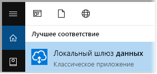
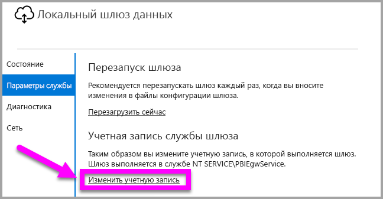
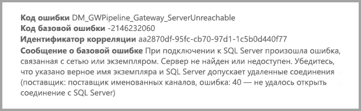

# <a name="use-kerberos-for-single-sign-on-sso-from-power-bi-to-on-premises-data-sources"></a>Использование Kerberos для единого входа из Power BI в локальные источники данных

Используйте [ограниченное делегирование Kerberos](/windows-server/security/kerberos/kerberos-constrained-delegation-overview), чтобы включить простой единый вход. Включение единого входа позволяет отчетам и панелям мониторинга Power BI легко обновлять данные из локальных источников.

## <a name="supported-data-sources"></a>Поддерживаемые источники данных

В настоящее время поддерживаются следующие источники данных:

* SQL Server
* SAP HANA
* SAP BW
* Teradata
* Spark
* Impala

Мы также поддерживаем SAP HANA с [языком разметки заявлений системы безопасности (SAML)](service-gateway-sso-saml.md).

### <a name="sap-hana"></a>SAP HANA

Чтобы включить единый вход для SAP HANA, сначала выполните следующие действия:

* Убедитесь, что для сервера SAP HANA используется минимально допустимая версия, которая зависит от уровня платформы сервера SAP HANA:
  * [HANA 2 SPS 01 Rev 012.03](https://launchpad.support.sap.com/#/notes/2557386)
  * [HANA 2 SPS 02 Rev 22](https://launchpad.support.sap.com/#/notes/2547324)
  * [HANA 1 SP 12 Rev 122.13](https://launchpad.support.sap.com/#/notes/2528439)
* На компьютере шлюза установите последнюю версию драйвера ODBC для HANA от SAP.  Минимальная версия драйвера ODBC для HANA — 2.00.020.00, выпущенная в августе 2017 г.

Дополнительные сведения о настройке единого входа для SAP HANA с помощью Kerberos см. в разделе о [едином входе с использованием Kerberos](https://help.sap.com/viewer/b3ee5778bc2e4a089d3299b82ec762a7/2.0.03/1885fad82df943c2a1974f5da0eed66d.html) руководства по безопасности SAP HANA. На этой странице приведены полезные ссылки, в частности примечание SAP 1837331 — HOWTO HANA DBSSO Kerberos/Active Directory.

## <a name="prepare-for-kerberos-constrained-delegation"></a>Подготовка к ограниченному делегированию Kerberos

Чтобы ограниченное делегирование Kerberos работало правильно, нужно настроить несколько элементов, в том числе *имена субъектов-служб* и параметры делегирования в учетных записях служб.

### <a name="prerequisite-1-install-and-configure-the-microsoft-on-premises-data-gateway"></a>Необходимое условие 1. Установка и настройка локального шлюза данных Майкрософт

Этот выпуск локального шлюза данных поддерживает обновление на месте, а также подхват параметров из существующих шлюзов.

### <a name="prerequisite-2-run-the-gateway-windows-service-as-a-domain-account"></a>Необходимое условие 2. Запуск службы Windows для шлюза в качестве учетной записи домена

В стандартной установке шлюз выполняет роль учетной записи службы для локального компьютера (например, *NT Service\PBIEgwService*).


Чтобы включить ограниченное делегирование Kerberos, шлюз необходимо запускать как учетную запись домена, если только экземпляр Azure Active Directory (Azure AD) не синхронизирован с локальным экземпляром Active Directory (с помощью Azure AD DirSync/Connect). Чтобы переключиться на учетную запись домена, см. раздел [Переключение шлюза на учетную запись домена](#switch-the-gateway-to-a-domain-account) далее в этой статье.

> [!NOTE]
> Если настроен Azure AD Connect и учетные записи пользователей синхронизированы, службе шлюза не требуется выполнять поиск в локальном экземпляре Azure AD во время выполнения. Для службы шлюза можно использовать локальный идентификатор безопасности (вместо учетной записи домена). Этапы настройки ограниченного делегирования Kerberos, описанные в этой статье, будут аналогичными для такой конфигурации. Они просто применяются к объекту-компьютеру шлюза в Azure AD, а не учетной записи домена.

### <a name="prerequisite-3-have-domain-admin-rights-to-configure-spns-setspn-and-kerberos-constrained-delegation-settings"></a>Необходимое условие 3. Получение прав администратора домена для настройки параметров ограниченного делегирования Kerberos и имен субъектов-служб (SetSPN)

Администратору домена не рекомендуется на временной или постоянной основе разрешать любому пользователю без прав администратора настраивать делегирование Kerberos и имена субъектов-служб. В следующем разделе более подробно описаны рекомендуемые этапы настройки.

## <a name="configure-kerberos-constrained-delegation-for-the-gateway-and-data-source"></a>Настройка ограниченного делегирования Kerberos для шлюза и источника данных

Войдите как администратор домена, настройте имя субъекта-службы для учетной записи домена службы шлюза, а также настройте параметры делегирования в этой учетной записи.

### <a name="configure-an-spn-for-the-gateway-service-account"></a>Настройка имени субъекта-службы для учетной записи службы шлюза

Сначала определите, создано ли имя субъекта-службы для учетной записи домена, используемой в качестве учетной записи службы шлюза.

1. Войдите как администратор домена и откройте **Пользователи и компьютеры Active Directory**.

2. Щелкните правой кнопкой мыши домен, выберите **Найти** и введите имя учетной записи службы шлюза.

3. В результатах поиска щелкните правой кнопкой мыши учетную запись службы шлюза и выберите **Свойства**.

4. Если в диалоговом окне **Свойства** отображается вкладка **Делегирование**, значит, имя субъекта-службы уже создано. Вы можете перейти к настройке параметров делегирования.

    Если в диалоговом окне **Свойства** не отображается вкладка **Делегирование**, можно вручную создать имя субъекта-службы для этой учетной записи. При этом добавляется вкладка **Делегирование**. Используйте [средство setspn](https://technet.microsoft.com/library/cc731241.aspx), входящее в состав Windows (для создания имени субъекта-службы нужны права администратора домена).

    Предположим, что учетная запись службы шлюза — PBIEgwTest\GatewaySvc, а компьютер, на котором работает шлюз, называется **Machine1**. Чтобы задать имя субъекта-службы для учетной записи службы шлюза для этого компьютера, выполните следующую команду:

    

    После этого можно перейти к настройке параметров делегирования.

### <a name="configure-delegation-settings-on-the-gateway-service-account"></a>Настройка параметров делегирования в учетной записи домена службы шлюза

Второе требование конфигурации — это параметры делегирования в учетной записи службы шлюза. Для этого можно использовать разные средства. Здесь мы будем использовать средство "Пользователи и компьютеры Active Directory", которое является оснасткой консоли управления (MMC). Это средство используется для администрирования и публикации данных в каталоге. По умолчанию оно доступно в контроллерах домена. На других компьютерах для его включения можно использовать средство настройки компонентов Windows.

Нужно настроить ограниченное делегирование Kerberos с транзитом протокола. При использовании ограниченного делегирования необходимо явно указать службы, для которых настраивается делегирование. Например, только SQL Server либо сервер SAP HANA принимает вызовы делегирования от учетной записи службы шлюза.

В этом разделе предполагается, что вы уже настроили имена субъектов-служб для ваших базовых источников данных (таких как SQL Server, SAP HANA, Teradata и Spark). Чтобы узнать, как настроить имена субъектов-служб сервера источника данных, см. техническую документацию соответствующего сервера базы данных. Также можно ознакомиться с записью блога, поясняющей, [какое имя субъекта-службы требуется вашему приложению](https://blogs.msdn.microsoft.com/psssql/2010/06/23/my-kerberos-checklist/).

В следующих шагах предполагается использование локальной среды с двумя компьютерами: компьютер шлюза и сервер баз данных с SQL Server. Для примера мы также предположим следующие параметры и имена:

* Имя компьютера шлюза: **PBIEgwTestGW**.
* Учетная запись службы шлюза: **PBIEgwTest\GatewaySvc** (отображаемое имя учетной записи: соединитель шлюза).
* Имя компьютера источника данных SQL Server: **PBIEgwTestSQL**.
* Учетная запись для службы источника данных SQL Server: **PBIEgwTest\SQLService**.

Ниже описано, как настроить параметры делегирования:

1. Войдите как администратор домена и откройте **Пользователи и компьютеры Active Directory**.

2. Щелкните правой кнопкой мыши учетную запись службы шлюза (**PBIEgwTest\GatewaySvc**) и выберите **Свойства**.

3. Выберите вкладку **Делегирование**.

4. Выберите параметр **Доверять компьютеру делегирование указанных служб** > **Использовать любой протокол проверки подлинности**.

6. В разделе **Службы, с которыми эта учетная запись может использовать делегированные учетные данные** нажмите кнопку **Добавить**.

7. В открывшемся диалоговом окне выберите **Пользователи или компьютеры**.

8. Введите данные учетной записи службы для источника данных SQL Server (**PBIEgwTest\SQLService**) и нажмите кнопку **ОК**.

9. Выберите имя субъекта-службы, созданное для сервера базы данных. В этом примере имя субъекта-службы начинается с **MSSQLSvc**. Если вы добавили полное доменное имя и имя субъекта-службы NetBIOS для службы базы данных, выберите оба имени. Вы можете увидеть только одно имя.

10. Нажмите кнопку **ОК**. Вы должны увидеть имя субъекта-службы в списке.

    При необходимости выберите **Развернуто**, чтобы отображалось имя NetBIOS и полное доменное имя субъекта-службы. Если установлен флажок **Развернуто**, диалоговое окно должно выглядеть так: Нажмите кнопку **ОК**.

    

Теперь на компьютере со службой шлюза (**PBIEgwTestGW** в приведенном примере) нужно назначить учетной записи службы шлюза локальную политику **Имитация клиента после проверки подлинности**. Это можно выполнить и проверить с помощью редактора локальных групповых политик (**gpedit**).

1. На компьютере шлюза выполните команду *gpedit.msc*.

1. Выберите элементы **Политика локального компьютера** > **Конфигурация компьютера** > **Параметры Windows** > **Параметры безопасности** > **Локальные политики** > **Назначение прав пользователя**.

    

1. В списке политик в разделе **Назначение прав пользователя** выберите **Имитация клиента после проверки подлинности**.

    

    Щелкните правой кнопкой мыши и выберите **Свойства**. Проверьте список учетных записей. В нем должна быть указана учетная запись службы шлюза (**PBIEgwTest\GatewaySvc**).

1. В списке политик в разделе **Назначение прав пользователя** выберите **Работа в режиме операционной системы (SeTcbPrivilege)** . Убедитесь, что учетная запись службы шлюза также входит в список учетных записей.

1. Перезапустите процесс службы **локального шлюза данных**.

Если вы используете SAP HANA, мы рекомендуем следующие дополнительные действия, которые позволят обеспечить небольшое повышение производительности.

1. В каталоге установки шлюза найдите и откройте этот файл конфигурации: *Microsoft.PowerBI.DataMovement.Pipeline.GatewayCore.dll.config*.

1. Найдите свойство *FullDomainResolutionEnabled* и измените его значение на *True*.

    ```xml
    <setting name=" FullDomainResolutionEnabled " serializeAs="String">
          <value>True</value>
    </setting>
    ```

## <a name="run-a-power-bi-report"></a>Запуск отчета Power BI

Выполнив все этапы настройки, на странице **Управление шлюза** в Power BI можно настроить источник данных. Затем можно включить единый вход в подразделе **Дополнительные параметры** и публиковать отчеты и наборы данных, которые привязаны к этому источнику данных.


Эта конфигурация применима для большинства случаев. Но при использовании Kerberos в разных средах могут применяться разные конфигурации. Если отчет по-прежнему не загружается, обратитесь к администратору домена для дальнейшего изучения проблемы.

## <a name="switch-the-gateway-to-a-domain-account"></a>Переключение шлюза на учетную запись домена

При необходимости вы можете переключить шлюз с учетной записи локальной службы на учетную запись домена с помощью пользовательского интерфейса **Локальный шлюз данных**. Вот как это сделать.

1. Запустите средство настройки **Локальный шлюз данных**.

   

2. На главной странице нажмите кнопку **Войти** и войдите в учетную запись Power BI.

3. После входа выберите вкладку **Параметры службы**.

4. Выберите команду **Изменить учетную запись**, чтобы запустить интерактивное пошаговое руководство.

   

## <a name="configure-sap-bw-for-sso"></a>Настройка единого входа для SAP BW

Теперь, когда вы знаете, как Kerberos работает через шлюз, можно настроить единый вход для SAP Business Warehouse (SAP BW). В следующих шагах предполагается, что вы уже [подготовили ограниченное делегирование Kerberos](#prepare-for-kerberos-constrained-delegation), как описано ранее в этой статье.

Это руководстве включает все возможные подробности. Если вы уже выполнили часть этих действий, их можно пропустить. Возможно, вы уже создали пользователя службы для сервера SAP BW и сопоставили с ним имя субъекта-службы или уже установили библиотеку `gsskrb5`.

### <a name="set-up-gsskrb5-on-client-machines-and-the-sap-bw-server"></a>Настройка gsskrb5 на клиентских компьютерах и сервере SAP BW

> [!NOTE]
> `gsskrb5` больше не поддерживается в SAP. Для получения дополнительных сведений см. [Заметку SAP 352295](https://launchpad.support.sap.com/#/notes/352295). Также обратите внимание, что `gsskrb5` не позволяет осуществлять подключения с единым входом от шлюза данных к серверам сообщений SAP BW. Возможны только подключения к серверам приложений SAP BW. Чтобы выполнить подключение с единым входом через шлюз, на сервере и на клиенте должна быть установлена библиотека `gsskrb5`. Теперь мы поддерживаем библиотеку Common Crypto Library (sapcrypto) для SAP BW.

1. Скачайте `gsskrb5` - `gx64krb5` из [примечания SAP 2115486](https://launchpad.support.sap.com/) (требуется s-пользователь SAP). Убедитесь в наличии библиотек gsskrb5.dll и gx64krb5.dll версии не ниже 1.0.11.x.

1. Поместите библиотеку в расположение на компьютере шлюза, доступное с вашего экземпляра шлюза (а также для графического интерфейса SAP GUI, если вы хотите протестировать подключение единого входа с помощью SAP Logon).

1. Поместите другую копию на серверном компьютере SAP BW в расположение, доступное для сервера SAP BW.

1. На клиентском и серверном компьютерах задайте переменные среды S`SNC\_LIB` и `SNC\_LIB\_64`, чтобы указать расположения gsskrb5.dll и gx64krb5.dll, соответственно.

### <a name="create-a-sap-bw-service-user-and-enable-snc-communication"></a>Создание пользователя службы SAP BW и включение обмена данными SNC

В дополнение к конфигурации шлюза, с которой вы уже знакомы, существует несколько дополнительных действий, связанных с SAP BW. Раздел документации [Настройка параметров делегирования в учетной записи службы шлюза](#configure-delegation-settings-on-the-gateway-service-account) предполагает, что вы уже настроили имена субъектов-служб для ваших базовых источников данных. Чтобы провести настройку шлюза для SAP BW, выполните следующие действия.

1. На сервере контроллера домена Active Directory создайте пользователя службы (изначально это обычный пользователь Active Directory) для сервера приложений SAP BW в среде Active Directory. Назначьте ему имя SPN.

    SAP рекомендует начинать имя субъекта-службы с префикса `SAP/`, но должны поддерживаться и другие префиксы, например `HTTP/`. Что следует за `SAP/`, выбираете вы; один из вариантов — имя пользователя службы сервера SAP BW. Например, если вы создаете `BWServiceUser@\<DOMAIN\>` в качестве пользователя службы, можно использовать имя субъекта-службы `SAP/BWServiceUser`. Один из способов установить сопоставление имени субъекта-службы — команда setspn. Например, чтобы задать имя субъекта-службы для пользователя службы, которого мы только что создали, следовало бы выполнить следующую команду из окна командной строки на компьютере контроллера домена: `setspn -s SAP/ BWServiceUser DOMAIN\ BWServiceUser`. Дополнительные сведения см. в документации по SAP BW.

1. Предоставьте пользователю службы доступ к серверу приложений SAP BW:

    1. На сервере SAP BW добавьте пользователя службы в группу локальных администраторов сервера SAP BW. Откройте программу "Управление компьютером" и дважды щелкните группу локальных администраторов своего сервера.

        

    1. Дважды щелкните группу локальных администраторов, а затем выберите команду **Добавить**, чтобы добавить пользователя службы в группу. Выберите **Проверить имена**, чтобы убедиться, правильно ли вы ввели имя. Нажмите кнопку **ОК**.

1. Задайте пользователя службы сервера SAP BW в качестве пользователя, который запускает службу сервера SAP BW на серверном компьютере SAP BW.

    1. Откройте **Выполнить** и введите "Services.msc". Найдите службу, соответствующую экземпляру сервера приложений SAP BW. Щелкните ее правой кнопкой мыши и выберите **Свойства**.

        

    1. Перейдите на вкладку **Вход** и измените пользователя на пользователя службы SAP BW. Введите пароль пользователя и нажмите кнопку **ОК**.

1. Войдите на сервер через SAP Logon и задайте следующие параметры профиля с помощью транзакции RZ10:

    1. Задайте значение параметра профиля snc/identity/as как p:\<имя пользователя службы SAP BW, только что созданного вами\>, например, p:BWServiceUser@MYDOMAIN.COM. Обратите внимание на элемент "p:", предшествующий имени субъекта-пользователя службы. Здесь не используется "p:CN=", как при использовании Common Crypto Lib в качестве библиотеки SNC.

    1. Задайте параметр профиля snc/gssapi\_lib как \<путь к gsskrb5.dll или gx64krb5.dll на сервере (библиотека, которую вы будете использовать, зависит от разрядности операционной системы)\>. Не забудьте поместить библиотеку в расположение, доступное серверу приложений SAP BW.

    1. Также задайте следующие дополнительные параметры профиля, изменив значения по необходимости. Обратите внимание, что последние пять параметров позволяют клиентам подключиться к серверу SAP BW через SAP Logon без необходимости настройки SNC.

        | **Параметр** | **Значение** |
        | --- | --- |
        | snc/data\_protection/max | 3 |
        | snc/data\_protection/min | 1 |
        | snc/data\_protection/use | 9 |
        | snc/accept\_insecure\_cpic | 1 |
        | snc/accept\_insecure\_gui | 1 |
        | snc/accept\_insecure\_r3int\_rfc | 1 |
        | snc/accept\_insecure\_rfc | 1 |
        | snc/permit\_insecure\_start | 1 |

    1. Установите свойство snc/enable равным 1.

1. Задав эти параметры профиля, откройте консоль управления SAP на сервере и перезапустите экземпляр SAP BW. Если сервер не запускается, убедитесь, что параметры профиля заданы правильно. Дополнительные сведения о настройке параметров профиля см. в [документации по SAP](https://help.sap.com/saphelp_nw70ehp1/helpdata/en/e6/56f466e99a11d1a5b00000e835363f/frameset.htm). Если у вас возникли проблемы, можно также обратиться к сведениям об устранении неполадок далее в этом разделе.

### <a name="map-a-sap-bw-user-to-an-active-directory-user"></a>Сопоставление пользователя SAP BW с пользователем Active Directory

Сопоставьте пользователя Active Directory с пользователем сервера приложений SAP BW и проверьте подключение единого входа в SAP Logon.

1. Войдите на сервер SAP BW с помощью SAP Logon. Выполните транзакцию SU01.

1. В поле **Пользователь** введите имя пользователя SAP BW, для которого вы хотите включить единый вход (на снимке экрана выше мы задаем разрешения для BIUSER). Выберите значок **Изменить** (изображение пера) рядом с левой верхней частью окна входа в систему SAP.

    

1. Выберите вкладку **SNC**. В поле ввода имени SNC введите p:\<ваше имя пользователя Active Directory\>@\<домен\>. Обратите внимание на обязательные символы "p:", которые должны предшествовать имени субъекта-пользователя Active Directory. Указанная вами учетная запись пользователя Active Directory должна принадлежать лицу или организации, которым вы хотите включить единый вход для доступа к серверу приложений SAP BW. Например, если вы хотите включить единый вход для пользователя [testuser@TESTDOMAIN.COM](mailto:testuser@TESTDOMAIN.COM), введите p:testuser@TESTDOMAIN.COM.

    

1. Выберите значок **Сохранить** (изображение гибкого диска) в левом верхнем углу экрана.

### <a name="test-sign-in-by-using-sso"></a>Проверка работы единого входа

Убедитесь, что можно войти на сервер. Используйте SAP Logon с помощью единого входа от имени пользователя Active Directory, для которого вы только что включили доступ с единым входом.

1. Войдите в систему на компьютере, где установлен SAP Logon, от имени пользователя Active Directory, для которого вы только что включили доступ с единым входом. Запустите SAP Logon и создайте подключение.

1. На экране **Создать новую системную запись** выберите **Указанная пользователем система** > **Далее**.

    

1. Введите соответствующие сведения на следующем экране, включая сервер приложений, номер экземпляра и идентификатор системы. Нажмите кнопку **Готово**.

1. Щелкните правой кнопкой мыши новое подключение и выберите **Свойства**. Откройте вкладку **Сеть**. В текстовом поле **Имя SNC** введите p:\<имя субъекта-пользователя службы SAP BW\>, например p:BWServiceUser@MYDOMAIN.COM. Нажмите кнопку **ОК**.

    

1. Дважды щелкните только что созданное подключение, чтобы выполнить единый вход на сервер SAP BW. Если подключение будет установлено успешно, переходите к следующему шагу. В противном случае просмотрите шаги ранее в этом документе, чтобы убедиться в том, что они были завершены правильно, или обратитесь к разделу по устранению неполадок. Обратите внимание, что если не удается подключиться к серверу SAP BW с помощью единого входа в этом контексте, вы не сможете подключиться к серверу SAP BW с помощью единого входа в контексте шлюза.

### <a name="troubleshoot-installation-and-connections"></a>Устранение неполадок установки и подключений

Если возникнут проблемы, выполните следующие действия для устранения неполадок установки gsskrb5 и подключения единого входа из SAP Logon.

- Просмотр журналов сервера (...work\dev\_w0 на сервере) может быть полезен для устранения ошибок, которые возникают при установке gsskrb5. Это особенно актуально в случае, если сервер SAP BW не запускается после изменения параметров профиля.

- Если вам не удается запустить службу SAP BW из-за ошибки входа в систему, возможно, вы указали неправильный пароль при вводе имени пользователя запуска от имени для SAP BW. Проверьте пароль, войдя на компьютер в среде Active Directory в качестве пользователя службы SAP BW.

- Если возникают сообщения о том, что учетные данные SQL не позволяют запустить сервер, убедитесь, что вы предоставили пользователю службы доступ к базе данных SAP BW.

- Может появиться сообщение "(GSS-API) указано неизвестное расположение или оно недоступно". Обычно это означает, что у вас указано неверное имя SNC. Используйте в клиентском приложении только "p:", но не "p:CN =" или что-нибудь еще, отличное от имени субъекта-пользователя службы.

- Может появиться следующее сообщение: "(GSS-API) указано недопустимое имя". Убедитесь, что символы "p:" присутствуют в начале параметра профиля удостоверения SNC на сервере.

- Может появиться следующее сообщение: "(Ошибка SNC) не найден указанный модуль." Обычно это происходит, если поместить `gsskrb5.dll/gx64krb5.dll` где-нибудь, где для доступа требуются повышенные привилегии (права администратора).

### <a name="add-registry-entries-to-the-gateway-machine"></a>Добавление записей реестра на компьютере шлюза

Добавьте необходимые записи в реестр компьютера, на котором установлен шлюз. Выполните следующие команды:

1. REG ADD HKLM\SOFTWARE\Wow6432Node\SAP\gsskrb5 /v ForceIniCredOK /t REG\_DWORD /d 1 /f

1. REG ADD HKLM\SOFTWARE\SAP\gsskrb5 /v ForceIniCredOK /t REG\_DWORD /d 1 /f

### <a name="set-configuration-parameters-on-the-gateway-machine"></a>Настройка параметров конфигурации на компьютере шлюза

У вас есть два варианта для настройки параметров конфигурации в зависимости от того, настроен ли в вашей среде Azure AD Connect, который позволяет пользователям входить в службу Power BI в качестве пользователей Azure AD.

Если Azure AD Connect настроен, выполните указанные ниже действия.

1. Откройте главный файл конфигурации шлюза `Microsoft.PowerBI.DataMovement.Pipeline.GatewayCore.dll`. По умолчанию этот файл находится в каталоге C:\Program Files\On-premises data gateway.

1. Убедитесь, что свойство **FullDomainResolutionEnabled** имеет значение **True**, а **SapHanaSsoRemoveDomainEnabled** — **False**.

1. Сохраните файл конфигурации.

1. На вкладке **Службы** диспетчера задач щелкните службу шлюза правой кнопкой мыши и выберите команду **Перезапустить**.

    

Если у вас не настроен Azure AD Connect, выполните указанные ниже действия для каждого пользователя службы Power BI, которого вы хотите сопоставить с пользователем Azure AD. Они позволяют вручную связать пользователя службы Power BI с пользователем Active Directory с правами на вход в SAP BW.

1. Откройте главный файл конфигурации шлюза `Microsoft.PowerBI.DataMovement.Pipeline.GatewayCore.dll`. По умолчанию этот файл находится в каталоге C:\Program Files\On-premises data gateway.

1. Задайте для **ADUserNameLookupProperty** значение `msDS-cloudExtensionAttribute1`, а для **ADUserNameReplacementProperty** — значение `SAMAccountName`. Сохраните файл конфигурации.

1. На вкладке **Службы** диспетчера задач щелкните службу шлюза правой кнопкой мыши и выберите команду **Перезапустить**.

    

1. Задайте свойство `msDS-cloudExtensionAttribute1` для пользователя Active Directory. Это пользователь, сопоставленный с пользователем SAP BW. Задайте в свойстве пользователя службы Power BI, для которого требуется включить единый вход Kerberos. Один из способов задать свойство `msDS-cloudExtensionAttribute1` заключается в использовании оснастки MMC "Пользователи и компьютеры Active Directory". (Можно также использовать другие методы.)

    1. Войдите на компьютер контроллера домена с правами администратора.

    1. Откройте папку **Пользователи** в окне оснастки и дважды щелкните пользователя Active Directory, сопоставленного с пользователем SAP BW.

    1. Выберите вкладку **Редактор атрибутов**.

        Если вы не видите ее, найдите инструкции о том, как ее включить, или используйте другой метод, чтобы задать это свойство. Выберите один из атрибутов и затем нажмите клавишу M для перехода к свойствам Active Directory, которые начинаются с буквы "m". Найдите свойство `msDS-cloudExtensionAttribute1` и дважды щелкните его. В качестве значения введите имя пользователя, которое вы используете для входа в службу Power BI, в формате YourUser@YourDomain.

    1. Нажмите кнопку **ОК**.

        

    1. Нажмите кнопку **Применить**. Проверьте, правильно ли установлено значение в столбце **Значение**.

### <a name="add-a-new-sap-bw-application-server-data-source-to-the-power-bi-service"></a>Добавление нового источника данных сервера приложений SAP BW в службу Power BI

Добавьте источник данных SAP BW на шлюз, следуя приведенным выше инструкциям по [запуску отчета](#run-a-power-bi-report).

1. Введите в окне настройки источника данных **Имя узла** сервера приложений, **Номер системы** и **Идентификатор клиента**, как и в случае входа на сервер SAP BW из Power BI Desktop. В поле **Метод проверки подлинности** выберите **Windows**.

1. В поле **Имя партнера SNC** введите p: \<имя субъекта-службы, которое вы сопоставили с пользователем службы SAP BW\>. Например, если имя субъекта-службы имеет значение SAP/BWServiceUser@MYDOMAIN.COM, в поле **Имя партнера SNC** следует ввести значение p:SAP/BWServiceUser@MYDOMAIN.COM.

1. В качестве библиотеки SNC выберите **SNC\_LIB** или **SNC\_LIB\_64**.

1. В полях **Имя пользователя** и **Пароль** задайте имя и пароль пользователя, имеющего разрешение входить на сервер SAP BW с помощью единого входа. Другими словами, они должны относиться к пользователю Active Directory, сопоставленному с пользователем SAPBW посредством транзакции SU01. Эти учетные данные используются, только если флажок **Использовать единый вход (SSO) через Kerberos для запросов DirectQuery** не установлен.

1. Установите флажок **Использовать единый вход (SSO) через Kerberos для запросов DirectQuery** и щелкните **Применить**. Если проверка подключения не была успешной, убедитесь, что предыдущие шаги установки и настройки были выполнены правильно.

    Шлюз всегда использует введенные учетные данные для создания тестового подключения к серверу и плановых обновлений отчетов на основе импорта. Подключение единого входа шлюз будет использовать лишь в том случае, если установлен флажок **Использовать единый вход (SSO) через Kerberos для запросов DirectQuery** и пользователь обращается к прямым отчетам на основе запросов или к набору данных.

### <a name="test-your-setup"></a>Проверьте установку

Для проверки опубликуйте отчет DirectQuery из Power BI Desktop в службе Power BI. Убедитесь, что вы вошли в службу Power BI от имени пользователя Azure AD или пользователя, который сопоставлен с пользователем Azure AD через свойство `msDS-cloudExtensionAttribute1`. Если настройка выполнена успешно, вы сможете создать отчет на основе набора данных, опубликованного в службе Power BI. Вы также сможете извлекать данные с помощью визуальных элементов в отчете.

### <a name="troubleshoot-gateway-connectivity-issues"></a>Устранение проблем с подключением шлюза

1. Проверьте журналы шлюза. Откройте приложение настройки шлюза и выберите **Диагностика** > **Экспортировать журналы**. Самые последние ошибки указаны в конце файлов журнала.

    

1. Включите трассировку SAP BW и просмотрите созданные файлы журналов. Существует несколько различных типов трассировки SAP BW. Дополнительные сведения см. в документации по SAP.

## <a name="errors-from-an-insufficient-kerberos-configuration"></a>Ошибки из-за неполной конфигурации Kerberos

Если основной сервер базы данных и шлюз настроены неправильно для ограниченного делегирования Kerberos, может возникнуть следующее сообщение о сбое при загрузке данных:


Технические сведения, связанные с сообщением об ошибке (DM_GWPipeline_Gateway_ServerUnreachable), могут выглядеть так:



Эта ошибка возникает из-за того, что шлюз не может правильно олицетворить исходного пользователя, поэтому не удается подключиться к базе данных.

## <a name="next-steps"></a>Дальнейшие действия

Дополнительные сведения о **локальном шлюзе данных** и **DirectQuery** см. в следующих ресурсах:

* [On-premises data gateway (Локальный шлюз данных)](service-gateway-onprem.md)
* [Power BI и DirectQuery](desktop-directquery-about.md)
* [Источники данных, поддерживаемые DirectQuery](desktop-directquery-data-sources.md)
* [Использование DirectQuery и SAP Business Warehouse (BW)](desktop-directquery-sap-bw.md)
* [DirectQuery и SAP HANA](desktop-directquery-sap-hana.md)
