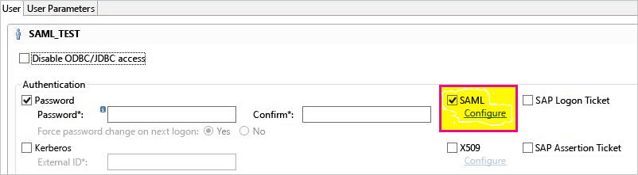
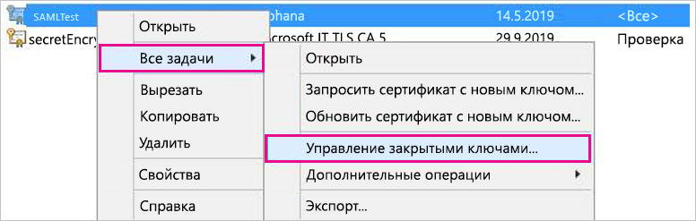

# <a name="use-security-assertion-markup-language-saml-for-sso-from-power-bi-to-on-premises-data-sources"></a>Использование SAML для единого входа из Power BI в локальные источники данных

Включение единого входа позволяет отчетам и панелям мониторинга Power BI легко обновлять данные из локальных источников с учетом разрешений, настроенных для таких источников на уровне пользователей. Используйте [язык разметки заявлений системы безопасности (SAML)](https://www.onelogin.com/pages/saml), чтобы включить простой единый вход. 

## <a name="supported-data-sources"></a>Поддерживаемые источники данных

Сейчас мы поддерживаем SAP HANA с SAML. Дополнительные сведения об установке и настройке единого входа для SAP HANA с помощью SAML см. в разделе [Единый вход через SAML для платформы бизнес-аналитики в HANA](https://wiki.scn.sap.com/wiki/display/SAPHANA/SAML+SSO+for+BI+Platform+to+HANA).

Мы поддерживаем набор дополнительных источников данных (включая SAP HANA) с помощью [Kerberos](service-gateway-sso-kerberos.md).

Для SAP HANA рекомендуется включить шифрование, прежде чем устанавливать подключение единого входа SAML. Чтобы включить шифрование, настройте на сервере HANA прием зашифрованных подключений и настройте на шлюзе шифрование для взаимодействия с сервером HANA. Так как драйвер ODBC для HANA не шифрует утверждения SAML по умолчанию, то, если не включить шифрование, подписанные утверждения SAML будут отправляться со шлюза на сервер HANA *в открытом виде* и могут быть перехвачены и повторно использованы третьими лицами. Инструкции по включению шифрования для SAP HANA с использованием библиотеки OpenSSL см. в [этом разделе](/power-bi/desktop-sap-hana-encryption).

## <a name="configuring-the-gateway-and-data-source"></a>Настройка шлюза и источника данных

Чтобы использовать SAML, необходимо установить отношение доверия между серверами HANA, для которых вы хотите включить единый вход, и шлюзом. В этом сценарии шлюз выступает в качестве поставщика удостоверений SAML (IdP). Установить это отношение можно различными способами, например, импортировав сертификат X509 поставщика удостоверений в хранилище доверия серверов HANA или подписав сертификат X509 шлюза с помощью сертификата корневого центра сертификации (ЦС), который является доверенным для серверов HANA. Хотя в этом руководстве мы описываем последний подход, вы можете использовать и другой подход, если он является более удобным.

Хотя в этом руководстве в качестве поставщика служб шифрования сервера HANA используется OpenSSL, вы также можете использовать рекомендуемую компанией SAP библиотеку шифрования SAP (также известную как CommonCryptoLib или sapcrypto) вместо OpenSSL, чтобы завершить установку отношения доверия во время настройки. Дополнительные сведения см. в официальной документации SAP.

Ниже описано, как установить отношение доверия между сервером HANA и поставщиком удостоверений шлюза путем подписывания сертификата X509 поставщика удостоверений шлюза с помощью сертификата корневого центра сертификации (ЦС), который является доверенным для сервера HANA. Вы создадите этот корневой ЦС.

1. Создайте сертификат X509 корневого центра сертификации и закрытый ключ. Например, чтобы создать сертификат X509 корневого центра сертификации и закрытый ключ в формате PEM, введите следующую команду:

   ```
   openssl req -new -x509 -newkey rsa:2048 -days 3650 -sha256 -keyout CA_Key.pem -out CA_Cert.pem -extensions v3_ca
   ```

    Убедитесь, что закрытый ключ корневого ЦС защищен должным образом. Если его раздобудет третье лицо, его можно будет использовать для несанкционированного доступа к серверу HANA. 

 1. Добавьте сертификат (например, CA_Cert.pem) в хранилище доверия сервера HANA, чтобы сервер HANA доверял любым сертификатам, подписанным с помощью только что созданного сертификата корневого центра сертификации. 

    Чтобы определить расположение хранилища доверия сервера HANA, просмотрите значение параметра конфигурации **ssltruststore**. Если вы выполняли инструкции по настройке OpenSSL в документации по SAP, в вашем сервере HANA, возможно, уже есть корневой центр сертификации, который можно использовать. Дополнительные сведения см. в разделе [Как настроить Open SSL для сервера SAP HANA в SAP HANA Studio](https://archive.sap.com/documents/docs/DOC-39571). Если вы хотите настроить единый вход SAML для нескольких серверов HANA, убедитесь, что каждый из этих серверов доверяет используемому корневому центру сертификации.

1. Создайте сертификат X509 поставщика удостоверений шлюза. 

   Например, чтобы создать запрос подписи сертификата (IdP_Req.pem) и закрытый ключ (IdP_Key.pem), которые будут действовать в течение года, выполните следующую команду:

   ```
   openssl req -newkey rsa:2048 -days 365 -sha256 -keyout IdP_Key.pem -out IdP_Req.pem -nodes
   ```

 1. Подпишите запрос подписи сертификата с помощью корневого центра сертификации, который был настроен для серверов HANA. 

    Например, чтобы подписать IdP_Req.pem с помощью CA_Cert.pem и CA_Key.pem (сертификат и ключ корневого ЦС), выполните следующую команду:

    ```
    openssl x509 -req -days 365 -in IdP_Req.pem -sha256 -extensions usr_cert -CA CA_Cert.pem -CAkey CA_Key.pem -CAcreateserial -out IdP_Cert.pem
    ```

     Полученный сертификат поставщика удостоверений будет действителен в течение года (см. значение параметра -days). 

Импортируйте сертификат поставщика удостоверений в HANA Studio, чтобы создать поставщик удостоверений SAML.

1. В SAP HANA Studio щелкните правой кнопкой мыши имя сервера SAP HANA, а затем перейдите к разделу **Безопасность** &gt; **Открыть консоль безопасности** &gt; **Поставщик удостоверений SAML** &gt; **Криптографическая библиотека OpenSSL**.

    

1. Выберите **Импортировать**, перейдите к файлу IdP_Cert.pem и импортируйте его.

1. В SAP HANA Studio выберите папку **Безопасность**.

    

1. Разверните раздел **Пользователи**, а затем выберите нужного пользователя, с которым необходимо сопоставить пользователя Power BI.

1. Нажмите кнопку **SAML**, а затем — **Настроить**.

    

1. Выберите поставщик удостоверений, который вы создали на шаге 2. В поле **Внешнее удостоверение** введите имя субъекта-пользователя Power BI (обычно это адрес электронной почты, с помощью которого пользователь входит в Power BI), а затем выберите команду **Добавить**. Если вы настроили шлюз для использования параметра конфигурации *ADUserNameReplacementProperty*, нужно ввести значение, которое заменит изначальное имя субъекта-пользователя Power BI. 

   Например, если задать для *ADUserNameReplacementProperty* значение **SAMAccountName**, вам нужно ввести **SAMAccountName** пользователя.

    

Теперь, когда у вас есть настроенные удостоверение и сертификат шлюза, преобразуйте сертификат в формат PFX и настройте его использование на шлюзе.

1. Преобразуйте сертификат в формат PFX, выполнив указанную ниже команду. Эта команда присваивает полученному PFX-файлу имя samlcert.pfx и устанавливает *root* в качестве пароля к нему.

    ```
    openssl pkcs12 -export -out samltest.pfx -in IdP_Cert.pem -inkey IdP_Key.pem -passin pass:root -passout pass:root
    ```

1. Скопируйте PFX-файл на компьютер шлюза:

    1. Дважды щелкните файл samltest.pfx, а затем выберите пункты **Локальный компьютер** &gt; **Далее**.

    1. Введите пароль, а затем нажмите кнопку **Далее**.

    1. Установите переключатель **Разместить все сертификаты в следующем хранилище** и щелкните пункты **Обзор** &gt; **Личные** &gt; **ОК**.

    1. Выберите пункт **Далее**, затем — **Готово**.

       

1. Предоставьте учетной записи службы шлюза доступ к закрытому ключу сертификата:

    1. На компьютере шлюза запустите консоль управления (MMC).

        

    1. В меню **Файл** выберите команду **Добавить или удалить оснастку**.

        

    1. Выберите пункты **Сертификаты** &gt; **Добавить**, а затем — **Учетная запись компьютера** &gt; **Далее**.

    1. Выберите **Локальный компьютер** &gt; **Готово** &gt; **ОК**.

    1. Разверните узел **Сертификаты** &gt; **Личные** &gt; **Сертификаты** и найдите сертификат.

    1. Щелкните сертификат правой кнопкой мыши и перейдите к разделу **Все задачи** &gt; **Управление закрытыми ключами**.

        

    1. Добавьте учетную запись службы шлюза в список. По умолчанию учетная запись — это **NT SERVICE\PBIEgwService**. Можно выяснить, какую учетную запись служба шлюза использует для работы, запустив **services.msc** и найдя **локальную службу шлюза данных**.

        

Наконец, выполните следующие действия для добавления отпечатка сертификата в конфигурацию шлюза.

1. Выполните следующую команду PowerShell, чтобы получить список сертификатов на вашем компьютере.

    ```powershell
    Get-ChildItem -path cert:\LocalMachine\My
    ```

1. Скопируйте отпечаток сертификата, который вы создали.

1. Перейдите в каталог шлюза. По умолчанию используется C:\Program Files\On-premises data gateway.

1. Откройте файл PowerBI.DataMovement.Pipeline.GatewayCore.dll.config и найдите раздел *SapHanaSAMLCertThumbprint*. Вставьте скопированный отпечаток.

1. Перезапустите службу шлюза.

## <a name="running-a-power-bi-report"></a>Запуск отчета Power BI

Теперь вы можете использовать страницу **Управление шлюзом** в Power BI, чтобы настроить источник данных SAP HANA. В разделе **Дополнительные параметры** включите единый вход с помощью SAML. Это позволяет публиковать отчеты и наборы данных с привязкой к этому источнику данных.

   

## <a name="troubleshooting"></a>Устранение неполадок

После настройки единого входа на основе SAML вы можете увидеть на портале Power BI следующую ошибку: *Указанные учетные данные невозможно использовать для источника SapHana*. Эта ошибка означает, что учетные данные SAML были отклонены SAP HANA.

Для устранения неполадок с учетными данными в SAP HANA вы можете получить подробные сведения, используя трассировки проверки подлинности на стороне сервера. Чтобы настроить трассировку для сервера SAP HANA, выполните следующие действия.

1. На сервере SAP HANA включите трассировку проверки подлинности, запустив следующий запрос.

    ```
    ALTER SYSTEM ALTER CONFIGURATION ('indexserver.ini', 'SYSTEM') set ('trace', 'authentication') = 'debug' with reconfigure 
    ```

1. Воспроизведите проблему.

1. В HANA Studio откройте консоль администрирования и перейдите на вкладку **Diagnosis Files** (Файлы диагностики).

1. Откройте последнюю трассировку сервера индекса и найдите *SAMLAuthenticator.cpp*.

    В файле должно быть подробное сообщение об ошибке с указанием основной причины, как в следующем примере.

    ```
    [3957]{-1}[-1/-1] 2018-09-11 21:40:23.815797 d Authentication   SAMLAuthenticator.cpp(00091) : Element '{urn:oasis:names:tc:SAML:2.0:assertion}Assertion', attribute 'ID': '123123123123123' is not a valid value of the atomic type 'xs:ID'.
    [3957]{-1}[-1/-1] 2018-09-11 21:40:23.815914 i Authentication   SAMLAuthenticator.cpp(00403) : No valid SAML Assertion or SAML Protocol detected
    ```

1. После завершения устранения неполадок отключите трассировку проверки подлинности, выполнив следующий запрос.

    ```
    ALTER SYSTEM ALTER CONFIGURATION ('indexserver.ini', 'SYSTEM') UNSET ('trace', 'authentication');
    ```

## <a name="next-steps"></a>Дальнейшие действия

Дополнительные сведения о локальном шлюзе данных и DirectQuery см. в следующих ресурсах:

* [Что такое локальный шлюз данных?](/data-integration/gateway/service-gateway-onprem)
* [Power BI и DirectQuery](desktop-directquery-about.md)
* [Источники данных, поддерживаемые DirectQuery](desktop-directquery-data-sources.md)
* [Использование DirectQuery и SAP Business Warehouse (BW)](desktop-directquery-sap-bw.md)
* [DirectQuery и SAP HANA](desktop-directquery-sap-hana.md)
