# Начало работы со службой Power BI (app.powerbi.com)
В этом руководстве содержатся сведения, которые помогут вам приступить к работе со ***службой Power BI***. Чтобы иметь представление о соответствии службы Power BI другим предложениям Power BI, мы советуем ознакомиться со статьей [Интерактивное обучение Power BI](guided-learning/gettingstarted.yml?tutorial-step=1).

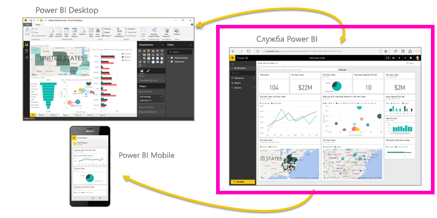

Вы можете использовать бесплатную версию Power BI или версию Power BI Pro. *Если у вас есть учетная запись*, откройте браузер и введите app.powerbi.com, чтобы открыть службу Power BI, независимо от используемой версии. Если вы используете службу впервые, рекомендуется ввести www.powerbi.com. На этом сайте вы можете узнать больше о Power BI, прежде чем войти в службу.  Когда будете готовы к работе со службой, щелкните ссылку **Бесплатная регистрация** в правом верхнем углу. Если администратор уже включил Power BI, не используйте кнопку бесплатной регистрации, но перейдите непосредственно по адресу app.powerbi.com. 

Если вам нужна помощь в работе с Power BI Desktop, см. статью [Приступая к работе с Desktop](desktop-getting-started.md). Сведения о мобильном приложении Power BI см. в статье [Приложения Power BI для мобильных устройств](mobile-apps-for-mobile-devices.md).

> [!TIP]
> Предпочитаете бесплатные курсы для самостоятельного обучения? [Запишитесь на наш курс по анализу и визуализации данных на сайте EdX](http://aka.ms/edxpbi).

Посетите наш [список воспроизведения на YouTube](https://www.youtube.com/playlist?list=PL1N57mwBHtN0JFoKSR0n-tBkUJHeMP2cP). Для начала просмотрите вводное видео о службе Power BI:
> 
> <iframe width="560" height="315" src="https://www.youtube.com/embed/B2vd4MQrz4M" frameborder="0" allowfullscreen></iframe>
> 
> 
> 

Microsoft Power BI помогает поддерживать актуальность важных данных.  ***Информационные панели*** службы Power BI позволяют быть в курсе событий в вашей компании.  В панелях мониторинга отображаются ***плитки***, которые можно щелкнуть для дальнейшего изучения данных в ***отчетах***.  Подключитесь к нескольким ***наборам данных***, чтобы объединить все необходимые данные вместе в одном месте. Нужна помощь со стандартными блоками Power BI?  См. раздел [Power BI — основные понятия](service-basic-concepts.md).

Если важные данные хранятся в файлах Excel или CSV, вы можете создать панель мониторинга Power BI, чтобы быть в курсе последних сведений в любом месте и делиться важными данными с другими.  Есть ли у вас подписка на приложение SaaS, такое как Salesforce?  Начните с подключения к Salesforce, чтобы автоматически создать панель мониторинга на основе этих данных, или [ознакомьтесь с другими приложениями SaaS](service-get-data.md), к которым можно подключиться. Если вы работаете в организации, проверьте, не опубликованы ли для вас какие-либо [приложения](service-create-distribute-apps.md).

Ознакомьтесь со всеми другими способами [получения данных для Power BI](service-get-data.md).

## Шаг 1. Получение данных
Ниже приведен пример получения данных из CSV-файла. Хотите изучить это руководство? [Скачайте этот образец CSV-файла](http://go.microsoft.com/fwlink/?LinkID=521962).

1. [Войдите в Power BI](http://www.powerbi.com/). Нет учетной записи? Не волнуйтесь, вы можете зарегистрироваться совершенно бесплатно.
2. Power BI откроется в браузере. Выберите **Получить данные** на панели навигации внизу слева.
   
   
3. Выберите **Файлы**. 
   
   
4. Перейдите к файлу на компьютере и выберите **Открыть**. Если файл сохранен в службе "OneDrive для бизнеса", выберите соответствующий параметр. Если файл сохранен локально, выберите **Локальный файл**. 
   
   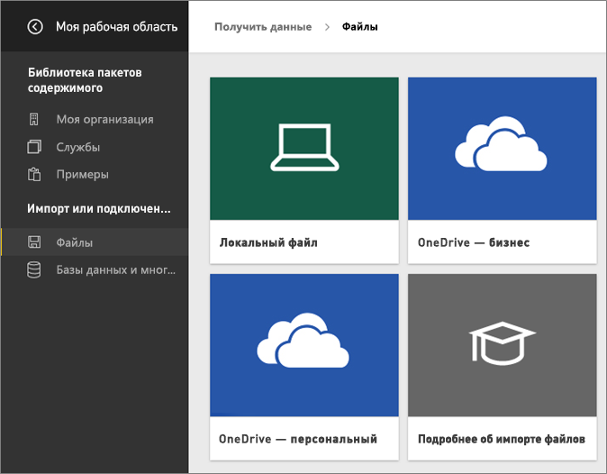
5. В этом руководстве мы выберем **Импорт** для добавления файла Excel как набора данных, который затем можно использовать для создания отчетов и информационных панелей. Если выбрать **Загрузить**, то в Power BI будет загружена вся рабочая книга Excel, которую можно открыть и редактировать в Excel в интерактивном режиме.
   
   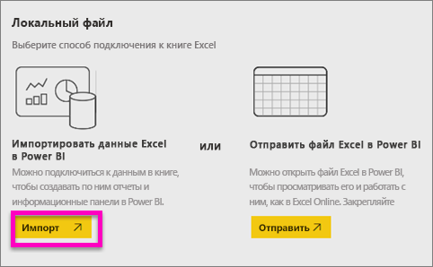
6. Подготовив набор данных, нажмите кнопку **Просмотреть набор данных**, чтобы открыть его в редакторе отчетов. 

    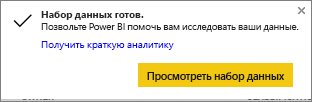

    Так как мы еще не создали визуализации, полотно отчета будет пустым.

    

6. Взгляните на строку меню вверху и обратите внимание на параметр **Представление чтения**. Если отображается параметр "Режим чтения", значит вы сейчас находитесь в **режиме правки**. 

    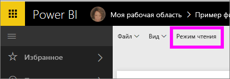

    В режиме правки вы можете создавать и изменять отчеты, так как вы являетесь *владельцем* отчета, то есть его *автором*. При совместном использовании отчета с коллегами они смогут взаимодействовать с отчетом только в режиме чтения, то есть они являются *пользователями*. Дополнительные сведения о режимах чтения и правки см. [здесь](service-reading-view-and-editing-view.md).
    
    Чтобы лучше ознакомиться с редактором отчетов, см. [эту статью](service-the-report-editor-take-a-tour.md).
   > 
 

## Шаг 2. Начало изучения набора данных
Теперь, когда вы подключились к данным, начните изучать их.  Если вы нашли интересные сведения, можно создать панель мониторинга, чтобы отслеживать эти данные и наблюдать за их изменением с течением времени. Давайте посмотрим, как это работает.
    
1. В редакторе отчетов мы будем использовать панель **Поля** в правой части страницы для создания визуализации.  Установите флажки рядом с элементами **Валовые продажи** и **Дата**.
   
   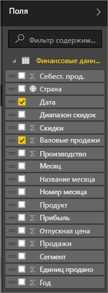

2. Power BI анализирует эти данные и создает визуализацию.  Если вы сначала выбрали элемент **Дата** , отображается таблица.  Если вы сначала выбрали элемент **Валовая выручка** , отображается диаграмма. Переключитесь в другой режим отображения данных. Давайте посмотрим на эти данные в виде графика. На панели **Визуализации** выберите значок графика (также называемый шаблоном).
   
   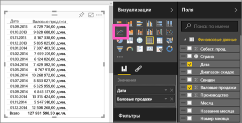

3. Это выглядит интересно, так что давайте *закрепим* график на панели мониторинга. Наведите указатель мыши на визуализацию и выберите значок **Закрепить**.  Закрепленная визуализация будет храниться на панели мониторинга и постоянно обновляться, поэтому вы сможете быстро отслеживать последние значения.
   
   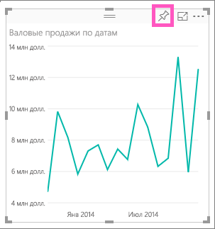

5. Так как этот отчет новый, вам будет предложено сохранить его, прежде чем закрепить визуализацию на панели мониторинга. Присвойте имя отчету (например, *Продажи за период времени*) и выберите **Сохранить и продолжить**. 
   
   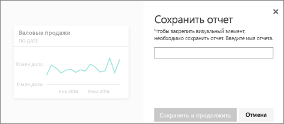
   
6. Давайте закрепим график на новой панели мониторинга и присвоим ему имя "Финансовый пример для руководства". 
   
   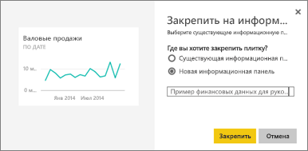
   
 1. Выберите **Закрепить**.
   
    Сообщение об успешном выполнении (рядом с правым верхним углом экрана) позволяет узнать, что визуализация была добавлена на панель мониторинга в качестве плитки.
   
    

8. Выберите **Перейти к панели мониторинга**, чтобы просмотреть график, закрепленный в виде плитки, на новой панели мониторинга. Сделать панель мониторинга еще лучше можно, если добавить еще больше плиток визуализаций, а также [переименовать и связать плитки или изменить их размер и положение](service-dashboard-edit-tile.md).
   
   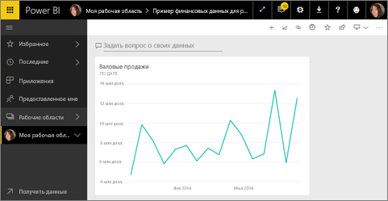
   
   Чтобы в любой момент вернуться к отчету, выберите новую плитку на панели мониторинга. Power BI вернет вас в редактор отчетов в режиме чтения. Чтобы переключиться обратно в ежим правки, выберите **Изменить отчет** в верхней строке меню. Когда вы перейдете в этот режим, продолжайте изучать данные и закреплять плитки. 

## Шаг 3. Дальнейшее знакомство с компонентом "Вопросы и ответы" (запросы на естественном языке)
1. Для быстрого исследования данных попробуйте задать вопрос в поле "Вопросы и ответы". Поле вопросов и ответов находится в верхней части панели мониторинга (**Задать вопрос о своих данных**) и верхней строке меню в отчете (**Задать вопрос**). Например, попробуйте ввести "в каком сегменте наибольший доход".
   
   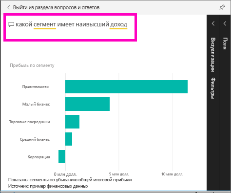

2. Компонент выполнит поиск ответа и представит его в виде визуализации. Нажмите значок закрепления,  чтобы отображать эту визуализацию также и на панели мониторинга.
3. Закрепите визуализацию на панели мониторинга "Финансовый пример для руководства".
   
    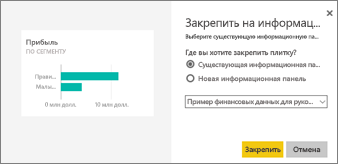

4. Вернитесь на панель мониторинга, где вы увидите новую плитку.

   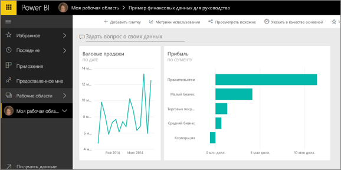

## Дальнейшие действия
Готовы узнать больше?  Вот некоторые замечательные возможности для изучения Power BI.

* [Подключитесь к другому набору данных](service-get-data.md).
* [Предоставьте общий доступ к панели мониторинга](service-share-dashboards.md) коллегам.
* Прочитайте [советы по созданию панелей мониторинга](service-dashboards-design-tips.md).
* Просматривайте панели мониторинга с помощью [приложения Power BI на мобильном устройстве](mobile-apps-for-mobile-devices.md).

Еще не готовы перейти дальше? Начните с этих разделов, которые помогут вам изучить все возможности Power BI.

* [Узнайте, как взаимодействуют отчеты, наборы данных, панели мониторинга и плитки](service-basic-concepts.md)
* Посетите наш сайт [интерактивного обучения Power BI](guided-learning/index.md) и пройдите несколько курсов (очень коротких).
* Просмотрите [видео о службе Power BI](videos.md).
* [Узнайте, какие примеры можно использовать](sample-datasets.md)

### Будьте в курсе с помощью Power BI
* Подпишитесь на страницу [@MSPowerBI в Twitter](https://twitter.com/mspowerbi)
* Подпишитесь на [наш видеоканал в YouTube](https://www.youtube.com/channel/UCy--PYvwBwAeuYaR8JLmrfg)
* Посмотрите [вебинары о начале работы с Power BI](webinars.md) по запросу
* Не знаете, куда обратиться за помощью? Дополнительные сведения см. на странице [10 советов по получению справки](service-tips-for-finding-help.md)

Появились дополнительные вопросы? [Попробуйте задать вопрос в сообществе Power BI.](http://community.powerbi.com/)

