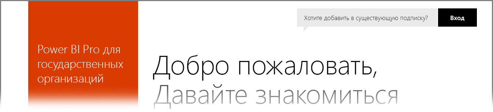

# Power BI для клиентов из государственных организаций США
Существует версия **службы Power BI** для клиентов из государственных организаций США, доступная в рамках подписок **Office 365 для сообщества государственных организаций США**. Версия **службы Power BI**, описанная в этой статье, специально предназначена для клиентов из государственных организаций США и отличается от коммерческой версии **службы Power BI**.

В следующих разделах описываются *возможности* и *ограничения* версии **службы Power BI** для государственных организаций США, приводятся **часто задаваемые вопросы** и ответы на них (включая инструкции по регистрации), а также ссылки на дополнительные сведения.

## Возможности Power BI для государственных организаций США
Важно помнить, что версия **Power BI для государственных организаций США** доступна только в рамках **лицензии Pro**. При использовании бесплатной лицензии эта версия недоступна. В **Power BI для государственных организаций США** доступны только определенные функции службы Power BI.

Ниже приведены функции службы **Power BI для государственных организаций США**, доступные в рамках лицензии **Pro**.

* создание и просмотр панелей мониторинга и отчетов;
* [ограничение емкости данных;](service-admin-manage-your-data-storage-in-power-bi.md)
* [обновление данных по расписанию;](refresh-data.md)
* обновляемые информационные панели группы;
* группы Active Directory для совместного использования и управления доступом;
* [импорт данных](service-get-data.md) и отчетов из файлов Excel, CSV и Power BI Desktop;
* Шлюз управления данными
* шифрование всех данных в Azure SQL и хранилище BLOB-объектов для Power BI;
* подключение к службам с помощью [пакетов содержимого](service-connect-to-services.md).

## Возможности подключения между службами для государственных учреждений и глобальными облачными службами Azure 

Azure распределяется между несколькими облаками. По умолчанию клиенты могут создавать разрешающие правила брандмауэра для экземпляров в том же облаке. Однако сетевое подключение между облаками имеет ряд отличий, и для обмена данными между службами нужно разрешать определенные правила брандмауэра. Если вы являетесь клиентом Power BI и хотите получить доступ к своим существующим экземплярам SQL в общедоступном облаке, вам необходимо открыть определенные правила брандмауэра в пространстве для экземпляров SQL, размещенных в пространстве IP-адресов облака Azure для государственных организаций США, в следующих центрах обработки данных:

* Айова, США
* Вирджиния, США
* Министерство обороны США — Техас
* Министерство обороны США — Аризона

В общедоступном облаке доступны пространства IP-адресов. Актуальные сведения об облаке для государственных организаций см. в [этой документации](https://www.microsoft.com/download/details.aspx?id=57063), доступной для скачивания.

## Ограничения Power BI для государственных организаций США
Некоторые функции, доступные в коммерческой версии **службы Power BI**, *отсутствуют* в версии **службы Power BI** для государственных организаций США. Команда разработчиков Power BI прилагает все усилия, чтобы сделать эти функции доступными для клиентов из государственных организаций США. Когда они станут доступными, эта статья будет обновлена.

* **Внедрить в SharePoint Online**. Вы не можете внедрять содержимого в SharePoint Online с помощью веб-части Power BI. Однако безопасное внедрение не работает при использовании веб-части [*Embed*](https://docs.microsoft.com/power-bi/service-embed-secure). Нужно добавить *app.powerbigov.us* в список исключений, для чего можно выполнить инструкции из статьи [Разрешение или запрет на внедрение контента на страницы SharePoint](https://support.office.com/article/allow-or-restrict-the-ability-to-embed-content-on-sharepoint-pages-e7baf83f-09d0-4bd1-9058-4aa483ee137b).
* Служба **Power BI для государственных организаций США** доступна только в рамках лицензии **Pro**. Все ссылки на лицензии Power BI (бесплатные) на портале администрирования (или как пользователи) выполняются в коммерческой облачной службе Power BI.
* **Аудит**. С июня 2018 г. аудит доступен в Центре безопасности и соответствия требованиям на портале Office 365.
* **Предоставление общего доступа внешним пользователям**. Совместная работа поддерживается в рамках клиента Power BI. С июня 2018 г. также можно предоставлять общий доступ пользователям вне вашего клиента Power BI. См. раздел [Предоставление содержимого Power BI внешним гостевым пользователям с помощью Azure AD B2B](service-admin-azure-ad-b2b.md).
* **Метрики использования для панелей мониторинга и отчетов**. Метрики использования недоступны для отчетов и панелей мониторинга. Клиенты могут использовать данные журнала аудита для получения сведений об использовании содержимого в своей организации.
* **Потоки данных** — потоки данных недоступны.
* **Отчеты с разбивкой на страницы** — отчеты с разбивкой на страницы в настоящее время доступны только в государственных организаций США в штате Виргиния.  Поддержка государственных организаций США в штате Техас планируется, но пока недоступна.
* Внедрение содержимого Power BI из облака сообщества для государственных организаций (GCC) возможно только с использованием SKU Office 365. Клиенты GCC High могут использовать [SKU Office 365 или Azure](developer/embedded-faq.md#what-is-the-difference-between-the-a-skus-in-azure-and-the-em-skus-in-office-365).

Если учетной записи назначены бесплатные лицензии на службу **Power BI**, эти учетные записи выполняются в коммерческой версии **Power BI** и не входят в состав предложения **Power BI для государственных организаций США**. С бесплатными учетными записями могут возникнуть следующие проблемы:

* Не удается выполнить аутентификацию шлюза, мобильных устройств и рабочего стола.
* Не удается получить доступ к коммерческим источникам данных Azure.
* PBIX-файлы должны передаваться из коммерческих источников данных вручную.
* Мобильные приложения Power BI недоступны.

Для решения этих проблем, обратитесь к представителю учетной записи.

## Часто задаваемые вопросы о версии службы Power BI для государственных организаций США
Следующий список вопросов и ответов поможет вам быстро найти необходимые сведения об этой службе.

**Вопрос.** Как перенести данные из коммерческой версии **Power BI** в **службу Power BI** для государственных организаций США?

**Ответ.** Вашему администратору следует создать новый экземпляр **Power BI** в рамках отдельной подписки для государственной организации США. После этого вы сможете реплицировать свои данные из коммерческой версии в **службу Power BI** для государственных организаций США, удалить коммерческую лицензию и связать существующий домен с новой службой для государственных организаций США.

**Вопрос.** Почему не удается подключиться к определенному пакету содержимого?

**Ответ.** Прежде чем подключаться к этому пакету содержимого, убедитесь, что ваша подписка включена.

**Вопрос.** Я хочу использовать **Power BI** в своей государственной организации в США. С чего начать?

**Ответ.** Процесс регистрации (иногда называемый *подключением*) зависит от лицензии и подписки. Дополнительные сведения см. в статье о [регистрации государственных организаций США в службе Power BI](service-govus-signup.md).

**Вопрос.** Отличается ли URL-адрес для подключения к службе **Power BI** для государственных организаций США от URL-адреса для подключения к коммерческой службе **Power BI**? Существует ли другой URL-адрес у Облака сообщества для государственных организаций (высокий уровень защиты) — GCC High?

**Ответ.** Да, эти URL-адреса разные. Оба они приведены в следующей таблице.

| URL-адрес коммерческой версии | URL-адрес версии для государственных организаций США | URL-адрес правительства США для GCC High |
| --- | --- | --- |
| https://app.powerbi.com/ |[https://app.powerbigov.us](https://app.powerbigov.us) | [https://app.high.powerbigov.us](https://app.high.powerbigov.us) |

**Вопрос.** Моя учетная запись подготовлена в нескольких национальных облаках. Как при использовании **Power BI Desktop** выбрать облако для подключения?

**Ответ.** Начиная с выпуска **Power BI Desktop** за июль 2018 г. вы можете выбрать облако, которое хотите использовать, при входе в приложение **Power BI Desktop**.

## Дальнейшие действия
Служба Power BI предоставляет широкие возможности. Дополнительные сведения и руководства, включая статью с инструкциями по регистрации в службе, см. по следующим ссылкам:

* [Регистрация в службе Power BI для государственных организаций США](service-govus-signup.md)
* <a href="https://channel9.msdn.com/Blogs/Azure/Cognitive-Services-HDInsight-and-Power-BI-on-Azure-Government">Power BI US Government Demo</a> (Power BI для государственных организаций США (демо-версия))
* [Интерактивное обучение работе с Power BI](guided-learning/index.yml)
* [Приступая к работе со службой Power BI](service-get-started.md)
* [Что такое Power BI Desktop?](desktop-what-is-desktop.md)

