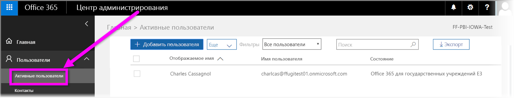

# Регистрация государственных организаций США в службе Power BI
Существует версия **службы Power BI** для клиентов из государственных организаций США, доступная в рамках подписок **Office 365 для сообщества государственных организаций США**. Версия **службы Power BI**, описанная в этой статье, специально предназначена для клиентов из государственных организаций США и отличается от коммерческой версии **службы Power BI**.

Дополнительные сведения о **службе Power BI** для государственных организаций США, включая ее возможности и ограничения, см. в обзорной статье, посвященной [Power BI для государственных организаций США](service-govus-overview.md).

> [!NOTE]
> Эта статья предназначена для администраторов, которые имеют право регистрировать государственные организации США для использования Power BI. Если вы — обычный пользователь, обратитесь к администратору, чтобы получить подписку на службу Power BI для государственных организаций США.
> 
> 

## Выберите соответствующий процесс регистрации для своей государственной организации США
Ваша организация может быть новым клиентом **Office Government Cloud** или уже иметь соответствующую подписку. В следующих разделах подробно описано, как выполнить регистрацию с учетом статуса клиента Office Government Cloud и Power BI, а также на основе существующей подписки.

После регистрации в Power BI для государственных организаций США некоторые функции могут не работать, пока торговый представитель или представитель службы поддержки не выполнит процесс адаптации для вас. Сведения об этих функциях см. в статье [Power BI для клиентов из государственных организаций США](service-govus-overview.md). Чтобы завершить процесс адаптации и включить функции, обратитесь к торговому представителю или к представителю службы поддержки.

### Государственные организации США, которые являются новыми клиентами Office Cloud
Если ваша организация — новый клиент **Office Government Cloud**, выполните следующие действия.

> [!NOTE]
> Эти действия должен выполнять администратор портала.
>

1. Перейдите на [https://products.office.com/en-us/government/office-365-web-services-for-government](https://products.office.com/en-us/government/office-365-web-services-for-government).

>[!NOTE]
>Если вы не хотите регистрироваться в Office Government Cloud сейчас, сообщите об этом своему торговому представителю.
>

2. Выберите Office G3 и заполните форму для получения пробной версии Office.
3. Теперь, когда вы являетесь клиентом Office Cloud, перейдите к действиям, описанным в разделе "Существующие клиенты Office Government Cloud".

### Существующие клиенты Office Government Cloud
Если ваша организация является клиентом **Office Government Cloud**, но у нее нет подписки на **Power BI** (бесплатную или другую версию), выполните следующие действия.

> [!NOTE]
> Эти действия должен выполнять администратор портала.
> 
> 

1. Войдите в существующую учетную запись Office Government Cloud и перейдите на портал администрирования.
2. Выберите **Выставление счетов**.
3. Выберите **Приобрести службу**.
4. Выберите параметр Power BI Pro Government (Power BI Pro для государственных организаций) и щелкните **Try** (Попробовать) или **Buy Now** (Купить сейчас).
5. Подтвердите свой заказ.
6. Добавьте пользователей в учетную запись.
   
   
7. Войдите в **службу Power BI** для государственных организаций США по адресу [https://app.powerbigov.us](https://app.powerbigov.us).

## Дополнительные сведения о регистрации
Ниже приведены дополнительные сведения о регистрации в **Power BI для клиентов из государственных организаций США**. Эта информация применима к разным вариантам миграции лицензирования.

### Прямая пробная версия Power BI Pro для подключения клиентов
* Последовательно выберите "Выставление счетов" > "Приобрести службу" > "Power BI Pro Gov". Затем выберите покупку, а не пробную версию.
* Укажите необходимые сведения и получите лицензии.
* Удалите пробную версию Power BI Pro. Или удалите старые лицензии и назначьте пользователям новые.
* Выполните вход по адресу [https://app.powerbigov.us](https://app.powerbigov.us).

### Пробная версия Power BI Pro торгового посредника для подключения клиентов
Перейдите в раздел **Выставление счетов > Подписки** и выберите подписку **Power BI Pro for Government** (Power BI Pro для клиентов из государственных организаций). Вы увидите следующие сведения:

* Доступность
* Назначенные лицензии
* Ссылки для назначения лицензий пользователям
* Если вашей организации все еще назначена пробная версия, сделайте следующее.
  * Щелкните **Назначено** под подпиской пробной версии и удалите из нее пользователей, которых вы хотите добавить в платную подписку.
  * Перейдите к платной подписке и назначьте ее этим пользователям.

### Инструкции по добавлению в утвержденный список
*Добавление в утвержденный список* — это процесс, с помощью которого команда инженеров Power BI переносит клиентов из коммерческой облачной среды в безопасную облачную среду для государственных организаций. Это гарантирует правильную работу компонентов, доступных в облаке для клиентов из государственных организаций США. Все существующие (или новые) клиенты, представленные государственными организациями США, которые в первый раз приобрели соответствующие службы **Power BI** *должны* инициировать описанную ниже процедуру добавления в список разрешений. Ее нужно выполнить до установки или миграции служб **Power BI** для государственных организаций США. 

Чтобы *включить ваш клиент в список разрешенных* для облака государственных организаций США, обратитесь в службу поддержки учетных записей Майкрософт. Обратите внимание, что этот запрос могут создать только администраторы. Процесс добавления в *список разрешений* занимает около трех недель. В это время инженеры Power BI вносят соответствующие изменения, чтобы обеспечить корректную работу клиента в облаке для клиентов из государственных организаций США.

Клиенты, которые переходят с **бесплатных** лицензий на **Power BI для государственных организаций США** (и, соответственно, переходят к связанным функциям лицензии **Pro**, о чем было сказано в этой статье ранее), столкнутся с определенными проблемами (описанными ниже), если команда инженеров Power BI не добавит клиент в *список разрешений*.

### Смешанные лицензии Free и Pro в клиентах для государственных организаций США
Если в клиенте есть бесплатная лицензия и лицензия Pro для государственных организаций США, эти лицензии не будут удалены, но одна из них не будет работать должным образом. Если клиент был успешно добавлен в *список разрешений*, произойдет следующее:

* Пользователи, использующие бесплатную лицензию, больше не смогут выполнить вход в Power BI с помощью **Power BI Desktop**, что приведет к функциональным проблемам, о чем будет описано в разделе ниже.
* Все клиенты, назначенные лицензиям Pro для государственных организаций США, смогут работать как раньше, а также использовать шлюзы, Power BI Desktop и мобильные приложения.

При использовании лицензий Free и Pro в клиенте для государственных организаций США, а также успешном завершении процесса добавления в *список разрешений* может случиться следующее:

Что происходит **перед _добавлением в список разрешений_**:

* Пользователи, которым назначены бесплатные лицензии, находятся в коммерческой облачной среде.
* Лицензии Pro для государственных организаций США отображаются на портале, и администратор может назначить их пользователям. Во избежание потери данных для лицензий Free администратор должен назначить пользователям лицензии Pro для государственных организаций США. У пользователей, которым назначены эти лицензии, будет доступ к функциям Power BI Pro для клиентов государственных организаций США, однако пока клиент не будет добавлен в *список разрешений*, могут возникнуть следующие проблемы в работе:
  
  * Сбой проверки подлинности шлюза, мобильных устройств и Power BI Desktop.
  * Не удается получить доступ к коммерческим источникам данных Azure.
  * PBIX-файлы должны передаваться из коммерческой службы Power BI вручную.
  * Мобильные приложения Power BI недоступны.

Что происходит **после _добавления в список разрешений_**:

* Пользователи, использующие бесплатную версию, которые работают в коммерческой службе Power BI, могут работать как раньше. Но клиентское приложение больше не будет правильно выполнять аутентификацию.
* Пользователи, использующие лицензию Pro для облака для государственных организаций США, могут продолжать использовать **Power BI для клиентов из государственных организаций США** как раньше.

Для идентификации пользователей в клиенте, которым назначена бесплатная лицензия Power BI, администраторы могут запустить отчет лицензирования, после чего пользователи, использующие бесплатную лицензию, отобразятся в подписке **Power BI Standard**.

## Дальнейшие действия
Служба Power BI предоставляет широкие возможности. Дополнительные сведения и руководства, включая статью с инструкциями по регистрации в службе, см. по следующим ссылкам:

* [Общие сведения о службе Power BI для государственных организаций США](service-govus-overview.md)
* [Интерактивное обучение работе с Power BI](guided-learning/gettingstarted.yml?tutorial-step=1)
* [Приступая к работе со службой Power BI](service-get-started.md)
* [Что такое Power BI Desktop?](desktop-what-is-desktop.md)

