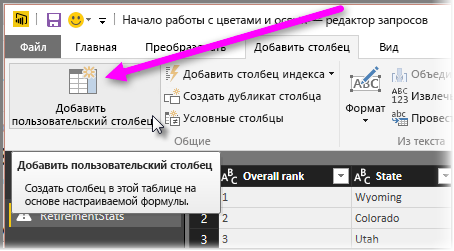

# Гистограммы
Создать гистограмму в Power BI можно несколькими способами. Мы начнем с простейшего и перейдем к более сложным.

## Простейшие гистограммы
Для начала нужно выяснить, в каком запросе есть поле, на основе которого требуется построить гистограмму.  Воспользуйтесь параметром запроса *Ссылка* , чтобы создать новый запрос, и назовите его *Гистограмма FieldName*. Используйте параметр **Группировать по** на ленте **Преобразование** и выберите агрегатную функцию **подсчет строк** . Убедитесь, что для получаемого агрегатного столбца используется тип данных число. Затем эти данные можно представить на странице отчетов. Этот способ простой и быстрый, однако он не работает при наличии множества точек данных и не допускает перебора визуальных элементов.

## Определение контейнеров для создания гистограммы
Выясните, в каком запросе есть поле, на основе которого требуется построить гистограмму. Воспользуйтесь параметром запроса *Ссылка* , чтобы создать новый запрос, и назовите его *FieldName*.  Теперь можно определите контейнеры с правилом. Используйте параметр **Добавить настраиваемый столбец** на ленте **Добавить столбец** и создайте настраиваемое правило.

Убедитесь, что для получаемого агрегатного столбца используется тип данных число. Теперь можно воспользоваться методом «Группировать по», описанным в разделе **Простейшие гистограммы** ранее в этой статье, чтобы создать гистограмму. Этот параметр обрабатывает больше точек данных, но по-прежнему не позволяет выполнять перебор.

## Определение гистограммы, которая поддерживает перебор.
Перебор — это связывание визуальных элементов таким образом, чтобы, когда пользователь выбирает одну точку данных в одном визуальном элементе, другие визуальные элементы на странице отчета выделяли или фильтровали точки данных, связанные с выбранной.  Поскольку мы обрабатываем данные во время запроса, потребуется создать связь между таблицами и убедиться, что мы знаем, какой элемент сведений относится к контейнеру на гистограмме, и наоборот.

Запустите процесс, воспользовавшись параметром *Ссылка* в запросе, содержащем поле, на основе которого требуется построить гистограмму.  Назовите новый запрос *Контейнеры*.  Для этого примера назовем исходный запрос *Сведения*.  Удалите все столбцы, кроме столбца, который будет использоваться как контейнер для гистограммы.  Теперь выделите столбец, щелкните его правой кнопкой мыши и воспользуйтесь функцией *Удалить дубликаты*, после чего в нем останутся только уникальные значения. Если имеются десятичные числа, сначала можно воспользоваться рекомендацией по определению контейнеров для создания гистограммы, чтобы получить управляемый набор контейнеров.  Проверьте данные, которые отображаются в области предварительного просмотра запроса. Если вы увидите пустые значения или значения null, перед созданием связи потребуется их исправить. См. раздел "Создание связи при наличии в данных значений null или пустых значений". Использовать этот метод может быть проблематично из-за необходимости выполнить сортировку. Чтобы обеспечить правильность сортировки контейнеров, воспользуйтесь инструкциями в разделе "Порядок сортировки: отображение категорий в нужном порядке". 

> [!NOTE]
> Имеет смысл подумать о порядке сортировки до начала создания любых визуальных элементов.   
> 
> 

Далее необходимо определить связь между запросами *Контейнеры* и *Сведения* в столбце контейнеров.  В *Power BI Desktop*щелкните *Управление связями* на ленте.  Создайте связь с запросами *Контейнеры* в левой таблице и запросами *Сведения* в правой таблице, а затем выберите поле, которое используется для создания гистограммы. 

Затем нужно создать гистограмму. Перетащите поле «Контейнер» из таблицы *Контейнеры* . Удалите поле по умолчанию из получившейся столбчатой диаграммы.  Теперь перетащите поле гистограммы из таблицы *Сведения* в тот же визуальный элемент. В списке полей измените статистическое выражение по умолчанию на "Количество". Результатом является гистограмма. При создании другого (древовидного) визуального элемента из таблицы "Сведения" выберите точку данных на древовидной диаграмме, чтобы увидеть выделенную гистограмму и показать гистограмму для выбранной точки данных относительно тенденции для всего набора данных.

