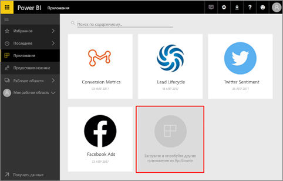
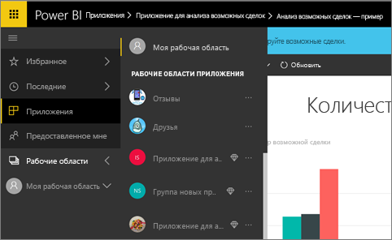
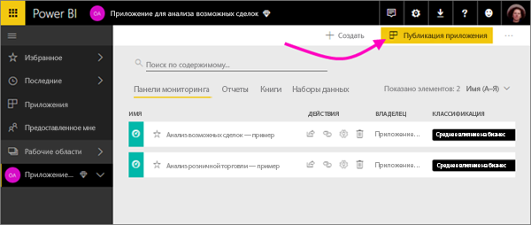
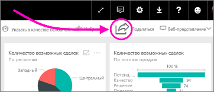

# Как предоставить общий доступ к панелям мониторинга, отчетам и плиткам в Power BI?
Панели мониторинга и отчеты создаете вы. Их также можно создавать совместно с сотрудниками. Затем возникает необходимость предоставить к ним доступ другим пользователям. Какой же лучший способ распространить их?

В этой статье мы сравним варианты совместной работы и предоставления общего доступа в Power BI: 

* Совместная работа с сотрудниками для создания полноценных отчетов и информационных панелей в *рабочих областях приложений*.
* Объединение готовых панелей мониторинга и отчетов в *приложения* и их публикация для большой группы пользователей или всей организации.
* Предоставление нескольким пользователям общего доступа к панелям мониторинга или отчетам из службы или мобильных приложений Power BI.
* Публикация данных в Интернете, где любой пользователь сможет работать с ними.
* Печать. 

Вы можете выбрать любой из вариантов совместного использования панели мониторинга. В любом случае вам нужна лицензия [Power BI Pro](service-free-vs-pro.md) либо же содержимое должно находиться в [емкости Premium](service-premium.md). В зависимости от выбранного варианта требования к лицензии могут быть разными для коллег, просматривающих ваши информационные панели. В следующих разделах представлен подробный обзор возможностей. У вас есть предложения? Для команды Power BI ваши отзывы всегда важны, поэтому перейдите на [сайт сообщества Power BI](https://community.powerbi.com/).

*Приложения в службе Power BI*

## Совместная работа с коллегами для создания приложения
Предположим, что вы и ваши коллеги хотите опубликовать аналитические данные Power BI для всей организации. Лучший способ сделать это — создать *приложение*. Приложение — это совокупность панелей мониторинга и отчетов, предназначенная предоставить ключевые метрики для вашей организации. 

Чтобы создать приложение, вам понадобится *рабочая область приложения* с коллегами в качестве участников. Рабочая область приложения — это промежуточная область, где вы и ваши коллеги можете совместно работать над информационными панелями и отчетами Power BI. Вы все можете создавать отчеты в Power BI Desktop и публиковать их в рабочей области приложения. И для этого всем вам нужны лицензии Power BI Desktop.

**Если вам нужно просто предоставить доступ коллегам к готовой информационной панели, не обязательно добавлять их в рабочую область приложения.** Вместо этого [создайте панель мониторинга в рабочей области приложения](service-create-distribute-apps.md) и опубликуйте это приложение для ваших коллег. 

## Публикация приложения для широкой аудитории
Предположим, что вам необходимо распространить свою панель мониторинга для широкой аудитории. Вы и ваши сотрудники создали *рабочую область приложения*, затем создали и настроили в ней информационные панели, отчеты и наборы данных. Теперь выберите нужные информационные панели и отчеты и опубликуйте их как приложение: либо для членов группы безопасности или списка рассылки, либо для всей организации. 

В службе Power BI ([https://powerbi.com](https://powerbi.com)) приложения легко обнаруживать и устанавливать. Вы можете отправить бизнес-пользователям прямую ссылку на приложение, или они могут найти его в AppSource. Дополнительные сведения о [публикации приложений](service-create-distribute-apps.md#publish-your-app). 

После установки приложения они смогут просматривать его в браузере или на мобильном устройстве.

Для просмотра приложения пользователям требуется лицензия Power BI Pro, либо приложение должно быть сохранено в емкости Power BI Premium. Дополнительные сведения см. в статье [Что такое Power BI Premium?](service-premium.md)

## Совместное использование информационных панелей и отчетов
Предположим, вы завершили работу над информационной панелью и отчетом в своей рабочей области или рабочей области приложения, и хотите, чтобы у других пользователей был к ним доступ. Чтобы реализовать это, *предоставьте к ней общий доступ* пользователям. 

Вы можете предоставить общий доступ к вашему содержимому. Для этого у вас и соответствующих пользователей должна быть лицензия Power BI Pro либо же содержимое должно находиться в [емкости Premium](service-premium.md). При совместном использовании информационной панели или отчета они могут просматривать их и взаимодействовать с ними, но не могут их изменять. Они видят на панелях мониторинга и в отчетах те же данные, что и вы, при условии, что к базовому набору данных не применяется защита на уровне строк (RLS). Коллеги, которым вы предоставляете общий доступ, тоже могут, с вашего разрешения, предоставлять доступ своим коллегам. 

Вы можете также предоставлять общий доступ пользователям за пределами своей организации. Они могут просматривать панель мониторинга и взаимодействовать с ней, но не могут предоставлять к ней общий доступ. 

Дополнительные сведения о предоставлении общего доступа к информационной панели из службы Power BI см. в [этой статье](service-share-dashboards.md).

Вы также можете [поделиться прямой ссылкой на отчет](service-share-reports.md), не прибегая к использованию информационной панели. Вы можете добавить фильтр к ссылке, чтобы получатели просматривали отчет в отфильтрованном представлении.

## Добавление заметок и предоставление общего доступа из мобильных приложений Power BI
В мобильных приложениях Power BI для устройств iOS и Android вы можете добавлять заметки к плиткам, отчетам или визуальным элементам, а затем предоставлять к ним доступ другим пользователям по электронной почте. 

Когда вы предоставляете доступ к моментальному снимку, плитке, отчету или визуальному элементу, получатели видят эти элементы такими же, какими они были отправлены в сообщении электронной почты. Сообщение также содержит ссылку на панель мониторинга или отчет. Если у получателей есть лицензия Power BI Pro либо же содержимое находится в [емкости Premium](service-premium.md), а вы уже предоставили им общий доступ к объекту, они смогут его открыть. Моментальные снимки плиток можно отправлять кому угодно, не только сотрудникам в том же домене электронной почты, что и вы.

См. дополнительные сведения в статье [Добавление заметок и совместное использование плиток, отчетов или визуальных элементов в мобильных приложениях iOS](mobile-annotate-and-share-a-tile-from-the-mobile-apps.md).

Вы также можете [предоставить общий доступ к моментальному снимку плитки](mobile-share-tile-windows-10-phone-app.md) из приложения Power BI для устройств Windows 10.

## Публикация в Интернете
Вы можете публиковать отчеты Power BI в Интернете, внедряя интерактивные визуализации в записи блога, веб-сайты, социальные сети и другие средства коммуникации в сети на любом устройстве. Любой пользователь в Интернете может просматривать ваши отчеты; вы не можете выбирать, кто может просматривать уже опубликованный отчет. Пользователям не нужна лицензия Power BI. Функция публикации в Интернете доступна только для отчетов с возможностью редактирования. Отчеты, к которым вам предоставили доступ или которые находятся в приложении, публиковать нельзя. Дополнительные сведения о [публикации в Интернете](service-publish-to-web.md).

## Печать или сохранение в формате PDF или в другом формате статических файлов
Вы также можете распечатать или сохранить в формате PDF (или в другом формате статических файлов) всю панель мониторинга, плитку панели мониторинга, страницу отчета или визуализацию отчета в службе Power BI. Отчеты можно распечатывать только постранично, весь отчет сразу распечатать нельзя. Ознакомьтесь с дополнительными сведениями о [печати или сохранении в качестве статического файла](service-print.md).

## Дальнейшие действия
* Хотите оставить отзыв? Поделитесь своими предложениями на [веб-сайте сообщества Power BI](https://community.powerbi.com/).
* [Предоставление общего доступа к информационным панелям коллегам и другим пользователям](service-share-dashboards.md)
* [Создание и публикация приложений с информационными панелями и отчетами в Power BI](service-create-distribute-apps.md)
* Появились дополнительные вопросы? [Ответы на них см. в сообществе Power BI](http://community.powerbi.com/).

