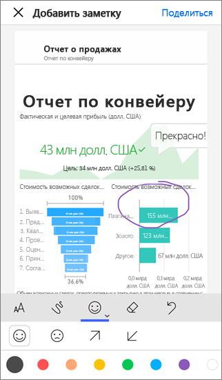

# Способы совместного использования работы в Power BI

Вы создали панели мониторинга и отчеты. Возможно, они были созданы совместно с коллегами. Теперь необходимо предоставить к ним доступ другим пользователям. Какой же лучший способ распространить их? В этой статье мы сравним следующие варианты совместной работы и общего доступа в Power BI:

* Совместная работа с коллегами для создания полноценных отчетов и панелей мониторинга в *рабочих областях*.
* Объединение готовых панелей мониторинга и отчетов в *приложения* и их предоставление большой группе пользователей или всей организации.
* Создание *общих наборов данных*, которые ваши коллеги могут использовать в качестве основы для своих собственных отчетов в их рабочих областях.
* Предоставление нескольким пользователям общего доступа к панелям мониторинга или отчетам из службы или мобильных приложений Power BI.
* Добавление заметок и предоставление общего доступа из мобильных приложений Power BI.
* Внедрение отчета в Microsoft Teams.
* Печать отчетов.
* *Внедрение* отчетов на защищенных порталах или общедоступных веб-сайтах.
* Создание *приложения-шаблона*, которое можно распространять среди внешних пользователей Power BI с помощью Microsoft AppSource.

Какой бы из вариантов вы ни выбрали, для совместного использования содержимого нужна [лицензия Power BI Pro](service-features-license-type.md), либо содержимое должно находиться в [емкости Premium](service-premium-what-is.md). В зависимости от выбранного варианта требования к лицензии могут быть разными для коллег, просматривающих ваше содержимое. В следующих разделах представлен подробный обзор возможностей. 

*Приложения в службе Power BI*

## Совместная работа в рабочей области

Если команды работают вместе, им нужен доступ к одним и тем же документам для быстрого взаимодействия. В рабочих областях Power BI команды совместно управляют своими панелями мониторинга, отчетами, наборами данных и книгами. Иногда пользователи Power BI упорядочивают рабочие области в зависимости от структуры организации, а иногда создают их для конкретных проектов. Иногда в организациях используется несколько рабочих областей для хранения разных версий отчетов и панелей мониторинга. 

Рабочие области предоставляют роли, которые определяют, какие разрешения есть у ваших коллег. Эти роли позволяют определить, кто может управлять всей рабочей областью либо изменять или предоставлять ее содержимое.

Вы можете поместить содержимое в раздел "Моя рабочая область" и поделиться им оттуда. Но рабочие области лучше подходят для совместной работы, чем раздел "Моя рабочая область", так как у содержимого может быть несколько владельцев. Все члены вашей команды могут вносить изменения и предоставлять доступ другим. Раздел "Моя рабочая область" подходит для размещения одноразового или личного содержимого отдельными пользователями.

Предположим, у вас есть готовая панель мониторинга и вы хотите предоставить коллегам общий доступ к ней. Как лучше всего предоставить доступ к панели мониторинга? Ответ зависит от ряда факторов. 

- Если коллегам требуется поддерживать панель мониторинга в актуальном состоянии или нужен доступ ко всему содержимому рабочей области, рекомендуется добавить их в рабочую область. 
- Если вашим коллегам нужна только эта панель мониторинга, а не все содержимое рабочей области, у вас снова есть несколько вариантов. Если нескольким людям нужна только одна определенная панель мониторинга, можно просто предоставить к ней общий доступ.
- Но если панель мониторинга является частью большего набора содержимого, доступ к которому нужен многим коллегам, лучше всего опубликовать *приложение*.

В Power BI доступен новый интерфейс рабочей области. Ознакомьтесь со статьей [Создание рабочих областей](service-create-the-new-workspaces.md) и узнайте, как изменились рабочие области. 

## Распространение аналитических сведений в приложении

Предположим, что вам нужно распространить свою панель мониторинга для широкой аудитории в вашей организации. Вы и ваши коллеги создали *рабочую область*, а затем создали и настроили в ней информационные панели, отчеты и наборы данных. Теперь выберите нужные панели мониторинга и отчеты и опубликуйте их как приложение для группы или для всей организации.

Служба Power BI ([https://app.powerbi.com](https://app.powerbi.com)) позволяет легко находить и устанавливать приложения. Вы можете отправить бизнес-пользователям прямую ссылку на приложение, или они могут найти его в AppSource. С разрешения администратора Power BI его можно установить автоматически в учетных записях Power BI ваших коллег. Дополнительные сведения о [публикации приложений](service-create-distribute-apps.md).

После установки приложения они смогут просматривать его в браузере или на мобильном устройстве.

Для просмотра приложения пользователям требуется лицензия Power BI Pro, либо приложение должно быть сохранено в емкости Power BI Premium. Дополнительные сведения см. в статье [Что такое Power BI Premium?](service-premium-what-is.md)

Вы также можете публиковать приложения для пользователей за пределами организации. Они могут просматривать панель мониторинга и взаимодействовать с содержимым приложения, но не могут предоставлять к ней общий доступ. Теперь вы можете создать *приложение-шаблон* и развернуть его в любом клиенте Power BI.

## Общий доступ к набору данных

Нужно понимать, что некоторые люди лучше умеют создавать высококачественные и продуманные модели данных в своих отчетах. Возможно, вы являетесь именно таким человеком. Вся ваша организация может извлечь пользу из использования таких продуманных моделей данных. *Общие наборы данных* подходят на эту роль. При создании отчета с моделью данных, который должны использовать все пользователи, можно сохранить этот отчет в службе Power BI и предоставить подходящим людям право на его использование. Затем они могут создать собственные отчеты на основе вашего набора данных. Таким образом, все базируют отчеты на одних данных и видят схожую картину мира.

Дополнительные сведения о [создании и использовании общих наборов данных](service-datasets-across-workspaces.md).

## Совместное использование информационных панелей и отчетов

Предположим, вы завершили работу над панелью мониторинга и отчетом в разделе "Моя рабочая область" или какой-либо другой рабочей области и хотите, чтобы у других пользователей был к ним доступ. Чтобы реализовать это, *предоставьте к ней общий доступ* пользователям. 

Вы можете предоставить общий доступ к своему содержимому. Для этого у вас и соответствующих пользователей должна быть лицензия Power BI Pro либо же содержимое должно находиться в рабочей области в [емкости Premium](service-premium-what-is.md). При совместном использовании панели мониторинга или отчета получатели могут просматривать их и взаимодействовать с ними, но не могут их изменять. Они видят на панелях мониторинга и в отчетах те же данные, что и вы, при условии, что к базовому набору данных не применяется защита на уровне строк (RLS). Коллеги, которым вы предоставляете общий доступ, тоже могут, с вашего разрешения, предоставлять доступ своим коллегам. 

Вы можете также предоставлять общий доступ пользователям за пределами своей организации. Они тоже могут просматривать панель мониторинга и отчет и взаимодействовать с ними, но не могут предоставлять к ним общий доступ. 

См. дополнительные сведения о [предоставлении общего доступа к панелям мониторинга и отчетам](service-share-dashboards.md) из службы Power BI. Можно также добавить фильтр в ссылку и [предоставить общий доступ к отфильтрованному представлению отчета](service-share-reports.md).

## Добавление заметок и предоставление общего доступа из мобильных приложений Power BI

В мобильных приложениях Power BI для устройств iOS и Android вы можете добавлять заметки к плиткам, отчетам или визуальным элементам, а затем предоставлять к ним доступ другим пользователям по электронной почте.

Когда вы предоставляете доступ к моментальному снимку, плитке, отчету или визуальному элементу, получатели видят эти элементы такими же, какими они были отправлены в сообщении электронной почты. Сообщение также содержит ссылку на панель мониторинга или отчет. Если у получателей есть лицензия Power BI Pro либо же содержимое находится в [емкости Premium](service-premium-what-is.md), а вы уже предоставили им общий доступ к объекту, они смогут его открыть. Моментальные снимки плиток можно отправлять кому угодно, не только сотрудникам в том же домене электронной почты, что и вы.

См. дополнительные сведения в статье [Добавление заметок и совместное использование плиток, отчетов или визуальных элементов в мобильных приложениях iOS](consumer/mobile/mobile-annotate-and-share-a-tile-from-the-mobile-apps.md).

Вы также можете [предоставить общий доступ к моментальному снимку плитки](consumer/mobile/mobile-windows-10-phone-app-get-started.md) из приложения Power BI для устройств Windows 10.

## Внедрение отчета в Microsoft Teams

Внедрение отчетов Power BI и отчетов Power BI с разбивкой на страницы в Microsoft Teams повышает эффективность совместной работы на основе данных в организации. Можно добавить отдельные вкладки Power BI для каждого отдельного отчета и присвоить каждой вкладке имя отчета или любое другое имя. Ваши коллеги могут просматривать отчеты на вкладках Power BI в Teams. Они также могут открыть окно беседы и комментировать отчет прямо в Teams. Узнайте подробнее о [внедрении отчетов в Microsoft Teams](service-embed-report-microsoft-teams.md).

## Печать или сохранение в формате PDF или в другом формате статических файлов

Вы также можете распечатать или сохранить в формате PDF (или в другом формате статических файлов) всю панель мониторинга, плитку панели мониторинга, страницу отчета или визуализацию отчета в службе Power BI. Отчеты можно распечатывать только постранично, весь отчет сразу распечатать нельзя. Ознакомьтесь с дополнительными сведениями о [печати или сохранении в качестве статического файла](consumer/end-user-print.md).

## Внедрение отчетов на защищенных порталах или общедоступных веб-сайтах

### Внедрение на безопасных порталах

Вы можете внедрять отчеты Power BI на порталах и веб-сайтах, где они нужны вашим пользователям.  
Функции **Внедрить в SharePoint Online** и **Внедрить** в службе Power BI позволяют безопасно внедрять отчеты для внутренних пользователей. 

- Функция **Внедрить в SharePoint Online** работает с веб-частью Power BI для SharePoint Online. Она предоставляет интерфейс единого входа со средствами управления внедрением отчета. 
- Функция **Внедрить** работает на любом портале или веб-сайте, которые поддерживают внедрение содержимого с помощью URL-адреса или iFrame. 

Любой из этих вариантов гарантирует соблюдение службой Power BI всех разрешений и мер по защите данных, прежде чем содержимое предоставляется пользователю. Человек, просматривающий отчет, должен иметь соответствующую лицензию. Дополнительные сведения о функциях [Внедрить в SharePoint Online](service-embed-report-spo.md) и [Внедрить](service-embed-secure.md) в Power BI.

### Публикация на общедоступных веб-сайтах

Функция **Опубликовать в Интернете** позволяет вам открывать доступ к отчетам Power BI для всего Интернета, внедряя интерактивные визуализации в записях блога, веб-сайтах, социальных сетях и других сетевых средствах коммуникации на любом устройстве. Любой пользователь в Интернете может просматривать ваши отчеты; вы не можете выбирать, кто может просматривать уже опубликованный отчет. Пользователям не нужна лицензия Power BI. Функция публикации в Интернете доступна только для отчетов с возможностью редактирования. Отчеты, к которым вам предоставили доступ или которые находятся в приложении, публиковать нельзя. Дополнительные сведения о [публикации в Интернете](service-publish-to-web.md).

>[!Warning]
>Используйте функцию [Публикации в Интернете](service-publish-to-web.md) только для того, чтобы сделать содержимое общедоступным, а не для предоставления общего доступа внутри организации.

## Создание и развертывание приложений-шаблонов

*Приложения-шаблоны* предназначены для публичного распространения, часто в Microsoft AppSource. Вы создаете приложение и можете развернуть его для любого клиента Power BI с минимальным количеством кода или вообще без него. Ваши клиенты подключаются к своим данным и создают экземпляры собственных учетных записей. Дополнительные сведения о [приложениях-шаблонах Power BI](service-template-apps-overview.md).

## Дальнейшие действия

* [Предоставление общего доступа к информационным панелям коллегам и другим пользователям](service-share-dashboards.md)
* [Создание и публикация приложений с информационными панелями и отчетами в Power BI](service-create-distribute-apps.md)
* [Внедрение отчета на защищенный портал или веб-сайт](service-embed-secure.md)

Хотите оставить отзыв? Поделитесь своими предложениями на [веб-сайте сообщества Power BI](https://community.powerbi.com/).

У вас имеются и другие вопросы? [Ответы на них см. в сообществе Power BI.](https://community.powerbi.com/)
