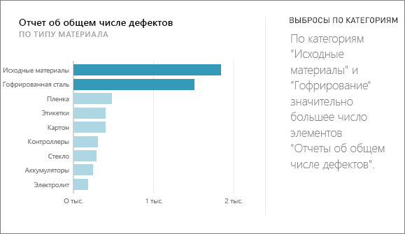
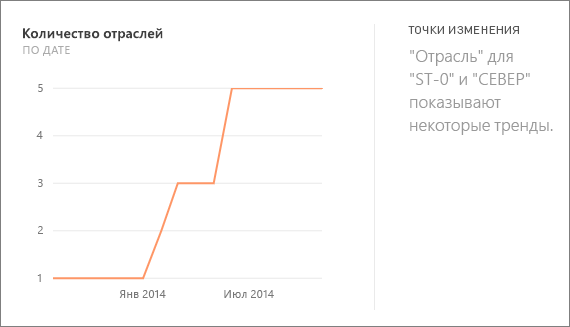
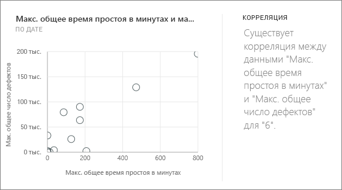
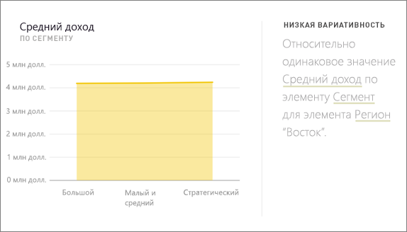
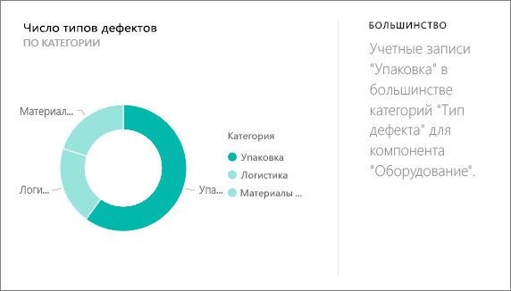
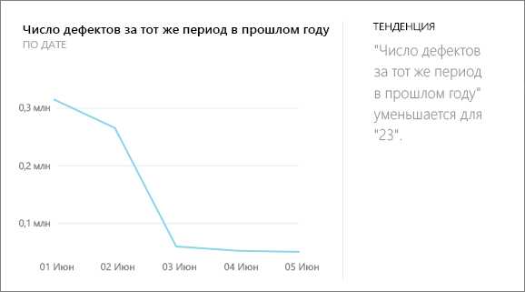
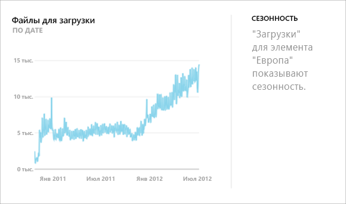
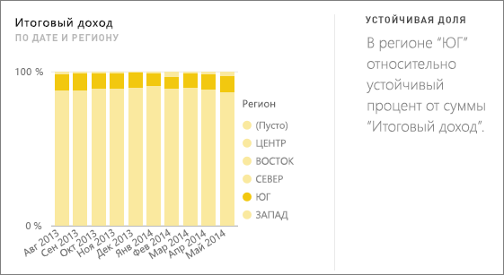
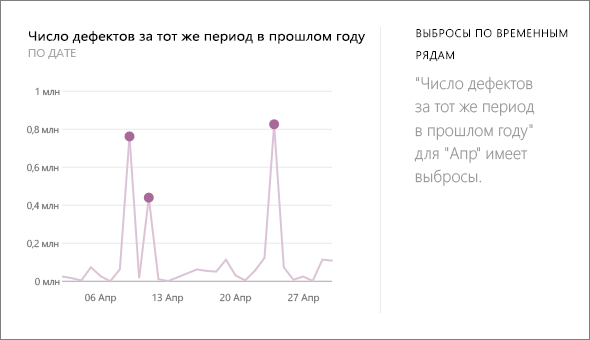

# Типы быстрого анализа данных, поддерживаемые Power BI
## Как работает быстрый анализ данных?
Power BI быстро ищет различные подмножества наборов данных, применяя ряд сложных алгоритмов для обнаружения интересных комбинаций. Power BI сканирует максимальный объем набора данных в течение выделенного количества времени.

Можно выполнять быстрый анализ данных для набора данных или плитки (связанная аналитика).   

## Какие результаты краткой аналитики можно получить?
Ниже перечислены некоторые используемые нами алгоритмы.

## Провалы или всплески значений
Выделяет случаи, когда при измерении по модели значения одного или двух членов измерения намного превышают значения остальных  

## Точки изменений во временных рядах
Выделяет существенные изменения в тенденциях, наблюдаемых во временном ряде данных.

## Корреляция
Выявляет случаи корреляции  между несколькими показателями, нанесенными на график в зависимости от какого-либо измерения в наборе данных.

## Низкая вариативность
Выявляет случаи, когда точки данных близки к среднему значению.

## Большинство (основные факторы)
Находит случаи, когда большую часть общего значения можно свести к одному фактору, выполнив детализацию по другому параметру.  

## Общие тенденции во временных рядах
Определяет восходящие и нисходящие тенденция в данных временных рядов.

## Сезонность во временных рядах
Находит повторяющийся рисунок в данных временных рядов, такие как недельная, месячная или годовая сезонность.

## Постоянная доля
Выделяет случаи иерархической корреляции между долей дочернего значения и суммарным значением родительского элемента в непрерывной переменной.

## Выбросы временных рядов
Определяет, есть ли во временном ряде значения даты или времени, которые существенно отличаются от остальных значений даты и времени.

## Дальнейшие действия
[Быстрый анализ данных Power BI](service-insights.md)

Если у вас есть набор данных, [оптимизируйте его для краткой аналитики](service-insights-optimize.md).

Появились дополнительные вопросы? [Ответы на них см. в сообществе Power BI.](http://community.powerbi.com/)

