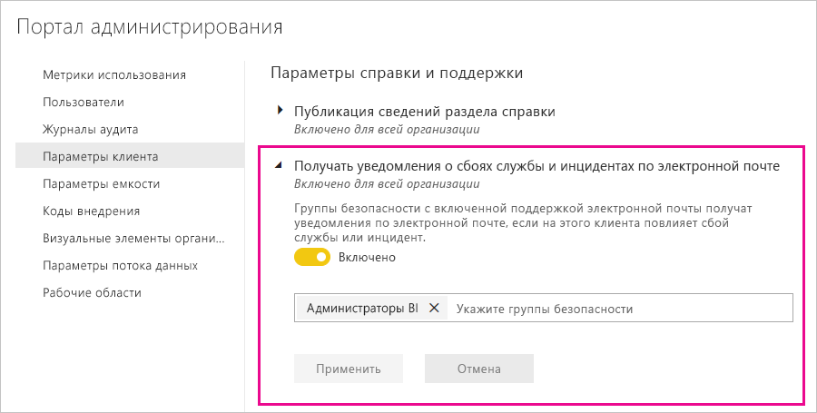

# Уведомления о перебое в работе служб

Крайне важно иметь представление о доступности критически важных бизнес-приложений. Power BI обеспечивает уведомление об инциденте, поэтому вы можете получать сообщения электронной почты при нарушении или снижении производительности в службе. Хотя благодаря Соглашению об уровне обслуживания (SLA) в 99,9 % для Power BI такие события возникают нечасто, мы хотим проинформировать вас об этом. На следующем снимке экрана показан тип сообщения электронной почты, которое вы получите при включении уведомлений:

Сейчас мы отправляем сообщения электронной почты для следующих _сценариев надежности_:

- Надежность открытия отчетов
- Надежность обновления моделей
- Надежность обновления запросов

К примерам таких уведомлений относятся ситуации, когда пользователи сталкиваются с расширенной задержкой в работе, включая открытие отчетов, обновление набора данных или выполнение запросов. После разрешения инцидента вы получите сообщение электронной почты с дальнейшими указаниями.

> [!NOTE]
> Сейчас эта функция доступна только для выделенных емкостей в Power BI Premium. Она недоступна для общей или встроенной емкости.

## Включение уведомлений

Администратор клиента Power BI включает уведомления на портале администрирования:

1. Найдите или создайте группу безопасности с включенной поддержкой электронной почты, которая должна получать уведомления.

1. На портале администрирования выберите **Параметры клиента**. В разделе **Параметры справки и поддержки** разверните узел **Получать уведомления о сбоях службы и инцидентах по электронной почте**.

1. Включите уведомления, войдите в группу безопасности и нажмите кнопку **Применить.**

    

> [!NOTE]
> Power BI отправляет уведомления из учетной записи no-reply-powerbi@microsoft.com. Убедитесь, что эта учетная запись внесена в список разрешений, чтобы уведомления не попадали в папку нежелательной почты.

## Дальнейшие действия

[Варианты поддержки Power BI Pro и Power BI Premium](service-support-options.md)

Появились дополнительные вопросы? [Ответы на них см. в сообществе Power BI.](http://community.powerbi.com/)