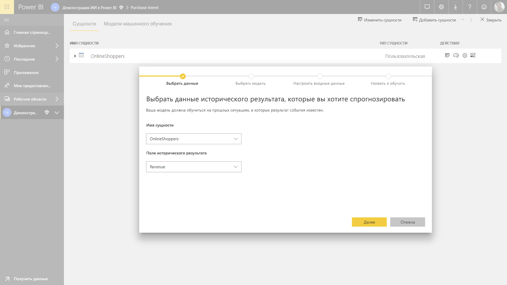
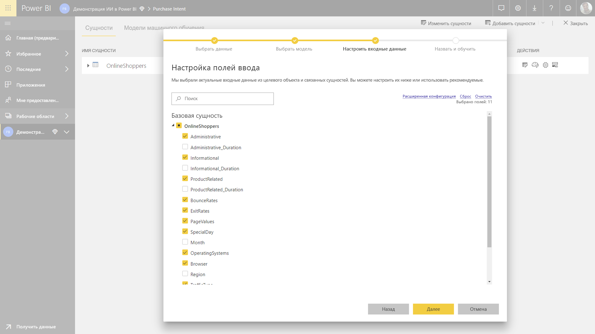
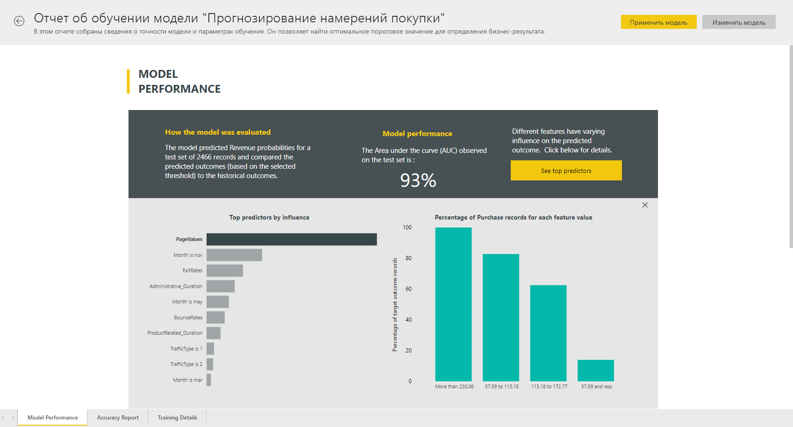
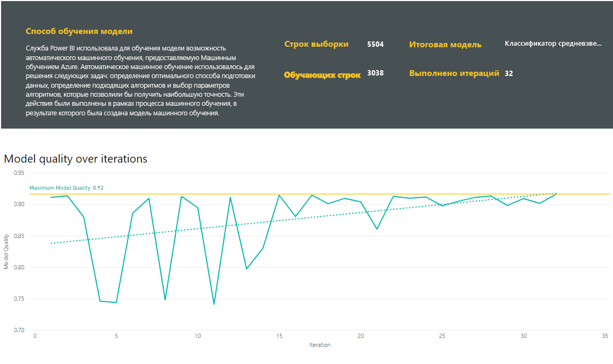
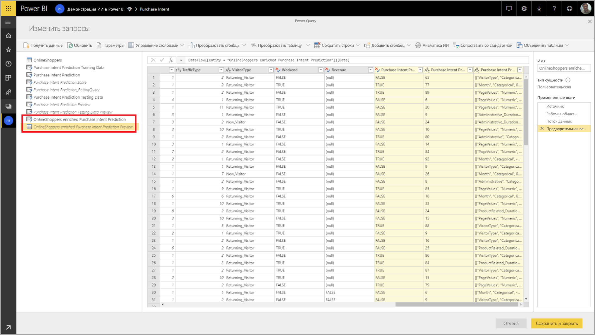
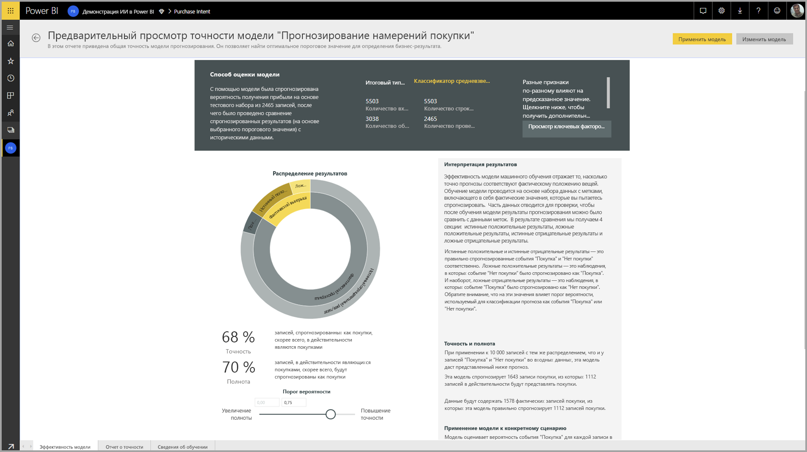
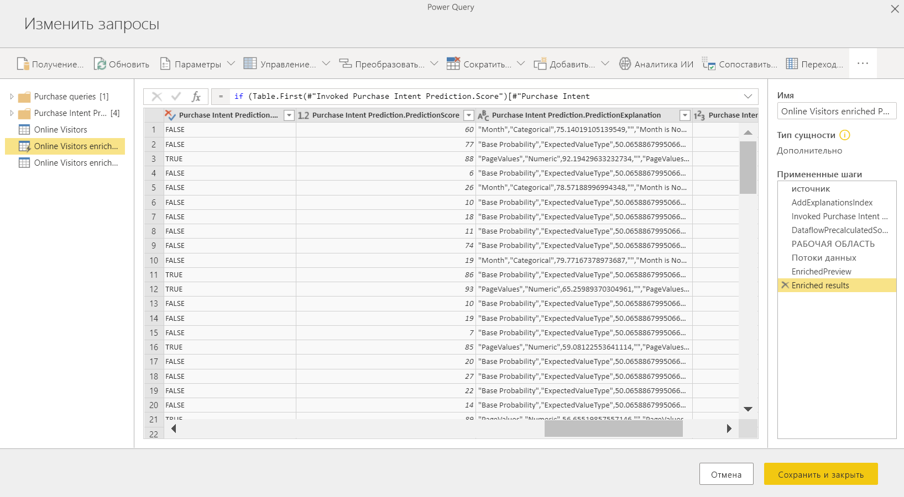
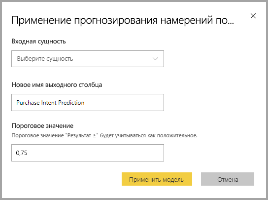
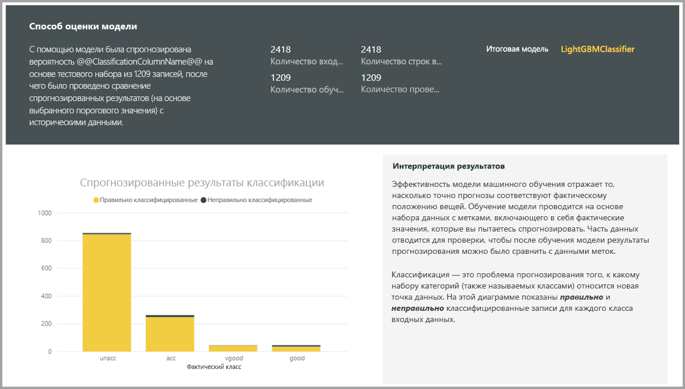
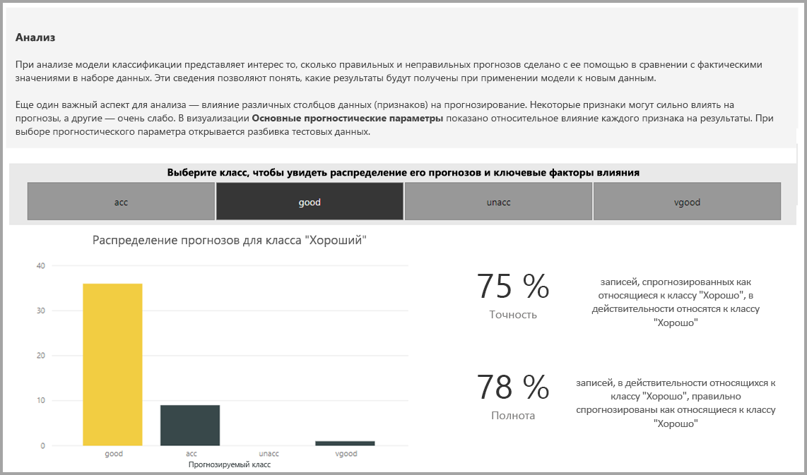

# Автоматизированное машинное обучение в Power BI (предварительная версия)

Автоматические машинного обучения (AutoML) для потоков данных позволяет бизнес-аналитики для обучения, проверки и вызова моделей машинного обучения, непосредственно в Power BI. Он включает простой интерфейс для создания новой модели машинного Обучения, где аналитики могут использовать свои потоки данных, чтобы указать входные данные для обучения модели. Служба автоматически извлекает наиболее важных компонентов, выбирает соответствующий алгоритм и настраивает и проверяет модель машинного Обучения. После обучения модели, Power BI автоматически создает отчет, содержащий результаты проверки, объясняющее, производительность и аналитикам. Модель может быть вызвана на все новые или обновленные данные в потоке данных.

Автоматические машинного обучения доступна для потоков данных, которые размещаются на Power BI Premium и внедренный емкости. В этой предварительной версии AutoML позволяет обучать модели машинного обучения для моделей двоичный прогноз, классификации и регрессии.

## Работа с AutoML

[Power BI потоки данных](service-dataflows-overview.md) предлагают подготовки данных Самообслуживание для больших объемов данных. AutoML позволяет использовать усилия подготовки данных для построения моделей машинного обучения, непосредственно в Power BI.

AutoML в Power BI позволяет специалистам по анализу данных использовать потоки данных для построения моделей машинного обучения с упрощенные средства, с использованием только что навыков Power BI. Большая часть обработки и анализа данных за создание моделей машинного Обучения можно автоматизировать Power BI с защитных функций, чтобы убедиться, что модели, формируемой имеет хорошего качества и видимость для предоставления с полным пониманием процесса, используемый для создания модели машинного Обучения.

AutoML поддерживает создание **двоичный прогноз**, **классификации**, и **регрессии** моделей для потоков данных. Это типы моделей контролируемого машинного обучения, что означает, что они учиться возможными результатами прошлых наблюдений, для прогнозирования результатов других наблюдений. Входной набор данных для обучения модели AutoML — это набор записей, которые **с меткой** с возможными результатами.

AutoML в Power BI интегрирует [автоматической ML](https://docs.microsoft.com/azure/machine-learning/service/concept-automated-ml) из [службы машинного обучения Azure](https://docs.microsoft.com/azure/machine-learning/service/overview-what-is-azure-ml) для создания моделей машинного Обучения. Тем не менее не требуется подписка Azure с помощью AutoML в Power BI. Процесс обучения и размещения моделей машинного Обучения в полностью управляется в службе Power BI.

После обучения модели машинного Обучения AutoML автоматически создает отчет Power BI, объясняющее, скорее всего, производительность Обучения модели. AutoML особое внимание уделяется explainability, выделив цветом ключевые факторы влияния среди входные данные, которые влияют на прогнозы, возвращенный модели. Отчет также содержит ключевые метрики для модели, в зависимости от типа модели машинного Обучения.

Другие страницы отчета, созданного Показать статистическую сводку по модели и сведений обучения. Статистическая Сводка представляет интерес для пользователей, которые хотели бы видеть меры обработки и анализа стандартные данные о производительности для модели. Обучающие сведения представлены сведения о всех итераций, выполненных для создания модели, с параметрами связанные моделирования. Он также описывает, как каждый набор входных данных использовался для создания модели машинного Обучения.

Затем можно применить модели машинного Обучения к данным для оценки. При обновлении потока данных, прогнозов из машинного Обучения модели автоматически применяются к данным. Power BI также включает в себя объяснение индивидуальных для каждого конкретного прогноза рейтинг, который создает модель машинного Обучения.

## Создание модели машинного обучения

В этом разделе описывается создание AutoML обучения модели. 

### Подготовка данных для создания модели машинного Обучения

Чтобы создать модель машинного обучения в Power BI, необходимо сначала создать поток данных для данных информация, исторические результат, который используется для обучения модели машинного Обучения. Дополнительные сведения о настройке потока данных, см. в разделе [подготовки самообслуживания данных в Power BI](service-dataflows-overview.md).

В текущем выпуске Power BI использует данные из одной сущности для обучения модели машинного Обучения. Поэтому если исторических данных состоит из нескольких сущностей, необходимо вручную присоединить данные в сущность отдельного потока данных. Следует также добавить вычисляемые столбцы для любой бизнес-метрики, которая может быть строгим экстраполяции для результата, который вы пытаетесь спрогнозировать.

AutoML имеет определенные требования к данных для обучения модели машинного обучения. Эти требования описаны в следующих разделах, основанные на типах нужную модель.

### Настройка входные данные модели машинного Обучения

Чтобы создать модель AutoML, выберите значок машинного Обучения в **действия** столбца потока данных сущности с данным исторических данных и выберите **добавить модель машинного обучения**.

Упрощенные запускается, состоящий из мастера, который проведет вас через процесс создания модели машинного Обучения. Мастер включает следующие простые действия.

1. Выберите сущность с исторических выходные данные, а в поле, для которого необходимо получить прогноз
2. Выберите тип модели, в зависимости от типа прогноза, который вы бы хотели см. в разделе
3. Выберите модель для использования в качестве прогнозируемого сигналы входные данные
4. Имя модели и сохранить конфигурацию

Поля журнала результата определяет атрибут label для обучения модели машинного Обучения, показано на следующем рисунке.

При указании поля исторических результата AutoML анализирует данные метки для определения типов моделей машинного Обучения, которые могут быть обучены для этих данных и предлагает скорее всего, тип модели машинного Обучения, который может быть настроен. 

> [!NOTE]
> Возможно, некоторые типы моделей не поддерживается для данных, которые вы выбрали.

AutoML также анализирует все поля в выбранной сущности, чтобы предложить входные данные, которые могут быть использованы для обучения модели машинного Обучения. Этот процесс являются приблизительными и на основе статистического анализа, поэтому вам следует проверить входных атрибутах, используемых. Входные данные, зависящие от поля исторических результата (или поле метки), не следует для обучения модели машинного Обучения, так как они будут влиять на его производительность.

На заключительном этапе можно назовите модель и сохранить свои настройки.

На этом этапе будет предложено обновить поток данных, который начинает процесс обучения модели машинного Обучения.

### Обучение модели машинного Обучения

Обучение моделей AutoML является частью обновления потока данных. AutoML сначала подготавливает данные для обучения.

AutoML разделяет исторических данных вами на обучающий и проверочный наборы данных. Проверочный набор данных — это набор контрольных данных, который используется для проверки эффективности модели после обучения. Они реализуются как **обучающий и проверочный** сущностей в потоке данных. AutoML используется перекрестная проверка для проверки модели.

Затем анализируется каждое поле ввода, и применяется подстановки, который заменяет отсутствующих значений с подстановкой. AutoML использует несколько стратегий разных подстановки. Затем все необходимые выборки и нормализации применяются к данным.

AutoML применяется несколько преобразований являются все выбранные поля ввода, на основе типа данных и его статистических свойств. AutoML использует эти преобразования для извлечения признаков для обучения модели машинного Обучения.

Процесс обучения моделей AutoML состоит из 50 итераций моделирования разные алгоритмы и параметры гиперпараметров, чтобы найти модель с наилучшей производительностью. Каждая из этих моделей производительность оценивается с помощью проверки с помощью тестового набора контрольных данных. На этом этапе обучения AutoML создает несколько конвейеров для обучения и проверки этих итераций. Оценка производительности моделей может занять время, в любом от нескольких минут до нескольких часов в зависимости от размера набора данных и доступных ресурсов, выделенных ресурсов.

В некоторых случаях окончательная модель создается использовать совокупного обучения, где используются несколько моделей лучше прогнозной производительность.

### Explainability AutoML модели

После обучения модели, AutoML анализирует связь между входные признаки и выходные данные модели. Он оценивает величину и направление изменения выходные данные модели тестового набора контрольных данных для каждого входного компонента. Этот процесс называется *компонентов важности*.

### AutoML модели отчета

AutoML создает отчет Power BI, описывающий производительность модели во время проверки, а также важности глобального компонента. В отчете представлена сводка результатов от применения контрольные проверочные данные модели машинного Обучения и сравнение прогнозов с помощью известных результирующие значения.

Можно просмотреть отчет модели, чтобы понять его производительность. Можно также проверить, что ключевые факторы влияния модели соответствуют бизнес-аналитику о возможными результатами.

Диаграммы и меры, используемые для описания эффективности модели в отчете зависят от типа модели. В следующих разделах описываются эти диаграммы производительности и меры.

Дополнительные страницы в отчете могут описывать статистических показателей о модели с точки зрения обработки и анализа данных. Например **двоичный прогноз** отчет включает диаграммы прибыль и кривой ROC для модели.

Отчеты также содержат **обучающие сведения** страница с описанием того, как модель была обучена и располагает диаграммой, описывающий производительность модели на каждой итерации выполняется.

Другой раздел на этой странице описывается, как подстановки метод, используемый для заполнения недостающих значений для поля ввода, а также как преобразованы каждое поле ввода для извлечения характеристик, используемых в модели. Она также включает параметры, используемые в окончательной модели.

Если в модели, формируемой используется совокупного обучения, то **обучающие сведения** страница также содержит раздел с описанием вес каждой составляющих модели, в совокупности, а также его параметры.

## Применение модели AutoML

Если вас устраивают производительность созданной модели машинного Обучения, можно применить их для новых или обновленных данных, при обновлении потока данных. Выбрав это можно сделать из модели отчета, **применить** кнопки в правом верхнем углу.

Чтобы применить модели машинного Обучения, необходимо указать имя сущности, к которому должен применяться и префикс для столбцов, которые будут добавлены в эту сущность для выходных данных модели. Префикс для имен столбцов по умолчанию является имя модели. *Применить* функция может включать дополнительные параметры, относящиеся к типу модели.

Применение модели машинного Обучения создает новую сущность потока данных с суффиксом **насыщенные < model_name >** . Например при применении _PurchaseIntent_ модели _OnlineShoppers_ сущности, создает выходные данные **OnlineShoppers насыщенные PurchaseIntent**.

В настоящее время выходные данные сущности не может использоваться для предварительного просмотра результатов модели машинного Обучения в редакторе Power Query. Выходные столбцы всегда показывать значение null в результате. Чтобы просмотреть результаты, секунды, выходные данные сущности с суффиксом **насыщенные < model_name > Предварительная версия** создается при применении модели.

Необходимо обновить поток данных для предварительного просмотра результатов в редакторе запросов.

При применении модели AutoML всегда регулярно обновляет прогнозы при обновлении потока данных.

AutoML также пояснение индивидуальных для каждой строки, он оценивает в выходных данных сущности.

Чтобы использовать мнения и прогнозы из модели машинного Обучения в отчете Power BI, может подключиться к сущности выходной из Power BI Desktop с помощью **потоки данных** соединителя.

## Двоичный Прогноз моделей

Двоичный моделей прогнозирования, более формально известный под названием **моделей двоичной классификации**, используются для классификации набора данных на две группы. Они используются для прогнозирования событий, которые может иметь двоичный результат, например, преобразует ли возможность продажи, которые учетной записи будет оттока, ли оплаты на времени. является ли транзакция мошеннических операций и т. д.

Так как результат является двоичным, Power BI ожидает, что метка двоичный Прогноз модели, чтобы иметь логическое значение, с возможными результатами с меткой **true** или **false**. К примеру в модели преобразования сделка, сбыта, реализованные, помечаются как true, те, которые были утеряны, помечаются как false и открытые возможные сделки продаж, помечаются как null.

Выходные данные в двоичный Прогноз модели является Оценка вероятности, который определяет вероятность, что можно получить результат, соответствующий значению метки, должны выполняться.

### Обучение модели двоичный прогноз

Чтобы создать модель прогнозирования двоичных, входной объект, содержащий обучающих данных должен иметь логическое поле как поле исторических результат, чтобы определить последние возможными результатами.

Предварительные требования:

* Логическое поле должны использоваться в качестве поля исторических результата
* Как минимум 50 строк исторических данных является обязательным для каждого класса результатов

Как правило если последние результаты идентифицируются по полям в другой тип данных, можно добавить вычисляемый столбец для преобразования их в логическое значение с помощью Power Query.

Процесс создания для двоичный Прогноз модели соответствует же действия, как другие AutoML моделей, описанных в разделе **Настройка входные данные модели машинного Обучения** выше.

### Двоичный Прогноз модели отчета

Двоичный Прогноз модели выходным вероятность, что запись будет результату определяется значением метки логическое значение true. Отчет включает срез для порог вероятности, что влияет способ интерпретации выше и ниже порогового значения вероятности оценки.

Отчет описывает эффективность модели на основе *истинных положительных результатов*, *ложных срабатываний*, *истинных отрицательных* и *ложных отрицательных результатов*. Значение true, положительных результатов и истинно отрицательных результатов, правильно прогнозируемых выходных данных для двух классов в выходные данные. Ложные срабатывания, результатов, которые использовали фактическое метку логическое значение False, но были прогнозируемое как True. И наоборот ложных отрицательных результатов, результаты, где значение фактического логическое метки возвращает true, но были прогнозировать значение false.

Меры, такие как точность и полноту, описать результат порог вероятности для прогнозируемых выходных данных. Выберите пороговое значение, которое обеспечивает сбалансированный компромисс между точностью и полнотой можно использовать срез порог вероятности.

**Точность отчетов** странице модель отчета включает в себя *суммарной эффективности* кривой, диаграммы и ROC для модели. Это статистические показатели эффективности модели. Отчеты содержат описания диаграммы показано.

### Применение модели двоичный прогноз

Чтобы применить модель двоичного прогнозирования, необходимо указать сущности с данными, к которому необходимо применить прогнозы из модели машинного Обучения. Другие параметры включают префикс имени выходного столбца и порог вероятности для классификации прогнозируемый результат.

При применении модели двоичный прогноз, он добавляет три выходных столбцов сущности богатый набор выходных данных. Это **PredictionScore**, **PredictionOutcome** и **PredictionExplanation**. Имена столбцов в сущности имеют префикс, указанный при применении модели.

**PredictionOutcome** столбец содержит метку прогнозируемый результат. Согласно для достижения результата прогнозу записей с оценкой вероятности, превышающие пороговое значение и расположенных ниже по прогнозу как маловероятно, что для достижения результата.

**PredictionExplanation** столбец содержит объяснение с определенной влияния оказывали входные признаки **PredictionScore**. Это коллекция формате JSON весовых коэффициентов входные признаки для прогноза.

## Модели классификации

Модели классификации используются для классификации набора данных в несколько групп или классов.  Они используются для прогнозирования событий, которые может иметь одно из нескольких возможных результатов, например, является ли клиент может оказать очень высокий, высокий, средний или низкое значение времени существования; риск для по умолчанию, является ли высокий, средний, Low или Very Low; и т. д.

Модели классификации выводится Оценка вероятности, который определяет вероятность, что запись будет достичь критерии для данного класса.

### Обучение модели классификации

Входной объект, содержащий обучающих данных для модели классификации должен иметь строковое или числовое поле, что поля исторических результат, которое определяет последние возможными результатами.

Предварительные требования:

* Как минимум 50 строк исторических данных является обязательным для каждого класса результатов

Процесс создания для модели классификации соответствует же действия, как другие AutoML моделей, описанных в разделе **Настройка входные данные модели машинного Обучения** выше.

### Классификации модели отчета

Классификацию, которую модель отчета создается путем применения модели машинного Обучения контрольных данных тестирования, данных и сравнение прогнозируемый класс для записи с помощью известных собственно с классом.

Модель отчета содержит диаграмму, которая включает в себя разбиение правильных и неправильных классификаций записей для каждого известного класса.

Дополнительно определенного класса углубленной детализации позволяет анализ распределение прогнозы для известных класса. Сюда входят другие классы, в которых записи, известен класс скорее всего будут неправильно классифицированы.

Объяснение модели в отчете также включает верхний экстраполяции для каждого класса.

Отчет модели классификации также содержит сведения обучения страницу, похожую на страницах для других типов моделей, как описано в разделе **AutoML модели отчета** ранее в этой статье.

### Применение модели классификации

Чтобы применить модели машинного Обучения для классификации, необходимо указать сущности с входными данными и префикс имени выходного столбца.

Если применяется модель классификации, он добавляет три выходных столбцов для сущности Обогащенные выходной. Это **PredictionScore**, **PredictionClass** и **PredictionExplanation**. Имена столбцов в сущности имеют префикс, указанный при применении модели.

**PredictionClass** столбец содержит наиболее вероятным прогнозируемым класс для записи. **PredictionScore** столбец содержит список оценки вероятности для записи для каждого класса невозможно.

**PredictionExplanation** столбец содержит объяснение с определенной влияния оказывали входные признаки **PredictionScore**. Это коллекция формате JSON весовых коэффициентов входные признаки для прогноза.

## Модели регрессии

Модели регрессии используются для прогнозирования значения, например, прибыли, скорее всего, принесет сделки, значение времени существования учетной записи, объем задолженностей счета, который вероятнее всего, должны быть уплачены дату, на котором может быть оплачены счета , и т. д.

Выходные данные модели регрессии — прогнозируемое значение.

### Обучение модели регрессии

Входной объект, содержащий обучающих данных для модели регрессии требуется числовое поле в качестве поля исторических результат, которое определяет последние известные результирующие значения.

Предварительные требования:

* Как минимум 100 строк исторических данных является обязательным для регрессионной модели

Процесс создания для регрессионной модели соответствует же действия, как другие AutoML моделей, описанных в разделе **Настройка входные данные модели машинного Обучения** выше.

### Отчет модели регрессии

Как и в других отчетах модели AutoML в результате применения контрольные проверочные данные модели основан отчет регрессии.

Модель отчета включает в себя это диаграмма, сравнивающая прогнозируемые значения относительно фактического значения. На этой диаграмме расстояние от диагонали указывает ошибку в прогноз.

Остаточная ошибка диаграмма показывает распределение процент Средняя погрешность для разных значений в проверочном наборе данных контрольных данных. Горизонтальная ось представляет среднее фактическое значение для группы, в зависимости от размера пузырьков, показывающая частоту или количество значений в этом диапазоне. Вертикальная ось — это средняя погрешность остаточная.

Отчет модели регрессии также включает в себя на страницу обучения сведений, как и отчеты для других типов моделей, как описано в разделе **AutoML модели отчета** выше.

### Применение к модели регрессии

Чтобы применить модель регрессии машинного Обучения, необходимо указать сущности с входными данными и префикс имени выходного столбца.

При применении к модели регрессии, он добавляет два выходных столбца сущности богатый набор выходных данных. Это **PredictionValue**, и **PredictionExplanation**. Имена столбцов в сущности имеют префикс, указанный при применении модели.

**PredictionValue** столбец содержит прогнозируемое значение для записи, на основе входных полей. **PredictionExplanation** столбец содержит объяснение с определенной влияния оказывали входные признаки **PredictionValue**. Это коллекция формате JSON весовых коэффициентов входные признаки.

## Дальнейшие действия

В этой статье ознакомились с обзором автоматической машинного обучения для потоков данных в службе Power BI. Также можно использовать со следующими статьями.

* [Руководство. Построить модель машинного обучения в Power BI (Предварительная версия)](service-tutorial-build-machine-learning-model.md)
* [Руководство. Использование служб Cognitive Services в Power BI](service-tutorial-use-cognitive-services.md)
* [Руководство. Вызов модели Студии машинного обучения в Power BI (предварительная версия)](service-tutorial-invoke-machine-learning-model.md)
* [Использование Cognitive Services в Power BI (предварительная версия)](service-cognitive-services.md)
* [Интеграция Машинного обучения Azure в Power BI (предварительная версия)](service-machine-learning-integration.md)

См. дополнительные сведения о потоках данных в следующих статьях:
* [Creating and using dataflows in Power BI (Preview)](service-dataflows-create-use.md) (Создание и использование потоков данных в Power BI (предварительная версия))
* [С помощью вычисляемых сущностями в Power BI Premium](service-dataflows-computed-entities-premium.md)
* [Использование потоков данных с локальными источниками данных](service-dataflows-on-premises-gateways.md)
* [Ресурсы для разработчиков для потоков данных Power BI](service-dataflows-developer-resources.md)
* [Потоки данных и интеграция Azure Data Lake (предварительная версия)](service-dataflows-azure-data-lake-integration.md)

