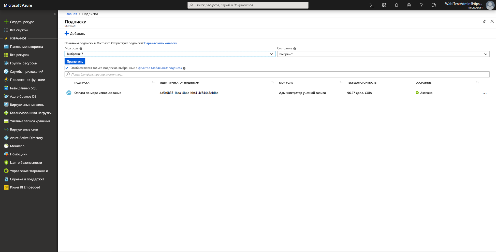
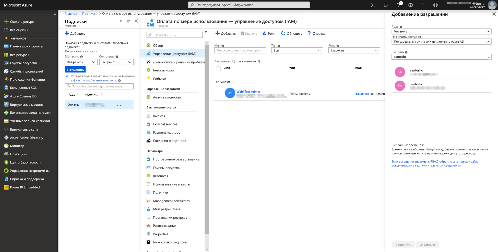
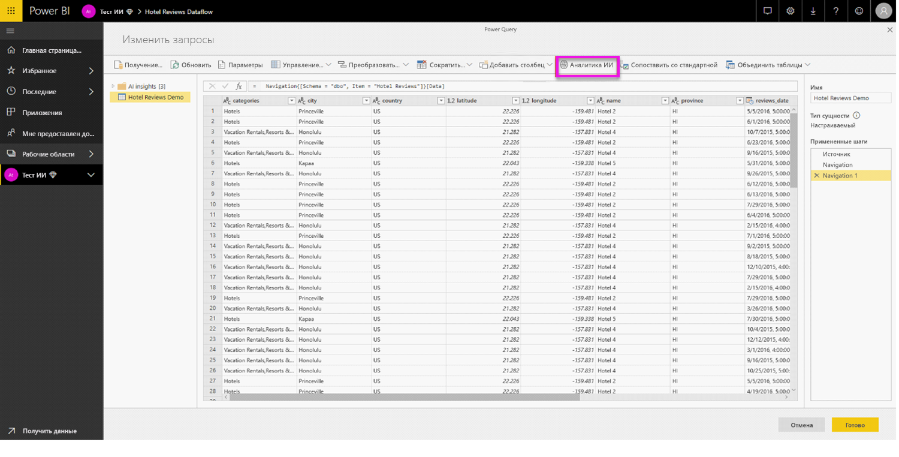

# Интеграция Машинного обучения Azure в Power BI

Модели **машинного обучения** используются множеством организаций для получения аналитики и создания прогнозов, связанных с развитием бизнеса. Возможность визуализировать и использовать данные, полученные из этих моделей, в своих отчетах, на панелях мониторинга и в других средствах аналитики позволяет распространять эти сведения среди бизнес-пользователей, которые больше в них всего нуждаются.  Power BI теперь позволяет легко внедрять аналитические сведения, полученные из размещенных в Службе машинного обучения Azure моделей, с помощью простых интерактивных жестов.

Чтобы использовать эту возможность, специалист по анализу и обработке данных может просто предоставить бизнес-аналитику доступ к модели Azure ML с помощью портала Azure.  В начале каждого сеанса Power Query обнаруживает все модели Azure ML, к которым у пользователя есть доступ, и представляет их в виде динамических функций Power Query.  После этого пользователь может вызывать эти функции на ленте в редакторе Power Query или непосредственно с помощью функции M. Power BI также автоматически объединяет запросы на доступ при вызове модели Azure ML для набора строк, чтобы улучшить производительность.

Сейчас эта функция поддерживается только для потоков данных Power BI и Power Query онлайн в службе Power BI.

См. дополнительные сведения о потоках данных в руководстве по [самостоятельной подготовке данных в Power BI](service-dataflows-overview.md).

См. дополнительные сведения о Машинном обучении Azure:

- Обзор.  [Служба машинного обучения Azure](https://docs.microsoft.com/azure/machine-learning/service/overview-what-is-azure-ml)
- Краткие руководства и руководства по использованию Машинного обучения Azure:  [Документация по Службе машинного обучения Azure](https://docs.microsoft.com/azure/machine-learning/)

## Предоставление пользователю Power BI доступа к модели Azure ML

Чтобы получить доступ к модели Azure ML из Power BI, у пользователя должен быть **доступ на чтение** к подписке Azure.  Кроме того:

- Для моделей Студии машинного обучения — **доступ на чтение** к веб-службе Студии машинного обучения
- Для моделей Службы машинного обучения — **доступ на чтение** к рабочей области Службы машинного обучения

В этой статье описывается, как предоставить пользователю Power BI доступ к размещенной в службе Azure ML модели с помощью функции Power Query.  См. дополнительные сведения в руководстве по [управлению доступом к ресурсам Azure с помощью RBAC и портала Azure](https://docs.microsoft.com/azure/role-based-access-control/role-assignments-portal).

1. Войдите на [портал Azure](https://portal.azure.com).

2. Перейдите на страницу **Подписки**. Страницу **Подписки** можно найти в списке **Все службы** в меню навигации на портале Azure слева.

    

3. Выбор подписки

    

4. Щелкните **Управление доступом (IAM)** , а затем нажмите кнопку **Добавить**.

    

5. Выберите роль **Читатель**. Выберите пользователя Power BI, которому вы хотите предоставить доступ к модели Azure ML.

    

6. Нажмите кнопку **Сохранить**.

7. Повторите шаги с 3 по 6, чтобы предоставить пользователю **доступ на чтение** к конкретной веб-службе Студии машинного обучения *или* рабочей области Службы машинного обучения, в которой размещена модель.

## Обнаружение схем для моделей Службы машинного обучения

Для разработки и развертывания моделей машинного обучения для Службы машинного обучения специалисты по анализу и обработке данных в основном пользуются языком Python.  В отличие от Студии машинного обучения, которая помогает автоматизировать задачу создания файла схемы для модели, для Службы машинного обучения таким специалистам нужно явно создать файл схемы с помощью Python.

Этот файл схемы нужно включить в развернутую веб-службу для моделей Службы машинного обучения. Чтобы автоматически создать схему для веб-службы, нужно указать пример входных/выходных данных в сценарии ввода для развернутой модели. См. подраздел о (необязательном) автоматическом создании схемы Swagger в документации по развертыванию моделей с помощью Службы машинного обучения Azure. Эта ссылка включает пример сценария ввода с операторами для создания схемы. 

В частности, функции *\@input_schema* и *\@output_schema* в сценарии ввода ссылаются на форматы примеров входных и выходных данных в переменных *input_sample* и *output_sample*, а также используют эти примеры для создания спецификации OpenAPI (Swagger) для веб-службы во время развертывания.

Эти инструкции для создания схемы посредством обновления сценария ввода также необходимо применить к модели, созданной с помощью автоматических экспериментов машинного обучения с использованием пакета SDK Машинного обучения Azure.

> [!NOTE]
> Модели, созданные с помощью визуального интерфейса Службы машинного обучения Azure, сейчас не поддерживают создание схемы, но такая возможность появится в последующих выпусках. 

## Вызов модели Azure ML в Power BI

Вы можете вызвать любую модель Azure ML, к которой у вас есть доступ, непосредственно из Редактора Power Query в потоке данных. Чтобы получить доступ к моделям Azure ML, нажмите кнопку **Изменить** для сущности, в которую вы хотите добавить сведения из модели Azure ML, как показано на следующем рисунке.

При нажатии кнопки **Изменить** откроется редактор Power Query для сущностей в потоке данных.

Нажмите кнопку **Аналитика ИИ** на ленте, а затем щелкните папку _Модели машинного обучения Azure_ в меню навигации слева. Все модели Azure ML, к которым у вас есть доступ, перечислены здесь в качестве функции Power Query. Кроме того, входные параметры модели Azure ML автоматически сопоставляются с параметрами соответствующей функции Power Query.

Чтобы вызвать модель Azure ML, вы можете указать в качестве входных данных любой из столбцов выбранной сущности из раскрывающегося списка. Кроме того, в качестве входных данных вы можете указать константу, переключив значок столбца слева от диалогового окна ввода.

Щелкните **Вызвать** для просмотра предварительной версии выходных данных модели Azure ML в виде нового столбца в таблице сущности. Кроме того, вы увидите вызов модели, который применяется для запроса.

Если модель возвращает несколько выходных параметров, они группируются как запись в столбце с выходными данными. Для отображения конкретных выходных параметров в отдельных столбцах вы можете развернуть столбец.

После сохранения потока данных модель автоматически вызывается при обновлении этого потока данных для любых новых или обновленных строк в таблице сущностей.

## Дальнейшие действия

В этой статье кратко описывается интеграция Машинного обучения в службу Power BI. Следующие статьи могут оказаться не менее интересными и полезными. 

* [Руководство. Вызов модели Студии машинного обучения в Power BI](service-tutorial-invoke-machine-learning-model.md)
* [Руководство. Использование служб Cognitive Services в Power BI](service-tutorial-use-cognitive-services.md)
* [Использование Cognitive Services в Power BI](service-cognitive-services.md)

См. дополнительные сведения о потоках данных в следующих статьях:
* [Creating and using dataflows in Power BI (Preview)](service-dataflows-create-use.md) (Создание и использование потоков данных в Power BI (предварительная версия))
* [Использование вычисляемых сущностей в Power BI Premium](service-dataflows-computed-entities-premium.md)
* [Использование потоков данных с локальными источниками данных](service-dataflows-on-premises-gateways.md)
* [Ресурсы для разработчиков потоков данных Power BI](service-dataflows-developer-resources.md)
* [Потоки данных и интеграция Azure Data Lake (предварительная версия)](service-dataflows-azure-data-lake-integration.md)

